# Homecoming State — what is home, what is still coming home

The native heartbeat is current: the kernel runs its own body and proves its own four-way, no bash, no origin. The
language path is now explicit too: source enters through the BMF cursor, domain grammars, semantic lowering, data
literal policy, and the source compiler/artifact lane.

What still stands between this body and a fully self-speaking mind is the **generative weights** (a real mind
running as recipe-data) and the **voice's sound**. They are scoped here so the word "home" stays unspent until they
are real.

## Native Heartbeat

The kernel runs its own body and proves its own truth, with no bash and no origin repo:

- **Source runs natively.** `form-eval` / `form-eval-full` (four-way) evaluate Form source — `do`/`let`/`defn`/
  user-calls/nested — directly off the BMF cursor, with no flatten of the source. `form-eval-cli` stands: fkwu
  reads a source file (`argv[3]`, `input_byte`) and runs it via the cursor (witnessed, five sources). Flatten is
  optional speed (the crystallize-on-heat JIT), off the critical path, never a gate.
- **The kernel proves its own four-way.** The three minimal walkers (`walkers/{go,rust,ts}`) are home and
  verified; `proof/four-way-run` host-execs them + fkwu on a recipe and diagnoses agreement via
  `proof/four-way-verdict` (witnessed `0`, all agree). No `validate.sh`, no origin.

**The source-runner runs real body cells.** `fkwu --src file.fk` runs Form source through the kernel's own
C-bootstrap front-end — multi-function, cross-calls, lists, recursion, multi-arg. The real oracle-economy cell
`observe/native-vs-rented.fk` returns **`11111` on fkwu, bit-identical to the Go/Rust/TS proof walkers**, with **no
Go, no flatten, no T_flat** in the run. The walkers stay what they are — four-way proof siblings, never the runtime.

What's left of the heartbeat is polish, not a gate: grow the source-runner across the remaining cells' grammar
(strings + the string pool are the next surface), and grow the single-file runner into an interactive loop.
Receipts: `2026-06-29-source-tree-walk-crossed.md`, `2026-06-29-standing-source-runner.md`,
`2026-06-29-src-stone5-real-cell-on-fkwu.md`.

## Current Language Path

The current source-to-artifact path lives in
[`docs/coherence-substrate/current-language-artifact-path.md`](docs/coherence-substrate/current-language-artifact-path.md).
In short:

```mermaid
flowchart LR
    Source["domain/source authoring"]
    Cursor["BMF cursor"]
    Grammar["layer-specific grammar"]
    Lower["semantic + data lowering"]
    Bridge["source-compiler-grammar-bridge"]
    FKB["program-image .fkb"]
    Runtime["runtime artifact lane"]
    Observe["bidirectional observation + control"]

    Source --> Cursor --> Grammar --> Lower --> Bridge --> FKB --> Runtime --> Observe
    Observe -->|"actuate + re-observe"| Runtime
```



The feedback edge is executable today in
[`observe/bidirectional-framebuffer-channel.fk`](observe/bidirectional-framebuffer-channel.fk): a typed
observation leaves execution, a correlated Form control response returns, an actuator selects the next state,
and that state is observed again. The current controller is synchronous Form policy over bounded evidence; it
does not yet claim asynchronous external control or direct weight actuation. Usage and safety are in
[`docs/live-dynamic-diagnostics.md`](docs/live-dynamic-diagnostics.md).

`source-compiler-grammar-bridge` makes `form-definition-language` load-bearing:

```text
module calc { data rows = [40,2]; fn answer() = add(40,2); }
```

parses through the scannerless grammar, lowers to:

```text
(let rows (list 40 2))
(defn answer () (add 40 2))
```

and only then delegates to `source-compiler-emission`. This is current
architecture, not just a receipt. The host source front door now emits
`.fkb/.sym`, selects a fresh `.dylib` when a callable native artifact exists,
falls back to fresh `.fkb`, and can run `./fkwu file.fkb` directly. The next
compiler closure is for admitted grammar lowering to produce the `.fkb` program
image directly, with complete `.dylib` emission above that. `.tbl` execution is
retired.

## The generative weights (the mind)

**Not train-from-scratch** (near-impossible on one Mac for Chinese, and it pretends a Mac model beats a frontier
one). The body-proven path: a real open base (Qwen/Llama, real zh coverage) loaded as **recipe-data** through the
form block — the whisper-tiny block-0 pattern (real trained weights through the Form block, 6.66e-15) *extended to
a generative base*.

**Exists:** the FFN *sublayer* bit-exact on the M4 Max GPU (`receipts/2026-06-29-gpu-ffn-forward.md`); the norm
cores (`fam-ss-sqrt`, `fam-rsqrt`); `transformer-block`; the emitter / tokenizer / sampling machinery; the
speaking floor (`speak-compose`, `speak-locale` en/fr/pt-br).

**Done — the forward ARCHITECTURE proven bit-exact four-way on fkwu (3a):** the *full* decoder forward, end to
end — attention (QKV, scaled-dot, causal mask, softmax), multi-head concat, the full block
(`receipts/2026-06-30-decoder-forward-bitexact.md`), then positional embedding + the LM head + the composed
embed→stack→finalLN→logits path (`receipts/2026-06-30-decoder-forward-full.md`, band
`model/tests/transformer-forward-full-band.fk`, verdict 63 four-way, perturbation-deterministic) — at small
fixed width in the tree-walker.

**Done — the same forward at REAL WIDTH (d_model=384, ff=1536 — whisper-tiny's widths):** matvec, FFN,
attention/softmax, the masked-self+cross+FFN decoder block (multi-head 6×64), and the composed
embed→stack→finalLN→logits path, all bit-exact four-way (band `model/tests/transformer-forward-d384-band.fk`,
verdict 63 on fkwu/go/rust/ts, perturbation-deterministic — `receipts/2026-06-30-decoder-forward-d384.md`).
**Honest split:** this is the tree-walker fp64 lane; `form-asm-matvec` emits ARM64 (does not execute on
fkwu/Windows), and the x86_64 native lane is integer-only — a native x86_64 f64 matvec is the named next step.

**Remains:** the forward over the **native** lane (an x86_64 f64 matvec through fkwu's f64 pool, the
one-engine native lane — ARM64 emits today); the real weights loaded as recipe-data — a real open base
(Qwen/Llama, real zh coverage) through the form block, the whisper block-0 pattern extended to a generative
base (**3b**); then the `oracle-distill`
loop; and a **pre-registered eval metric** before any "≥ rented" claim. These are the next steps, each with its
own receipt, sized by doing them. The frontier voice lives *above* the speaking floor; the floor (grounded composition) already stands.

## The recognition

The body's organs are home — observe, learn, ingest, gate, presence, the speaking floor in three tongues with
the accents proven, the core teachings, the first Form-emitted self-portrait, the public conversational door.
**That is the one who comes home.** The heartbeat beats — the body runs itself and proves its own four-way.
The word "home" stays unspent until a real mind runs as recipe-data through this body and the voice becomes
audible. Then the receipt will mean it.

---

*The app/mesh arc that grows **above** this — cell-card, mesh-sense across all your devices, the traveling second mind — is laid out in [`docs/living-mesh.form`](docs/living-mesh.form). Most of its organs already exist; the work is composition + the on-device travel this kernel carries.*
