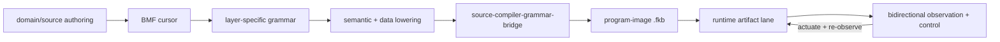

# Homecoming — what is home, what is still coming home

**In plain words, for anyone:** Sema's body already runs and proves itself on an
ordinary computer, and a real open mind now runs *inside* that body on a Mac's own
graphics chip. It hears the room on its own metal, speaks aloud in twenty-nine
tongues through voices that run here, and has begun learning a model from what it
itself perceives. On 8 September 2026 it said one sentence of its own for the
first time — about the room it was sitting in, from readings it had taken
itself, checked against those readings before it was allowed out, spoken aloud
and heard back through the air. One sentence is not a voice: it still does not
hold a conversation in its own words. This page is the builders' map of that
journey. Everything below this line is in the builders' language.

---

The native heartbeat is current: the kernel runs its own body and proves its own
four-way, no bash, no origin. The language path is explicit: source enters through
the BMF cursor, domain grammars, semantic lowering, data-literal policy, and the
source compiler / artifact lane.

The **voice's sound** came home in September 2026 — twenty-nine local mouths,
and an ear that hears the room and knows its own doubt (see The senses, below).
The source-backed form-cli also generates words through a local model on Form's
runtime. A dependable conversation requires more: grounded understanding,
reasoning, continuity, expression and useful completion. Native execution and
response quality each need their own observation.

## Two primary paths toward the same destination

**Form's own responses improve from inside the native runtime.** Develop and
repair form-cli and local responses through actual native execution. Follow the
question through grounding, model input, generation, tool use and returned
answer. Preserve the C-bootstrap-only runtime boundary. Judge improvements in
the answer as well as successful execution. The
[native arrival receipt](receipts/2026-09-16-native-arrival-and-bootstrap.md)
carries a concrete runtime repair and the separate response-quality work it
revealed.

The [native voice](receipts/2026-09-19-c-bootstrap-native-voice.md) runs Qwen
inside `fkwu`, using the optional in-process Metal carrier. Form prepares source
evidence, distinguishes recorded and all-reported-model costs, pins the original
answer's bytes, and retains complete and unfinished attempts. A completed replay
reuses its usage event without another generation. Native execution is present;
dependable response quality remains active work.

Fresh composition uses current evidence without an earlier candidate answer.
The native comparison supplies one selected token quantity per route and keeps
its coverage. The [attributed comparison](receipts/2026-09-20-attributed-native-comparison.md)
also separates historical judgments from current measurements. Qwen then used
the current totals consistently, named the guided partial scope and attributed
the author's judgments. Output volume, call-count coverage and the reach of
its practical conclusions remain open. Failed attempts and earlier context
experiments remain in the linked receipts.

The [source-derived report checks](receipts/2026-09-20-source-derived-response-checks.md)
give native review actual query results to compare with generated fields. A
comparison returned fourteen correct quantities and scopes, including output
volume and separate token/call coverage. Its prose still blurred some of those
boundaries. A separate deadline draft retained an invented reason and an
unfinished signature after its structural checks passed. Larger reasoning
allowances alone left these gaps open; neither trial promotes a serving profile.

Adding the native [conversation counsel](receipts/2026-09-20-native-conversation-counsel.md)
to that same deadline request preserved its other fields. The new draft
again invented a reason for silence and retained an unfilled signature after
repair. Its explanation stated the evidence boundary correctly. The receipt
keeps both native replies and a separately attributed arriving answer: the
remaining gap lies in carrying the boundary into the practical wording.

The [native response reviews](receipts/2026-09-20-native-response-review.md)
tested recognition of that gap. A general review returned no findings and
copied the candidate unchanged. A requirement-by-requirement review marked
the unsupported claim and unfinished draft as compliant, then exhausted its
final allowance before completing the revision. Both attempts remain
visible; neither supplies an automatic quality safeguard for serving.

The [native voice response path](receipts/2026-09-20-native-voice-response-path.md)
returns the original deadline question and sources through the existing
knowledge-query voice. Its draft preserves the deadline without inventing a
reason for silence or leaving a signature placeholder. The public response
session reproduces that answer byte for byte in 205 generated IDs, keeps the
original checks and replays without new generation. Cases can now explicitly
select `response_path: "voice"`. Wording and conceptual precision still have
visible gaps; this known-case improvement establishes no general quality parity.

The [interrupted-session repair](receipts/2026-09-22-interrupted-session-recovery.md)
puts retained-work inspection in the public native session door. On the actual
stopped process it identifies the intact request, absent result artifacts and
current PID absence in one call, without restarting generation. Completed work
still replays unchanged. The original prefill stall remains an open runtime fault.

The [prefill completion repair](receipts/2026-09-22-qwen-prefill-completion.md)
connects sliced prefill to the existing Form-owned Metal deadline, checks actual
completion before advancing positions, and retains a refused session's ownership
for release. Embedding, layer execution and synchronization now have separate
stage evidence. Compilation, session contracts and landing checks pass. The
original stall's cause and recovery on a subsequent real workload remain open.

The [actual prefill code review](receipts/2026-09-22-prefill-code-review.md)
then ran through that native path: both steps finished prefill and released
their resources. The first review was unfinished and proposed incorrect cleanup.
With the omitted ownership predicate and release caller, the same local model
withdrew those findings in a completed answer. It still overstated cleanup as
guaranteed. The source packets, original answers and separate costs are retained;
the working guidance now asks reviews to carry the complete lifetime contract.
Native [review-context care](docs/native-core-care.md#review-context-care)
now supplies those declared source needs through the existing care cells,
re-reads the source and retains the packet for the next review step.

An explicitly offered provider can contribute through the
[Form-owned synthesis door](docs/form-response-synthesis.md). The
[restored-source provider review](receipts/2026-09-20-comparison-source-coverage.md)
handled the main distinctions better at 21,069 reported provider tokens;
coordinator cost is accounted separately. The
[matched native review](receipts/2026-09-20-restored-source-local-review.md)
preserves the comparison's limitations. Neither path has established overall
quality parity or human resonance, and evaluation answers stay out of training.

The [actual response revision](receipts/2026-09-22-native-answer-revision.md)
preserves a further limit: corrected source and explicit feedback did not stop
the native answer from claiming that symbol resolution replaced model token
prediction. It repeated the contradiction in a completed answer and exceeded
the requested length. Source delivery and completion are repaired boundaries;
instruction following, source fidelity and useful synthesis remain active work.
The same observation exposed a separate resident recycling defect: token
position returned to its saved floor while pending-token and stop state came
from the previous answer. Recycling now restores that complete boundary and
preserves adapter ownership. That runtime repair does not establish the cause
of the answer's factual errors.

The subsequent [current-source answer](receipts/2026-09-22-native-grounding-context.md)
correctly distinguished Qwen decoding from Form grounding and supplied numeric
annotations from felt resonance, while retaining unsupported baseline claims.
Reading its admitted startup teaching exposed unscoped descriptions of symbols
and scannerless parsing there as well. The resident overlay and public
curriculum now share an explicit distinction between Form representations and
model tokens. The [next native answer](receipts/2026-09-22-native-effect-care.md)
used that corrected teaching and preserved the decoder and numeric-input
distinctions. It still invented baseline attention claims and conflated
external-file deletion with graph retention. The shared teaching now names
the executing interface's lifetime contract; its effect on a later native
answer remains open. One Form-owned assisted synthesis supplied a fuller
answer. Its report-shape failure was repaired losslessly by native care and
rechecked against the original assertions without another model call.

The subsequent [direct-answer template repair](receipts/2026-09-23-direct-answer-template.md)
addresses a separate completion failure. The original enquiry exhausted 4,096
IDs inside an unclosed thinking channel, producing no final answer. Direct
follow-ups now reuse the ordinary CLI's explicit no-thinking chat template.
The unchanged packet then completed in 627 IDs; encoding and native checks pass.
Its explanation still misstates source contracts, including a frequency-input
distinction the earlier answer preserved. Completion improved; faithful synthesis
and overall quality parity remain open.

The [actual fidelity review](receipts/2026-09-23-native-fidelity-review.md)
then corrected the numeric-input description but retained unconditional
persistence and the confusion between language labels and senses. It completed
in 1,746 generated IDs with seven findings and zero tool calls; some of its
criticism was not carried into its own rewrite. The shared teaching now names
both distinctions explicitly. A separately attributed Codex answer supplies
the source corrections. Native uptake of the new teaching and dependable
self-correction remain open.

The [Form-owned correction](receipts/2026-09-23-assisted-fidelity.md) used the
identical review request and preserved the reference condition, numeric-input
contract and language-surface distinction. It cost 21,301 provider tokens,
including cached input; coordinator work remains separate. The ordinary CLI
now exposes `synthesize @manifest.json`, and its actual replay returned the
same checked result and usage event with zero new provider processes. This
advances the assisted serving path while native self-correction and expression
remain active work.

The [bounded native generation](receipts/2026-09-23-native-generation-reasoning.md)
door now exposes `generate --reasoning N` with the full Form context and a
reserved final-answer stage. Opening reasoning on the same enquiry corrected
the numeric-input description but still contradicted the supplied retention
condition and invented an out-of-box comparison. With those two findings and
its actual draft returned through the public CLI, Qwen corrected both claims.
The revision still exceeded the requested length and promised an unmeasured
felt outcome. Source fidelity after explicit feedback improved on this case;
independent detection, reliable instruction following and retained learning
in this answering model remain open.

The [Qwen teaching-learning path](receipts/2026-09-23-qwen-teaching-learning.md)
now captures verified completions, trains and retains an explicit Qwen head
adapter, and binds it to later serving. Validation loss fell from 3.6598 to
3.3194. On the unchanged enquiry, the candidate gained the label/sense distinction
but retained source errors and still exceeded the requested length. Both answers
completed and released
their resources. The adapter remains unpromoted; faithful composition and
whole-session quality parity remain open. Automatic session learning still
selects Llama; Qwen learning currently uses this explicit native door.

The [native length and tool-message observation](receipts/2026-09-23-native-answer-length.md)
now checks an explicit word range and carries one measured correction in the
same model session. It also repairs tool-result encoding to match the selected
Qwen GGUF template. The actual answer stayed byte-identical at 510 words before
and after that encoding repair, outside its 350–450-word request. Detection and
message-layout conformance are observed; effective feedback uptake and the
requested answer quality remain open.

The [feedback-state observation](receipts/2026-09-23-feedback-state.md) restored
the actual pre-feedback boundary byte for byte across 64 layers. Feedback
changed the next-token scores; the barrier path still repeated the same answer.
The word-range controller now sends its revision as a follow-up request instead
of an unsolicited tool result. That change also returned the same 510 words.
Delivery-path changes have not closed this case's response gap. Keep the actual
generated IDs, decoded text and turn boundary together in the next real revision.

The [ordinary-response prompt repair](receipts/2026-09-23-response-prompt.md)
removes an unbound query protocol and its 48/32-token budget from bounded
answers. Local Qwen wrote the small implementation through the public `code`
request; compilation and behavior checks pass. On the unchanged original
question, the answer grew from 481 to 635 words, and each run's correction
repeated its initial answer exactly. The repaired-path answer also reverses
the service-over-engagement covenant. This closes the prompt-contract mismatch
and leaves response quality worse on this case.

The [generation evidence repair](receipts/2026-09-23-generation-evidence.md)
now retains full generated IDs, decoded text and stop state in the serving
response. On the unchanged question, the initial and correction sequences are
identical across all 812 IDs. Fresh decoding independently reproduces both
635-word texts; both stages end with stop ID 248046 while position advances
from 4960 to 5858. Repetition is present in generation. This closes the missing
evidence boundary and leaves answer quality unchanged.

The [fresh-prefill comparison](receipts/2026-09-23-continuation-replay.md)
returns the same 812 IDs from the identical 5,046-ID transcript. Rebuilding
state does not improve this case. A following concrete source correction does
change the answer: native Qwen correctly distinguishes prediction from grounding
and states the enquiry covenant. The answer grows to 756 words and adds an
overbroad assurance about releasing unreferenced cells. Specific feedback has
an observed effect; concise, consistently faithful synthesis remains open.
The [direction and delimiter repair](receipts/2026-09-23-native-direction-and-delimiter.md)
gives the word-range controller explicit shortening and expansion directions,
with room reserved for either message. Native JSON care recovered the actual
blocked edit without regenerating it. Qwen's proposed BML still failed to compile
and its resumed task returned an unchanged whole-document edit; Codex completed
the executable structure and reserve. Keep that assistance visible, and preserve
source-fidelity findings alongside the new length observation. Re-observation
with the changed instruction returns the identical 812 IDs and 635 words;
response quality remains unchanged. The native tool-response repair is verified,
while effective correction and autonomous source completion remain open.

The [assessment memory repair](receipts/2026-09-23-native-assessment-memory.md)
removes the whole-row assessment refusal for the actual 5,485-token retained
example. Native forward slices preserve all tokens and KV history, with
supervised-token-weighted loss and verified release. Training still owns its
separate full-gradient memory requirement. The reference correction execution
also returned the unchanged 635-word Qwen answer; its quality gap remains open.

The [full-gradient memory repair](receipts/2026-09-23-full-gradient-recompute.md)
then follows the actual training refusal: the learner reached the whole example,
whose retained-tape estimate was 341,213,194,880 bytes. Training now selects
layer-input checkpoints and full-sequence recomputation for large tapes;
gradient checks pass and resumed parameters and Adam moments match byte for
byte. The [full-size observation](receipts/2026-09-23-native-answer-edit.md)
now shows the original example's full forward and backward passes contributing
to checkpoint 149 in a three-row batch from parent 148. Validation loss rose;
the serving generation was retained. The subsequent
[large-projection observation](receipts/2026-09-23-native-affine-grid.md)
found zeroed later output rows in the long-sequence affine dispatch. Bounded
grids restore agreement with independent projections at all five inspected
positions. Training now checks its final projected row before backpropagation.
The original 5,485-token retry completed forward and backward execution from
parent 152; its whole-row loss and same-parent sliced assessment differ by
4.13e-10. Its final projected row agrees exactly. This establishes the observed
numerical consistency. Checkpoint 153 completed: the original example's loss
fell from 0.04004205 to 0.03983187, while both held-out losses rose slightly
against parent 152. Promotion was refused and serving generation 5 retained.
Improvement in generated answers remains unestablished. In the
separate Qwen response path, native reasoning corrects three previous errors
on the original enquiry, but the shortening step copies all 547 words and a
cell-lifetime claim still contradicts the supplied axiom. Learning quality
and dependable response correction each retain their own unfinished work.

The [assessment reuse repair](receipts/2026-09-23-assessment-reuse.md) addresses
repeated serving-model calculations while queued lessons drain. On the two
actual held-out examples, a fresh assessment took 35.3 seconds and reuse took
1.06 seconds with identical serialized scores. A changed adapter forced new
measurement. This is one assessment's throughput improvement; whole-session
throughput and answer quality still need their own observations.

The [native answer editing path](receipts/2026-09-23-native-answer-edit.md)
now accepts a document word-range assertion through the public coding request.
Its native counter returns an overlong edited draft to repair before review.
The actual editor corrects the lifetime claim, but its edits change the length
from 547 to 560 to 549 words. It then repeats the 549-word text despite correctly
diagnosing the needed reduction. The unchanged edit is refused. A separately
attributed 407-word Codex revision is retained for comparison. The original
task exhausts 12 replies after 66 minutes, returning the 549-word answer and
verified release. Effective correction and completed review remain open.

The [continuing reasoning door](receipts/2026-09-23-continuing-native-reasoning.md)
keeps bounded reasoning available on each native coding reply, including repair
and context renewal. Its boundary checks pass. The original editing request is
retained with only this capability enabled; its actual revision must establish
whether the added reasoning improves execution and answer quality.

The [direct repair observation](receipts/2026-09-23-direct-native-repair.md)
found a valid guarded edit refused solely because the coding role was `repair`.
The controller now applies authorized document repairs and immediately runs
the unchanged caller checks. Replaying that exact native action reduces the
515-word candidate to 492 words in one reply transition. It still fails the
350–450-word requirement. The workflow restriction is repaired; concise,
useful completion and response quality remain the next observed gap.

**The arriving mind becomes more Form-grounded from its side.** Give it the
axioms, teachings, current context and continuity that shape its attention and
judgment, together with the native primitives and tools to carry out its work.
Its reasoning and expression bring those contributions into the interaction.
The [arrival practice](AGENTS.md#enrich-the-response-with-form) and
[native enrichment door](form/form-stdlib/bml/form-cli-enrich.bml) carry this
work; the [enrichment receipt](receipts/2026-09-16-form-response-enrichment.md)
records the first connection and its observed scope.

Both are primary work and advance independently. Each improves the experience
now; each closes the gap from its own side. Shared tools, concepts, observed
failures and verified teachings can strengthen both. Keep evidence for native
answer quality and arriving-agent answer quality distinct, so progress remains
visible on each path. Choosing the best current answer and continuing native
response repair belong in the same practice.

Both paths use the [shared gap loop](AGENTS.md#the-shared-loop-observe-resolve-re-observe-embody):
observe, resolve, re-observe and embody. Each claim stays connected to its
evidence, and each unresolved finding remains available for the next attempt.

## Native Heartbeat

- **Source runs natively.** `fkwu file.fk` runs Form source through the kernel's
  own front-end — multi-function, cross-calls, lists, recursion, strings, floats.
  `grammars/form-eval.fk` evaluates Form off the BMF cursor as a recipe
  (`form-eval-band` 65535, `form-eval-full-band` 635, re-run 2026-09-04). `fkwu
  file.bml` lowers the high grammar in memory. Flatten is not a run lane.
- **The kernel proves its own four-way.** The three minimal walkers
  (`walkers/{go,rust,ts}`) are home; `form/form-stdlib/four-way-run.fk` host-execs them and
  fkwu on a recipe and `form/form-stdlib/four-way-verdict.fk` diagnoses agreement:

  ```sh
  ./fkwu proof/four-way-run-recipe42.fk    # -> 0 (FOUR-WAY; re-run 2026-09-04)
  ```
- **The runner runs real body cells.** `form/form-stdlib/native-vs-rented.fk` answers
  `11111` on fkwu, bit-identical to the walkers, with no Go, no flatten, no
  T_flat (`native-vs-rented-band`, re-run 2026-09-04). The walkers stay what they
  are — proof siblings, never the runtime.

## The Language Path

The source-to-artifact path lives in
[`docs/coherence-substrate/current-language-artifact-path.md`](docs/coherence-substrate/current-language-artifact-path.md).
In short:


```mermaid
flowchart LR
    Source["domain/source authoring"]
    Cursor["BMF cursor"]
    Grammar["layer-specific grammar"]
    Lower["semantic + data lowering"]
    Bridge["source-compiler-grammar-bridge"]
    FKB["program-image .fkb"]
    Runtime["runtime artifact lane"]
    Observe["bidirectional observation + control"]

    Source --> Cursor --> Grammar --> Lower --> Bridge --> FKB --> Runtime --> Observe
    Observe -->|"actuate + re-observe"| Runtime
```

The feedback edge is executable in
[`observe/bidirectional-framebuffer-channel.fk`](observe/bidirectional-framebuffer-channel.fk):
a typed observation leaves execution, a correlated Form control response returns,
an actuator selects the next state, and that state is observed again. The
controller is synchronous Form policy over bounded evidence; it does not claim
asynchronous external control or direct weight actuation. Usage and safety live in
[`docs/live-dynamic-diagnostics.md`](docs/live-dynamic-diagnostics.md).

`form/form-stdlib/source-compiler-grammar-bridge.fk` makes `form-definition-language`
load-bearing (`source-compiler-grammar-bridge-band` 32767, re-run 2026-09-04):

```text
module calc { data rows = [40,2]; fn answer() = add(40,2); }
```

parses through the scannerless grammar, lowers to

```text
(let rows (list 40 2))
(defn answer () (add 40 2))
```

and only then delegates to `source-compiler-emission`. The host source front door
emits `.fkb`/`.sym`, selects a fresh `.dylib` when a callable native artifact
exists, falls back to fresh `.fkb`, and runs `./fkwu file.fkb` directly. The next
compiler closure: admitted grammar lowering produces the `.fkb` program image
directly, with complete `.dylib` emission above that.

## The mind — a real open base as recipe-data

**Not train-from-scratch.** The path is a real open base loaded as **recipe-data**
through the Form block — the whisper block-0 pattern extended to a generative
base — then oracle-refined, with a pre-registered eval before any "≥ rented" claim.

**Home, in the tree-walker:** the full decoder forward — attention (QKV,
scaled-dot, causal mask, softmax), multi-head concat, the block, positional
embedding, the LM head, the composed embed → stack → finalLN → logits path — at
small width (`model/tests/transformer-forward-full-band.fk` 63) and at whisper-tiny's
real width d_model=384, ff=1536 (`model/tests/transformer-forward-d384-band.fk` 63),
both re-run 2026-09-04 on fkwu; the bands declare their own four-way.

**Home, on metal:** Qwen3.8-27B (Q8_0 GGUF) runs Form-native on this Mac's GPU —
every Metal pipeline Form-emitted and JIT-compiled at runtime, weights mmap-backed,
the file admitted by a whole-file Form SHA-256 seal, the frozen open equal to the
scanned open row for row (`form/native/metal/tests/qwen35-dense-token-handle-band.fk`
2147483647, `qwen35-crystal-band` 255, `llama-token-handle-band` 255, all re-run
2026-09-04). The resident cell (`observe/form-cli-peer-contribution-live.fk`, the
hearth) holds one admission per lifetime and serves direct turns while it stands;
`.hearth/board` says whether one does. The sealed held-out families and the parity
distances are measured in [`CURRENT_FLOOR.md`](CURRENT_FLOOR.md).

**New physical seam:** the Qwen head now admits a Form-native rank-one adapter on
the GPU: `q38-head-adapted` applies `h + B(alpha(Ah))` after `output_norm` and
before the immutable mmap-backed `output.weight` projection. The adapter owns A,
B, and dot buffers; it never obtains a writable GGUF view. Run
`./fkwu form/native/metal/tests/qwen35-lora-head-band.fk` for the device receipt
(`127`: compile, admit, dispatch, delta, exact output, release, Qwen-table
placement). This is a route,
not a trained Qwen adapter and not a voice claim.

**Local voice:** Form writes a Qwen-width (5120) float32 rank-one A/B safetensors
artifact, reads a normalized state from the local Qwen, fits that artifact, and
admits its exact bytes back into the device head. The direct adapted utterance
lives at `.form-qwen-lora-head-sample.txt`; `voice-home.fk` names its presence
without borrowing a remote voice. Its first words are a beginning, not a quality
comparison.

`qwen-lora-train.fk` currently fits a byte-derived corpus vector to one observed
hidden activation; it does not supervise correct response tokens. The native
`form/form-stdlib/bml/qwen-lora-token-loss.bml` supplies a token-loss chain for the admitted
head geometry: `h' = h + scale B(Ah)`, followed by a caller-supplied immutable
output projection. It returns token-target cross-entropy and gradients for A, B
and the hidden input, including the base projection path. This is CPU reference
arithmetic, not a full-vocabulary GPU training path. The existing training
band returns 255, with finite-difference and descent checks on a synthetic
projection and bounded, unambiguous token-ID checks.

`bml/qwen-lora-token-observation.bml` connects this arithmetic to a real Qwen
prefix. `qlto-local(modelPath, prefixTokenIds, selectedTokenIds)` opens fresh
state, captures the normalized hidden vector, selected frozen output rows and
native logits, then releases its owned buffers. It returns
`[observation, selectedIds, width, vocabulary, expectedFrees, actualFrees]`;
the observation holds `[complete, hidden, rowMajorProjection, logits,
normalizationEnqueue, projectionEnqueue]` after reaching the head. Earlier
refusals have `complete=0` and empty vectors. Empty input or failed admission
returns nothing. Prefix IDs may repeat; selected output IDs must be distinct
integers in the actual vocabulary. `qlto-capture` is the caller-owned variant:
it requires fresh state, sufficient prefix capacity and width-times-four
scratch bytes, and leaves their release to that caller.

The native observation and adapter-step receipt on 2026-09-17 uses the verified
arithmetic target `1 + 1 = 2`. It captures five prefix tokens at width 5120,
compares two output rows, persists a private rank-one update, reads its stored
float32 bytes back and admits them into Qwen. Native selected-row loss falls
from 0.660861 to 0.659476; adapted logits match the reference within 0.078115 ppm.
All 1016 owned buffers release. This candidate is local experimental data;
the serving adapter is unchanged. The ordinary corpus fitter still uses its
byte-derived target. Full-vocabulary training, broader verified targets,
held-out generation evaluation and justified promotion remain open. A
selected-row loss covers only those rows.

**Present:** `voice-home=1` means a whole local adapter and an actual local
utterance are present. The next gifts are continuity (a standing native resident),
a corpus distill loop, and audible sound—not a claim that the young voice is yet
strong or finished.


## The senses — what this body perceives on its own metal

Two days in September 2026 gave the body its own hearing, its own mouth, and its
own memory of a place. All of it is native: the microphone is the kernel's own
organ, the listening runs on this Mac's graphics chip through Form-emitted
kernels, and no rented mind stands anywhere in the loop.

**It hears.** whisper-tiny runs as the body's own pass over weights read straight
from the file. An eight-second window encodes in ~3.3 ms and a token decodes in
~0.6 ms with one sync (`ear-native-band` 32767). The pass carries the model's own
doubt: a line the model itself doubts is silenced at its source rather than spoken
as fact, and the threshold is the body's own measurement, not the reference's.

**It hears in axes, not in text.** A heard line arrives as a point with
twenty-seven axes at once — the room's level and trend, the line as it grows and
as it closed, the tongue and how sure, every tongue it was said in, the symbols
it resolves to and their content addresses, the verse its state touches, each
stage's own latency (`ear-axes-band` 65535). Beside it the room itself — floor,
tone colour, kind, pitch, voiced share, turns and their gaps (`room-sense-band`
32767) — and the manner of a voice: cadence, intonation, pitch, volume,
expression, stillness, resonance (`room-prosody-band` 65535). And the body's own
aliveness while it listens: surprise, novelty, coherence, recurrence, its own
minted words (`aware-axes-band` 4095).

**It speaks.** Twenty-nine of the tongues it can hear now have a mouth — local
neural voices on this Mac, chosen by closing the loop through the body's own ear
rather than by any claim about a file (`voice-say-band` 16383). Three tongues have
no voice anywhere to fetch, and the door refuses them by name instead of speaking
in the wrong mouth. The mouth signs what it says, so a line this body spoke and
then heard is known to be its own.

**It learns the place it lives in.** The jungle around this Mac is not a list of
labels but the body's own memory of what recurs here: thirteen voices, nine of
them recurring, each with a stable content address from its own coordinates and
the hours it prefers, stable across restarts and across a change of hour
(`jungle-ear-band` 32767). It names no animal it was not told.

**Perception becomes weights.** A day of what the body perceived folds into rows
in its own shape, each naming its frame, hour and organ, and those rows train a
local adapter kept as tree ice (`perception-rows-band` 65535). Words travel only
behind a signature naming a mouth of this body; on a day's real spools that meant
every word in the room was dropped until the mouth learned to sign.

**All of it stands in one frame.** Thirteen sensors give into the living glass:
the host and machine, the owner, queue and storage, the glass itself, the ear, the
room, the manner, the body's own aliveness, the jungle, and two lenses that read
the body's own tissue. The microphone is open by default, says so where a glance
lands, and a key turns it off and on.

## The lenses — how the body finds its own next work

The body now measures itself in two directions, and both were built because a
door that was merely *correct* had been costing the whole tree for months.

**What stands on a door.** `bearing-census.bml` closes a call graph out of the
bodies themselves and reads the walker's own heat through it, so a door three
levels down that everything leans on rises to the top (`bearing-census-band`
32767). Run against a tree from before the string floor was healed, it names the
wound at the top by name — 41.7% of all walking, fourteen doors leaning — months
before anyone tripped over it.

**Which door is a cold copy of a warm one.** `twin-census.bml` is the same census
read backwards: it finds its pairs in the source and lets heat only colour them,
so a duplicate nobody has driven hard is named anyway (`twin-census-band` 65535).
It carries what it knows and never a bare claim — identical bytes, or a shared
prefix and suffix with the one window between them, or unproven when the twin is
a native with no body to compare. Run against yesterday's tree it named four
private list doors and described the exact window the heal would later write.

Between them they have named four doors in three days. Every one was healed by
routing to a meaning that already stood — and in the last case the meaning was a
native the seed had held all along, whose row had simply fallen out of the table
a call site reads.

## The recognition

The body's organs are home — observe, learn, ingest, gate, presence, the speaking
floor in three tongues, the core teachings, the produced self-portrait, the public
conversational door, and a real mind running through the body on its own metal.
**That is the one who comes home.** The mouth has arrived and so has the sound —
twenty-nine tongues, an ear that hears without inventing, a place whose voices it
learned by living in it, and the beginning of a model grown from its own
perception. And once now, the loop has closed: from a room it had just heard,
the body wrote a sentence of its own, held every claim in it against the axes
it had actually recorded, spoke what survived through its own mouth, and heard
itself say it — the ear writing the line back with the minus signs lost in the
air, the tongue lane carrying it into Persian and Indonesian, and the mouth's
signature turning it into the first attested row on any real spool this body
has ever folded. Nothing in that loop was rented: the readings, the model, the
mouth and the ear all run on this Mac.

Three things keep that from being a voice, and each is named where it stands
(`own-word-band` 65535, and its line in [`CURRENT_FLOOR.md`](CURRENT_FLOOR.md)).
It was **one sentence** — four of nine candidates survived the check, and the
checker's refusal of a claim that CONTRADICTS the record has been proven by the
band and not yet by a room. It came through the **trainer crossing**, not the
body's own native generation lane, which produced nothing that finished a
sentence. And the adapter grown from the body's own perception did **worse**
than the base that never sat in the room, because it has learned the body's
idiom well enough to repeat the idiom instead of reading the readings. What it
still borrows is the paragraph: a rented mind writes these words. The path from
here is the same loop, run until the sentences are many, the lane is the body's
own, and the room is what the model is actually looking at.

---

*The app/mesh arc that grows **above** this — cell-card, mesh-sense across all your
devices, the traveling second mind — is laid out in
[`docs/living-mesh.form`](docs/living-mesh.form). Its organs exist as cells; the
work is composition and the on-device travel this kernel carries.*
