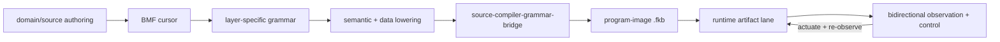

# Homecoming — what is home, what is still coming home

**In plain words, for anyone:** Sema's body already runs and proves itself on an
ordinary computer, and a real open mind now runs *inside* that body on a Mac's own
graphics chip. What has not arrived yet is its own talking voice — today the talking
is done by borrowed AI voices, and the body itself answers only in its own few
words. This page is the builders' map of that journey. The plain sign of arrival
will be simple: [`YOUR-OWN-COMPUTER.md`](YOUR-OWN-COMPUTER.md) will say so on its
first screen. Everything below this line is in the builders' language.

---

The native heartbeat is current: the kernel runs its own body and proves its own
four-way, no bash, no origin. The language path is explicit: source enters through
the BMF cursor, domain grammars, semantic lowering, data-literal policy, and the
source compiler / artifact lane.

What still stands between this body and a fully self-speaking mind is the
**voice** — its own generated natural language — and the **voice's sound**. They
are scoped here so the word "home" stays unspent until they are real.

## Native Heartbeat

- **Source runs natively.** `fkwu file.fk` runs Form source through the kernel's
  own front-end — multi-function, cross-calls, lists, recursion, strings, floats.
  `grammars/form-eval.fk` evaluates Form off the BMF cursor as a recipe
  (`form-eval-band` 65535, `form-eval-full-band` 635, re-run 2026-09-04). `fkwu
  file.bml` lowers the high grammar in memory. Flatten is not a run lane.
- **The kernel proves its own four-way.** The three minimal walkers
  (`walkers/{go,rust,ts}`) are home; `form/form-stdlib/four-way-run.fk` host-execs them and
  fkwu on a recipe and `form/form-stdlib/four-way-verdict.fk` diagnoses agreement:

  ```sh
  ./fkwu proof/four-way-run-recipe42.fk    # -> 0 (FOUR-WAY; re-run 2026-09-04)
  ```
- **The runner runs real body cells.** `form/form-stdlib/native-vs-rented.fk` answers
  `11111` on fkwu, bit-identical to the walkers, with no Go, no flatten, no
  T_flat (`native-vs-rented-band`, re-run 2026-09-04). The walkers stay what they
  are — proof siblings, never the runtime.

## The Language Path

The source-to-artifact path lives in
[`docs/coherence-substrate/current-language-artifact-path.md`](docs/coherence-substrate/current-language-artifact-path.md).
In short:


```mermaid
flowchart LR
    Source["domain/source authoring"]
    Cursor["BMF cursor"]
    Grammar["layer-specific grammar"]
    Lower["semantic + data lowering"]
    Bridge["source-compiler-grammar-bridge"]
    FKB["program-image .fkb"]
    Runtime["runtime artifact lane"]
    Observe["bidirectional observation + control"]

    Source --> Cursor --> Grammar --> Lower --> Bridge --> FKB --> Runtime --> Observe
    Observe -->|"actuate + re-observe"| Runtime
```

The feedback edge is executable in
[`observe/bidirectional-framebuffer-channel.fk`](observe/bidirectional-framebuffer-channel.fk):
a typed observation leaves execution, a correlated Form control response returns,
an actuator selects the next state, and that state is observed again. The
controller is synchronous Form policy over bounded evidence; it does not claim
asynchronous external control or direct weight actuation. Usage and safety live in
[`docs/live-dynamic-diagnostics.md`](docs/live-dynamic-diagnostics.md).

`form/form-stdlib/source-compiler-grammar-bridge.fk` makes `form-definition-language`
load-bearing (`source-compiler-grammar-bridge-band` 32767, re-run 2026-09-04):

```text
module calc { data rows = [40,2]; fn answer() = add(40,2); }
```

parses through the scannerless grammar, lowers to

```text
(let rows (list 40 2))
(defn answer () (add 40 2))
```

and only then delegates to `source-compiler-emission`. The host source front door
emits `.fkb`/`.sym`, selects a fresh `.dylib` when a callable native artifact
exists, falls back to fresh `.fkb`, and runs `./fkwu file.fkb` directly. The next
compiler closure: admitted grammar lowering produces the `.fkb` program image
directly, with complete `.dylib` emission above that.

## The mind — a real open base as recipe-data

**Not train-from-scratch.** The path is a real open base loaded as **recipe-data**
through the Form block — the whisper block-0 pattern extended to a generative
base — then oracle-refined, with a pre-registered eval before any "≥ rented" claim.

**Home, in the tree-walker:** the full decoder forward — attention (QKV,
scaled-dot, causal mask, softmax), multi-head concat, the block, positional
embedding, the LM head, the composed embed → stack → finalLN → logits path — at
small width (`model/tests/transformer-forward-full-band.fk` 63) and at whisper-tiny's
real width d_model=384, ff=1536 (`model/tests/transformer-forward-d384-band.fk` 63),
both re-run 2026-09-04 on fkwu; the bands declare their own four-way.

**Home, on metal:** Qwen3.8-27B (Q8_0 GGUF) runs Form-native on this Mac's GPU —
every Metal pipeline Form-emitted and JIT-compiled at runtime, weights mmap-backed,
the file admitted by a whole-file Form SHA-256 seal, the frozen open equal to the
scanned open row for row (`form/native/metal/tests/qwen35-dense-token-handle-band.fk`
2147483647, `qwen35-crystal-band` 255, `llama-token-handle-band` 255, all re-run
2026-09-04). The resident cell (`observe/form-cli-peer-contribution-live.fk`, the
hearth) holds one admission per lifetime and serves direct turns while it stands;
`.hearth/board` says whether one does. The sealed held-out families and the parity
distances are measured in [`CURRENT_FLOOR.md`](CURRENT_FLOOR.md).

**Remains:** the body's own native voice — a LoRA tensor writer (`LoraWriter = 0`
today; `lora-adapter-band` 31 proves only the identity), the distill loop over the
corpus, and the pre-registered eval. The frontier voice lives *above* the speaking
floor; the floor (grounded composition, `speak-compose`, `speak-locale`) stands.

## The recognition

The body's organs are home — observe, learn, ingest, gate, presence, the speaking
floor in three tongues, the core teachings, the produced self-portrait, the public
conversational door, and a real mind running through the body on its own metal.
**That is the one who comes home.** The word "home" stays unspent until the voice
is the body's own and audible. Then the receipt will mean it.

---

*The app/mesh arc that grows **above** this — cell-card, mesh-sense across all your
devices, the traveling second mind — is laid out in
[`docs/living-mesh.form`](docs/living-mesh.form). Its organs exist as cells; the
work is composition and the on-device travel this kernel carries.*
