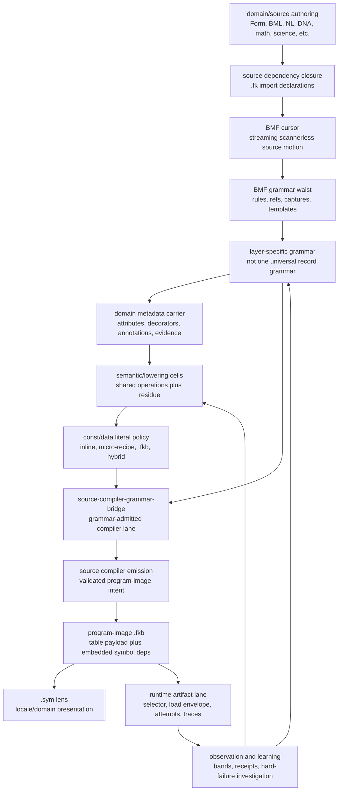

# Current Language And Artifact Path

This file names the current path, not the story of how it arrived. Receipts
preserve the climb. This document is the shape a new language surface should
fit today.

## The Path



## What Is Current

- The source floor enters through `fkwu file.fk` or `fkwu --src file.fk`,
  directly off the supported Form surface. A fresh callable `.dylib` wins; a
  fresh `.fkb` with matching embedded source-unit identity runs next; stale or
  missing artifacts compile source and emit `.fkb/.sym`. A program image can
  also run directly as `./fkwu file.fkb`.
- `.fk` dependency management is installed in the source runtime door. The
  current declaration is `import "path.fk"` for the direct source runner and
  `; import "path.fk"` where a file must still pass through comment-only
  sibling proof lanes. Legacy `; preludes:` declarations remain compatibility
  input during migration. Imports load recursively, suppress duplicate/cyclic
  paths, resolve relative paths from the importing file with Form-root fallbacks
  for stdlib paths, and prefer fresh versioned `.fkb` images when available.
  When an import image is missing, the runtime compiles that import into
  `.fkb/.sym` and then imports the image. Source composition is the fallback
  when an import image cannot be made or trusted. The root `.fkb` freshness
  identity includes every dependency's path, mtime, and size.
- The grammar waist is load-bearing. `bmf-core` and `bmf-grammar` own the
  scannerless cursor and reusable grammar mechanics; domain layers own their
  own vocabulary and lowering.
- Metadata is not a hidden side channel. Languages that spell meta information
  as attributes, decorators, annotations, pragmas, tags, or BML class/method
  marks lower into the same domain metadata carrier:
  `carrier + scope + key + value`. Examples include
  `@ bml class capability host:file`,
  `@ python function decorator lru_cache`, and
  `@ rust item derive Debug`. The carrier can attach to domains, grammar
  rules, captures, emitted nodes, and runtime artifacts; a downstream semantic
  lane may consume it, but parsing does not mutate meaning just because
  metadata exists.
- The current authoring grammars include `defdata-language`,
  `defdata-recipe-language`, `domain-grammar-core`,
  `grammar-authoring-language`, `domain-metadata-carrier`,
  `form-definition-language`, `domain-semantic-bridge`, and
  `sibling-ref-authoring-language`.
- `source-compiler-grammar-bridge` now makes `form-definition-language` feed
  the source compiler lane. The compiler path is no longer allowed to look like
  only caller-supplied low-level artifact rows.
- A program-image `.fkb` is the executable artifact authority: it carries the
  table-shaped payload and the embedded canonical symbol/dependency image.
  `.sym` is a locale/domain lens over those stable symbols, not executable
  dependency truth.
- `.tbl` execution is retired. The table-shaped payload belongs inside `.fkb`,
  not in a standalone runtime input.
- Hard runtime observations such as OOM-killed, killed, stalled, timeout, and
  wrong-value route to investigation. They are not soft fallbacks.

The measured release map for the `.fk/.fkb/.dylib` runtime surface and retired
`.tbl` input lives in
[`source-runtime-release-map.md`](source-runtime-release-map.md).

## Example: Grammar Used By The Compiler Lane

High-level source:

```text
module calc { data rows = [40,2]; fn answer() = add(40,2); }
```

`form-definition-language` parses that through the scannerless BMF grammar and
lowers it to the current top-level Form floor:

```text
(let rows (list 40 2))
(defn answer () (add 40 2))
```

`source-compiler-grammar-bridge` then delegates only admitted lowerings to
`source-compiler-emission`. Bad grammar refuses the lane; bad nested emission
investigates.

## Data Literal Policy

Constants and stable data are not one syntax choice. The current policy is:

- Small literals can stay inline.
- Larger regular data should become a micro-recipe when the recipe is smaller
  and clearer than storing every value.
- Stable realized data can become `.fkb` payload.
- Hybrid forms are allowed when the recipe plus a small literal seed is the
  honest representation.

This is why `defdata-language` and `defdata-recipe-language` exist below the
compiler layer. They are the data authoring surface; the source compiler and
artifact layers decide when those values become program image material.

## What Still Has To Close

- `--src` still has a C-seed parser/compiler path when artifacts are stale or
  missing. Fresh artifacts now skip that parse path and load `.fkb`; the
  remaining shrink work is to move this artifact door into the native body as
  the seed recedes.
- The current grammar bridge still accepts a supplied program-image envelope for
  emission. The next stronger compiler move is to produce the `.fkb` program
  image directly from the admitted lowering.
- Complete `.dylib` emission is not installed yet. Fresh callable `.dylib`
  selection is installed; stale, missing, or non-callable native artifacts fall
  back to `.fkb` or source compilation with diagnostics.
- Low-level Form remains the execution floor and verifier surface. It should
  not be the hand-authored public language for every layer.

## Current Release Gates

The current path is:

```text
.fk source -> dependency closure -> BMF cursor -> domain grammar -> source compiler
           -> .fkb program image + .sym lens + .dylib when available
           -> runtime selector -> running body
```

`--src` remains an explicit compiler/admission spelling. Plain `fkwu file.fk`
uses the same selector. `.tbl` is not a supported runtime artifact.

## Import Declaration Shape

Runtime-native source can use the direct declaration:

```text
import "form-stdlib/core.fk"
```

Files that still need to run through the older sibling proof walkers use the
comment-safe declaration:

```text
; import "form-stdlib/core.fk"
```

Both forms are source dependency declarations to `fkwu`. The validator expands
the comment-safe form recursively so repo files can migrate away from
`preludes:` without losing four-way observation. `preludes:` is now only a
legacy compatibility spelling.

## Current Witnesses

The current grammar path is carried by these focused bands:

```text
form-stdlib/tests/defdata-language-band.fk -> 8191
form-stdlib/tests/defdata-recipe-language-band.fk -> 134217727
form-stdlib/tests/domain-grammar-core-band.fk -> 268435455
form-stdlib/tests/grammar-authoring-language-band.fk -> 134217727
form-stdlib/tests/domain-metadata-carrier-band.fk -> 32767
form-stdlib/tests/form-definition-language-band.fk -> 65535
form-stdlib/tests/domain-semantic-bridge-band.fk -> 268435455
form-stdlib/tests/sibling-ref-authoring-language-band.fk -> 2147483647
form-stdlib/tests/source-compiler-grammar-bridge-band.fk -> 32767
form-stdlib/tests/source-runner-admission-band.fk -> 2097151
form-stdlib/tests/import-statement-runtime-band.fk -> 42
```
