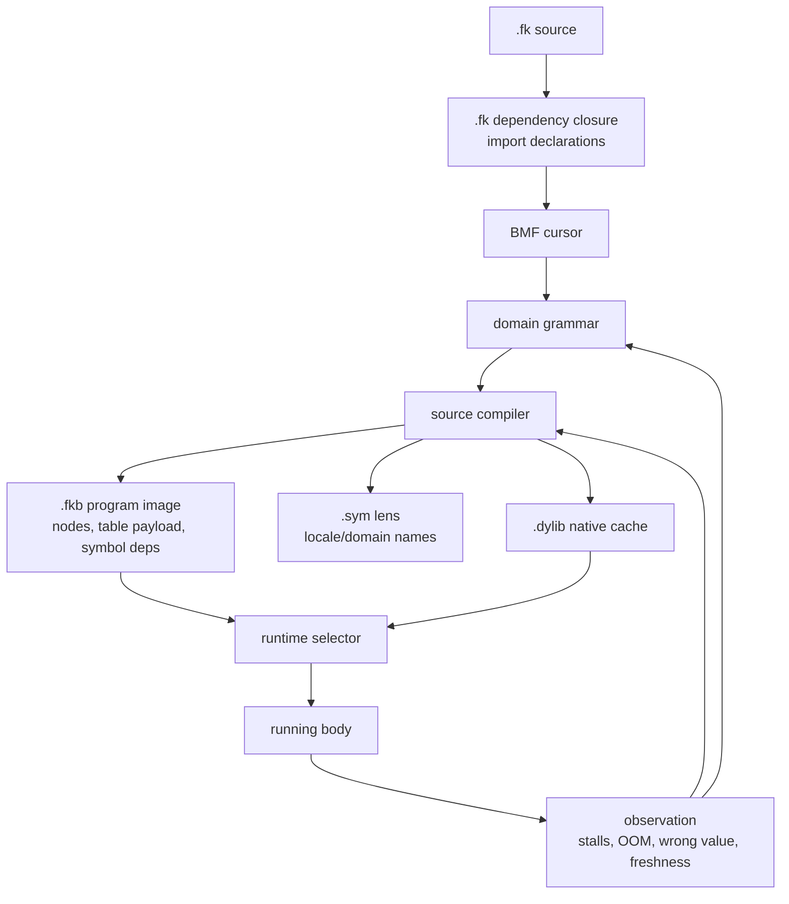

# Source Runtime Release Map

This is the current release map for making `.fk/.fkb/.dylib` the runtime
artifact surface and retiring `.tbl`. Receipts keep the past. This file names
the present floor, the target shape, and the measured pressure that tells us
whether we are moving.

## Target Shape

`--src` becomes a compiler front door: it may read source and produce fresh
artifacts, but it is no longer the normal runtime path when a fresh artifact
exists.

`.tbl` execution is retired. The table-shaped payload belongs inside `.fkb`,
not in a standalone runtime artifact.

`.sym` is the locale/domain symbol lens. The `.fkb` must still carry stable
symbol dependencies needed to run; `.sym` gives names and presentation without
being the executable dependency truth.

`.fk` source now has dependency management in the runtime door. The installed
surface is `import "path.fk"` for the direct source runner plus comment-safe
`; import "path.fk"` for files that still need to pass through the older
sibling proof walkers. Legacy `; preludes:` declarations are compatibility
input during migration. Dependencies are loaded recursively, resolved from the
importing file with Form-root fallbacks, and tracked as a source unit. Direct
imports prefer fresh versioned `.fkb` program images when available. When a
direct import has no usable `.fkb`, the runtime compiles that imported `.fk`
into its own `.fkb/.sym` first, then imports the image. The source-composition
path is now the fallback only when an import image cannot be made or trusted.
The root `.fkb` identity remains a source-unit identity over the root plus
every imported `.fk` file, so changing a dependency stales the root artifact.

## Current Baseline

Measured on the 2026-07-05 worktree.

| Measure | Value |
| --- | ---: |
| repo visible `.fk` files | 3,220 |
| repo legacy anchored `; preludes:` declarations | 2,418 |
| `form/form-stdlib` `.fk` files | 2,286 |
| non-test stdlib `.fk` files | 1,023 |
| test `.fk` files | 1,263 |
| all stdlib `(defn` | 26,246 |
| all stdlib `(let` | 24,138 |
| all stdlib low-level total | 50,384 |
| non-test `(defn` | 21,963 |
| non-test `(let` | 7,145 |
| non-test low-level total | 29,108 |
| BMF source files in `grammars/` | 3 |
| executable BMF rule lines | 14 |
| `section [` declarations in stdlib + grammars | 145 |

The checkout witness is green: `ground.fk` returned `42`,
`ground-recursive.fk 10` returned `55`, the binary freshness band returned
`15`, and the native-vs-rented witness returned `11111`.

The 2026-07-05 runtime selector is installed in the checkout witness:
`fkwu file.fk` and `fkwu --src file.fk` derive `file.fkb` plus `file.sym`, scan
the `.fk` dependency closure, try a fresh callable `.dylib`, prefer a fresh
`.fkb` with matching embedded source-unit identity over reparsing source,
recompile when the root or any dependency changes, and `./fkwu file.fkb`
executes the program image directly. Focused temp proofs returned `first=42`,
`fkb_direct=42`, `identity_mismatch_recompile=999`, nested dependency import
`42 -> 43` after dependency edit, proper import declarations `42`, and native
ABI selection `777`.

## Progress Over Time

This table tracks non-test stdlib pressure. Historical rows are tracked commits;
the worktree row includes current untracked work.

| Point | Date | `(defn` | `(let` | Total | Sections |
| --- | --- | ---: | ---: | ---: | ---: |
| `c175ba0a` | 2026-07-01 | 1,107 | 358 | 1,465 | 14 |
| `ddcf5757` | 2026-07-01 | 1,132 | 379 | 1,511 | 14 |
| `aeaab57c` | 2026-07-01 | 1,132 | 379 | 1,511 | 14 |
| `87631c47` | 2026-07-01 | 1,131 | 373 | 1,504 | 14 |
| `96575f65` | 2026-07-01 | 1,131 | 373 | 1,504 | 14 |
| `407cb324` | 2026-07-01 | 1,131 | 373 | 1,504 | 14 |
| `779a2710` | 2026-07-02 | 1,131 | 375 | 1,506 | 14 |
| `17d263a5` | 2026-07-02 | 1,147 | 376 | 1,523 | 14 |
| `1c6f456c` | 2026-07-02 | 18,327 | 6,827 | 25,154 | 113 |
| `00ece70d` | 2026-07-02 | 1,153 | 379 | 1,532 | 14 |
| `2ab224ec` | 2026-07-03 | 18,367 | 6,827 | 25,194 | 113 |
| `355fa336` | 2026-07-03 | 18,384 | 6,827 | 25,211 | 113 |
| worktree | 2026-07-05 | 21,963 | 7,145 | 29,108 | 145 |

The big jumps are import/consolidation events, not semantic uplift wins or
losses by themselves. From this point onward, the useful signal is whether the
worktree total falls while BMF grammar usage, artifact coverage, and tests rise.

## Feature Families

First-pass filename clustering of non-test stdlib pressure:

| Family | Files | `(defn` | `(let` | Total | Sections | Next release pressure |
| --- | ---: | ---: | ---: | ---: | ---: | --- |
| other-stdlib | 605 | 8,843 | 2,137 | 10,980 | 28 | classify into real clusters before uplift |
| grammar-language | 99 | 3,969 | 1,992 | 5,961 | 3 | load `.bmf` source as runtime rules, then migrate grammar files |
| artifact-runtime | 43 | 2,776 | 572 | 3,348 | 0 | make artifact lifecycle grammar drive `.fkb/.sym/.dylib` |
| learning-cognition | 76 | 2,368 | 297 | 2,665 | 2 | lift experiments, corpora, and observations into domain grammars |
| host-mesh-world | 69 | 1,497 | 101 | 1,598 | 3 | lift carriers, channels, and world entities |
| core-engine | 11 | 1,229 | 175 | 1,404 | 0 | keep minimal; shrink toward stable primitives and generated forms |
| registry-ontology | 10 | 333 | 770 | 1,103 | 1 | turn symbol and ontology rows into grammar-owned declarations |
| file-codec-cursor | 28 | 497 | 279 | 776 | 3 | use cursor/codec grammars instead of hand parser forms |
| language-lift-eval | 26 | 377 | 90 | 467 | 0 | move translators to language-specific BMF surfaces |

The release work starts with `artifact-runtime`, `grammar-language`, and
`core-engine`. The broad `other-stdlib` bucket is not a separate cleanup
mission. Split and lift it only when a north-star release change touches that
code, or when a missing cluster blocks an active release gate.

## Release Gates

| Gate | Exit condition | Current status |
| --- | --- | --- |
| R0 measurement | repeatable counts for `(defn`, `(let`, sections, grammar rules, artifact tests | baseline recorded here; needs Form-native metric cell |
| R1 source compiler health | cursor is the scanner, no large string builder hot path, health and persistence bands pass | healthy in current worktree |
| R2 artifact authority | `.fk` compile emits fresh `.fkb` plus `.sym`, and eventually `.dylib`; `.fkb` embeds table payload and symbol deps | installed for `.fkb/.sym`; version-3 `.fkb` carries exported function index + arity for import loading; `.sym` records source-unit dependency closure; `.dylib` selection installed for prebuilt ABI artifacts; `.dylib` emission still pending |
| R3 runtime selector | loader chooses fresh `.dylib`, then fresh `.fkb`, then source compile only on stale/missing artifacts | installed for `.fk`, `.fkb`, and `.dylib` executable inputs; `.fk` freshness includes imported `.fk` dependencies |
| R3a import declaration migration | `.fk` files use import declarations; `preludes:` remains only compatibility | runtime supports bare `import "path.fk"` and comment-safe `; import "path.fk"`; validator expands comment-safe imports recursively; 2,418 anchored legacy `; preludes:` declarations remain to migrate |
| R4 `.tbl` release | `.tbl` is not a supported runtime input | closed: `fkwu file.tbl` reports retired `.tbl` execution |
| R5 `--src` release | `--src` is an explicit compiler/admission spelling, not the only source invocation path | closed: plain `fkwu file.fk` uses the selector too |
| R6 C seed shrink | no runtime meaning grows in `runtime/fkwu-uni.c`; seed code only carries the current checkout witness until the native body owns the door | open: this pass added artifact IO/selection to the checkout witness, not new language semantics |
| R7 lift-on-touch | every file touched by R1-R6 moves to the highest available grammar, or records the missing grammar that blocked the lift | standing rule |

## Time Shape

The earlier multi-week framing is not the operating plan. This body was built
quickly because work stayed close to the north star; repair should follow the
same discipline.

The first working runtime release is now installed for `.fk -> .dylib/.fkb +
.sym -> runtime selector`. The remaining release work is narrower: move the
artifact door out of the shrinking C seed as the native body takes it over, and
install native `.dylib` emission without making it strand execution without a
fresh `.fkb` fallback.

Stdlib semantic uplift is not a separate multi-week cleanup project. It is a
release-path rule: whenever we touch code for the runtime release, we lift that
file or section to the highest grammar available now. If no adequate grammar
exists, we add the smallest missing grammar needed by the touched path and use
it immediately. The `(let`/`defn` count must trend down slice by slice, but it
does not block release work that is already moving the artifact path home.

The important split is now this: keep `.fk` as the compiler/admission input,
keep `.fkb` as the program-image authority, use `.dylib` only when fresh and
callable, retire `.tbl`, and drain low-level forms in the same motion where
they are on the artifact path.
