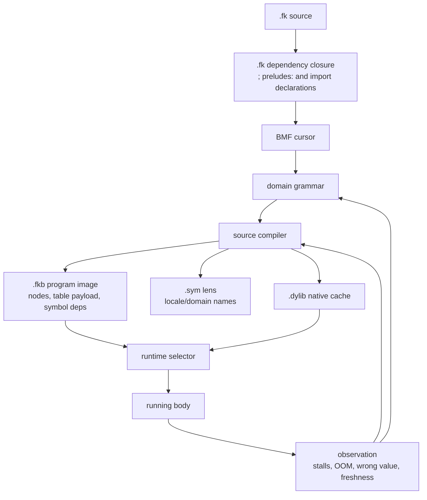

# Source Runtime Release Map

This is the release map for `.fk/.fkb/.dylib` as the runtime artifact surface,
with `.tbl` retired. Receipts keep the past. This file names the present floor,
the target shape, and the measured pressure that tells us whether we are moving.
Every measure below was re-taken on 2026-09-04.

## Target Shape

```mermaid
flowchart TD
    Source[".fk source"]
    Deps[".fk dependency closure<br/>; preludes: and import declarations"]
    Cursor["BMF cursor"]
    Grammar["domain grammar"]
    Compiler["source compiler"]
    Fkb[".fkb program image<br/>nodes, table payload, symbol deps"]
    Sym[".sym lens<br/>locale/domain names"]
    Dylib[".dylib native cache"]
    Selector["runtime selector"]
    Runtime["running body"]
    Observe["observation<br/>stalls, OOM, wrong value, freshness"]

    Source --> Deps
    Deps --> Cursor
    Cursor --> Grammar
    Grammar --> Compiler
    Compiler --> Fkb
    Compiler --> Sym
    Compiler --> Dylib
    Fkb --> Selector
    Dylib --> Selector
    Selector --> Runtime
    Runtime --> Observe
    Observe --> Grammar
    Observe --> Compiler
```

`fkwu file.fk` is a compiler front door: it may read source and produce fresh
artifacts, and when a fresh artifact exists it runs that instead of reparsing
source.

`.tbl` execution is retired: `fkwu x.tbl` refuses by name, and no `.tbl` is in
the tree. The table-shaped payload belongs inside `.fkb`, not in a standalone
runtime artifact.

`.sym` is the locale/domain symbol lens. The `.fkb` must still carry stable
symbol dependencies needed to run; `.sym` gives names and presentation without
being the executable dependency truth.

`.fk` dependency management lives in the runtime door. The declaration every
kernel reads is `; preludes: a.fk b.bml …` — fkwu's parser walks it recursively,
and the Go/Rust/TS siblings walk it the same way (deduplicated, `none` honored,
a `.bml` prelude lowered in-process). `import "path.fk"` is also installed in
fkwu and in the three minimal walkers; `validate.sh` expands `; import` headers
for the siblings. Dependencies load recursively, resolve from the importing file
with body-root fallbacks, and are tracked as a source unit: a direct import
prefers a fresh versioned `.fkb` image, compiles one when none is usable, and
falls back to source composition only when an image cannot be made or trusted.
The root `.fkb` identity covers the root plus every imported file, so changing a
dependency stales the root artifact.

## Current Measures

| Measure | Value |
| --- | ---: |
| repo `.fk` files (outside `node_modules`) | 5,231 |
| `; preludes:` declaration lines / files carrying one | 5,338 / 4,464 |
| `import "…"` declaration lines in `.fk` | 307 |
| `form/form-stdlib` `.fk` files | 3,492 |
| of which root / tests / seedbank / grammars | 1,446 / 1,872 / 117 / 31 |
| `form/form-stdlib` `.bml` files | 222 |
| stdlib `(defn` / `(let` outside `tests/` | 37,209 / 14,158 |
| all stdlib `(defn` / `(let` | 44,560 / 42,773 |
| `section [` declarations in stdlib `.fk`/`.bml` and `grammars/` | 611 |
| BMF source files in `grammars/` | 4 |

The checkout witness is green: `bootstrap/ground.fk` 42, `ground-recursive.fk 10`
55, the binary freshness band 31, `ground-numeric-list.fk` `[1, 2.5, [3, 4]]`,
native-vs-rented 11111, structural gate 1.

The runtime selector is installed: `fkwu file.fk` derives `file.fkb` plus
`file.sym`, scans the `.fk` dependency closure, tries a fresh callable `.dylib`,
prefers a fresh `.fkb` with matching embedded source-unit identity over
reparsing source, recompiles when the root or any dependency changes, and
`./fkwu file.fkb` executes the program image directly; `fkwu file.bml` lowers in
memory and caches `.bml.fkb` beside the source. The admission pulse
(`kernel_stat 15..18`) names which door a run took. Bands:
`import-statement-runtime-band` 42, `source-runner-admission-band` 2097151,
`import-carry-band` 63.

## Feature Families

The stdlib's pressure groups into feature families; the release work starts
with `artifact-runtime`, `grammar-language`, and `core-engine`.

| Family | Next release pressure |
| --- | --- |
| other-stdlib | classify into real clusters before uplift |
| grammar-language | load `.bmf` source as runtime rules, then migrate grammar files |
| artifact-runtime | make artifact lifecycle grammar drive `.fkb/.sym/.dylib` |
| learning-cognition | lift experiments, corpora, and observations into domain grammars |
| host-mesh-world | lift carriers, channels, and world entities |
| core-engine | keep minimal; shrink toward stable primitives and generated forms |
| registry-ontology | turn symbol and ontology rows into grammar-owned declarations |
| file-codec-cursor | use cursor/codec grammars instead of hand parser forms |
| language-lift-eval | move translators to language-specific BMF surfaces |

The broad `other-stdlib` bucket is not a separate cleanup mission. Split and lift
it only when a north-star release change touches that code, or when a missing
cluster blocks an active release gate.

## Release Gates

| Gate | Exit condition | Current status |
| --- | --- | --- |
| R0 measurement | repeatable counts for `(defn`, `(let`, sections, grammar rules, artifact tests | the counts above are shell counts re-taken by hand; the Form-native metric cell is still owed |
| R1 source compiler health | cursor is the scanner, no large string builder hot path, health and persistence bands pass | healthy: `source-compiler-grammar-bridge-band` 32767 on fkwu and three-way agreed |
| R2 artifact authority | `.fk` compile emits fresh `.fkb` plus `.sym`, and eventually `.dylib`; `.fkb` embeds table payload and symbol deps | installed for `.fkb/.sym`; version-3 `.fkb` carries exported function index + arity for import loading; `.sym` records the source-unit dependency closure; `.dylib` selection installed for prebuilt ABI artifacts; `.dylib` emission still pending (`HOMECOMING.md`) |
| R3 runtime selector | loader chooses fresh `.dylib`, then fresh `.fkb`, then source compile only on stale/missing artifacts | installed for `.fk`, `.fkb`, and `.dylib` executable inputs; `.fk` freshness includes imported `.fk` dependencies |
| R3a dependency declarations | every kernel reads the body's dependency declarations natively | closed: `; preludes:` is read by all four kernels; `import "path.fk"` by fkwu and the minimal walkers; no migration debt |
| R4 `.tbl` release | `.tbl` is not a supported runtime input | closed: `fkwu file.tbl` refuses by name |
| R5 one invocation | `fkwu file.fk` is the only source invocation | closed: there is no second spelling |
| R6 C seed shrink | no runtime meaning grows in `runtime/fkwu-uni.c`; seed code only carries the current checkout witness until the native body owns the door | open: the artifact door (parse, `.fkb` emit, selector) still lives in the seed |
| R7 lift-on-touch | every file touched by R1-R6 moves to the highest available grammar, or records the missing grammar that blocked the lift | standing rule |

## The Standing Rule

The remaining release work is narrow: move the artifact door out of the
shrinking C seed as the native body takes it over, and install native `.dylib`
emission without stranding execution without a fresh `.fkb` fallback.

Stdlib semantic uplift is not a separate cleanup project. It is a release-path
rule: whenever we touch code for the runtime release, we lift that file or
section to the highest grammar available now. If no adequate grammar exists, we
add the smallest missing grammar needed by the touched path and use it
immediately. The `(let`/`defn` count must trend down slice by slice, but it does
not block release work that is already moving the artifact path home.

The split is this: keep `.fk` as the compiler/admission input, keep `.fkb` as
the program-image authority, use `.dylib` only when fresh and callable, keep
`.tbl` retired, and drain low-level forms in the same motion where they are on
the artifact path.
