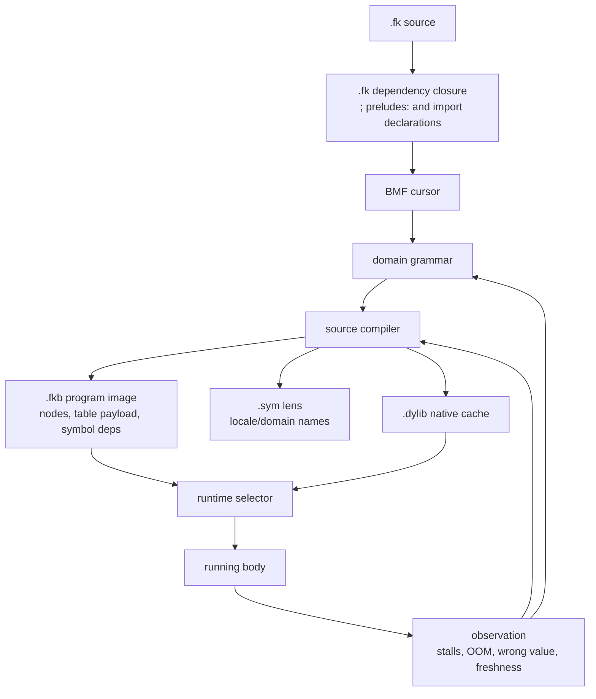

# Source Runtime Release Map

This is the release map for `.fk/.fkb/.dylib` as the runtime artifact surface.
It names the present floor, the target shape, and the measured pressure that
tells us whether we are moving. Every measure below comes from the command named
beside it, run over the current tree.

## Target Shape

```mermaid
flowchart TD
    Source[".fk source"]
    Deps[".fk dependency closure<br/>; preludes: and import declarations"]
    Cursor["BMF cursor"]
    Grammar["domain grammar"]
    Compiler["source compiler"]
    Fkb[".fkb program image<br/>nodes, table payload, symbol deps"]
    Sym[".sym lens<br/>locale/domain names"]
    Dylib[".dylib native cache"]
    Selector["runtime selector"]
    Runtime["running body"]
    Observe["observation<br/>stalls, OOM, wrong value, freshness"]

    Source --> Deps
    Deps --> Cursor
    Cursor --> Grammar
    Grammar --> Compiler
    Compiler --> Fkb
    Compiler --> Sym
    Compiler --> Dylib
    Fkb --> Selector
    Dylib --> Selector
    Selector --> Runtime
    Runtime --> Observe
    Observe --> Grammar
    Observe --> Compiler
```

`fkwu file.fk` is the one source invocation and a compiler front door: it may
read source and produce fresh artifacts, and when a fresh artifact exists it runs
that instead of reparsing source. The table-shaped payload lives inside `.fkb`.

`.sym` is the locale/domain symbol lens. The `.fkb` carries the stable symbol
dependencies needed to run; `.sym` gives names and presentation without being
the executable dependency truth.

`.fk` dependency management lives in the runtime door. The declaration every
kernel reads is `; preludes: a.fk b.bml …` — fkwu's parser walks it recursively,
and the Go/Rust/TS siblings walk it the same way (deduplicated, `none` honored,
a `.bml` prelude lowered in-process). `import "path.fk"` is installed in fkwu and
in the three minimal walkers; `validate.sh` expands `; import` headers for the
siblings. Dependencies load recursively, resolve from the importing file with
body-root fallbacks, and are tracked as a source unit: a direct import prefers a
fresh versioned `.fkb` image, compiles one when none is usable, and falls back to
source composition only when an image cannot be made or trusted. The root `.fkb`
identity covers the root plus every imported file, so changing a dependency
stales the root artifact.

## Current Measures

| Measure | Value | How |
| --- | ---: | --- |
| repo `.fk` files (outside `node_modules`) | 5,621 | `git ls-files -- '*.fk'` |
| `; preludes:` declaration lines / files carrying one | 5,925 / 4,969 | `git grep -E '^[[:space:]]*;+[[:space:]]*preludes:' -- '*.fk'` |
| `import "…"` declaration lines in `.fk` | 203 | `git grep -E '^[[:space:]]*\(?import[[:space:]]+"' -- '*.fk'` |
| `form/form-stdlib` `.fk` files | 3,699 | `git ls-files` inside `form/form-stdlib` |
| of which root / tests / seedbank / grammars | 1,387 / 2,142 / 115 / 30 | same |
| `form/form-stdlib` `.bml` files | 916 | same, `'*.bml'` |
| stdlib `(defn` / `(let` outside `tests/` | 39,458 / 16,140 | `git grep -o` occurrences |
| all stdlib `(defn` / `(let` | 48,567 / 49,981 | same |
| `section [` declarations in stdlib `.fk`/`.bml` and `grammars/` | 1,278 | `git grep -o 'section \['` |
| BMF source files in `grammars/` | 4 | `git ls-files grammars` |
| `runtime/fkwu-uni.c` lines | 25,483 | `wc -l` — the seed-shrink reading (R13) |

The checkout witness is green: `bootstrap/ground.fk` 42, `ground-recursive.fk`
55, `binary-freshness-band` 31, `ground-numeric-list.fk` `[1, 2.5, [3, 4]]`,
`native-vs-rented-band` 11111, structural gate
(`./fkwu gate/structural-gate-run.fk`) 1.

The runtime selector is installed: `fkwu file.fk` derives `file.fkb` plus
`file.sym`, scans the `.fk` dependency closure, tries a fresh callable `.dylib`,
prefers a fresh `.fkb` with matching embedded source-unit identity over
reparsing source, recompiles when the root or any dependency changes, and
`./fkwu file.fkb` executes the program image directly; `fkwu file.bml` lowers in
memory and caches `.bml.fkb` beside the source. The admission pulse
(`kernel_stat 15..18`, [live diagnostics](../live-dynamic-diagnostics.md)) names
which door a run took. Bands: `import-statement-runtime-band` 42,
`source-runner-admission-band` 2097151, `import-carry-band` 63.

## Feature Families

The stdlib's pressure groups into feature families; the release work starts
with `artifact-runtime`, `grammar-language`, and `core-engine`.

| Family | Next release pressure |
| --- | --- |
| other-stdlib | classify into real clusters before uplift |
| grammar-language | load `.bmf` source as runtime rules, then migrate grammar files |
| artifact-runtime | make artifact lifecycle grammar drive `.fkb/.sym/.dylib` |
| learning-cognition | lift experiments, corpora, and observations into domain grammars |
| host-mesh-world | lift carriers, channels, and world entities |
| core-engine | keep minimal; shrink toward stable primitives and generated forms |
| registry-ontology | turn symbol and ontology rows into grammar-owned declarations |
| file-codec-cursor | use cursor/codec grammars instead of hand parser forms |
| language-lift-eval | move translators to language-specific BMF surfaces |

The broad `other-stdlib` bucket is not a separate cleanup mission. Split and lift
it only when a release change touches that code, or when a missing cluster
blocks an active release gate.

## Release Gates

| Gate | Exit condition | Where it stands |
| --- | --- | --- |
| R0 measurement | repeatable counts for `(defn`, `(let`, sections, grammar rules, artifact tests | the counts above are `git` counts named beside each; a Form-native metric cell is the stone |
| R1 source compiler health | cursor is the scanner, no large string builder hot path, health and persistence bands pass | `source-compiler-grammar-bridge-band` 32767 on fkwu |
| R2 artifact authority | `.fk` compile emits fresh `.fkb` plus `.sym`, and `.dylib`; `.fkb` embeds table payload and symbol deps | `.fkb/.sym` installed; version-3 `.fkb` carries the exported function index + arity for import loading; `.sym` records the source-unit dependency closure; `.dylib` is an accepted executable input; `.dylib` emission from source is open |
| R3 runtime selector | loader chooses fresh `.dylib`, then fresh `.fkb`, then source compile only on stale/missing artifacts | installed for `.fk`, `.fkb`, and `.dylib` executable inputs; `.fk` freshness includes imported `.fk` dependencies |
| R6 C seed shrink | no runtime meaning grows in `runtime/fkwu-uni.c`; seed code only carries the checkout witness until the native body owns the door | open: the artifact door (parse, `.fkb` emit, selector) lives in the seed |
| R7 lift-on-touch | every file touched by R1-R6 moves to the highest available grammar, or records the missing grammar that blocked the lift | standing rule |

## The Standing Rule

The release work ahead is narrow: move the artifact door out of the shrinking C
seed as the native body takes it over, and install native `.dylib` emission
without stranding execution without a fresh `.fkb` fallback.

Stdlib semantic uplift is not a separate cleanup project. It is a release-path
rule: whenever we touch code for the runtime release, we lift that file or
section to the highest grammar available now. If no adequate grammar exists, we
add the smallest missing grammar needed by the touched path and use it
immediately. The `(let`/`defn` count is a reading slice by slice; it does not
block release work that is already moving the artifact path home.

The split is this: keep `.fk` as the compiler/admission input, keep `.fkb` as
the program-image authority, use `.dylib` only when fresh and callable, and drain
low-level forms in the same motion where they are on the artifact path.
