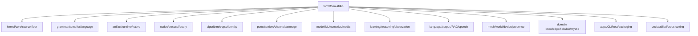

# Stdlib Knowledge Hierarchy Index

This index comes before per-file uplift. The stdlib is too large to improve
honestly file by file without first grouping files into semantic families,
section classes, and missing grammar surfaces.

Each touched surface answers one question: what does its realization want to become? Protocols
become grammars, codecs declarations over cell shapes, routes route classes, queries path grammars,
domain models cell classes — and low-level Form stays as generated realization or generic runtime,
not the hand-authored public surface of a domain; where two public ways do the same thing, the
higher one proves itself complete and the lower one is released.

## Inventory

`form/form-stdlib` holds 3,699 tracked `.fk` files (counted with
`git ls-files -- '*.fk'` inside `form/form-stdlib`):

| Area | `.fk` files |
| --- | ---: |
| total | 3699 |
| root | 1387 |
| tests | 2142 |
| seedbank | 115 |
| grammars | 30 |
| queries | 9 |
| integration | 8 |
| emits | 2 |
| skills | 2 |
| bml, drafts, lenses, measure | 1 each |

Beside them, 916 `.bml` files carry the high-grammar authority: 392 under
`bml/`, 251 at the root, 272 under `tests/`, one under `grammars/`.

The root files have a first-pass filename cluster index in
`form/form-stdlib/stdlib-knowledge-hierarchy.fk` (band
`tests/stdlib-knowledge-hierarchy-band.fk` 16383). That cell's own
`skh-inventory` and cluster rows are its snapshot, not the tree's count; the
clusters are heuristic review buckets, not final ontology.

## Tree Shape

```mermaid
flowchart TD
    Stdlib["form/form-stdlib"]
    Core["kernel/core/source floor"]
    Grammar["grammar/compiler/language"]
    Artifact["artifact/runtime/native"]
    Codec["codec/protocol/query"]
    Algo["algorithm/crypto/identity"]
    Carrier["ports/carriers/channels/storage"]
    Model["model/ML/numerics/media"]
    Learning["learning/reasoning/observation"]
    Corpus["language/corpus/RAG/speech"]
    World["mesh/world/device/presence"]
    Domain["domain knowledge/field/bio/mystic"]
    Apps["apps/CLI/host/packaging"]
    Unknown["unclassified/cross-cutting"]

    Stdlib --> Core
    Stdlib --> Grammar
    Stdlib --> Artifact
    Stdlib --> Codec
    Stdlib --> Algo
    Stdlib --> Carrier
    Stdlib --> Model
    Stdlib --> Learning
    Stdlib --> Corpus
    Stdlib --> World
    Stdlib --> Domain
    Stdlib --> Apps
    Stdlib --> Unknown
```

## Root Clusters

| Cluster | Highest Current Grammar | Missing Grammar |
| --- | --- | --- |
| `kernel-core-source-floor` | core Form + BMF cursor | core law / byte waist language |
| `grammar-compiler-language` | BMF grammar, Form definition language, source compiler grammar bridge | cluster index + section lift language |
| `artifact-runtime-native` | source artifact and program-image rows | artifact lifecycle language |
| `codec-protocol-query` | codec cells and hand parsers | protocol codec + query language |
| `algorithm-crypto-identity` | law-coded Form recipes | algorithm law language |
| `ports-carriers-channels-storage` | carrier and channel rows | capability carrier protocol language |
| `model-ml-numerics-media` | tensor/model Form recipes | tensor graph + model experiment language |
| `learning-reasoning-observation` | receipt and choice rows | learning experiment + observation language |
| `language-corpus-rag-speech` | corpus and speech rows | corpus locale query language |
| `mesh-world-device-presence` | world and device rows | world sensor/entity language |
| `domain-knowledge-field-bio-mystic` | domain-specific Form cells | domain law/evidence language |
| `apps-cli-host-packaging` | CLI and host carrier rows | app command + host package language |
| `unclassified` | unknown or cross-cutting | classification language |

## Section Classes

Each file should be reviewed by section class before any uplift:

| Section Class | Purpose | Highest Current Surface | Missing Grammar |
| --- | --- | --- | --- |
| freshness/proof header | file status, proof, next abstraction | `stdlib-freshness-header` | file-header sweep language |
| prelude dependency | declared dependency surface | `; preludes:` | prelude dependency graph language |
| feature manifest | capability facts | manifest row list | feature manifest language |
| row shape/accessors | data shape and field access | Form constructors/accessors | record shape language |
| grammar/parser | source admission | BMF grammar | domain-specific grammar language |
| metadata/attribute carrier | language-specific meta information | `domain-metadata-carrier` | per-language attribute surface adapters |
| semantic lowering | meaning-preserving translation | `domain-semantic-bridge` | semantic translation language |
| policy/selector | route or choice policy | policy rows | policy decision language |
| artifact carrier | cache/runtime artifact truth | program-image/source-artifact rows | artifact lifecycle language |
| observation/trace | runtime facts for learning | trace and receipt rows | observation ingest language |
| host effect | file/socket/process/device effects | carrier rows | effect capability language |
| low-level Form pressure | visible defn/let pressure and next grammar | `section-grammar-pressure-language` | generated grammar-use migration language |

## Missing Grammars

The missing grammar list is the work queue. The v1 grammar surfaces are
authored as BMF source in
[`grammars/stdlib-uplift-missing-grammars.bmf`](../../grammars/stdlib-uplift-missing-grammars.bmf).
They are not Form constructor lists. Their runtime-use witness is
[`form/form-stdlib/stdlib-uplift-bmf-use.fk`](../../form/form-stdlib/stdlib-uplift-bmf-use.fk),
which binds each authored grammar family to an actual reversible BMF object rule
and proves source -> object -> source -> object roundtrips in
[`form/form-stdlib/tests/stdlib-uplift-bmf-use-band.fk`](../../form/form-stdlib/tests/stdlib-uplift-bmf-use-band.fk).

The source file uses the repo's executable BMF section shape:
`section [name.bmf] { rule ::= ... => emit <= reverse; }`. The open gap is the
generic `.bmf` text-to-runtime-rule path: a `grammars/*.bmf` file is source
authority that a `.fk` cell mirrors by hand (`host-effect-grammar.fk` names
`grammars/host-effect-vocabulary.bmf` and carries its rows as Form data; no cell
reads a `.bmf` file into runtime rules). What stands is BMF-authored section
source plus observed bidirectional runtime rules (`stdlib-uplift-bmf-use-band`
131071). Uplift should happen by
cluster after the relevant BMF grammar is loaded and used in at least one file.

Low-level `defn` / `let` pressure is tracked separately by
[`grammars/stdlib-section-pressure.bmf`](../../grammars/stdlib-section-pressure.bmf)
and
[`form/form-stdlib/stdlib-section-pressure.fk`](../../form/form-stdlib/stdlib-section-pressure.fk).
This is a guide metric: capped file-window counts make the pressure visible
without recreating the recursive whole-file scan stall.

The whole-body pressure measures live in
[`source-runtime-release-map.md`](source-runtime-release-map.md): the stdlib
outside `tests/` carries 39,458 `(defn` and 16,140 `(let` across 1,557 `.fk`
files.

| Grammar | Status | First Use |
| --- | --- | --- |
| `stdlib-freshness-header` | built v1 | parseable file and section uplift headers |
| `stdlib-cluster-index-language` | BMF source v1 | replace the current row index with parseable cluster declarations |
| `section-lift-plan-language` | BMF source v1 | ask highest-current and higher-imaginable questions per section |
| `protocol-codec-language` | BMF source v1 | HTTP, JSON, XML, CDR, DNS, path/query grammars |
| `route-service-language` | BMF source v1 | HTTP services and CLI route surfaces |
| `capability-carrier-protocol-language` | BMF source v1 | storage, resource, tool, and channel carriers |
| `artifact-lifecycle-language` | BMF source v1 | `.fk`, `.fkb`, `.sym`, `.dylib` lifecycle |
| `tensor-graph-model-language` | BMF source v1 | model blocks, tensor layouts, tokenizer experiments |
| `learning-experiment-language` | BMF source v1 | choice receipts, evaluation, feedback loops |
| `corpus-locale-query-language` | BMF source v1 | RAG corpora, i18n, speech, concept queries |
| `world-sensor-entity-language` | BMF source v1 | rooms, devices, presence, sensors, spatial fusion |
| `domain-law-evidence-language` | BMF source v1 | biology, astronomy, field law, evidence claims |
| `proof-manifest-language` | BMF source v1 | band coverage, stale proof headers, expected values |
| `section-grammar-pressure-language` | BMF source and use v1 | capped-window `defn`/`let` pressure and next grammar per section |
| `domain-metadata-carrier` | built and used v1 | attributes/decorators/annotations lower to carrier/scope/key/value rows |

## Migration Rule

No mechanical freshness-header sweep, and no side-mission uplift pass that
does not serve an active release gate.

The north-star rule is lift-on-touch: any file or section touched while releasing
the source door, `.fkb`, `.sym`, `.dylib`, loader selection, or source compiler
health moves to the highest available grammar. If no adequate grammar
exists, build the smallest missing grammar needed for that touched path and use
it immediately.

For a cluster pass, the order is:

1. Keep the hierarchy index current.
2. Pick one cluster.
3. Read the files in that cluster together.
4. Identify repeated section shapes.
5. Build the missing grammar for the repeated shape.
6. Use that grammar in one or two files.
7. Record `defn`/`let` pressure and the next imaginable grammar.
8. Validate the focused bands.
9. Only then add freshness/elevation headers to the cluster.

This prevents a superficial header pass from hiding the real abstraction work.
