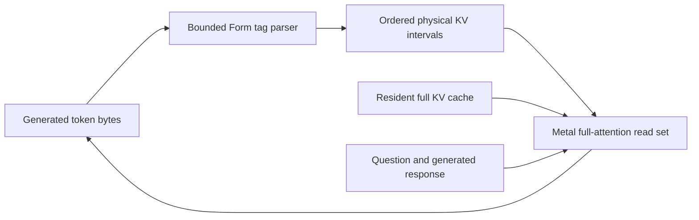

# Declarative attention in the native Qwen path

Status: an opt-in implementation with parser, GPU, and live-generation witnesses.
The default Qwen generation entrypoint is unchanged. No C seed growth is involved.

## What the paper contributes

[Language Models Can Control Their Own Attention](https://arxiv.org/abs/2609.02737)
lets generated declarations choose global, selected-chunk, or local attention.
The full KV cache remains resident; changing scope changes what is read.
Instructions, the question, and generated output remain available. The authors
report lower attended-token counts with modest accuracy losses on their tested
models and tasks, and longer generated responses. Their projected high-batch
GPU speedups are distinct from measured task accuracy and attention counts.
Their implementation affects global-attention layers, leaving recurrent or
sliding-window layers alone. A masking-disabled ablation separates the effect
of the instructions from the effect of actually reducing reads.

Our decision: implement reversible read selection, then measure its usefulness
on this machine and our workloads. An attention-count reduction alone cannot
establish end-to-end speed, answer quality, or lower resident memory use.

## The implementation



The authority is [declarative-attention.bml](../form/form-stdlib/declarative-attention.bml).
It admits a configuration and builds an interval plan only when a declaration
completes. Partial tags survive token boundaries. Control text is bounded to
128 bytes. Unknown or duplicate chunk IDs and oversized controls restore global
scope and increment the refusal counter. Ordinary non-control text leaves the
read set unchanged. A closing scope tag returns to global.

The configuration is `[prefixEnd, questionStart, responseStart, chunks]`.
Each chunk is `[positiveId, start, endExclusive]`. Coordinates are absolute token
positions. Admitted chunks are ordered, disjoint, within the context region, and have
unique IDs; the current bound is 64 chunks.

| Mode | Static intervals | Growing interval |
|---|---|---|
| Global | none | `[0, currentPosition + 1)` |
| Focus | prefix and selected chunks in physical order | question through current token |
| Local | prefix | question through current token |

Place all always-visible instructions in the prefix or question
region. Chunk boundaries are supplied by the caller; there is no automatic
document chunker or relevance index here. The exact emitted syntax is
`<global>`, `<focus magic_chunks="1,2">`, and `<local>` with corresponding
closing tags. Nested spans are not a stack: any recognized closing tag restores
global scope. This deliberately narrow protocol is exposed by `qdag-instruction`.

[declarative-attention-metal.bml](../form/form-stdlib/declarative-attention-metal.bml)
maps interval indices back to original KV positions. It uploads a small interval
buffer at transitions. Its GPU loops traverse selected positions directly;
they do not read the full cache and zero excluded scores afterward. RoPE
positions, KV writes, cache capacity, and recurrent-layer state stay intact.
The interval buffer belongs to one generation stream and is released afterward.

[qwen35-dense-token-handle.fk](../form/native/metal/qwen35-dense-token-handle.fk)
adds scoped variants of the existing forward functions. The existing functions
delegate with no scope. Full-attention layers receive the selected read set;
the recurrent path keeps its established behavior.

[form-cli-declarative-attention.bml](../form/form-stdlib/form-cli-declarative-attention.bml)
provides `qdag-generate(ctx, state, cfg, promptIds, budget, stopIds, enabled)`.
Use a freshly allocated stream state. The caller owns the admitted model and
state. Prompt prefill is full-context, once. Only decoded generated bytes feed
the parser. `enabled=1` applies the read set; `enabled=0` runs the same protocol
through the original forward path for a masking-disabled comparison.

The result contains status, generated token IDs, parser state, next cache
position, selected-position total, full-position total, and successful decode
forward count. The position totals exclude prefill and are not byte or latency
measurements. On budget exhaustion, the last returned token can still be pending
in the autoregressive loop: it is returned and parsed without an unnecessary
next forward. This API does not currently offer conversation-state continuation.
Failed forwards do not advance the success counters.

## Evidence and promotion criteria

The pure parser band requires **4095**, with identical results on Go, Rust,
TypeScript, and native fkwu. It checks split declarations, scaffold retention,
global restoration, ordered multi-chunk selection, invalid references, bounded
control text, invalid coordinates, and causal limits.

The GPU band requires **255**. It uses 513 cache positions, four query heads,
two KV heads, and width eight. The four views visit **513, 265, 15, 513**
positions. Each output is byte-identical to the existing cooperative attention
kernel supplied with the equivalent gathered KV rows. Gathering is only the
test oracle. Excluded rows poisoned with NaNs do not affect focused output.
Returning to global restores the full view, and the original KV bytes remain
unchanged. This fixture is an implementation check, not a model-quality result.

The generation refusal/accounting band requires **31**. The first live Qwen3.8
Q8 smoke generated seven output tokens with two transitions and zero refused
controls. Its entire prompt was always visible: **182 selected / 182 full**
positions. That result demonstrates the live control path without implying
savings. [The stronger reproducible smoke](../observe/declarative-attention-qwen-smoke.bml)
compares fresh states with a removable context chunk in both masking modes.
On this checkout it passed with **244 prompt positions**, including **145
context positions**. Both arms stopped with the same seven token IDs, two
transitions, and zero refusals. Masking selected **1,156 / 1,736** positions;
the masking-disabled arm selected **1,736 / 1,736**. Cleanup released all
**1,013** expected model/state handles, after separately releasing the first
arm's **128** state handles. This is one controlled fixture with a trivial
answer, so it establishes execution parity for that case rather than general
answer-quality parity. No latency comparison was performed.

Run from the repository root:

```sh
form-run ./form/validate.sh form-stdlib/tests/declarative-attention-band.fk
form-run ./fkwu form/native/metal/tests/declarative-attention-metal-band.fk
form-run ./fkwu form/form-stdlib/tests/form-cli-declarative-attention-band.fk
form-run ./fkwu observe/declarative-attention-qwen-smoke.bml
```

Before enabling this in the resident session path, use a fixed local evaluation
set covering retrieval, multi-document synthesis, code questions, irrelevant
context, and return-to-context behavior. Compare the existing prompt, the
declaration prompt without masking, and the declaration prompt with masking.
Record answer checks, output length, refusals, transitions, decode latency,
prefill latency, and selected/full positions per case. Include warm runs and
multiple context lengths. Keep local batch-one results separate from any
throughput experiment. The deciding question is whether smaller read sets
preserve useful answers and improve measured runtime on our own tasks.

Memory offload, eviction, training, and a default-on resident policy are separate
work. The current full cache remains allocated, and no quality or latency
advantage is claimed by this implementation receipt.
