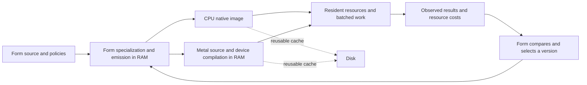

# fkwu Form-native runtime north star

**Form owns the program, the compiler recipes, the resource policy, and the choice of what runs. CPU and Metal programs are generated, admitted, and executed in RAM. Disk holds disposable caches. The C seed shrinks as each host operation gains a witnessed Form-native replacement.**

The engineering scope is:

> Perform a C bootstrap runtime architecture audit and repair pass for Form-native host integration. Inspect the current C seed function by function and global by global, reduce accidental C ownership, repair concrete runtime limits, and describe the migration path toward a Form-owned runtime with native host carriers, explicit resource lifetimes, dynamic replacement, and live comparative execution.

The remaining carrier starts, maps, calls, waits, and releases. Runtime meaning lives in Form/BML cells that can be inspected, replaced, compared, cached, and improved without editing C.

The bootstrap compiler follows this direction too: Form now generates the full CLI table through the source-native runner. Large literals and row sets use balanced traversals. The Form reference walker carries call frames and run memory as explicit values. These are working pieces of the native substrate; source parsing, CPU executable allocation, several host protocols and process-global carrier state still reside in the seed.

## The Metal floor now witnessed

`form/form-stdlib/bml/metal-jit.bml` generates the program descriptor, hashes program identity, selects RAM/capture/reuse mode, and holds the selected pipeline as a Form value. `metal_pipeline` passes Form-generated MSL directly to Metal's in-process compiler. Dispatch uses resident buffer handles and fences. An authored `.metal` file and a shader compiler subprocess are unnecessary.

An optional `.metalbin` file stores a compiled pipeline archive. Its Form-owned key covers exact source, entry, device registry identity, OS version and descriptor version. A fresh process can require that archive to contain the requested compiled pipeline. The API's archive-miss option makes the requirement observable. [Apple: binary archive hit requirement](https://developer.apple.com/documentation/metal/mtlpipelineoption/failonbinaryarchivemiss)

The running witnesses are:

- `metal-jit-live-band.fk`: `4095`; two in-RAM programs, equal GPU outputs, live Form selection, and continued use of both versions after admission, including separately submitted fences.
- `metal-jit-cache-band.fk`: `63` for capture and `63` in a second process requiring archive reuse.
- `metal-jit-refusal-band.fk`: `127`; missing/corrupt/mismatched archives and malformed descriptors are refused without publishing a pipeline.
- `metal-jit-choice-band.fk`: `2047`; two domain-specific policies select real GPU programs, stale evidence refuses selection, a failed re-witness retires the policy, and micro-thought recall checks exact source plus entry.

Current limits remain explicit. The archive reuses pipeline binaries; Metal still processes the supplied MSL into an in-memory library. The Objective-C adapter is a dynamically loaded bootstrap artifact. `FKWU_METAL_CARRIER` selects that adapter for a process; it does not hot-swap the adapter. Live A/B here selects **Form-generated GPU programs**. Pipeline objects currently live until process exit; per-version reclamation and multi-context ownership still need their own lifetime implementation. Buffer tables grow, but the current handle wire format still permits at most 65535 slots and retires exhausted generations. Reads and writes currently quiesce all outstanding adapter work; per-buffer dependencies remain a throughput improvement to implement. These boundaries are measured work remaining, rather than claims of a completed C-free OS.

## The north star

The north star is a Form-native runtime whose C surface is mechanical and whose policy lives in Form.

The C carrier should keep only the parts that must touch the platform ABI directly:

- reserve, commit, protect, map, unmap, and synchronize memory;
- load and enter a verified image;
- expose monotonic time, entropy, threads, events, waits, and wakeups;
- open files, mapped stores, sockets, devices, and platform queues;
- submit work to host devices and return fences, spans, handles, and status rows;
- flush instruction caches and transfer control across a stable value ABI;
- release resources through explicit destructors.

Everything else should move home to Form:

- parsing, lowering, specialization, and scheduling policy;
- garbage-collection policy and root classification;
- protocol recipes, device interpretation, image and audio formats;
- HTTP and mesh behavior;
- numeric algorithms and operator selection;
- resource admission, budgets, backpressure, and retry policy;
- belief/provenance models and choice policy.

Every remaining C function should have a concrete host-ABI reason to exist. A function retained because Form cannot yet express, test, or dispatch its behavior is a migration target requiring an executable replacement and comparative witness.

## Runtime shape

The target runtime has one explicit context object. The context owns all state that is now scattered through process globals: values, intern pools, image tables, file descriptors, device handles, dynamic modules, root stacks, metrics, and outstanding work. A process may host one context or many. A test may create, compare, and destroy contexts without hidden residue.

The value ABI is small, versioned, and portable. It carries tags, spans, handles, and capability descriptors rather than host pointers with implicit meaning. It has explicit overflow behavior and a stable layout record. Form code can then call native carriers without depending on C source layout.

Crossings across the carrier boundary are batched. Bulk data stays in owned shared regions. Form passes descriptors: handle, offset, length, element type, layout, fence. The carrier returns status and fences. Large frames, buffers, audio windows, and tensor slabs do not cross as nested Form lists when a span can hold the data in place.

Device work is asynchronous by default. A submit creates a fence. A timeout means "still outstanding," not "safe to free." Freeing a live resource refuses the release, drains where policy asks for it, or retires the slot until the outstanding work is known to be gone. Handles are generational so a stale handle cannot revive a reused slot.

Dynamic limits are negotiated from the host and device. Tables grow when safe, report capacity when useful, and expose pressure to Form policy. The goal is minimal artificial limits, not physically infinite capacity. The runtime should know why a limit exists and where the next growth path lives.

## Dynamic replacement and live comparison

Native behavior should be replaceable without editing the C seed. A Form-native replacement carries a contract:

- content hash and source path;
- builder ABI hash and runtime ABI hash;
- required capabilities;
- input and output layout;
- purity/effect classification;
- destructor and lease behavior;
- evidence: bands, fixtures, and comparative traces.

A replacement is admitted beside the existing implementation. Form can run old and new versions over the same captured inputs, compare outputs, latency, allocation, and device usage, then publish one version atomically. Existing leases finish on their original version. New calls take the selected version. Rollback is another selection, not a rebuild.

This gives A/B testing at the runtime level without making the C seed larger. The carrier supplies the loading and call discipline; Form owns the choice path.

## Form-native OS path

The hosted runtime is the first floor. The same shape can grow toward a freestanding Form-native substrate:

1. hosted Form kernel over the current carrier;
2. freestanding emulator with the same value ABI and resource contracts;
3. one-board boot path with timer, interrupt, memory, and console witnesses;
4. scheduler, mapped storage, and device queue witnesses;
5. network and media carriers;
6. recovery and update paths;
7. multiple hardware families with the same Form-level contracts.

Ownership must move through observable boot, memory, interrupt, scheduling, driver, persistence, and update contracts. The hosted witnesses in this pass establish the resource and program-admission floor; they do not establish a freestanding boot or kernel driver implementation.

## Embodied knowledge

"Embodied knowing" in this repo means the claim has a body:

- an executable cell;
- a band that can fail;
- source evidence;
- a receipt with the command and result;
- a migration path when the witness is incomplete.

Belief systems become versioned, witnessed policy sets. More than one can exist at once when their validity domain is explicit. Choice paths name which belief set is active for a decision. A belief that no longer serves is retired by witness and lineage, not defended as a permanent rule.

The concrete bridge is `form/form-stdlib/bml/metal-jit-choice.bml`. It uses the existing lifecycle in `observe/belief-freshness.fk`: a policy carries a domain, a resident program version and its observed-result stamp. Different domains coexist. The caller names which domain and epoch applies; a stale or failed observation returns no selected version. Renewing one policy leaves the earlier evidence value intact. `mj-thought` uses `micro-thought.bml` to recall a resident program while refusing a reused address whose source or entry differs. These witnesses establish a small local choice mechanism, not general reasoning competence or consciousness.

The runtime form of that idea is simple: every policy is a replaceable module with provenance, evidence, lease rules, and rollback. The system can learn without changing the carrier, and it can release old behavior without losing the path that explained why it once existed.

## The practical test

A C function or global earns its place only if the answer to these questions is concrete:

1. What platform resource or ABI does it touch?
2. What state does it own?
3. Can Form express the policy around it today?
4. Can the data cross as a handle or span instead of a copied structure?
5. Can this behavior be replaced, compared, and rolled back without changing C?
6. What band proves the current behavior?
7. What is the next Form-native home if it still lives in C?

When those answers are absent, the gap is a work item. When the answer lands as a cell and a band, the gap has started to come home.
