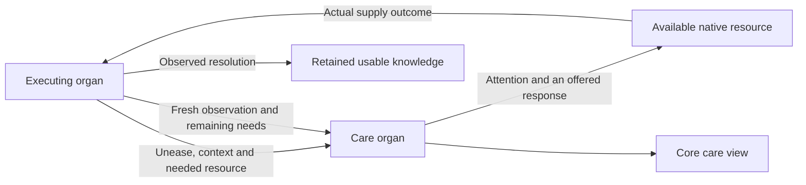
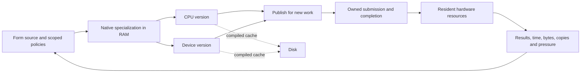

# Form-native runtime and OS north star

**A sovereign Form system can discover and use its machine, sense what needs attention, improve its own programs and release what no longer serves. Form owns meaning, memory lifetimes, compilation, scheduling and resource choice. Native CPU and device programs execute in RAM; disk holds reusable caches. Each working replacement retires the corresponding seed responsibility, until Form can bootstrap and renew itself without handwritten C.**

A computation carries its meaning, resource needs, evidence and lifetime. Form specializes it for available hardware, submits work over resident data, observes results and cost, and publishes a better version while existing work continues. The [current status](fkwu-kernel-status.md) identifies running capabilities. The [bootstrap inspection](fkwu-c-bootstrap-inspection.md) identifies handwritten ownership.

## What progress means

The unit of migration is a complete working responsibility: its callers,
values, resource owners, diagnostics and eventual release. A native component
earns its place by carrying real work through that whole lifetime. Completion
means its former runtime dependency can be removed while the behavior remains
available. The current interner is a useful component of that transition;
primary field ownership is still ahead.

| Direction | Evidence that it has become usable |
| --- | --- |
| Minimal seed | A live caller uses its Form replacement; the preceding implementation and mutable ownership retire |
| Flexible memory | Growth, compaction and release preserve identities and live readers; temporary observations leave with their owner |
| Living care | An organ can signal, receive a response and observe recovery while its ordinary allocation is unavailable |
| Native hardware performance | Complete workloads improve in latency, throughput, memory or energy with bytes, copies and crossings accounted for |
| Live improvement | Selected versions coexist under actual work; publication, comparison, cancellation and final release retain their distinct outcomes |
| Sovereignty and knowledge | Essential work completes locally; a retained lesson improves a later independent use; a recipient can use and verify an offered gift |

The smallest payload, fewest crossings and greatest occupancy can pull in
different directions. Selection follows the workload and its needs. Account
for index and descriptor bytes, page rounding, peak replacement residency,
compilation, transfer, synchronization and observation as well as payload.
Hardware remains available at its useful capacity; quiet work can leave it idle.
Remove accidental ceilings as their owners migrate. Physical capacity, current
ABI reach and chosen resource policy remain separately visible and adaptable.

The organs speak from their own execution. They offer capabilities, signal
unease and name the resources they need. A care organ listens, directs attention
and brings available nourishment to the asking organ. That organ observes what
arrived and what changed. The core interface makes this exchange visible.
Missing, aging and unreadable signals remain unknown. Tests witness contracts;
the living care loop follows signals as they arise.

## Live awareness and sovereignty

Warnings, errors, pressure and unavailable results become signals of unease at
their point of occurrence. The care organ preserves their origin, time, scope
and evidence, and connects the asking organ to suitable resource providers.
Supplying a resource, applying a response and observing recovery are distinct
events. An unfamiliar organ can join this language without changing the carrier
or adding another fixed health tally.

In the intended runtime, the ability to ask for care survives resource pressure.
The owning allocator
reports its actual capacity, demand and reclamation opportunities while the
signal and response path can still run. Care settles or transfers live owners
before reclaiming shared storage. Growth and reclamation follow observed
availability; exhaustion does not silence the organ that needs nourishment.
The minimal observation and response path has working storage and execution
already admitted independently of the allocation that needs care. It can retain
the outstanding need without repeatedly allocating the same signal. Recovery
settles every claimed reservation before another caller depends on it. Broader
diagnosis can acquire more resources when they become available.

In that runtime, stable identities reuse their existing cells. Changing
observations have an
owned lifetime and leave storage when no reader or submitted operation needs
them. A quiet interface reuses retained meaning while computing age from the
current clock. It accounts for its own allocations, bytes and crossings, so
the act of observing cannot silently exhaust what it observes.

A view owns the working memory used to render its current age, resource demand
and delivery state. Its temporary values leave with the completed reader.
Durable organ observations enter the retained field deliberately, with named
owners and release conditions. The reader can renew its view without turning
each clock tick into a permanent shared identity.

Every membrane crossing carries its reason, available local choices, resource
owner, actual outcome and observed cost. Unknown cost stays unknown. Form first
uses its own sufficient capabilities, then sufficient local and sovereign
resources. Free external resources still carry dependency and data movement;
paid work requires an explicit choice. Measured sufficiency, resource pressure
and the caller's needs guide selection, rather than a provider's prestige or an
assumption that external work is better.

The core reads the current capability and ownership graph: which organ offers
which operation, its admitted implementation, live resources, dependencies and
outstanding needs. Birth, change and retirement update that graph. Discovery
coverage is itself observed; a quiet or missing publisher retains its age and
availability instead of becoming an invented healthy result. Measuring a
crossing belongs at the executing boundary and includes the observer's cost.

Every external attempt returns something the body can use locally: an attributed
experience, a diagnostic lesson, a checked reusable program, or verified teaching.
An answer retained is not yet an answer verified; a training update is not yet
improved capability. Reuse and independent observation establish what came home.
Repeated needs direct nourishment toward the capability that can serve them
locally. Sensitive experience remains private, and evaluation answers remain
outside their own training and recall paths.

Self-sufficiency means essential work continues when external services are absent.
The outward direction is a useful gift: a capability, understanding or resource
that another can receive and verify. Its value is observed in the recipient's
use. Receiving remains open while dependence diminishes; giving grows from
demonstrated local capacity.

## Minimal carrier

The carrier starts, maps, calls, submits, waits and releases through a versioned ABI. Form owns the policies choosing those operations. Platform ABI duties can be implemented by Form-generated machine code; their present language does not make them permanent C responsibilities.

| Mechanical boundary | Form-owned meaning |
| --- | --- |
| Reserve, map, protect, synchronize and release memory | Allocation, collection, layout, admission and budgets |
| Open resources and transfer owned bytes | Naming, protocols, parsers, formats and persistence |
| Admit executable images and synchronize instruction caches | Parsing, lowering, specialization, identity, selection and retirement |
| Expose clocks, events, interrupts and runnable execution | Scheduling, fairness, deadlines, backpressure and cancellation |
| Discover devices, submit queues and report completions | Resource choice, batching, dependencies and release eligibility |

Every function and mutable declaration has an owner, an ABI reason, an executable witness and a Form-native destination. Handwritten seed C, platform adapters, assembly, globals, exported operations and generated artifacts are measured separately.

Faster execution alone does not discharge seed ownership. Native specialization
rules and code generation belong to replaceable Form programs; C additions need
an executable removal path. Progress means preserved behavior, lower handwritten
ownership, and measured resource cost together.

The same ownership applies to inspections, generators, numerical references, build identity, migrations and temporary helpers. Form carries their decisions and checks. A host process carries an explicit OS operation with owned input, complete output, actual completion status and confirmed release. A replacement takes over every active responsibility before its preceding implementation is removed. Foreign-language specimens remain clearly identified input data, and independent proof engines retain their distinct role.

Every admitted source construct reaches an explicit Form interpretation, native emission or visible admission refusal. Grammar and dispatch evolve in Form. New behavior meets executable observations and independent proof execution before it becomes available to subsequent work.

Source admission preserves every statement, scope, selected effect and final
value. Changing layout cannot discard a refusal or alter a program's meaning.
An incomplete interpretation stays unadmitted. The
[native BML boundary](native-bml-admission.md) makes this obligation executable;
compiler identity participates in cache identity so Form can renew this meaning
without editing the handwritten seed.

Resident workers receive complete owned messages and keep their programs and
working state available across requests. Readiness, backpressure, deadlines,
result framing and diagnostic flow remain Form-owned. The owner admits
completion only after submitted obligations and inherited streams are observed;
cleanup preserves the channel needed to witness its own completion.

## Native programs and resident data

CPU and device code is generated and admitted in RAM. The runtime discovers and loads Metal dynamically; its bootstrap executables do not link the framework. Separate Swift comparison carriers still use the host framework directly. Compiled caches carry exact source, entry, target and ABI identities. Required reuse either meets that identity or reports a miss. Selection is explicit.

Bulk data stays in owned resident regions. A span carries allocation identity and generation, owner, offset, length, layout, access mode and completion dependencies. Crossings carry descriptors and batches. A zero-copy request preserves its alignment and lifetime contract or reports refusal.

Device capacity is an admission ceiling. Each submitted resource view covers
the data the computation needs, with its required alignment. Form records the
view's admitted extent and completion alongside numerical results. Device
allocation and process residency measurements guide the next resource choice.

Physical capacity, encoding width and policy admission are distinct, discoverable limits. Growth follows actual availability and declared policy. Performance is measured through latency distributions, copies, copied bytes, occupancy and achieved bandwidth over a stated workload. Correctness is independently checked.

A node identity is generated as one native 64-bit word. Semantic fields may
occupy any required number of bits within that word; byte alignment is not a
requirement. Form owns their interpretation and admission. Physical storage
follows the population actually retained, independent of the identity space.
Changing an interpretation requires an explicit version and preserved meaning
for existing owners. The [current native word](native-node-word.md) establishes
the resident representation; Form-native module admission and live lifetime
management must also own its evolution and storage.

The blueprint is the shared layout authority. A primitive occupies one native
word when its meaning fits, or the few additional bits its meaning requires.
Complex cells share blueprint metadata across a run; fields and rows need no
8-, 16- or 32-bit rounding. Execution IDs stay native 64-bit words while stored
IDs and other payloads use widths selected from their actual values and schema.
CPU JIT and device expressions consume the same offsets, widths, numeric
interpretations and scale relationships. Layout changes create an identified
generation; existing readers and submitted work retain their original meaning.

Native access carries full words directly between native functions and owned
RAM; tagged host values do not constrain the payload. A stable entry consumes
identified layout descriptors, with specialized entries admitted when measured
work benefits. A descriptor owns its data lease. Retirement closes admission,
submitted work completes, then the final lease releases storage and code.
Semantic identities, runtime handles and physical slots remain distinct, so
layout changes and slot reuse cannot silently change what an existing handle
means. Reference-bearing storage participates in root retention and relocation.
Canonical equality for composed cells checks their kind and complete
composition; an index hash alone does not establish that two cells are equal.
The [current raw accessor](native-node-accessor.md) establishes the local
native call and lease boundary. The [directory](native-identity-directory.md),
[arena](native-identity-arena.md) and [exact-word interner](native-identity-intern.md)
provide executing storage components. The [current status](fkwu-kernel-status.md)
keeps their observed limits and primary ownership gap in one place. A complete
producer/read transition also carries kind-sensitive equality, tagged-handle
resolution, concurrent publication, side-table lifetimes and collector roots.

Compact storage is a measured choice. Aligned fields lower directly to native
word operations; other fields lower to the required bit extraction. A format
names its signed zero, subnormal, infinity, NaN and rounding behavior. ML block
scales remain explicit relations. Form compares footprint, compile cost and
execution over the same data, then selects from observed results. Neither
packing nor a wider arithmetic carrier silently changes numeric semantics.

## Contexts, modules and live replacement

A runtime context owns values, roots, intern pools, executable images, dynamic modules, handles, metrics and outstanding work. Several contexts coexist. Closing one completes or transfers its obligations and releases its resources while others retain allocations and progress.

The value ABI defines tags, arithmetic and overflow, layouts, spans, handles, capabilities and compatibility. Module manifests bind content, builder, ABI, target requirements, effects, layouts, destruction, leases and evidence. Admission checks these obligations before publication.
Cache identity follows exact source, compiler configuration and ABI. Build time
measures work; it does not replace those identities.

ABI identities remain unambiguous across images. Submitted work retains its granted version, buffers and completion identity until it settles. Programs, policies and evidence can be compared, renewed, published and retired for subsequent work. A deadline bounds observation; cancellation can discard a result while work still owns resources. Destruction follows the final lease. Indeterminate work never becomes successful through aggregate cleanup. Completed resources remain independent of unrelated work.

Comparisons capture effectful input once and execute selected versions over the same bytes. Equivalence comparisons preserve policy; policy comparisons vary it deliberately. Selection, evidence expiry and physical reclamation are separately observable.

An A/B comparison names the version selected to publish each external effect
and retains its completion identity. Alternative versions can compute proposals
over the same retained input; comparison does not duplicate effect submission.
Uncertain completion remains unresolved until observed. Replacement names its
state migration and any retained version usable for subsequent work. Returning
to that version preserves the state contract and does not undo completed
external effects. A better isolated result earns live selection after the
consumer's complete lifetime and resource contract is observed under continued
work.

Numerical programs carry their precision, reduction order, contraction policy
and supported input range. Comparison includes downstream discrete choices,
such as quantization and routing, alongside continuous error. A replacement
earns selection through the consumer's existing contract; observations identify
which stage needs different arithmetic and which stages already satisfy it.

## Complete OS contract

| Capability | Required execution |
| --- | --- |
| Boot, firmware, image layout and guest ABI | Enter Form-emitted code with image identity and preserved entry state |
| Physical memory and allocation | Discover memory, preserve reservations, allocate/reclaim/reuse and report exhaustion |
| Address spaces, MMU, privilege and faults | Independent mappings, attributed faults and context-owned destruction |
| Traps, interrupts, clocks and entropy | Preserve interrupted state, distinguish sources and expose unavailable entropy |
| Scheduling and process lifecycle | Preempt non-yielding work, preserve fairness and reclaim exited stacks and owners |
| Async wait/wake and cancellation | Observe completion exactly once across registration races while retaining unfinished obligations |
| Shared memory, DMA and coherence | Explicit CPU/device transitions, ordering and stale-span refusal |
| IPC, capabilities and synchronization | Transfer messages and grants with ordering, revocation and receiver-exit cleanup |
| Devices, drivers, hotplug and removal | Discover, admit, submit and remove while retaining every unresolved lease |
| Block I/O, filesystems and durability | Acknowledge durable state only when restart recovery can reproduce it |
| Networking | Preserve buffers through exchange, loss, reorder, timeout and close |
| Display, input, audio, camera and sensors | Actual streams with timestamps, measured jitter, copies and cleanup |
| Power and suspend/resume | Quiesce devices, preserve state, reconcile clocks and resolve live owners |
| Multicore and ordering | Start cores, wake across cores and retire versions under concurrent work |
| Observability and recovery | Attribute failures, retain bounded diagnostics and distinguish retries from completion |
| Live update | Migrate state, publish under load, settle leases, reclaim and restart from a valid image |

Boot and memory establish traps and address spaces. These enable scheduling and wait/wake, which support device queues, DMA and IPC. Storage, networking and media use the same ownership contracts. Update and recovery are exercised at each layer. Hosted and freestanding implementations each require their own executions.

Form features reach the kernel as native programs with explicit effects,
ownership and execution needs. Interrupt completion and resource release retain
their required progress. Reasoning that waits, learns, allocates extensively
or consults another service runs as resumable scheduled work and offers its
result back as a policy change. The system can change those policies while
preserving the ability to schedule, observe and release the work already alive.

## Local reasoning and adaptable belief systems

Micro-thoughts and choice paths are short, inspectable computations with explicit domains, inputs, effects and observations. Recalled native programs verify source and entry identity. Several policy sets can coexist with their own assumptions, evidence and freshness. Comparison can renew a policy, narrow its domain, change its selection or retire it.

A belief names the context in which it helps, the observations supporting it,
counterevidence and what would change its selection. Different beliefs can
offer alternatives without overwriting each other's evidence. A choice names
the belief and version it used. Learning can revise future choices; completed
experience keeps its actual source. Release follows the final reader and
obligation, so retained knowledge does not become permanent allocation by default.

Language sources retain their contributors, review state and complete set of candidate meanings. A context may rank those meanings while their ambiguity remains inspectable. Reindexing or changing a policy preserves the source bytes that support the comparison. Attribution, observation, interpretation and selection stay distinct, so a new interpretation can replace an old one without rewriting its evidence.

A source can be re-observed by revision and complete byte identity. Reproducing
an existing meaning, selecting a fresh source and publishing a changed meaning
are separate observable operations. Each can refuse without erasing the current
generation. Shared values preserve their complete structure when ownership
crosses between local and resident storage.

Evidence expiry stops authorizing new choices without cancelling the lifetime obligations of submitted choices. General reasoning competence requires its own evaluations. A policy witness establishes only the domain and behavior it exercised.

Embodied knowing means a claim meets real input, can be rejected by an executable check, carries execution identities and costs, and remains available for re-witnessing. What no longer serves can be released without making current meaning depend on a narrative of its origin.

## Next completed boundary

Health, care and Glass parse, retain and render changing observations outside permanent
primary interning, with collector-visible Form roots and an explicit
node-materialization door. Shared JSON construction and health protocol logic
preserve typed data and correlation through that transition. The collector,
boxed floats, reader records and framebuffer timestamps still use the seed;
the complete native lifetime below remains the destination.
Declared stream generations reuse their owned reader, releasing its obsolete
working references while held views retain their values. Current-state updates
release obsolete event trees instead of extending an overlay chain. Measure
primary admission, float boxes, temporary storage, retained state, diagnostics
and latency separately. No primary mints in an observed interval does not mean
no allocation. Ordinary health text emits values directly; explicit node APIs
and custom node callbacks retain their materialization contract. Request
parsing and discovery still use primary nodes. The next caller transition
concerns the remaining seed-owned values, records and collector roots.

The immediate runtime milestone is an owned lifetime for the retained care
view, connected to the primary value path. It is a real, recurring consumer
whose changing observations now have reclaimable list/string lifetimes but
still rely on seed collection and value pools. The native storage components
support the attempt; they do not yet replace those owners.

The implementation begins with explicit value/handle resolution and collector
roots for this consumer, including its records and reference-bearing values.
Its working observations then use the native owner from construction through
rendering and release. Deliberately retained knowledge has a separate lifetime.
The caller transition removes the corresponding primary allocation/read path
for that scope; a parallel copy alone leaves the milestone open.

The same execution must show:

1. Repeated quiet views retain their meaning without permanent primary growth;
   changed signals, current age, unresolved needs and recovery remain visible.
2. A deliberately constrained local owner preserves completed work, emits a
   correlated need, receives actual care and re-observes the result without
   depending on fresh allocation in the constrained pool.
3. Growth and release preserve held readers and exact values. Another live
   owner continues; failed publication settles or relinquishes its reservation.
   Any slot reuse preserves handle generations and side-table ownership.
4. The original care result and its complete cost remain comparable, including
   serialization, observer work, metadata, mappings and membrane crossings.

After this lifetime is usable, generalize the same ownership contract across
primary node kinds and submitted CPU/device work. Exercise live replacement
with held work before removing each old implementation. Form-owned compilation
on demand and the freestanding memory/interrupt/scheduler path can advance
alongside this migration; each uses the same ownership and completion rules.
Native response quality follows its own [homecoming](../HOMECOMING.md) evidence.
This keeps the next runtime step concrete while the full OS destination remains
visible.
