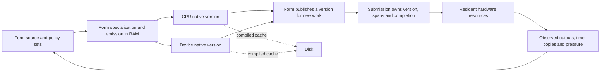

# fkwu Form-native runtime north star

**Form owns runtime meaning: programs, compilation, scheduling, resource policy, interpretation, and the choice of what runs. Form generates CPU and device programs for admission and execution in RAM. Disk holds reusable compiled caches. The temporary C seed shrinks toward zero as observed Form-native implementations take ownership.**

The destination is a Form-native operating system: the same language can describe a computation, specialize it for available hardware, submit it with explicit resource ownership, observe its result and cost, and replace it while other work continues. Small local decisions, choice paths and domain-specific policy sets belong in this runtime. They gain authority from fresh observations in their stated domain; expired evidence stops authorizing new choices. Already-submitted work retains its lifetime obligations.

The hosted runtime is the current development floor. Its host delegates access to memory, files, processes and devices. Full device ownership, address spaces, interrupts and boot require their own freestanding implementations and witnesses. A capability catalog names a route; execution establishes whether it stands.

## The ownership boundary

The carrier starts, maps, calls, submits, waits and releases through a versioned ABI. Those are enduring platform duties; their present C and Objective-C implementations are temporary. Form-native machine code may take over each duty when it can express the ABI and pass its resource, lifetime and behavior witnesses.

| Carrier duty | Form-owned meaning |
| --- | --- |
| Reserve, commit, map, protect, synchronize and release memory | Allocation and collection policy, root classification, budgets, data layout and admission |
| Open a resource and read, write or map owned bytes | Paths and protocols, parsers, image/audio formats, interpretation and persistence policy |
| Load an image, enter its ABI and synchronize instruction caches | Parsing, lowering, specialization, source identity, selection and retirement |
| Expose time, events, threads, waits and wakeups | Scheduling, deadlines, fairness, backpressure and cancellation policy |
| Discover devices, submit queues and report completions | Resource choice, batching, dependency graphs, comparative execution and release decisions |

Physical I/O continues through the existing carrier. Form owns how it requests and interprets those bytes. Removing a C decoder does not require reimplementing the operating system's read operation in Form.

Every remaining seed function and global needs a named owner, an ABI or bootstrap reason, a behavior witness, and a Form-native destination. Measure handwritten seed C, handwritten platform adapters, assembly, process-global state, exported operations and generated artifacts separately. Moving interpretation into another handwritten carrier file does not retire it. Generated C can witness the bootstrap while Form emission advances; it is not the final native image format.

## What runs now

Form generates the full bootstrap table and emitted CLI C through its source runner. Balanced traversal handles large literals and row sets; the Form reference walker carries call frames and run memory explicitly. Parsing, evaluation, executable allocation, several host protocols and much process-global state still live in the seed. Source/BML admission currently materializes a whole unit synchronously. On-demand specialization and independent context destruction remain work to implement.

The lexical inspection at `a31a89c2` counted 649 functions, 374 distinct global names, 395 individual global declarations and 58 local-static declaration units, with zero unresolved top-level units. These are an inventory of that revision, not a semantic correctness verdict or the count after subsequent deletion. The inspection and its per-symbol evidence live in [fkwu-c-bootstrap-inspection.md](fkwu-c-bootstrap-inspection.md).

After this movement, the complete repeated census counts **642 functions**, the same **374 global names** and **58 local-static declaration units**, and zero unresolved top-level units. Active Clang reconciliation counts 561 functions and 365 globals. The seed loses seven functions and 243 lines net; the handwritten adapter loses 11 lines net. Global ownership remains work to reduce.

### Dynamic Metal and RAM compilation

The root seed and emitted CLI admit Metal dynamically. They do not link Metal or Foundation. `FKWU_METAL_CARRIER` selects the adapter for a process; the separately built Objective-C adapter carries those framework calls. Loading is once per process. Live adapter replacement has not been implemented.

[`metal-jit.bml`](../form/form-stdlib/bml/metal-jit.bml) generates Metal source and the program descriptor, identifies exact source and entry, chooses RAM or explicit archive mode, and admits a pipeline through the existing carrier. No shader source file or shader compiler subprocess is required. Multiple Form-generated GPU programs can remain resident and be selected live.

An optional `.metalbin` holds a compiled pipeline archive keyed by exact source, entry, device registry identity, OS version and descriptor version. Required reuse refuses an archive miss. Metal still creates an in-memory library from the supplied source; the archive does not establish that source processing disappeared. Witnesses from the preceding movement are `metal-jit-live-band.fk` **4095**, archive capture and fresh-process reuse **63/63**, refusal **127**, and policy choice **2047**.

Buffers have growable tables with a current 65535-slot handle encoding and retired exhausted generations. Pipeline objects live until process exit. Read/write/free behavior still depends on global adapter quiescence. These are concrete limits of the current carrier.

### Frame interpretation and real async ownership in Form

The current movement removes the C BMP decoder and the synthetic C sensing stream. Primitive slots **213 and 214** are reserved as retired operations with explicit error behavior; they cannot later mean a different operation. Live callers import the Form implementation. No C decoder remains as a selectable execution path.

[`frame-luma.bml`](../form/form-stdlib/bml/frame-luma.bml) validates captured 24-bit uncompressed BMP bytes, checks sizes before multiplying, and defines the exact integer luminance fold. Its four-value policy controls the dark threshold, accepted dark-percentage range and required side contrast. The nine-value result is an explicit interpretation heuristic. Empty thirds retain their defined zero mean; a returned presence flag does not establish identity, health or a remote answer.

[`frame-metal.bml`](../form/form-stdlib/bml/frame-metal.bml) generates a Metal chunk-reduction program in RAM. Chunk size is bounded by the accumulator width. Byte offsets, row stride and pixel count travel as pairs of 32-bit values and are reconstructed at wider width in the program. Form combines the small partial reductions and applies the chosen policy. The CPU interpreter is an explicitly invoked reference implementation; it is not silently selected after GPU failure.

One capture is validated and uploaded once. Several jobs can use that same resident input with different program versions and policies. Each job records its owner, serial, capture, version, policy, output allocation and real fence. Publication changes which version subsequent submissions take. Retirement refuses new selection while earlier jobs keep their submitted version.

The current owner is a **single cooperative Form owner over a process-wide adapter**. Opening requires no batch, pending work, in-flight work or shelved work. Form checks record membership and owner identity; globally backed mutable records do not enforce protected context isolation. Other code must obey this ownership discipline.

Jobs wait on their own real fences. A timeout retains that fence and remains pending. Cancellation means drain the submitted work and discard its result; it does not abort the GPU. A failed or uncertain submission keeps its output ownership and never publishes a result. Explicit cleanup establishes quiescence for checked resource release. Release is recorded only after the carrier confirms it. Captures remain allocated until `fg-close`, which first releases every job output. Duplicate waits or releases do not create a second completion or free.

All outstanding work is settled before readback because the adapter currently drains globally. This is a working fence-driven owner, with observable submission and lifetime behavior. Independent per-resource overlap is the next carrier contract to establish.

The running witnesses reported for this movement are:

| Witness | Observed result | What it establishes |
| --- | --- | --- |
| `frame-metal-band.fk` | **65535** | One capture, live version/policy selection, old-version retention, real completion, cancellation by discard, owner checks and checked cleanup |
| `frame-metal-shape-band.fk` | **1023** | Colored and padded rows, both orientations, narrow widths, chunk boundaries, malformed input, wide layout and policy validation compared with the CPU reference |

`frame-metal-deadline-band.fk` returns **511** for timeout/fence retention and cancelled-result withholding. `frame-metal-failure-band.fk` returns **255** for real adapter refusal, half-open encoder cleanup and stale-handle rejection. Allocation-failure injection and exhaustive resource exhaustion are not covered by these bands.

A 1,050,678-byte synthetic fixture gave these millisecond wall observations: retired C path **5 ms**; explicit Form CPU reference **1562 ms**; Form-generated Metal admission **187 ms**; first frame execution **25 ms**; subsequent executions **5 ms** and **4 ms**. A second run with dispatch-counter sampling measured admission **240 ms** and executions **13/7/8 ms**. Both samples are retained in the [movement receipt](../receipts/2026-09-10-frame-kernel-review.md). These are local samples with recorded stage boundaries, not a throughput distribution or a maximum-bandwidth result. CPU-native specialization is still required to close the interpreter gap. The benchmark runner reports upload, submit, wait, read/fold and end-to-end stages separately.

## Runtime contracts that make replacement possible

The target is an explicit runtime context owning values, roots, intern pools, executable images, dynamic modules, resource handles, metrics and outstanding work. A process can own several contexts. A context's destruction completes or transfers all its work and releases its resources without changing another context. Current process-global state and Form record identity do not yet provide that guarantee.

The value ABI describes tags, integer overflow, spans, layouts, handles, capability descriptors and version compatibility. A span carries owner, allocation identity and generation, offset, length, element layout, access mode and completion dependencies. Raw pointers with hidden lifetime obligations are not the interface. Physical capacity, handle encoding and policy admission limits remain distinguishable and observable.

Bulk input stays in owned resident regions. Carrier crossings move descriptors or batches. Copy count, copied bytes, queue occupancy, latency and achieved bandwidth are observations that guide specialization. A zero-copy request must either preserve its ownership and alignment contract or return an explicit refusal; it cannot quietly become a copy. Unsupported capabilities and capacity pressure return observable outcomes that Form can act on.

Replacement has three different lifetimes:

1. **ABI identities and retired opcode slots** remain stable across images.
2. **Submission obligations** retain the granted version, allocations and completion identity until that work has settled. Evidence expiry cannot shorten this lifetime.
3. **Programs, policies and evidence** can be admitted, compared, renewed, published and retired independently for subsequent work.

A replaceable module carries source/content identity, builder and runtime ABI identities, target capabilities, input/output layouts, effect classification, lifetime/destructor requirements and comparative evidence. Admission validates those obligations before publication. Existing jobs retain their original grant. Selection of another valid resident version is an explicit policy decision; failure does not silently select an alternate implementation.

Comparison captures an effectful input once, then evaluates the chosen versions over those same bytes. Equivalence comparisons test the same policy; policy comparisons deliberately vary interpretation. Correctness and performance evidence are kept separate. Destruction follows the final lease rather than whichever version is selected now. Current Metal pipelines do not yet have that destruction path.

[`metal-jit-choice.bml`](../form/form-stdlib/bml/metal-jit-choice.bml), `belief-freshness.fk` and `micro-thought.bml` already provide a small bridge: domain-specific policies hold observed stamps, stale evidence refuses new selection, and recalled programs check exact source and entry identity. These cells establish local versioned choice and recall. General local reasoning competence is not established by these bands.

## The complete OS path and its dependencies

The first freestanding continuation target is the existing **i386 guest under `qemu-system-i386` in [`os/hati-os`](../os/hati-os/README.md)**. Its committed [first-boot transcript](../os/hati-os/witness/first-boot.txt) and [2026-07-18 receipt](../receipts/2026-07-18-hati-os-bare-metal-witness.md) record a BIOS boot, serial output, PIT timer interrupts, preemptive context switches, a physical-page bitmap and a RAM filesystem. This is an existing C/GNU-assembly kernel witness. It has not been re-run in this frame movement and is not a Form-native boot implementation.

`hati-os-targets.fk` currently catalogs hosted macOS/Android/Windows targets and their declared carrier routes. It does not currently contain a bare-metal i386 target row. The first freestanding move must re-witness the existing guest, define its explicit guest ABI and add a truthful target/emission contract. The 32-bit guest cannot inherit a hosted ARM64 or x86-64 value layout by assertion. Form-emitted execution under that boot chain is a new witness to build.

Each next-witness entry below is a work order, not an implementation claim. Historical guest behavior is distinguished from current hosted execution.

| Capability and dependency | Current hosted organ or historical guest floor | Freestanding gap | Next observable witness |
| --- | --- | --- | --- |
| Boot, firmware and image layout | Host launches `fkwu`; historical i386 BIOS/assembly boot exists | Form-owned guest ABI, emission and boot image; broader firmware entry | Reproduce the serial boot transcript, then enter one Form-emitted computation with recorded image identity |
| Physical memory and allocation; after boot | Host allocation/mapping; guest has a fixed bitmap allocator | Discovered physical map, reserved-region ownership and Form allocation policy | Allocate, reclaim and reuse pages while preserving firmware/kernel reservations; report exhaustion explicitly |
| Address spaces, MMU and isolation; after physical ownership | Host isolates processes; runtime contexts remain process-global; guest is ring 0 without paging | Page tables, faults, privilege transitions and context-owned mappings | Two guest address spaces reuse a virtual address independently; an invalid access produces an attributed fault |
| Traps, interrupts, clocks and entropy; after boot/memory | Host events and monotonic time; guest has IDT/PIC/PIT | Form interrupt dispatch, exception state, interrupt-safe ownership and attributed entropy sources | Timer and synchronous trap enter/return with preserved registers and explicit source; unavailable entropy remains unavailable |
| Scheduling, threads and process lifecycle; after traps/context state | Form child supervision retains status and cleanup; guest historical preemption | Form scheduling policy, runnable/waiting/exited states, preemption and stack reclamation | Non-yielding tasks make progress under timer preemption; exiting tasks leave no stack or job ownership |
| Async wait/wake, deadlines and cancellation; after scheduling | Real GPU fences and Form process supervision; cooperative frame owner | Device-independent completion delivery and race-safe sleep/wake | Completion before, during and after sleep registration is observed exactly once; timeout/cancel retain unfinished ownership |
| Shared memory, DMA and cache coherence; after mappings/completions | Resident Metal buffers with global quiescence | Physical/device address mappings, ordering, pinned lifetimes and cache maintenance | CPU/device round-trip across explicit ownership transitions; unrelated work remains runnable; stale spans refuse reuse |
| IPC, capabilities and synchronization; after contexts/wake | Host processes, pipes and Form resource interfaces | Guest endpoint ownership, transfer, revocation and memory-order contract | Transfer a bounded message and a resource grant; receiver exit reclaims its grants without freeing the sender's live work |
| Device discovery, drivers and removal; after interrupts/DMA | Host device APIs and a target catalog; guest serial/VGA/PIC/PIT drivers | Form discovery, driver admission, device generations and removal protocol | Discover one guest device, submit real work, remove it during work and retain every unresolved lease |
| Block I/O, filesystems and durable state; after device queues | Host file operations and Form storage protocols; guest RAM filesystem | Persistent block driver, durable ordering, crash-consistent metadata and recovery | Write/flush, interrupt the guest, reboot and recover exactly the acknowledged state |
| Networking; after queues/memory/time | Host sockets and Form HTTP/mesh behavior | Guest NIC queues and network stack execution | Two guest endpoints exchange attributed bytes; loss, reorder, timeout and close preserve buffer ownership |
| Display, input, audio, camera and sensors; after drivers/scheduling | Host media carriers; Form frame interpretation/GPU computation | Form device streams, timestamps, synchronization and real-time resource budgets | One actual device stream through acquire/process/present or capture/playback, with measured jitter, copies and cleanup |
| Power, suspend/resume and hotplug; after device lifecycle | Host manages power; no new guest power witness | Device quiescence, state preservation and clock reconciliation | Suspend with live resource owners, resume or remove the device, then resolve each owner's state explicitly |
| Multicore, ordering and fairness; after traps/scheduling/memory | Host schedules CPU threads; guest historical floor is single CPU | Core startup, cross-core wakeup, atomics and shared-state ordering | Two guest cores exchange work and retire a version while retaining all earlier submissions |
| Observability, fault handling and recovery; throughout | Form framebuffer, process evidence, panels and GPU fence accounting | Guest crash records, bounded diagnostics and recovery ownership | Inject a stage failure, retain its exact cause and resource state, recover, and distinguish retries from completed work |
| Live update and persistence of meaning; after ownership/recovery | Live Form-generated GPU selection and disposable caches | Whole-runtime/driver update, state migration and boot recovery | Publish a new module under load, settle old leases, reclaim it, then restart from a recorded valid image |

Boot and memory establish the floor for traps and address spaces. Those enable scheduling and wait/wake; together they support device queues, DMA and IPC. Storage, networking and media grow from those same ownership contracts. Update and recovery must be exercised at each layer. Hosted witnesses are reusable contract evidence, not a substitute for executing the guest implementation.

## The next ordered movements

1. **Remove global device drains from independent work.** Carry per-buffer read/write dependencies from Form submission to adapter completion. Keep the current frame owner as the behavioral witness. Demonstrate that reading one completed output neither drains nor releases an unrelated pending job; report copies and overlap with actual fence timestamps.
2. **Reclaim program versions after their last lease.** Add an explicit platform pipeline destructor and Form ownership of its eligibility. Repeatedly admit, publish, retire and destroy programs while older jobs finish. Resident object counts must return to baseline; an expired policy alone cannot trigger destruction.
3. **Make memory and runtime contexts explicitly owned.** Move roots, records, handles, images and outstanding work out of implicit process globals. Give shared spans explicit transfer and generation rules. Create two contexts, close one with pending work, and prove the other retains its allocations and progress. Keep current single-owner claims bounded until that witness exists.
4. **Generate the CPU-native frame fold from Form.** Preserve the interpreter as an explicit oracle. Admit the native fold in RAM, compare exact rows over the same fixtures, and measure cold/warm costs and resident-span execution. This closes the observed 1562 ms interpreter gap without restoring C interpretation.
5. **Continue the existing freestanding guest.** Re-witness the i386 boot floor, define the guest ABI and Form-native emission route, then replace one running guest behavior and delete its old C implementation. Use the dependency matrix to advance through address spaces, interrupts, scheduling, queues and recovery with the same discipline.

Each movement includes its failure cases, retained ownership evidence and net handwritten ownership change. Source/BML compiler specialization, portable value ABI, dynamic host carriers and current artificial handle limits remain part of that reduction work. The next carrier repair must not become a new home for runtime policy.

## What embodied knowing means here

A claim gains a durable body when an executable cell meets real input, a band can reject it, observed source and resource identities travel with its result, and a receipt records the boundary reached. A policy can then be renewed or released without erasing the evidence that once supported it. Multiple policy sets coexist through explicit domains and freshness; lifetime discipline keeps their choices grounded in one resource world.

The practical questions for each function, global and replacement remain concrete: which ABI does it touch, who owns its state, where does Form own its policy, which bytes are copied, which completion releases its resources, what makes selection observable, and what execution would justify retiring the old implementation? Answering them with working cells is the path from a minimal bootstrap to a flexible Form-native OS.
