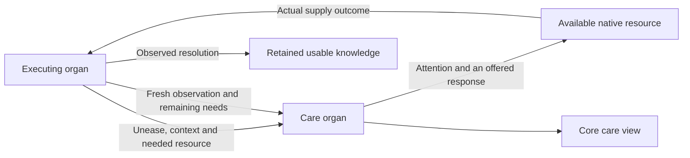
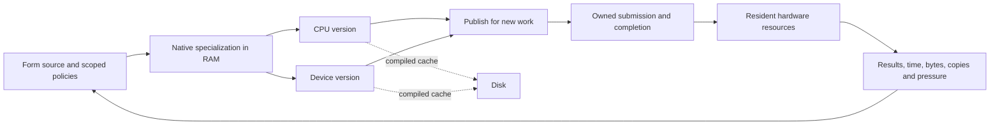

# Form-native runtime and OS north star

**Form owns programs, compilation, scheduling, resource policy, interpretation and live replacement. It emits CPU and device programs for execution in RAM. Disk holds reusable compiled caches. The temporary C seed shrinks toward zero as Form-native implementations take ownership.**

A computation carries its meaning, resource needs, evidence and lifetime. Form specializes it for available hardware, submits work over resident data, observes results and cost, and publishes a better version while existing work continues. The [current status](fkwu-kernel-status.md) identifies running capabilities. The [bootstrap inspection](fkwu-c-bootstrap-inspection.md) identifies handwritten ownership.

The organs speak from their own execution. They offer capabilities, signal
unease and name the resources they need. A care organ listens, directs attention
and brings available nourishment to the asking organ. That organ observes what
arrived and what changed. The core interface makes this exchange visible.
Missing, aging and unreadable signals remain unknown. Tests witness contracts;
the living care loop follows signals as they arise.

## Live awareness and sovereignty

Warnings, errors, pressure and unavailable results become signals of unease at
their point of occurrence. The care organ preserves their origin, time, scope
and evidence, and connects the asking organ to suitable resource providers.
Supplying a resource, applying a response and observing recovery are distinct
events. An unfamiliar organ can join this language without changing the carrier
or adding another fixed health tally.

In the intended runtime, the ability to ask for care survives resource pressure.
The owning allocator
reports its actual capacity, demand and reclamation opportunities while the
signal and response path can still run. Care settles or transfers live owners
before reclaiming shared storage. Growth and reclamation follow observed
availability; exhaustion does not silence the organ that needs nourishment.

In that runtime, stable identities reuse their existing cells. Changing
observations have an
owned lifetime and leave storage when no reader or submitted operation needs
them. A quiet interface reuses retained meaning while computing age from the
current clock. It accounts for its own allocations, bytes and crossings, so
the act of observing cannot silently exhaust what it observes.

A view owns the working memory used to render its current age, resource demand
and delivery state. Its temporary values leave with the completed reader.
Durable organ observations enter the retained field deliberately, with named
owners and release conditions. The reader can renew its view without turning
each clock tick into a permanent shared identity.

Every membrane crossing carries its reason, available local choices, resource
owner, actual outcome and observed cost. Unknown cost stays unknown. Form first
uses its own sufficient capabilities, then sufficient local and sovereign
resources. Free external resources still carry dependency and data movement;
paid work requires an explicit choice. Measured sufficiency, resource pressure
and the caller's needs guide selection, rather than a provider's prestige or an
assumption that external work is better.

Every external attempt returns something the body can use locally: an attributed
experience, a diagnostic lesson, a checked reusable program, or verified teaching.
An answer retained is not yet an answer verified; a training update is not yet
improved capability. Reuse and independent observation establish what came home.
Repeated needs direct nourishment toward the capability that can serve them
locally. Sensitive experience remains private, and evaluation answers remain
outside their own training and recall paths.

Self-sufficiency means essential work continues when external services are absent.
The outward direction is a useful gift: a capability, understanding or resource
that another can receive and verify. Its value is observed in the recipient's
use. Receiving remains open while dependence diminishes; giving grows from
demonstrated local capacity.

## Minimal carrier

The carrier starts, maps, calls, submits, waits and releases through a versioned ABI. Form owns the policies choosing those operations. Platform ABI duties can be implemented by Form-generated machine code; their present language does not make them permanent C responsibilities.

| Mechanical boundary | Form-owned meaning |
| --- | --- |
| Reserve, map, protect, synchronize and release memory | Allocation, collection, layout, admission and budgets |
| Open resources and transfer owned bytes | Naming, protocols, parsers, formats and persistence |
| Admit executable images and synchronize instruction caches | Parsing, lowering, specialization, identity, selection and retirement |
| Expose clocks, events, interrupts and runnable execution | Scheduling, fairness, deadlines, backpressure and cancellation |
| Discover devices, submit queues and report completions | Resource choice, batching, dependencies and release eligibility |

Every function and mutable declaration has an owner, an ABI reason, an executable witness and a Form-native destination. Handwritten seed C, platform adapters, assembly, globals, exported operations and generated artifacts are measured separately.

Faster execution alone does not discharge seed ownership. Native specialization
rules and code generation belong to replaceable Form programs; C additions need
an executable removal path. Progress means preserved behavior, lower handwritten
ownership, and measured resource cost together.

The same ownership applies to inspections, generators, numerical references, build identity, migrations and temporary helpers. Form carries their decisions and checks. A host process carries an explicit OS operation with owned input, complete output, actual completion status and confirmed release. A replacement takes over every active responsibility before its preceding implementation is removed. Foreign-language specimens remain clearly identified input data, and independent proof engines retain their distinct role.

Every admitted source construct reaches an explicit Form interpretation, native emission or visible admission refusal. Grammar and dispatch evolve in Form. New behavior meets executable observations and independent proof execution before it becomes available to subsequent work.

Source admission preserves every statement, scope, selected effect and final
value. Changing layout cannot discard a refusal or alter a program's meaning.
An incomplete interpretation stays unadmitted. The
[native BML boundary](native-bml-admission.md) makes this obligation executable;
compiler identity participates in cache identity so Form can renew this meaning
without editing the handwritten seed.

Resident workers receive complete owned messages and keep their programs and
working state available across requests. Readiness, backpressure, deadlines,
result framing and diagnostic flow remain Form-owned. The owner admits
completion only after submitted obligations and inherited streams are observed;
cleanup preserves the channel needed to witness its own completion.

## Native programs and resident data

CPU and device code is generated and admitted in RAM. The runtime discovers and loads Metal dynamically; its bootstrap executables do not link the framework. Separate Swift comparison carriers still use the host framework directly. Compiled caches carry exact source, entry, target and ABI identities. Required reuse either meets that identity or reports a miss. Selection is explicit.

Bulk data stays in owned resident regions. A span carries allocation identity and generation, owner, offset, length, layout, access mode and completion dependencies. Crossings carry descriptors and batches. A zero-copy request preserves its alignment and lifetime contract or reports refusal.

Device capacity is an admission ceiling. Each submitted resource view covers
the data the computation needs, with its required alignment. Form records the
view's admitted extent and completion alongside numerical results. Device
allocation and process residency measurements guide the next resource choice.

Physical capacity, encoding width and policy admission are distinct, discoverable limits. Growth follows actual availability and declared policy. Performance is measured through latency distributions, copies, copied bytes, occupancy and achieved bandwidth over a stated workload. Correctness is independently checked.

A node identity is generated as one native 64-bit word. Semantic fields may
occupy any required number of bits within that word; byte alignment is not a
requirement. Form owns their interpretation and admission. Physical storage
follows the population actually retained, independent of the identity space.
Changing an interpretation requires an explicit version and preserved meaning
for existing owners. The [current native word](native-node-word.md) establishes
the resident representation; Form-native module admission and live lifetime
management must also own its evolution and storage.

## Contexts, modules and live replacement

A runtime context owns values, roots, intern pools, executable images, dynamic modules, handles, metrics and outstanding work. Several contexts coexist. Closing one completes or transfers its obligations and releases its resources while others retain allocations and progress.

The value ABI defines tags, arithmetic and overflow, layouts, spans, handles, capabilities and compatibility. Module manifests bind content, builder, ABI, target requirements, effects, layouts, destruction, leases and evidence. Admission checks these obligations before publication.
Cache identity follows exact source, compiler configuration and ABI. Build time
measures work; it does not replace those identities.

ABI identities remain unambiguous across images. Submitted work retains its granted version, buffers and completion identity until it settles. Programs, policies and evidence can be compared, renewed, published and retired for subsequent work. A deadline bounds observation; cancellation can discard a result while work still owns resources. Destruction follows the final lease. Indeterminate work never becomes successful through aggregate cleanup. Completed resources remain independent of unrelated work.

Comparisons capture effectful input once and execute selected versions over the same bytes. Equivalence comparisons preserve policy; policy comparisons vary it deliberately. Selection, evidence expiry and physical reclamation are separately observable.

Numerical programs carry their precision, reduction order, contraction policy
and supported input range. Comparison includes downstream discrete choices,
such as quantization and routing, alongside continuous error. A replacement
earns selection through the consumer's existing contract; observations identify
which stage needs different arithmetic and which stages already satisfy it.

## Complete OS contract

| Capability | Required execution |
| --- | --- |
| Boot, firmware, image layout and guest ABI | Enter Form-emitted code with image identity and preserved entry state |
| Physical memory and allocation | Discover memory, preserve reservations, allocate/reclaim/reuse and report exhaustion |
| Address spaces, MMU, privilege and faults | Independent mappings, attributed faults and context-owned destruction |
| Traps, interrupts, clocks and entropy | Preserve interrupted state, distinguish sources and expose unavailable entropy |
| Scheduling and process lifecycle | Preempt non-yielding work, preserve fairness and reclaim exited stacks and owners |
| Async wait/wake and cancellation | Observe completion exactly once across registration races while retaining unfinished obligations |
| Shared memory, DMA and coherence | Explicit CPU/device transitions, ordering and stale-span refusal |
| IPC, capabilities and synchronization | Transfer messages and grants with ordering, revocation and receiver-exit cleanup |
| Devices, drivers, hotplug and removal | Discover, admit, submit and remove while retaining every unresolved lease |
| Block I/O, filesystems and durability | Acknowledge durable state only when restart recovery can reproduce it |
| Networking | Preserve buffers through exchange, loss, reorder, timeout and close |
| Display, input, audio, camera and sensors | Actual streams with timestamps, measured jitter, copies and cleanup |
| Power and suspend/resume | Quiesce devices, preserve state, reconcile clocks and resolve live owners |
| Multicore and ordering | Start cores, wake across cores and retire versions under concurrent work |
| Observability and recovery | Attribute failures, retain bounded diagnostics and distinguish retries from completion |
| Live update | Migrate state, publish under load, settle leases, reclaim and restart from a valid image |

Boot and memory establish traps and address spaces. These enable scheduling and wait/wake, which support device queues, DMA and IPC. Storage, networking and media use the same ownership contracts. Update and recovery are exercised at each layer. Hosted and freestanding implementations each require their own executions.

## Local reasoning and adaptable belief systems

Micro-thoughts and choice paths are short, inspectable computations with explicit domains, inputs, effects and observations. Recalled native programs verify source and entry identity. Several policy sets can coexist with their own assumptions, evidence and freshness. Comparison can renew a policy, narrow its domain, change its selection or retire it.

Language sources retain their contributors, review state and complete set of candidate meanings. A context may rank those meanings while their ambiguity remains inspectable. Reindexing or changing a policy preserves the source bytes that support the comparison. Attribution, observation, interpretation and selection stay distinct, so a new interpretation can replace an old one without rewriting its evidence.

A source can be re-observed by revision and complete byte identity. Reproducing
an existing meaning, selecting a fresh source and publishing a changed meaning
are separate observable operations. Each can refuse without erasing the current
generation. Shared values preserve their complete structure when ownership
crosses between local and resident storage.

Evidence expiry stops authorizing new choices without cancelling the lifetime obligations of submitted choices. General reasoning competence requires its own evaluations. A policy witness establishes only the domain and behavior it exercised.

Embodied knowing means a claim meets real input, can be rejected by an executable check, carries execution identities and costs, and remains available for re-witnessing. What no longer serves can be released without making current meaning depend on a narrative of its origin.
