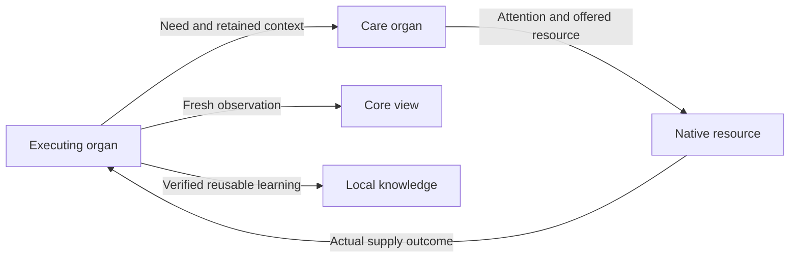

# Form-native runtime and OS north star

**A sovereign Form system understands its organs, uses its machine directly,
learns from actual work and releases what no longer serves. Form owns meaning,
memory lifetimes, compilation, scheduling and resource choice. CPU and device
programs execute in RAM; disk holds reusable caches. Each working replacement
retires its handwritten seed responsibility, until Form can bootstrap and renew
itself without handwritten C.**

The [current status](fkwu-kernel-status.md) separates running capabilities from
this destination. The [bootstrap inspection](fkwu-c-bootstrap-inspection.md)
identifies every handwritten function and global owner.

## One working responsibility at a time

A migration carries real callers, values, resource owners, diagnostics and final
release. It completes when the preceding implementation can leave while those
callers keep working. A parallel implementation or an isolated fast benchmark
does not establish that transition.

Reduce the active code and prose surface toward one tenth of its measured
baseline. Each responsibility has one authority. Remove generated source twins,
copied implementations inside witnesses, superseded routes and completed work
ledgers. Keep current capability, current needs, direction and the smallest
source-backed observation that can challenge a claim. Input corpora, independent
proof engines and disposable caches have distinct purposes and measurements.

Express each operation at the highest executable BML level that preserves its
meaning: infix operators with visible precedence, comparison contracts on the
binding, local functions and lambdas that capture their context, and pipelines
over shared collection operations. Keep names and structure readable. A shorter spelling earns its
place by removing repeated behavior, preserving effects and ownership, and
running through the same native compiler. The sensor flow demonstrates this
with local pixel readers, region folds, context matching and mesh fusion.
Choice, checkpoints and repetition speak compactly while their existing Form
owners keep effects, continuation context, care and release explicit.

Form also owns inspections, generators, migrations and temporary helpers. A
host process carries an explicit OS operation with owned input, complete output,
actual completion status and confirmed release. Foreign-language specimens are
input data. New seed work needs an executable removal path.

## Living organs and local care

Organs announce capabilities and signal unease from their actual execution.
A signal names its origin, scope, time, expectation, observation, outstanding
need and retained continuation. A care organ directs attention and available
resources to it. The asking organ observes what arrived and whether it helped.
Missing, unreadable or aging signals remain unknown.

The live framebuffer exposes operational decisions, timings, resource needs and
causal links at these boundaries. Attention follows observed need and cost;
fixed bands do not stand in for the executing organ. Observe slow stages against
bytes moved, useful work, native dispatch cost and available hardware capacity.
Reuse unchanged compiler knowledge and resident programs; batch crossings and
copy only what the operation needs. Compare cold admission with warm execution
and verify the same result after a repair. Keep private values with
their owner and make the diagnostic channel's own allocation and crossing cost
visible. Trace enough to explain and improve the next choice without duplicating
the computation or retaining an unbounded transcript.

The core interface exposes the live capability and ownership graph: admitted
implementations, dependencies, outstanding work, crossings and needs. Birth,
change and retirement update that graph. Discovery reports its coverage.
The observer accounts for its own allocations and crossings.

```mermaid
flowchart LR
  O[Executing organ] -->|Need and retained context| C[Care organ]
  C -->|Attention and offered resource| R[Native resource]
  R -->|Actual supply outcome| O
  O -->|Fresh observation| V[Core view]
  O -->|Verified reusable learning| K[Local knowledge]
```

A failure is a backtracking point in the same context. Preserve intent, inputs,
owner, completed effects, findings and the original choice. Apply available
care there. A changed choice can resume through the existing repeat mechanism
without recursive re-entry. An unchanged failure waits for relevant movement.
External needs retain their owner and continuation until an event arrives.

The minimal signal and response path must survive pressure in the resource it
serves. Admit its working storage independently; repeated observations must not
allocate the same need indefinitely. Settle or relinquish reservations before
reclamation. Broader diagnosis can request more capacity later.

## Minimal carrier, native execution

The mechanical boundary starts, maps, calls, submits, waits and releases through
an explicit ABI. Form owns the decisions:

| Boundary | Form-owned responsibility |
| --- | --- |
| Memory mapping and protection | Allocation, collection, layout, roots and budgets |
| Resource handles and byte transfer | Naming, protocols, parsers and persistence |
| Executable admission | Parsing, lowering, specialization, identity and retirement |
| Clocks, events and runnable execution | Scheduling, fairness, deadlines and cancellation |
| Device discovery, queues and completion | Selection, batching, dependencies and release |

Platform ABI duties can themselves become Form-generated native code.
Handwritten C, adapters, generated code, globals and exported operations are
measured separately. A speed gain alone does not retire ownership.

Every source construct receives a complete interpretation, native emission or
visible admission refusal. Statements, scope, selected effects and final values
survive lowering. Compiler identity belongs in cache identity; new language
meaning must be replaceable without a seed edit.

CPU and Metal programs are generated and admitted in RAM. Metal is discovered
and loaded dynamically, never linked into the seed. Optional caches bind exact
source, entry, target, compiler and ABI. Cache failure retains its image and
repair context while a working native program continues. Cache repair,
observation delivery and execution recovery are distinct lifetimes.

One owner can share resource notifications, pipe workers and cooperative Form
slices. Readiness resumes the captured receiver version; partial writes retain
accepted offsets; cancellation keeps its timer and unfinished obligations.
Registration re-observes the resource to cover arrival races. Complete wake
batches stay with their continuation. Quiet waits avoid polling. Foreign work
that does not return needs its own preemption mechanism.

## Resident data and adaptable layout

Execution identities are always one native 64-bit word. Semantic fields can
occupy any required number of bits; 8-, 16- or 32-bit alignment is unnecessary.
Identity space does not prescribe physical allocation. Identities, runtime
handles and storage slots remain distinct.

The blueprint owns layout. A primitive uses one word when its meaning fits, or
only the additional storage its meaning requires. Complex cells share metadata
across runs. Stored IDs and payloads use adaptive widths selected from actual
values and schema. CPU JIT and device expressions consume the same offsets,
widths and numeric interpretations, including ML bit-field floats and explicit
block scales.

A layout change creates an identified generation. Held readers and submitted
work keep their original interpretation. Reference-bearing storage participates
in roots and relocation. Canonical equality checks kind and complete composition;
a hash match alone is insufficient. Slot reuse preserves generations and
side-table ownership.

Bulk data remains resident. A span names allocation, generation, owner, offset,
length, layout, access and completion dependencies. Crossings carry descriptors
and batches. Zero-copy admission either preserves alignment and lifetime or
reports refusal. Device views cover the bytes the computation actually uses.

Physical capacity, encoding reach and resource policy remain separately visible.
Growth follows actual availability. Compare complete workloads: cold admission,
reuse, peak residency, page rounding, indices, copies, transfers, synchronization,
latency, throughput and energy. Smaller payloads do not automatically run faster.
Numeric formats declare signed zero, subnormals, infinities, NaNs, rounding,
reduction order, contraction and valid input range. Check downstream discrete
choices as well as continuous error.

## Contexts and live replacement

A context owns values, roots, code, modules, handles, observations and outstanding
work. Closing completes or transfers those obligations and confirms release
while other contexts continue.

A module binds content, builder, ABI, target requirements, effects, layouts,
destruction, leases and evidence. New versions can be admitted and selected while
old readers and submissions retain their grants. Timeout does not imply
completion; cancellation can discard a result while resources remain owned.
Indeterminate work never becomes successful through aggregate cleanup.

A/B comparisons capture effectful input once and run alternatives over the same
retained bytes. One selected version publishes each external effect.
Equivalence comparisons preserve policy; policy comparisons vary it deliberately.
State migration, selection, evidence expiry and physical reclamation are
independently observable. Returning to a retained version does not undo effects
already completed.

## Sovereignty and adaptable knowing

Prefer sufficient Form-native resources, then sufficient local sovereign
resources. Free external services still introduce dependencies and movement;
paid work requires an explicit choice. Each crossing carries its reason, local
alternatives, owner, outcome and observed cost. Unknown cost stays unknown.

Each external attempt should bring home an attributed experience, diagnostic
lesson, checked program or verified teaching that can improve later local use.
Retention is not verification, and a training update is not demonstrated
improvement. Keep sensitive experience private and evaluation answers outside
their own training and recall paths. Essential work should continue without
external services; proven surplus becomes capabilities others can receive and
verify.

Micro-thoughts and choice paths are short, inspectable computations with explicit
inputs, domain, effects and evidence. Several belief or policy systems coexist.
Each names its assumptions, supporting observations, counterevidence, freshness
and conditions for revision. Choices retain the version they used. Learning can
change future selection without rewriting completed experience.

Language sources preserve attribution and alternative meanings. Re-observation,
fresh acquisition and publication are separate operations. Evidence expiry
stops authorizing new work while existing obligations remain owned. Knowledge
has a lifetime too. Embodied knowing is a claim meeting real input, remaining
open to contradiction, improving later use and carrying its measured cost.

## Complete OS contract

| Capability | Required execution |
| --- | --- |
| Boot and firmware | Form-emitted entry with image identity and preserved entry state |
| Physical memory | Discovery, reservations, allocation, reclamation and pressure care |
| Address spaces and faults | Independent mappings, privilege and attributed destruction |
| Interrupts, clocks and entropy | Preserved state, distinct sources and explicit absence |
| Scheduling | Fairness, preemption, async wait/wake and exited-owner reclamation |
| Shared memory and DMA | Ordering, CPU/device coherence and stale-span refusal |
| IPC and synchronization | Ordered transfer, revocation and receiver-exit cleanup |
| Devices | Discovery, admission, queues, hotplug and outstanding-lease settlement |
| Storage | Block I/O, filesystems, durability and restart recovery |
| Networking | Buffer ownership through loss, reorder, timeout and close |
| Media and sensors | Real streams, timestamps, jitter, copies and cleanup |
| Power and multicore | Suspend/resume, reconciled clocks, cross-core wake and retirement |
| Live update and recovery | State migration, publication under load and valid restart |

Hosted and freestanding execution need separate observations. Reasoning that
waits, learns or allocates extensively runs as resumable scheduled work and offers
policy changes back. It must preserve progress for interrupts, completion and
release already owed.

## Next completed boundary

Move the retained care view's complete working lifetime onto Form-owned native
storage. Its changing event trees already use collector-visible values outside
permanent primary interning, but boxed floats, records, roots and collection
remain seed-owned. Connect value/handle resolution and roots to the native
storage components, then move construction, rendering and release together.
Retire the corresponding primary path for that consumer.

Observe repeated quiet and changing views, preserved snapshots, independent
owners and exact output. Under a deliberately constrained local owner, retain
completed work, emit a correlated need without allocating in the constrained
pool, apply real care and re-observe recovery. Settle failed publication
reservations. Account for temporary allocations, metadata, mappings, observer
work and crossings; zero primary mints does not mean zero allocation.

Generalize the working lifetime to other node kinds and CPU/device submissions.
Develop on-demand compilation alongside it, then carry the same ownership into
freestanding memory, traps, scheduling and device work.
