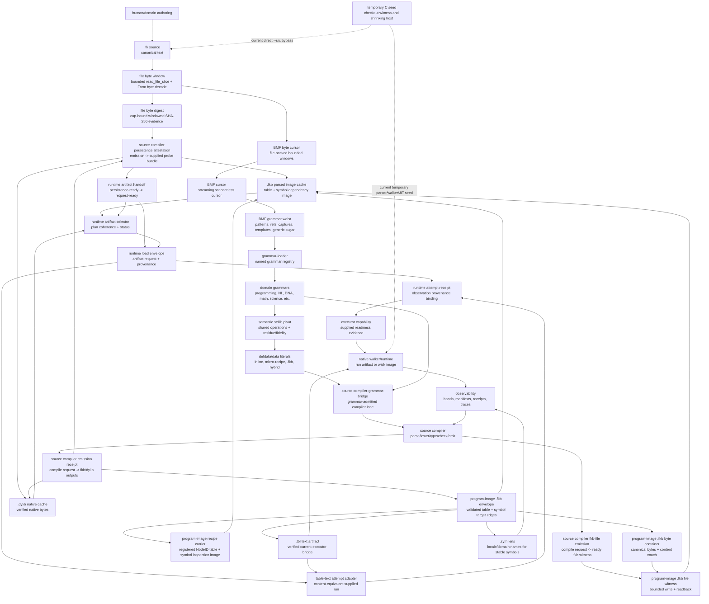
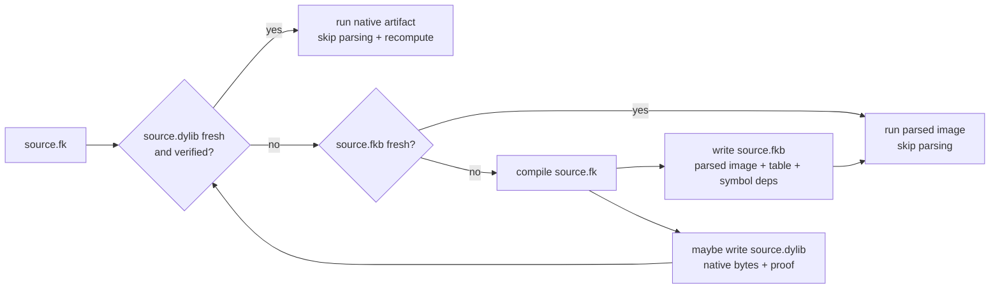
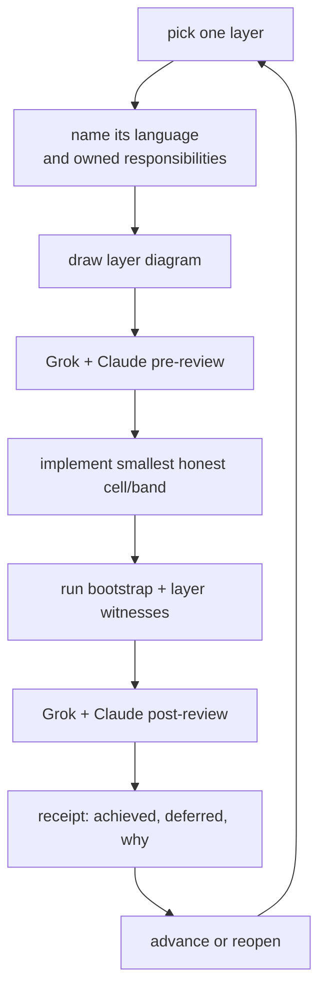

# 2026-07-03 -- Core layer architecture map

## Why This Map Exists

We hit the AST table error while reviewing the grammar and loader layers. The
wrong move is to treat that as a local nuisance: shrink a file, dodge a prelude,
or raise a C constant. The better reading is architectural.

The current direct `--src` path is a temporary checkout witness. It reads a
whole `.fk` source bundle through the C seed's source parser, builds a transient
syntax table, then walks one root. That proves the body can run source today,
but it is not the final runtime shape and it is not the final language
abstraction.

The destination is:

1. `.fk` source is canonical authoring input.
2. `--src` becomes a compiler front door.
3. The target compiler emits a fresh program-image `.fkb` cache, including a
   `.tbl`-shaped function/node/string image plus an embedded canonical
   symbol/dependency image whose dependency edges resolve to concrete target
   nodes. This is not yet the current default `fkwu --src`
   run path. Locale/domain `.sym` files are lenses over those stable symbol
   ids, not the source of executable dependency truth.
4. When eligible, the target compiler also emits a verified `.dylib` native
   artifact.
5. Later target runs prefer fresh verified artifacts and avoid
   reparsing/recomputing.
6. The C seed shrinks because parsing, lowering, caching, and native admission
   move into Form/native-walker cells.

## Architecture Stack

The dotted C seed arrows are not the target architecture. They are the current
bridge that keeps the checkout witness reachable while the real path comes
home.

2026-07-04 note: `form/form-stdlib/bmf-byte-cursor.fk` is the current
file-backed BMF byte cursor. It repairs the former raw byte-at source witness
by carrying bounded `file-byte-window` rows inside immutable cursor state. This
cursor uses an LF-only line convention: byte `10` advances to the next line and
resets column, while byte `13` advances column like an ordinary byte.
`bmf-core` now routes `surface-file` / `cursor-file` through this file-window
cursor instead of whole-file `read_file`; downstream grammar consumers still
need their own prelude and semantic-layer review.

2026-07-04 note: `bmf-grammar` now owns generic cursor-native grammar sugar:
`str`/`char`/`num`, infix, chain, ternary, typed template constants, and the
full-parse helpers. This does not make Layer 3 a domain grammar. It means
common scannerless expression/literal mechanics live once at the grammar waist,
while BML, Form, shell, NL, Python, DNA, math, and other domains still own their
own rule vocabulary and semantic lowering.

2026-07-05 current note: `form/form-stdlib/source-compiler-grammar-bridge.fk`
is now the grammar-admitted compiler lane. It parses `form-definition-language`
modules through the scannerless BMF grammar, lowers them to the current
top-level Form floor, and only then delegates to `source-compiler-emission`.
This makes a grammar surface load-bearing in Layer 8; it is still not the final
compiler because it accepts a supplied program-image envelope instead of
producing the `.fkb` directly from the admitted lowering.

## Layer Names And Responsibilities

| Layer | Owns | Must Not Own |
| --- | --- | --- |
| 0. Temporary seed | Current host boot, direct `--src` witness, minimal native ops still not home | Permanent language design, bulk data transport, growing AST caps as architecture |
| 1. Core value waist | NodeIDs, lists, strings, records, binary image IO, `bp`, small primitive floor | Tokenizers, line grammars, domain language policy |
| 1a. File byte window | Bounded NUL/ASCII string-slice byte windows over real files using the current `read_file_slice` floor plus Form byte decoding; cursor-friendly local byte indexing under an explicit cap | Arbitrary high-byte binary or multibyte UTF-8 byte carriers, whole-file byte materialization, raw byte-at native dependence, hashing/sealing/loading artifacts, runtime selection, compiler emission |
| 1b. File byte digest | Cap-bound windowed SHA-256 over real files through Layer 1a NUL/ASCII string-slice windows; total-length tail padding; size/restat cross-checks; SAI-compatible `file-byte-window-sha256` vouches | Arbitrary high-byte binary or multibyte UTF-8 file hashing on the shared floor, whole-file byte doors, arbitrary-size hashing beyond the reviewed cap, seal/proof/callable admission, route derivation, cache writes, artifact load/walk/call, runtime selection, compiler emission, C-seed growth |
| 1c. Blueprint authority | Blueprint authority policy: reviewed bootstrap `bp` rows for current direct-source runtime, `blueprint-registry.json` as authoring/generator source, generated proof-sibling bp tables as projections, program-image `.fkb` as target executable symbol/dependency truth, and `.sym` as locale/domain presentation lens | Runtime JSON registry loading, treating Go/Rust/TS generated tables as authority, fake unknown-name NodeIDs, `.sym` as executable dependency truth, C-seed growth |
| 2. BMF cursor | Streaming scannerless cursor over source bytes/codepoints; file-backed NUL/ASCII byte cursor over Layer 1a windows; boundary refresh, EOF, and line/column behavior are shared-proofed at that scope | Line-oriented parsing, token streams as required input, raw byte-at native dependence, whole-file file reads as the target cursor path, arbitrary high-byte or multibyte UTF-8 file-cursor proof on the current shared floor |
| 3. BMF grammar waist | Grammar values, rules, refs, captures, repetition, templates, generic cursor-native literal/expression sugar, full-parse helpers | Domain-specific rule vocabulary, semantic lowering, or language policy |
| 4. Grammar loader | Name -> grammar registry and parse-by-name route | Ontology loading, source compiler, domain semantics |
| 5. Domain grammars | Layer-appropriate language grammars for Form, BML, Python, NL, DNA, math, etc. | A universal S-expression or record grammar for every domain |
| 6. Semantic stdlib | Shared semantic operation layer, translation evidence, residue/fidelity | Pretending all languages are losslessly identical |
| 7. Defdata/data literals | Constant/data realization policy: inline vs micro-recipe vs `.fkb` vs hybrid | Recomputing large stable tables through source on every run |
| 8. Source compiler/artifact cache | Target/policy: grammar-admitted `.fk` -> program-image `.fkb`; eligible source -> verified `.dylib`; freshness routing | Treating `--src` parse as the permanent runtime path or letting artifact rows bypass a language grammar |
| 8a. Source-runner admission | Policy over runner observations: direct `--src` admission, artifact route, or investigation | Cache writes, disk selectors, C-cap growth, or treating silent wrong values as soft limits |
| 8b. Source artifact descriptor | Synthetic source/program-image/native descriptor rows; source identity, version, seal/proof fields; derivation into `sac-state` | Disk reads, byte hashing, seal verification, route preference, runtime selector, `.fkb`/`.dylib` loading |
| 8c. Source artifact probe | Observation rows for source/program-image/native artifacts; read-only `form-fs` stat face; absent/unvouched/contradictory distinction; construction of Layer 8b descriptors | Hash/seal verification, kind inference from extensions, route algebra, cache writes, runtime selector, `.fkb`/`.dylib` loading |
| 8c1. Source artifact file probe | File-backed `sap-bundle` construction from direct stat fields plus Layer 1b SAI-compatible vouches; stat/vouch size cross-check; observable mismatch/too-large/unobserved/status carriers | Supplied hash transit through stat rows, seal/proof/callable verification, route derivation, compiler emission import, persistence attestation, cache writes, artifact load/walk/call, runtime selector, C-seed growth |
| 8d. Source artifact identity | SHA-256 digest/vouch rows over supplied byte lists and size-checked text source; evidence-kind-carrying enrichment into 8c observations | Binary file hashing on current `fkwu`, seal/proof/callable admission, route algebra, cache writes, compiler emission, runtime selector, `.fkb`/`.dylib` loading |
| 8e. Source artifact seal | HMAC-SHA256 keyed seal rows over 8d-vouched artifact identity; artifact-only `seal-ok` enrichment | Binary file hashing, ed25519/public-key signatures, key storage, Mach-O codesign, proof/callable admission, route algebra, cache writes, compiler emission, runtime selector, `.fkb`/`.dylib` loading |
| 8f. Source artifact proof | Structural proof-receipt validation over 8e-sealed native dylib identity; native `proof` bit enrichment | Native execution, callable admission, source-map/deopt proof, binary hashing, route algebra, cache writes, compiler emission, selector, `.dylib` load/call |
| 8g. Source artifact callable | Structural callable-receipt validation over 8f-proven, 8e-sealed native dylib identity; native `callable` bit enrichment | Symbol resolution, dispatch, invoke/return, memory-envelope execution proof, source-map/deopt content proof, native execution, binary hashing, route algebra, cache writes, compiler emission, selector, `.dylib` load/call |
| 8h. Program-image `.fkb` envelope | Program-image artifact recipe envelope carrying source/artifact identity plus a validated table payload (`nf`, function roots, node rows x4, string byte rows) and embedded canonical symbol/dependency image (`symbol-id`, canonical key, node-defined symbol, dependency target rows resolving dependency symbols to concrete node ids); conversion into `sad-program-image-fkb` only after source/hash/seal/table/symbol checks | Disk `.fkb` write/read, table execution, startup selector install, locale/domain `.sym` presentation policy, whole-file hashing, native dylib proof/callability, C-seed growth |
| 8h1. Program-image recipe carrier | Convert a valid Layer 8h program-image envelope into a registered NodeID carrier: envelope/table/function-root/node-row/string-row and symbol-image/symbol-row/node-symbol-row/dependency-target categories, trivial int/string leaves, explicit carrier-ready/refused/investigate reasons, and structural inspection through `node_category`/`node_children`/`node_value` | Binary `.fkb` write/read, disk IO, table-text parsing/execution, runtime load/walk/call, attempt/observation rows, selector install, C-seed growth |
| 8h2. Typed literal carrier | Registered NodeID wrappers for int, string, and list literals so carrier layers can distinguish data by category and child shape instead of relying on current raw `fkwu` kind aliases | Parser syntax, source literals, PIRC admission changes, binary `.fkb` IO, artifact load/walk/call, selector install, C-seed growth |
| 8h3. Program-image typed carrier | Consume typed-literal program-image envelope/table nodes, validate metadata/table semantics, normalize into the raw 8h PIF envelope, and return the existing PIRC carrier row with a directly built recipe | Raw PIRC admission changes, binary `.fkb` IO, disk IO, `.tbl` parse/execute, runtime load/walk/call, attempt/observation rows, selector install, C-seed growth |
| 8h4. Program-image byte container | Deterministically encode a valid 8h program-image envelope into canonical bytes, including the embedded symbol/dependency target image after the table section, excluding content hash and artifact mtime from the hash-covered payload, then vouch those bytes with 8d supplied-byte SHA-256 | Disk write/readback, Form recipe-binary IO, `.tbl` text bridge, runtime load/walk/call, attempt/observation rows, selector install, C-seed growth |
| 8h5. Program-image byte file witness | Put a ready 8h4 byte container at its PIF-owned artifact path through remove+append, then prove one-window readback equality and content vouch through Layer 1a windows | Atomic durable persistence, cache freshness admission, compiler persistence, chunked large payloads, table-text bridge, runtime load/walk/call, attempt/observation rows, selector install, C-seed growth |
| 8h6. Program-image byte decode | Decode canonical 8h4 byte payloads from bytes into an external-metadata-free payload row, including table and embedded symbol/dependency target image, then admit only 8h5 readback witnesses whose window bytes, vouches, decoded metadata, table, and symbol image match | Runtime load/walk/call, 9f attempts, 9c observations, table-text bridge, selector install, C-seed growth |
| 8h7. Program-image `.sym` lens | Locale/domain presentation rows over stable embedded 8h symbol ids: display, aliases, docs, duplicate-free `(locale domain symbol-id)` keys, and canonical fallback only after lens validation over a valid PIF envelope | Executable dependency truth, symbol target-node resolution, `.sym` artifact IO, `.sym` grammar parsing, `.fkb` mutation, Go/Rust/TS generated table authority, runtime load/walk/call, selector install, C-seed growth |
| 8h8. Program-image symbol entry resolver | Resolve embedded executable symbol truth to a unique function-root entry: consume only a valid PIF envelope and a symbol-id/canonical-key/id+key request, guard duplicate canonical keys locally, require a non-anonymous node-symbol row and exactly one function-root match, and carry dependency target evidence without walking it | Runtime request/admission consumption, execution, 9h5 trace production, table-text authority, presentation-lens authority, generated proof-sibling bp-table authority, artifact IO, selector/storage/champion/corpus mutation, C-seed growth |
| 8i. Program-image table text emitter | Render a valid Layer 8h program-image table into exact `.tbl` numeric text and optionally write/read back a verified text artifact for the current table executor | Binary `.fkb` write/read, reverse `.tbl` parsing, table execution as a hidden side effect, runtime selector install, native dylib proof/callability, C-seed growth |
| 8i1. Program-image table text witness | Package an 8i write/readback-verified `.tbl` text file as an observable witness row compatible with 9h0, without importing 9h0 | Binary `.fkb` IO, program-image load/walk, table execution, supplied run rows, 9f attempts, 9c observations, selector install, C-seed growth |
| 8j0. Source compiler grammar bridge | Parse `form-definition-language` modules through the scannerless grammar, lower them to the current top-level Form floor, and admit only that lowering into `source-compiler-emission` | Full compiler execution, direct `.fkb` production from lowering, disk writes, runtime selector install, treating low-level supplied artifact rows as the public language |
| 8j. Source compiler emission | Observational receipt that binds a compile-source request and `sac-compile-output` intent to a validated program-image `.fkb` envelope, exact table-text witness, and optional native dylib descriptor | Actual parsing/compilation, disk `.fkb`/`.dylib` writes, filesystem freshness truth, artifact load/walk/call, selector install, C-seed growth |
| 8j1. Source compiler fkb-file emission | Sibling receipt that binds a compile-source request and `sac-compile-output` intent to a validated program-image `.fkb` envelope plus a ready 8h5 byte-file witness, without a table-text argument | Existing 8j row polymorphism, 8k/9h consumer replacement, durable persistence, freshness admission, `.fkb` load/walk/call, table execution, selector install, C-seed growth |
| 8k. Source compiler persistence attestation | Bind an 8j emission to a supplied 8c `sap-bundle` and emit a persistence-ready descriptor triple for the cache/probe lane when observations match | Durable filesystem truth, disk writes, byte hashing, seal/proof verification, artifact load/walk/call, selector install, C-seed growth |
| 8k1. Source compiler file persistence | Project an 8j emission into a file-backed 8c1 probe bundle under one byte cap, delegate to 8k, and carry the nested `source-compiler-persistence` row for downstream handoff | New persistence reasons, compiler execution, artifact writes, binary `.fkb` IO, table execution, artifact load/walk/call, 9i dependency on the carrier, selector install, C-seed growth |
| 9a. Runtime artifact plan | Descriptor route -> plan row; primary/fallback actions; skip-parse/recompute and deopt-anchor observability; compile-output attachment | Disk IO, artifact load/call, native execution, route algebra duplication, seal verification, direct-source admission |
| 9b. Runtime artifact selector | Plan-row coherence gate; total selection rows with selected/investigate/refused status | Descriptor route derivation, disk IO, artifact load/call, native execution, seal/proof/callable reverification, source-runner admission, installed `fkwu` selector |
| 9c. Runtime artifact outcome | Outcome rows from 9b selections plus synthetic runner observations; hard killed/stall/wrong-value statuses investigate; soft fallback availability without fallback execution | Descriptor or `rap-plan` consumption, real observation generation, disk IO, artifact load/walk/call, native execution, fallback execution/retry orchestration, seal/proof/callable reverification, source-runner admission, installed `fkwu` selector |
| 9d. Runtime artifact retry | Retry/re-selection rows from 9c outcomes; closed fallback pairings into synthetic next selections with provenance | Descriptor or `rap-plan` consumption, real observation generation, disk IO, artifact load/walk/call, native execution, fallback execution, retry loops/scheduling, seal/proof/callable reverification, source-runner admission, installed `fkwu` selector |
| 9e. Runtime artifact load envelope | Rejoin a selected or retry-ready request with source/fkb/dylib descriptors; emit a request envelope with explicit artifact and provenance fields | `rap-plan` consumption, plan coherence rederivation, route preference or fallback policy, disk IO, byte hashing, seal/proof/callable reverification, observation generation, load/walk/call/execute, admission, C-seed growth |
| 9f. Runtime artifact attempt receipt | Bind a supplied host/runner attempt observation to a request-ready 9e envelope; emit a loud receipt and only then derive a 9c observation row | Disk IO, byte hashing, seal/proof/callable reverification, `.fkb` walk, `.dylib` call, native/source execution, outcome algebra, retry policy, hidden fallback, unobserved kills/stalls, admission, C-seed growth |
| 9g. Runtime artifact executor capability | Match a request-ready 9e envelope to supplied per-route executor capability evidence; distinguish ready, unavailable, investigate, and refused without producing attempts or observations | Disk IO, byte hashing, seal/proof/callable reverification, `.fkb` walk, `.dylib` call, native/source execution, 9f attempt production, 9c observation production, outcome algebra, retry policy, admission, C-seed growth |
| 9h0. Runtime table-text attempt adapter | Bind a request-ready program-image envelope, a matching 8h program-image envelope, an exact 8i table-text witness, and a supplied table-run observation into a 9f supplied-attempt row; preserve hard/unknown statuses for 9c investigation and mark attempts as table-text witnesses | Launching the table executor, binary `.fkb` load/walk, native dylib calls, hidden fallback, route derivation, selector install, C-seed growth |
| 9h1. Runtime program-image `.fkb` attempt adapter | Bind a request-ready program-image envelope, an admitted 8h6 byte admission, and a supplied program-image run row into a 9f supplied-attempt row; preserve soft/hard/unknown statuses for 9c and mark attempts as program-image-fkb-admission | Real `.fkb` load/walk, local executor launch, 9g enforcement coupling, disk IO, byte hashing, table-text bridge, native dylib calls, hidden fallback, selector install, generated bp-table authority, C-seed growth |
| 9h2. Runtime program-image `.fkb` capability-bound join | Bind a request-ready program-image envelope, a genuine 9g ready program-image-walker row, an admitted 8h6 byte admission, and a supplied 9h1 program-image run into one capability-bound join row; require full 9f trust-tuple identity and recomputed readiness before exposing the 9h1 bridge/attempt | Real `.fkb` load/walk, local executor launch, treating `ready` alone as enough, hidden fallback, disk IO, byte hashing, table-text bridge, native dylib calls, selector install, generated bp-table authority, C-seed growth |
| 9h3. Runtime program-image `.fkb` walker trace adapter | Bind structured walker/resource facts to the same request-ready 9e envelope and admitted 8h6 program image before lowering to the existing 9h1 supplied-run bridge; validate artifact/source/content identity, function-root entry, root node, resource counters, stop reasons, and preserve OOM/stall/kill facts as structured trace evidence | Real `.fkb` load/walk, local executor launch, 9g capability consumption, direct 9f attempt construction, hiding resource facts in detail text, disk IO, byte hashing, table-text bridge, native dylib calls, selector install, generated bp-table authority, C-seed growth |
| 9h4. Runtime program-image `.fkb` traced capability-bound join | Terminal supplied-evidence join: expose a capability-bound program-image attempt only when 9h3 structured trace evidence and 9h2 readiness evidence independently reach agreeing nested 9h1 bridges; preserve trace and capability rows even when the top attempt is withheld | Real `.fkb` load/walk, local executor launch, accepting an independent run input, direct 9f attempt construction, hiding trace/capability drift, another supplied-evidence wrapper after this, disk IO, byte hashing, table-text bridge, native dylib calls, selector install, generated bp-table authority, C-seed growth |
| 9h5. Runtime program-image `.fkb` micro-walker | First real trace producer after terminal supplied-evidence 9h4: consume only a request-ready 9e program-image envelope and admitted 8h6 PIF byte admission, walk the admitted in-memory PIF table with bounded fuel for LIT/ARG/ADD/SUB/MUL/LE/IF, and emit a computed `rpiwt-trace` plus micro-walk receipt | Supplied run/trace input, bridge/join consumption, delegating to 9h1/9h3/9h4, recipe-walker delegation, artifact IO, table-text bridge, host/native execution, selector/storage/champion/corpus mutation, generated bp-table authority, C-seed growth |
| 9h6. Runtime program-image `.fkb` symbol walk | Symbol-addressed computed runtime surface after 9h5: consume a request-ready 9e program-image envelope, admitted 8h6 PIF byte admission, and 8h8 symbol-id/canonical-key/id+key request; reject diagnostic-node requests, resolve the symbol internally over the admitted PIF, then call 9h5 to emit a computed trace with top-level budget/input preservation | Raw entry-index runtime API, supplied symbol-resolution authority, diagnostic-node walking, supplied run/trace input, 9h3/9h4 consumption, 9g capability binding, dependency closure walking, table text or presentation-lens authority, generated proof-sibling table authority, artifact IO, selector/storage/champion/corpus mutation, C-seed growth |
| 9h7. Runtime program-image `.fkb` symbol capability bind | Capability-bind the computed 9h6 symbol walk: consume a request-ready 9e program-image envelope, a supplied 9g program-image-walker readiness row, an admitted 8h6 PIF byte admission, and an 8h8 symbol request/budget/input; prove readiness by full envelope identity, ready fields, nested capability, and recomputed 9g row, then recompute `rpsw-walk-symbol` internally and expose only that computed trace as capability-bound | Supplied 9h6 receipt authority, independent trace input, raw entry-index runtime API, supplied symbol resolution, supplied run/trace rows, 9h1/9h2/9h3/9h4 supplied-evidence consumption, table text or presentation-lens authority, generated proof-sibling table authority, artifact IO, attempt/observation production, selector/storage/champion/corpus mutation, C-seed growth |
| 9h8. Runtime program-image `.fkb` symbol observation adapter | Adapt a recomputed 9h7 capability-bound symbol trace into a synthetic 9c observation/outcome: consume only the 9h7 base inputs, call `rpswc-bind` internally, require a bound coherent trace and envelope-derived selected action, then derive `rao-run-observation` and `rao-outcome-from-selection-observation` inside that guarded branch | Supplied 9h7 row authority, independent trace/observation/outcome input, supplied attempt production, 9h1/9h2/9h3/9h4 consumption, fallback/pending outcome relabeling for non-bound joins, table text or presentation-lens authority, generated proof-sibling table authority, artifact IO, selector/storage/champion/corpus mutation, C-seed growth |
| 9i. Runtime artifact handoff | Bind an 8k `persistence-ready` descriptor triple into the existing 9a/9b/9e plan, selection, and load-envelope path; admit only artifact routes as request-ready handoffs with fixed admission order and defensive drift checks | Disk IO, byte hashing, artifact load/walk/call, native/source execution, attempt or observation production, fallback execution, selector install, C-seed growth |
| 9h. Runtime artifact loader/executor | Target future producer of real runtime attempts/observations while loading/walking/calling request-ready envelopes with 9g readiness | Outcome algebra, retry algebra, route derivation, hidden fallback, unobserved kills/stalls, C-seed growth as runtime home |
| 9. Native runtime | Target: run fresh `.dylib`, run fresh program-image `.fkb`, or walk fallback | Reparse current source when a fresh artifact is already available |
| 10. Learning/ingest/reasoning | Observed traces, receipts, corpus rows, semantic feedback loops | Hidden mutation without receipts or freshness/proof gates |
| 10a. Reason coverage observability | Pure expected-vs-observed reason coverage rows for bands and receipts; explicit reason manifests; missing/unexpected/duplicate diagnostics | Reflection over defined names, test generation, execution, file IO, selector install, C-seed growth |
| 10b. Runtime trace ingest | Consume 9h4 traced capability-bound evidence as learning/ingest/reasoning material; preserve carried trace fields and 9h4 provenance; separate memory lane from action; mark bound ok traces body-freeze eligible while hard/soft/unknown traces become investigation or quarantine prompts | Runtime progress, runtime evidence production, program-image execution, artifact loading, storage mutation, standalone trace authority, another runtime wrapper, selector install, generated bp-table authority, C-seed growth |
| 10c. Runtime trace feedback | Consume 10b ingest records only and emit pure feedback/work-item rows: body freeze candidates become propose-freeze only, liquid witnesses are retained, hard statuses including OOM become investigation work, soft statuses become repair work, quarantine/refused/malformed evidence stays held or rejected, and the agenda selector is pure and stable on ties | Runtime progress, raw 9h4/raw trace authority, execution, artifact loading, storage mutation, champion update, corpus insertion, selector install, generated bp-table authority, C-seed growth |
| 10d. Runtime computed observation ingest guide | Consume 9h8 computed symbol-observation rows only; preserve the 9h8 row, nested 9h7 bind, trace, derived observation, and outcome; recompute the 9h8 adapter row and require structural agreement before classifying body-freeze candidates, exact hard-status investigation work, soft repair work, held non-bound rows, and refused malformed input | Runtime progress, raw trace/observation/outcome authority, raw 9h7 authority, 9h1-9h4 supplied evidence, 10b record-shape reuse, execution, artifact loading, storage mutation, champion/corpus update, selector install, generated bp-table authority, C-seed growth |

## Target Artifact Route

This diagram is the target route, not the current integrated `fkwu` entry path.
Today, the C seed has a direct `--src` parser and a separate `.tbl` table loader.
It does not yet choose among `.dylib`, program-image `.fkb`, and source at
startup.

Freshness is not mere optimism. The current proven cache gate in
`form/form-stdlib/cache.fk` is mtime-based: cache mtime must be greater than or
equal to source mtime. The target program-artifact admission needs more:

- source path and source hash/mtime
- artifact mtime
- artifact kind and version
- content/signature match
- proof status for native artifacts
- source-map/provenance for deopt and observation

## Artifact Kinds

The word `.fkb` is currently doing too much work. Until the route is
implemented, keep these kinds separate:

| Artifact kind | Current status | Meaning |
| --- | --- | --- |
| Parsed-data `.fkb` | Proven by `cache.fk` pattern | A data source is parsed once; later consumers read the parsed Recipe/data through `read_form_binary`. The surrounding program still loaded normally. |
| Compiler/image `.fkb` | Partially witnessed by compiler-image bands | A compiler object or image round-trips through `write_form_binary`/`read_form_binary`, but this is not yet the checkout witness loading its own program image instead of parsing `.fk`. |
| Program-image `.fkb` | Target | A compiled `.fk` program image, including table-shaped function/node/string data and an embedded canonical symbol/dependency image, admitted by runtime without reparsing the source. |
| `.sym` | Target lens | Locale/domain presentation over stable `.fkb` symbol ids: names, aliases, documentation, and grammar-facing display. It must not be the only holder of executable dependency truth. |
| `.tbl` | Existing runnable table stream with provenance caveat | Numeric function/node/string table accepted by the table executor. Existing committed seeds are not yet fkwu-self-derived, and `.tbl` projection intentionally drops `.fkb` symbol/dependency metadata. |
| `.dylib` | Target runtime cache, partial evidence today | Native artifact chosen by a runtime selector only after callable/proof gates pass. Form-to-object and model receipts exist; integrated selector is pending. |

## Current Evidence Already In The Body

### Proven Today

- `runtime/fkwu-uni.c` has a direct `--src` parser and a `.tbl` table loader.
  These are separate entry paths; `--src` does not currently use the `.tbl`
  loader.
- `flatten/form-eval-cli-loop.tbl` and `proof/four-way-run.tbl` prove the
  table-shaped numeric stream already exists as a runnable artifact form.
- `form/form-stdlib/cache.fk` already states the freshness rule for parsed-data
  caches: if cache mtime is newer than source mtime, use `read_form_binary`.
- `form/form-stdlib/defdata.fk` already names why large stable tables should
  not be carried as source literals forever.
- `form/form-stdlib/file-byte-window.fk` defines the current bounded byte-window
  floor over `read_file_slice` plus Form byte decoding, without raw byte-at or
  whole-file byte materialization. A corrective sibling review narrowed the
  claim from arbitrary binary transparency to NUL/ASCII string-slice byte
  indexing. Its sibling and direct focused
  bands return `2147483647`.
- `form/form-stdlib/file-byte-digest.fk` now defines cap-bound windowed
  SHA-256 over real files through Layer 1a windows and emits SAI-compatible
  `file-byte-window-sha256` vouches. It proves total-length tail padding,
  NUL/ASCII transparency, cap refusal, size/restat cross-checks, and
  source/content vouch helpers with sibling and direct focused bands returning
  `2147483647`. It still does not make arbitrary high-byte binary file hashing,
  arbitrary whole-file byte IO, seal/proof/callable admission, artifact writes,
  load/walk/call, selector install, or C-seed growth true.
- `form/form-stdlib/source-artifact-file-probe.fk` now defines the file-backed
  bridge from Layer 1b digest vouches into Layer 8c `sap-bundle` observations.
  It reads only direct stat fields plus `file-byte-digest` vouches, refuses to
  carry supplied hashes through the stat pass, cross-checks stat size against the
  vouch observed size, exposes vouch/status carriers, and proves 8k persistence
  can become ready only when observed file evidence matches the emission. Its
  focused band returns `2147483647`. It still does not verify seals/proofs,
  derive routes in the layer, import compiler emission, attest persistence,
  write caches, load/walk/call artifacts, install a selector, or grow the C seed.
- `form/form-stdlib/program-image-fkb.fk` now defines the program-image `.fkb`
  envelope that folds the `.tbl`-shaped payload into recipe data and converts a
  valid sealed table envelope into a `sad-program-image-fkb` descriptor. Its
  band returns `2147483647`. It does not write, load, or execute artifacts.
- `form/form-stdlib/program-image-recipe-carrier.fk` now defines the Layer 8h1
  carrier from a valid 8h envelope into registered NodeID recipe data. The
  carrier has explicit envelope/table/function-root/node-row/string-row
  categories, preserves string rows as integer byte children, gates table cells
  with exact sibling `value_kind` where available plus the current `fkwu` atom
  fallback, and reports malformed/invalid/non-carrierable inputs without
  producing a recipe. The fallback is not a solved native raw-kind primitive:
  after string interning, positive raw integers and string-table indices are
  ambiguous in `fkwu`. It uses PIRC-owned tag-safe shape guards and primitive
  kind preflight before calling 8h semantic validators, so wrong-kind tags/table
  cells become observable sentinel rows instead of typed-host crashes. Because
  current `fkwu` lacks exact raw kind names, direct native carrier admission
  explicitly returns `investigate/native-raw-kind-floor` instead of claiming
  carrier readiness. Its band returns `2147483647` across the sibling kernels.
  It still does not write/read binary `.fkb`, load/walk/call an artifact,
  produce attempt/observation rows, install a selector, or grow the C seed.
- `form/form-stdlib/typed-literal-carrier.fk` now defines Layer 8h2 typed
  literal NodeID wrappers for int, string, and list data. This is the next core
  step exposed by PIRC's native raw-kind floor: later layers can carry values by
  wrapper category plus trivial child node type instead of raw `fkwu` kind
  guessing. The layer does not change PIRC admission yet; direct PIRC still
  returns `investigate/native-raw-kind-floor` until a later integration consumes
  typed literals. It does not parse syntax, write/read binary `.fkb`, load/walk
  artifacts, install selectors, or grow the C seed.
- `form/form-stdlib/program-image-typed-carrier.fk` now defines Layer 8h3,
  the first typed-literal consumer for program images. It accepts registered
  typed envelope/table nodes, partitions malformed metadata, non-carrierable
  table cells, and invalid table semantics into explicit PIRC reasons, then
  normalizes valid input into the raw 8h PIF envelope and returns the existing
  PIRC carrier row shape with a directly built recipe. It deliberately does not
  call `pirc-carrier-from-envelope`; raw PIRC admission remains the named
  `investigate/native-raw-kind-floor` on current direct `fkwu`.
- `form/form-stdlib/program-image-fkb-byte-container.fk` now defines Layer
  8h4, the canonical byte-container contract for valid program-image envelopes.
  It pins magic/version bytes, length-prefixed strings, signed big-endian table
  integers, table section order, and the embedded symbol/dependency section,
  while explicitly excluding `content-hash` and artifact mtime from the
  hash-covered payload. It vouches the resulting byte list through Layer 8d
  supplied-byte SHA-256. It does not write/read files, call Form recipe-binary
  IO, emit table text, load/walk artifacts, install a selector, produce
  attempts/observations, or grow the C seed.
- `form/form-stdlib/program-image-fkb-byte-file-witness.fk` now defines Layer
  8h5, the bounded immediate file witness for ready 8h4 byte containers. It
  replays the embedded PIF and supplied-byte content vouch before mutation,
  rebuilds a fresh 8h4 ready container from the embedded PIF, rejects empty
  paths, directory targets, empty payloads, drifted ready rows, and payloads
  larger than one file window, writes only at the PIF-owned artifact path via
  remove+append, then proves observed size, one-window readback byte equality,
  and readback content vouch. It still does not claim atomic durable
  persistence, cache freshness admission, source compiler persistence, chunked
  large-image IO, runtime load/walk/call, selector install, or C-seed growth.
- `form/form-stdlib/program-image-fkb-byte-decode.fk` now defines Layer 8h6,
  the canonical byte decoder and readback-witness admission layer. It decodes
  8h4 payload bytes into table plus embedded symbol/dependency payload rows,
  requires cursor exhaustion and canonical re-encode equality, and admits only
  8h5 witnesses whose witness path, readback window path, readback offset,
  sizes, bytes, vouches, decoded metadata, table, and symbol image match. It
  still does not load/walk/call artifacts, emit table text, produce 9f/9c
  attempts/observations, install selectors, or grow the C seed.
- `form/form-stdlib/program-image-tbl-emit.fk` now defines the current executor
  bridge from a valid program-image table envelope to exact `.tbl` numeric text:
  single spaces between integers and one trailing newline. Its band writes a
  verified text artifact for the existing table executor, but it still does not
  claim binary `.fkb` write/read or runtime selection.
- `form/form-stdlib/program-image-table-text-witness.fk` now packages a valid
  8i write/readback-verified `.tbl` text file as an observable witness carrier.
  It emits the exact data row shape that 9h0 consumes, while the source layer
  has no 9h0 code dependency; the band proves the producer/consumer handshake.
  Its focused band returns `2147483647`. It does not execute the table, produce
  supplied run rows, emit 9f attempts or 9c observations, install a selector,
  write binary `.fkb`, or grow the C seed.
- `form/form-stdlib/source-compiler-emission.fk` now defines the compile-output
  receipt that binds a compile-source request and `sac-compile-output` intent
  to a validated program-image `.fkb` envelope, exact 8i table-text witness,
  and optional native dylib descriptor. It derives the emitted fkb descriptor
  from the 8h envelope, delegates route/freshness policy to `sad-route`, and
  stays observational: no compile, disk write, load, selector install, or C
  seed growth. Its focused band returns `2147483647`.
- `form/form-stdlib/source-compiler-grammar-bridge.fk` now defines the current
  grammar-admitted compiler lane. It consumes `form-definition-language`
  modules, lowers them through the BMF grammar surface to the current top-level
  Form floor, and then delegates to `source-compiler-emission`. Its focused
  band returns `32767`. It still does not run a full compiler or produce a
  `.fkb` directly from the lowering.
- `form/form-stdlib/source-compiler-fkb-file-emission.fk` now defines the 8j1
  sibling receipt that binds the same compile-source policy to a ready 8h5
  byte-file witness instead of an external table-text argument. It creates a
  new row family, not `sce-emission`; revalidates witness shape, status/reason,
  embedded byte-container replay, path coherence, size/write/readback equality,
  and readback content vouch; preserves optional dylib policy; and refuses to
  feed existing 8k/9h consumers until a later adapter is reviewed. Its focused
  band returns `2147483647`.
- `form/form-stdlib/source-compiler-persistence.fk` now defines the
  persistence-ready attestation from an 8j emission to a supplied 8c
  `sap-bundle`. It checks source/fkb/native observation identity, delegates
  currency and route policy to `sad-route`, and returns the descriptor triple
  that downstream cache/probe routing can consume. It does not write files,
  hash bytes, prove durable filesystem truth, load artifacts, install a
  selector, or grow the C seed. Its focused band returns `2147483647`.
- `form/form-stdlib/source-compiler-file-persistence.fk` now defines the
  read-only file-backed seam from an 8j emission into 8k persistence. It
  projects source/fkb/dylib paths, expected hashes, and policy bits from the
  emission, builds a Layer 8c1 probe bundle under a uniform byte cap, delegates
  status and reason entirely to the nested 8k row, and leaves 9i consuming that
  nested `source-compiler-persistence` row. It does not compile, write caches,
  execute table text, load or call artifacts, mint persistence reasons, install
  a selector, or grow the C seed. Its focused band now returns `2147483647`
  after a band-only syntax, row-equality, and cwd path-hygiene repair; no
  semantic source/grammar change was needed for the 8k1 carrier.
- `form/form-stdlib/runtime-artifact-handoff.fk` now defines the request-lane
  handoff from an 8k `persistence-ready` row into the existing 9a/9b/9e
  plan/selection/load-envelope path. It refuses malformed persistence, then
  investigates non-ready persistence before looking at descriptor triples, and
  only marks `handoff-ready` for request-ready artifact routes. Its focused
  band returns `2147483647`. It does not read/write disk, hash bytes, load or
  execute artifacts, produce attempts/observations, run fallbacks, install a
  selector, or grow the C seed.

### Partial Evidence And Models

- `form/form-stdlib/tests/kernel-core-image-compiler-proof.fk` names a compiler
  object that writes and reads a `.fkb` image. Its own comment scopes the
  witness to Go, Rust, and TypeScript; it is not yet proof that `fkwu --src`
  skips parsing by loading a program-image `.fkb`.
- `form/form-stdlib/tests/recipe-dylib-band.fk` proves a Form-emitted Mach-O
  object image route toward a dylib carrier. Its comment attributes dlopen to a
  Go kernel test, not to an integrated `fkwu` runtime selector.
- The JIT receipts under `observe/` and `model/` already model native cache,
  deopt, melt, and source-to-dylib readiness.
- `form/form-stdlib/source-artifact-cache.fk` is a policy cell for this route.
  Its band uses synthetic state rows; it does not yet read disk artifacts or
  install a runtime selector.
- `form/form-stdlib/source-artifact-descriptor.fk` is the Layer 8b descriptor
  cell that validates synthetic source/program-image/native metadata rows and
  derives the `sac-state` consumed by the source artifact cache policy. It does
  not read disk, hash bytes, verify seals, or run a selector.
- `form/form-stdlib/source-artifact-probe.fk` is the Layer 8c probe cell that
  turns observed source/program-image/native stat rows plus declared identity
  fields into Layer 8b descriptors. It distinguishes absent, unvouched, and
  contradictory observations, and does not hash bytes, verify seals, infer kind
  from extensions, write artifacts, or run a selector.
- `form/form-stdlib/source-artifact-file-probe.fk` is the Layer 8c1 file-backed
  probe builder. It produces `sap-bundle` rows from real source/fkb/dylib stat
  observations and Layer 1b file digest vouches, with explicit probe carriers so
  mismatch, too-large, unobserved, malformed, and `stat-drift` status remain
  observable after hashes degrade to empty. It does not call source compiler or
  persistence layers; those edges are proven only by its band composition.
- `form/form-stdlib/source-compiler-file-persistence.fk` is the Layer 8k1
  file-backed persistence seam. It imports the 8j emission row only after the
  emission is already `emitted`, builds source/program-image/native probes
  through `source-artifact-file-probe`, then calls
  `scp-persistence-from-probe`. Malformed or non-emitted rows use an empty
  no-probe bundle and preserve the original emission unchanged. Top-level
  status and reason are projections from the nested 8k row, not a new reason
  language. The cell does not write artifacts, run the compiler, execute the
  `.tbl` witness, load program images, call native dylibs, hand off directly to
  9i, or install a selector.
- `form/form-stdlib/source-artifact-identity.fk` is the Layer 8d digest/vouch
  cell that computes SHA-256 identity over supplied byte lists and
  observed-size-checked text source. It emits evidence-kind-carrying vouch rows
  and can enrich 8c observations with matched source/content hashes, but it
  does not hash binary files from disk on current `fkwu`, set `seal-ok`, prove
  callable/native status, derive routes, write caches, emit compiler artifacts,
  load `.fkb`/`.dylib`, or install a selector.
- `form/form-stdlib/source-artifact-seal.fk` is the Layer 8e keyed-seal cell
  that verifies short, length-prefixed artifact identity messages with
  HMAC-SHA256 over 8d `sai-*` vouch rows. It can set artifact `seal-ok` in 8c
  observations only when source/content vouches match and the keyed MAC
  matches. Its seal row carries the bound source/content hashes so later proof
  layers can structurally reject seal/vouch pair swaps. It does not hash binary
  files, store keys, claim ed25519 signatures, perform Mach-O codesign, prove
  callable/native status, derive routes, write caches, emit compiler artifacts,
  load `.fkb`/`.dylib`, or install a selector.
- `form/form-stdlib/source-artifact-proof.fk` is the Layer 8f structural proof
  receipt cell that admits native dylib proof rows only when the 8d source and
  content vouches match, the 8e seal matches, the receipt is bound to that
  sealed identity, and the required witness count is present. It may set only
  the native dylib `proof` bit in 8c observations. It does not prove native
  execution, set callable/lowerable, hash binary files, own source-map/deopt
  proof, derive route algebra, write caches, emit compiler artifacts, load or
  call a `.dylib`, or install a selector.
- `form/form-stdlib/source-artifact-callable.fk` is the Layer 8g structural
  callable receipt cell that admits native dylib callable rows only when the 8d
  source/content vouches match, the 8e seal matches, the 8f proof row matches,
  the callable receipt is bound to that proof message and sealed identity, and
  the required callable witness count is present. It may set only the native
  dylib `callable` bit in 8c observations. It does not resolve symbols, load or
  call a `.dylib`, dispatch, prove invoke/return, verify memory-envelope
  execution, prove source-map/deopt content, hash binary files, derive route
  algebra, write caches, emit compiler artifacts, or install a selector.
- `form/form-stdlib/program-image-fkb.fk` is the Layer 8h program-image
  envelope cell. It makes the target `.fkb` payload concrete as a recipe row
  containing the same logical sections as a `.tbl` stream: function count,
  function roots, node count, node rows of arity four, string count, and string
  byte rows, plus an embedded canonical symbol/dependency image. A valid
  envelope requires source identity, artifact identity, declared seal success,
  a valid table, and a symbol image valid for that table; only then can it
  produce a `sad-program-image-fkb` descriptor with `includes-tbl=1`. It also
  exposes a table-to-numeric-stream list for future `.tbl` emitters, while
  `.sym` remains a locale/domain lens over stable embedded symbols. It does not
  call the current unavailable form-binary IO primitives, execute the table
  image, read disk artifacts, install a selector, or grow the C seed.
- `form/form-stdlib/program-image-typed-carrier.fk` is the Layer 8h3 typed
  carrier bridge over the 8h envelope. Its input language is not an
  S-expression record: it is registered NodeID grammar over typed literal cells
  for envelope fields, table counts, function roots, node rows, and string byte
  rows. It emits the existing PIRC row shape, but the envelope slot is the
  normalized raw PIF envelope, not the typed input node. It keeps raw PIRC
  admission unchanged, names the direct `fkwu` raw-kind floor, and avoids parser,
  binary IO, loader/caller, selector, attempt, observation, and C-seed claims.
- `form/form-stdlib/program-image-fkb-byte-container.fk` is the Layer 8h4 byte
  container bridge over the 8h envelope. Its language is a concrete byte grammar,
  not an S-expression record: `FKPIFB1\0`, version `2`, length-prefixed strings,
  signed 5-byte integer cells, the program-image table sections in pinned
  order, and the embedded symbol/dependency section after the table. `content-hash`
  and artifact mtime are excluded descriptor/probe metadata; changing only
  either one does not change payload bytes. The layer produces a supplied-byte
  content vouch and a `byte-container-ready` row only when the declared content
  hash matches those bytes. It does not write the file, parse or emit table text,
  load/walk/call artifacts, install selectors, produce runtime attempts, or grow
  the C seed.
- `form/form-stdlib/program-image-sym-lens.fk` is the Layer 8h7 presentation
  lens over the 8h envelope's embedded symbol image. Its language is fixed
  tagged rows with locale, domain, symbol id, display, aliases, docs, and an
  explicit executable-deps flag that must be zero. Rendering is row-valued:
  localized hits and canonical fallback are `ready`, but malformed/duplicate
  lens rows investigate and invalid PIF envelopes refuse. It does not read or
  write `.sym`, parse `.sym` syntax, consult generated proof-sibling bp tables
  as authority, mutate `.fkb`, load/walk/call artifacts, install selectors, or
  grow the C seed.
- `form/form-stdlib/program-image-symbol-entry.fk` is the Layer 8h8 resolver
  from embedded executable symbol truth to a unique function-root entry. It is
  a pure PIF metadata resolver, not 9h6: it consumes no runtime request
  envelope, no byte admission, no step budget, no input value, and emits no
  trace. Requests may name a symbol id, canonical key, or id+key pair; a
  diagnostic node request is explicitly not the normal calling surface. Ready
  rows require a valid PIF envelope, exact canonical-key disambiguation, a
  non-anonymous node-symbol row, and exactly one matching function root.
  Dependency target rows are carried as evidence and not walked. The layer
  refuses malformed/out-of-range requests and investigates duplicate
  canonical-key, undefined-symbol, non-root, anonymous-node, missing-node-row,
  and duplicate-root cases. It does not use presentation lenses as executable
  truth, emit table text, load/walk/call artifacts, install selectors, or grow
  the C seed.
- `form/form-stdlib/program-image-fkb-byte-file-witness.fk` is the Layer 8h5
  bounded file-witness cell over the 8h4 byte container. It deliberately uses
  file-window vocabulary, not `.tbl` text and not Form recipe-binary IO: replay
  container bytes from a freshly rebuilt 8h4 ready row, recheck the content
  vouch, reject non-ready/drifted/empty-payload/empty-path/directory/too-large
  cases before mutation, remove any old file, append the canonical bytes, stat
  the observed size, read them back through `file-byte-window`, and vouch the
  readback bytes. It is still an immediate witness, not the compiler
  persistence/admission route and not a program-image loader.
- `form/form-stdlib/program-image-fkb-byte-decode.fk` is the Layer 8h6 byte
  decode/admission cell over 8h4 bytes and 8h5 readback witnesses. It decodes
  the canonical payload into table plus embedded symbol/dependency rows, rejects
  tail garbage through cursor exhaustion, requires canonical re-encode equality,
  and admits only readback witnesses whose path, window path, offset, sizes,
  bytes, vouch, decoded metadata, table, and symbol image match. It is not a
  program-image loader, not a `.tbl` bridge, and not a producer of runtime
  attempts or observations.
- `form/form-stdlib/program-image-tbl-emit.fk` is the Layer 8i text emission
  cell. It consumes the Layer 8h table stream and renders the exact numeric
  `.tbl` text accepted by the current table executor, then can write and
  read-back verify that text through `form-fs`. Invalid envelopes return empty
  text and invalid writes return `0` without creating a file on an absent path
  or overwriting an existing file. It does not parse `.tbl` text, write or read
  binary program images, execute the emitted table as a side effect, install a
  runtime selector, or grow the C seed.
- `form/form-stdlib/program-image-table-text-witness.fk` is the Layer 8i1
  witness carrier over the 8i text artifact. It calls `pite-write-table-text`,
  then places only readback-verified text into a
  `runtime-table-text-witness` data row. That row shape is intentionally
  compatible with 9h0, but the source layer does not import or call 9h0; the
  band owns the handshake proof. Write failure and readback mismatch currently
  collapse to `write-readback-failed` because 8i returns only `1` or `0`. The
  cell does not run the table, accept supplied run rows, produce 9f attempts or
  9c observations, write binary program images, install a selector, or grow the
  C seed.
- `form/form-stdlib/runtime-artifact-plan.fk` is the Layer 9a plan face that
  turns descriptor routes into observable runtime intent rows. It does not load
  a program-image `.fkb`, call a `.dylib`, execute native bytes, or install the
  runtime selector.
- `form/form-stdlib/runtime-artifact-selector.fk` is the Layer 9b selector face
  that consumes only Layer 9a plan rows and emits total selection rows with
  selected, investigate, or refused status. It validates plan coherence but does
  not derive descriptor routes, read/write disk, load or call artifacts, execute
  native bytes, reverify seal/proof/callable receipts, decide direct-source
  admission, or install a `fkwu` selector.
- `form/form-stdlib/runtime-artifact-outcome.fk` is the Layer 9c outcome face
  that consumes only Layer 9b selections plus synthetic runner observation rows.
  It normalizes pending, complete, fallback-available, investigate, and refused
  outcomes. OOM-killed, killed, stalled, timeout, and wrong-value observations
  always investigate, even when a fallback exists. It does not consume
  descriptors or `rap-plan` rows, generate real observations, load/walk/call
  artifacts, execute native bytes, run fallbacks or retries, decide admission,
  or install a `fkwu` selector.
- `form/form-stdlib/runtime-artifact-retry.fk` is the Layer 9d retry face that
  consumes only Layer 9c outcome rows. It emits total retry rows and may embed a
  synthetic next `ras-selection` only for the two closed fallback pairings:
  native -> program-image and program-image -> compile-source. The retry row
  carries the source outcome as provenance. It does not consume descriptors or
  `rap-plan` rows, generate real observations, load/walk/call artifacts,
  execute native bytes, run fallbacks or retry loops, decide admission, or
  install a `fkwu` selector.
- `form/form-stdlib/runtime-artifact-load-envelope.fk` is the Layer 9e request
  envelope face. It accepts either a selected `ras-selection` or a retry-ready
  `rar-retry`, rejoins that request with the current source/fkb/dylib
  descriptors by requiring `sad-route(source,fkb,dylib)` to equal the request
  route, and emits a `request-ready`, `investigate`, or `refused` envelope with
  explicit selection/retry provenance. `request-ready` is not load success. The
  cell does not consume `rap-plan`, rederive plan coherence, choose fallback
  policy, read disk, hash bytes, reverify seal/proof/callable receipts,
  generate observations, load/walk/call artifacts, execute native bytes, decide
  admission, emit compiler output, install a selector, or grow the C seed.
- `form/form-stdlib/runtime-artifact-attempt-receipt.fk` is the Layer 9f
  attempt receipt face. It binds a supplied host/runner attempt observation to
  a request-ready Layer 9e envelope by matching action, route, artifact kind,
  artifact path, source hash, and content hash. Only a matched attempt derives
  the plain `rao-run-observation` consumed by Layer 9c; mismatches are loud
  investigate receipts with no derived observation. Pending envelopes can age to
  investigation, and hard supplied statuses such as OOM, killed, stalled,
  timeout, and wrong-value are preserved for 9c investigation. The cell does not
  read disk, hash bytes, reverify seal/proof/callable receipts, load or walk
  `.fkb`, load or call `.dylib`, execute native/source code, decide admission,
  install a selector, or grow the C seed.
- `form/form-stdlib/runtime-artifact-executor-capability.fk` is the Layer 9g
  executor capability face. It consumes a request-ready Layer 9e envelope plus
  a supplied capability row and emits readiness: ready, unavailable,
  investigate, or refused. The closed table maps native dylib calls,
  program-image walks, and source compiler/front-door attempts to the expected
  action/route/artifact-kind tuple. `ready` means only that a supplied current
  capability claims it can attempt the envelope; it is not execution or success.
  Current-floor `.fkb`/`.dylib` executor rows remain unavailable and cite the
  2026-07-03 `fs-read-bytes` canary red signal. The cell does not read disk,
  hash bytes, reverify seal/proof/callable receipts, load/walk/call artifacts,
  produce 9f attempts or 9c observations, execute native/source code, decide
  admission, install a selector, or grow the C seed.
- `form/form-stdlib/runtime-table-text-attempt.fk` is the Layer 9h0 table-text
  attempt adapter. It consumes a request-ready program-image envelope, a valid
  matching Layer 8h program-image envelope, an exact Layer 8i table-text
  witness, and a supplied table-run observation. Only after identity, text, and
  witness-path binding does it emit a 9f supplied-attempt row. Attempt details
  are marked `table-text-witness` so the proxy is not laundered as binary
  `.fkb` loading. OOM, killed, stalled, timeout, wrong-value, and unknown
  statuses are preserved into attempts for 9c investigation, even with zero
  output lines. It does not launch the table executor, walk a binary program
  image, call native artifacts, install a selector, or grow the C seed.
- `form/form-stdlib/runtime-program-image-fkb-attempt.fk` is the Layer 9h1
  supplied-attempt adapter for the binary program-image route. It consumes a
  request-ready program-image envelope, an admitted Layer 8h6 byte admission
  whose decoded payload still matches its admitted PIF, and a supplied
  program-image run row. Only after envelope kind, admitted PIF identity, and
  run-path binding does it emit a 9f supplied-attempt row. Attempt details are
  marked `program-image-fkb-admission` so the proxy is not laundered as
  table-text or native execution. Soft, hard, and unknown statuses are preserved
  into attempts for 9c; `ok` still requires a positive output indicator. This is
  not load success and does not consume 9g readiness, open `.fkb` artifacts,
  walk program images, emit table text, call native artifacts, install a
  selector, treat generated sibling bp tables as authority, or grow the C seed.
- `form/form-stdlib/runtime-program-image-fkb-capability-bound.fk` is the
  Layer 9h2 provenance join between 9g readiness and 9h1 supplied attempts. It
  consumes a request-ready program-image envelope, a 9g readiness row, an 8h6
  admitted byte admission, and a supplied program-image run row. It does not
  trust `ready` alone: the readiness row must carry `capability-ready`,
  `supplied-current`, `attempt-supplier`, `current`, require
  `program-image-walker`, embed the same full 9f trust tuple through its nested
  envelope, carry a current nested program-image-walker capability, and
  recompute to the same 9g ready row from the supplied envelope and capability.
  Only then does it delegate to 9h1 and expose the resulting bridge/attempt.
  If 9h1 refuses or investigates, the 9h1 bridge and reason remain visible and
  no attempt is laundered as capability-bound. This is not real `.fkb` load or
  walk success and does not launch an executor, read artifact bytes, emit table
  text, call native artifacts, install a selector, treat generated sibling bp
  tables as authority, or grow the C seed.
- `form/form-stdlib/runtime-program-image-fkb-walker-trace.fk` is the Layer
  9h3 structured trace adapter for the binary program-image route. It consumes
  a request-ready program-image envelope, an admitted Layer 8h6 byte admission,
  and a supplied trace row with artifact/source/content identity, entry-kind,
  entry-index, root-node, step budget, steps used, output count, first value,
  exit code, status, stop reason, and detail. It validates that the trace names
  the same admitted PIF and 9e request, that the entry is a real function-root
  in the PIF table, and that resource counters are possible before it lowers to
  the existing 9h1 supplied-run bridge. OOM, killed, stalled, timeout,
  wrong-value, loader-missing, error, and unknown statuses remain structured in
  the trace and then flow through 9h1/9f/9c; they are not hidden only in detail
  text. This is not a walker, not 9h2 readiness coupling, not a direct 9f
  attempt constructor, and not a generated proof-sibling table authority.
- `form/form-stdlib/runtime-program-image-fkb-traced-capability-bound.fk` is
  the Layer 9h4 terminal supplied-evidence join. It consumes a request-ready
  program-image envelope, 9g readiness, an admitted Layer 8h6 byte admission,
  and a structured 9h3 trace row. It first asks 9h3 to produce the trace-backed
  9h1 bridge, then asks 9h2 to capability-bind exactly that trace-derived run.
  The exposed capability-bound attempt is trace-backed, and both independently
  produced 9h1 bridges agree on run fields, bridge status/reason, and the full
  9f attempt tuple. Invalid traces produce no 9h2 join. Non-ready readiness
  preserves the 9h2 unavailable/investigate/refused status and reason while
  withholding the top-level attempt; the nested trace bridge remains visible as
  trace evidence only. This is the last honest supplied-evidence join, not
  runtime progress: the next runtime layer must produce a real trace producer
  or move the evidence into Layer 10 trace ingestion. Another supplied-evidence
  wrapper should fail.
- `form/form-stdlib/runtime-program-image-fkb-micro-walker.fk` is Layer 9h5,
  the first real trace producer after 9h4. 9h4 remains terminal
  supplied-evidence wrapping; 9h5 breaks the pattern by computing `rpiwt-trace`
  from the admitted PIF table in memory. It consumes only a request-ready 9e
  program-image envelope and an admitted 8h6 byte admission, validates the
  decoded PIF and envelope identity, then walks flat rows `(tag a b c)` with
  bounded fuel for LIT, ARG, ADD, SUB, MUL, LE, and IF. Budget exhaustion
  becomes a timeout trace; unsupported tags and invalid child references become
  loud error traces. It does not accept supplied runs, supplied traces, bridges,
  joins, table text, generated proof-sibling table authority, host/native
  execution, artifact IO, selector/storage/champion/corpus mutation, or C-seed
  growth.
- `form/form-stdlib/runtime-program-image-fkb-symbol-walk.fk` is Layer 9h6,
  the symbol-addressed runtime surface over 9h5. It consumes the same
  request-ready 9e program-image envelope and admitted 8h6 PIF byte admission,
  adds an 8h8 symbol-id/canonical-key/id+key request, rejects diagnostic-node
  requests as non-runtime, resolves the symbol internally over the admitted PIF,
  and only then calls 9h5. Its receipt carries top-level step budget and input
  value plus the 8h8 resolution, 9h5 micro-walk receipt, and computed trace so
  row agreement and nested refusal/timeout/error reasons stay observable. It
  does not accept a raw entry-index runtime API, supplied symbol resolution,
  supplied run/trace rows, 9h3/9h4 bridges, 9g capability binding, table
  authority, presentation-lens authority, artifact IO, selector/storage/
  champion/corpus mutation, generated proof-sibling table authority, or C-seed
  growth.
- `form/form-stdlib/runtime-program-image-fkb-symbol-capability-bound.fk` is
  Layer 9h7, the capability-bound computed symbol walk. It consumes a
  request-ready program-image envelope, a 9g readiness row, an admitted 8h6 PIF
  byte admission, and a symbol request/budget/input. It does not accept a 9h6
  receipt or trace as authority. Instead it proves the 9g row by envelope
  identity, ready fields, current nested program-image-walker capability, and
  recomputation from the supplied envelope/capability, then recomputes
  `rpsw-walk-symbol` internally. Only that recomputed 9h6 trace can become the
  capability-bound trace. Non-ready readiness and non-produced symbol walks
  preserve their nested status/reason without producing a bound trace. This is
  not a return to 9h1/9h2/9h3/9h4 supplied-evidence attempts, does not produce
  9f attempts or 9c observations, and does not consume table text, generated
  proof-sibling table authority, artifact IO, selector mutation, or C-seed
  growth.
- `form/form-stdlib/runtime-artifact-handoff.fk` is the Layer 9i request-lane
  handoff face. It consumes only 8k `source-compiler-persistence` rows, admits
  them in the fixed order malformed persistence -> non-ready persistence ->
  malformed descriptor triple -> downstream composition, then derives the
  existing 9a plan, 9b selection, and 9e load envelope. The public path only
  accepts artifact routes (`sac-run-fkb` or `sac-run-dylib`) as
  `handoff-ready`; compile-source or invalid routes investigate. A narrow
  `rah-handoff-from-components` helper exists only so the band can inject
  impossible downstream drift cases and prove envelope route/action/kind checks.
  It does not load artifacts, produce attempts or observations, run fallbacks,
  install a selector, or grow the C seed.
- `form/form-stdlib/reason-coverage.fk` is the Layer 10a observability helper.
  It compares explicit expected reason manifests with observed reasons produced
  by bands and emits missing, unexpected, duplicate-expected, and
  duplicate-observed diagnostics. It is not reflection and does not generate
  tests. Layer 9h0 now exposes `rtta-reason-manifest`, and its band uses
  `rcov-covered?` over actual `rtta-bridge-from-run` branch invocations so a
  full bitmask cannot hide an unexercised reason branch.
- `form/form-stdlib/runtime-trace-ingest.fk` is Layer 10b runtime trace ingest.
  It consumes 9h4 evidence only, reads the carried 9h3 trace and 9h4
  provenance, and emits a learning/ingest/reasoning record. This is not runtime
  progress and does not execute. A capability-bound ok/completed trace becomes
  body-freeze eligible only when capability-bound; non-bound rows stay
  liquid/witnessed; hard statuses become high-priority investigation prompts;
  soft statuses become repair prompts; unknown statuses quarantine. This layer
  learns from evidence without pretending to produce it.
- `form/form-stdlib/runtime-trace-feedback.fk` is Layer 10c runtime trace
  feedback. It consumes 10b ingest records, not raw joins or raw traces, and
  emits feedback/work-item rows for learning and reasoning. Body-lane witnessed
  records become propose-freeze only; liquid witnesses are retained; OOM,
  killed, stalled, timeout, and wrong-value prompts remain investigation work;
  loader-missing/error prompts become repair work; quarantine and refused
  records remain held or rejected. The agenda selector is pure, chooses the
  highest-priority row, and keeps the first row on equal priority. This is not
  runtime progress and does not execute, mutate storage, update champions, read
  generated proof-sibling tables as authority, install selectors, or grow the C
  seed.
- `form/form-stdlib/source-runner-admission.fk` is the policy cell that now
  decides whether a source/prelude snapshot may trust direct `--src`, must
  route to the artifact lane, or must be investigated. Its band is also over
  observation rows; it does not read disk artifacts or run a selector.

### Provenance Caveat

The existing committed `.tbl` seeds are runnable table streams, but
`flatten/README.md` and `flatten/SEED-DROP.md` still name their origin as a
bootstrap cache with bin-go provenance while fkwu-native flatten/self-derivation
is unfinished. A future program-image route must not treat those committed
tables as proof that fkwu can already compile every `.fk` into a fresh table
image by itself.

## Current Red Signals

These are not reasons to stop. They are reasons to put each concern in the
right layer.

- `form-ontology-loader.fk` fails through the current direct source path with
  `fk_smknode: program too large for the AST node table`.
- `flatten/SEED-DROP.md` records a historical direct `--src` divergence around
  `let`: `(do (let x 40) (add x 2))` returned `2` through `--src`, while the
  flattened `form-eval` table path returned `42`. On 2026-07-03 the same
  minimal direct `--src` probe returned `42`, so this is no longer recorded as
  a current red result. It remains a parity regression gate for any source
  front door.
- `learn/homecoming-distillation-corpus.fk` previously returned `0` when
  `core.fk` was prepended through process substitution. That is now closed by
  `receipts/2026-07-03-src-read-completeness-repair.md`: the cause was
  incomplete pipe/FIFO source ingestion in the temporary C source reader, not a
  Form composition bug. The same process-substitution bundle now returns `511`.
- `form/form-stdlib/form-fs.fk` and `primitive-registry.fk` mention the
  whole-file byte read/write doors, and `form-fs.fk` also still names the raw
  byte-at wrapper, but current `runtime/fkwu-optable.h` does not expose those
  paths. A Layer 8d canary over a three-byte file observes `fs-read-bytes`
  length `0`, and a 2026-07-04 direct probe showed the raw byte-at wrapper is
  not current-floor trustworthy. `form/form-stdlib/file-byte-window.fk` is the
  current bounded byte route: `read_file_slice` into a capped string slice, then
  Form-native byte decoding. A 2026-07-04 sibling correction found that Rust and
  TypeScript decode slices through UTF-8 text, so Layer 1a/1b must not claim
  arbitrary high-byte binary or multibyte UTF-8 transparency across all sibling kernels. The
  BMF byte cursor and BMF core file-window bands have therefore been narrowed to
  NUL/ASCII boundary fixtures for shared proof. Current `fkwu` must still not
  claim arbitrary whole-file binary hashing for `.fkb` or `.dylib` identity.
- Current fkwu source probes over the form-binary IO family remain unavailable:
  with `core.fk` loaded, `write_file_text`/`read_file` successfully wrote and
  read a control file, while `write_form_binary` returned `nothing` and created
  no file, and `(len (recipe_to_bytes ...))` returned `0`. Layer 8h therefore
  records the `.tbl` payload as a recipe envelope and leaves disk `.fkb`
  round-trip to a later loader/emitter layer.
- Some local-retention probes can mislead when a witness holds too many
  intermediate values. Helper-shaped witnesses are safer until the runtime
  retention model is hardened.

## Language Abstraction Rule

Each layer gets a language appropriate to that layer.

- Core gets a narrow value/identity language.
- Cursor gets a streaming movement language.
- Grammar gets pattern/rule/template language.
- Grammar-loader gets a registry language.
- Domain layers get their own grammars. They do not have to be S-expressions.
- Semantic stdlib gets shared operation and residue language.
- Defdata gets carrier and realization policy language.
- Artifact cache gets freshness/proof/route language.
- Source-runner admission gets observation row and failure-mode language:
  runner health, semantic parity, capacity, composition, and remediation.

No layer should smuggle another layer's language because it is convenient in the
temporary C source runner.

## Review And Implementation Loop

Every layer receipt must answer:

- What language abstraction belongs here?
- What alternatives were considered?
- Why was each alternative rejected or deferred?
- What does the band prove?
- What does the band explicitly not prove?
- What red signals appeared, including OOM or AST-cap failures?
- What must the next layer inherit as a constraint?

## Immediate Alignment Decision

The first core alignment after this map was the source artifact route, not
another domain grammar. The next refinement is source-runner admission: direct
`--src` is allowed only for snapshots whose runner-health, parity, capacity,
composition, and remediation observations are entitled.

Together, those routes close the conceptual gap that caused the AST-table
conversation:

- source remains canonical
- parsed-data `.fkb` is already proven as a cache pattern
- program-image `.fkb` now has a validated table-envelope shape, and remains
  the target parsed image cache once a real writer/loader exists
- program-image `.fkb` payloads now have canonical bytes and a bounded
  one-window file write/readback witness; cache freshness admission and runtime
  load are still deferred
- source compiler emission now has a sibling `.fkb` file-witness receipt that
  does not require an external table-text argument, while the older 8j table-text
  row remains in place for 8k/9h0 compatibility
- program-image tables can still be emitted as exact `.tbl` text for the
  current executor bridge while binary `.fkb` loading remains deferred
- write/readback-verified `.tbl` text can now be carried as an explicit
  table-text witness row for the current 9h0 adapter, with a handshake band
  rather than a hidden runtime dependency
- file-backed source/fkb identity can now enter a `sap-bundle` through
  `source-artifact-file-probe`, so 8k does not have to rely on purely
  caller-declared source/content hashes inside the cap
- source compiler emissions can now be replayed into that file-backed probe
  seam by 8k1, while 9i still receives the nested 8k persistence row rather
  than learning a new carrier language
- `.dylib` is the target native cache when proof permits
- fresh target artifacts skip source parsing only after a real selector exists
- stale/missing artifacts recompile
- direct `--src` silent wrong values investigate instead of being filed as
  cache misses
- C seed growth is not the answer

There is one bootstrap circularity to keep visible: the compiler that relieves
source-parse pressure must itself either fit the current direct-source envelope,
run through an existing table/image path, or arrive in smaller reviewed cells.
It cannot depend on a fat prelude that already fails under `FK_AST_NODE_CAP`.

Only after that route is reviewed should we continue reviewing higher domain
grammars that currently depend on fat preludes.

## Review Status

Claude approved the map directionally but required the artifact claims to be
split by evidence level. Its key correction was that proven `.fkb` caching today
is parsed-data/image caching that a program consumes, not proof that the
program's own parse is skipped by loading its `.fkb`. Claude also required the
`.tbl` bin-go provenance caveat, target labeling for the richer freshness
metadata and dylib selector, and a stronger note on the `--src`/`let` reducer
divergence.

Grok also approved the map directionally after the same corrections. Grok
required three artifact kinds to be kept separate: parsed-data `.fkb`,
compiler/image `.fkb`, and future program-image `.fkb`. Grok also asked that
the `.tbl` route be named as a separate table-executor entry, that the dylib
route be labeled partial/model evidence rather than current runtime behavior,
and that `source-artifact-cache.fk` be described as policy over synthetic state
until disk artifacts and runtime selection are implemented.

Those corrections are now applied. This map may guide the next layer as a
target architecture and guide contract, not as proof that artifact selection is
already live in `fkwu`.
