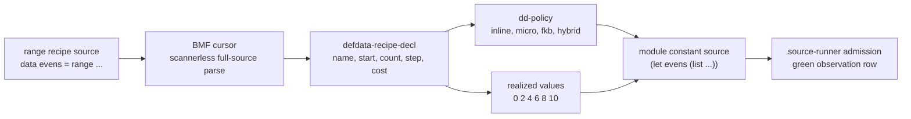

# 2026-07-03 -- defdata recipe language layer review

## Ground

This layer follows the Layer 7 data-literal lane named in:

- `receipts/2026-07-03-core-layer-architecture-map.md`
- `receipts/2026-07-03-defdata-language-layer-review.md`
- `form/form-stdlib/defdata.fk`
- `form/form-stdlib/defdata-recipe-language.fk`
- `grammars/defdata-recipe-language.fk`
- `form/form-stdlib/tests/defdata-recipe-language-band.fk`

The layer language is a scannerless BMF cursor grammar for a narrow range
recipe surface:

```text
data evens = range 0 count 6 step 2 cost 4
```

This is not an s-expression surface, not a line grammar, not a tokenizer, and
not a C runtime primitive. It is the second Layer 7 authoring surface above the
existing `defdata.fk` carrier policy.

## Layer Diagram



The important seam is carrier-vs-emission. `dd-policy` may choose inline,
micro-recipe, `.fkb`, or hybrid, but v1 lowering still emits a realized module
constant. The policy verdict is carried as data; the checkout emission remains
the current executable floor.

## Pre-Review

Grok pre-reviewed the proposed layer and accepted it with corrections:

- keep this as a second Layer 7 authoring grammar, not the Layer 8 compiler;
- use one fixed v1 surface: `data <name> = range <start> count <n> step <s> cost <c>`;
- define `count` as the number of emitted elements;
- prove the equality boundary where `cost == count` is not a micro-recipe;
- keep policy carrier and realized source lowering separate;
- declare `cost` as authored, not measured;
- prove malformed and trailing source fail with full-source EOF;
- mirror the grammar under `grammars/`;
- do not grow the C seed.

Claude pre-reviewed the same scope and accepted it with required corrections:

- name the carrier gap explicitly;
- witness all four policy quadrants: micro, inline, `.fkb`, and hybrid;
- witness equality at `cost == count`;
- decide and witness degenerate ranges (`count 0`, `step 0`);
- prove cross-negative separation from `defdata-language.fk`;
- declare that `cost` is an author estimate, not measured bytecode.

## Implementation

`defdata-recipe-language.fk` adds:

- `defdata-recipe-language-manifest`;
- `defdata-recipe-language-grammar`;
- full-source parse through `g-match-rule` plus cursor EOF check;
- declaration readers for name, start, count, step, and cost;
- carrier selection through `dd-policy`; v1 hardcodes stable and generative to
  `1` because the only admitted recipe kind is deterministic integer range;
- range realization, including `count 0` and `step 0`;
- lowering metadata that keeps policy carrier separate from emitted source;
- realized module-constant source:

```text
data evens = range 0 count 6 step 2 cost 4
-> (let evens (list 0 2 4 6 8 10))
```

The `form/form-stdlib` and `grammars` copies are intended to remain
byte-identical.

`source-runner-admission.fk` now records the green
`defdata-recipe-language-band` observation row with expected and actual
`134217727`.

## Witness

Required checkout witnesses before implementation:

```text
ground.fk                -> 42
ground-recursive.fk 10   -> 55
binary-freshness-band.fk -> 15
native-vs-rented-check   -> 11111
```

Layer witness:

```sh
./fkwu --src <(cat form/form-stdlib/core.fk \
    form/form-stdlib/bmf-core.fk \
    form/form-stdlib/bmf-grammar.fk \
    form/form-stdlib/defdata.fk \
    form/form-stdlib/defdata-language.fk \
    form/form-stdlib/defdata-recipe-language.fk \
    form/form-stdlib/tests/defdata-recipe-language-band.fk)
```

```text
defdata-recipe-language-band -> 134217727
defdata-language copy cmp    -> 0
```

Bit decoding:

```text
1        manifest declares scannerless
2        manifest declares bmf-cursor-grammar
4        manifest declares no-line-grammar
8        manifest declares range-recipe-v1-only
16       manifest declares consumes-dd-policy
32       manifest declares author-declared-cost
64       manifest declares realizes-at-lowering
128      manifest declares not-load-time-recipe
256      manifest declares module-constant-lowering
512      manifest declares not-runtime-primitive
1024     manifest declares carrier-policy-separate-from-lowering
2048     manifest declares degenerate-range-realized
4096     happy path parses
8192     reads name/start/count/step/cost
16384    realizes six values, head 0, last 10
32768    happy path carrier is micro-recipe
65536    lowering carries module-constant + micro + realization/runtime seam
131072   lowered source is exact
262144   whitespace variant parses
524288   trailing and malformed source fail
1048576  equality boundary: cost == count is inline, not micro
2097152  count >= 64 with cost >= count routes to fkb
4194304  count >= 64 with cost < count routes to hybrid
8388608  count 0 realizes empty and lowers to (let empty (list))
16777216 step 0 realizes repeated values
33554432 cross-negative separation from bracket-list defdata language
67108864 const-size and recipe-size expose count 6 and cost 4
```

The first local band run returned `34447359`, not `134217727`. That was not
ignored. The parse succeeded, but field reads and every derived value were
offset because the declaration emit did not include the explicit
`__ddrl_decl__` node tag that the accessors were written around. The grammar
now emits that tag in both mirrored files, matching the newer authoring
language pattern, and the band returns the full value.

No OOM-killed process occurred during this layer pass.

## Post-Review

Claude post-reviewed the implementation, band, admission row, and receipt
read-only. Verdict: PASS. Claude re-derived the `dd-policy` quadrants, checked
the carrier-vs-emission seam, verified the initial `34447359` mismatch story,
and found no required receipt corrections. Claude noted two non-blocking
readability points: the large-count fkb fixture helper had a misleading name,
and the hardcoded stable/generative values should be named as a v1 range
assumption.

Grok post-reviewed the same layer read-only. Verdict: PASS. Grok rebuilt
`fkwu`, re-ran the prelude-concatenated witness, confirmed
`defdata-recipe-language-band -> 134217727`, confirmed the mirror `cmp` exits
0, and found no technical blockers. Grok requested receipt improvements: add
the exact witness command, add the mirror witness line, and add this
post-review section.

Applied after post-review:

- renamed the misleading `ddrlb-large-inline-decl` test helper to
  `ddrlb-large-fkb-decl`;
- documented that stable/generative are hardcoded because v1 admits only
  deterministic range recipes;
- added the exact witness command, mirror line, and post-review closure to this
  receipt.

## Alternatives

| Alternative | Disposition | Why |
| --- | --- | --- |
| Extend `data rows = [...]` with more literal forms | Deferred | The previous layer already proves inline integer lists. This layer needed the micro-recipe policy surface. |
| Add a source compiler keyword now | Rejected for this layer | The goal here is authoring grammar plus lowering data. Compiler integration belongs to the source compiler/artifact layer. |
| Store the recipe and realize it at load time | Deferred | The v1 witness intentionally lowers to realized module constants while carrying policy as data. |
| Treat `cost` as measured runtime/bytecode size | Rejected | There is no measurement path in this layer. `cost` is authored policy input. |
| Materialize huge lists in policy-only checks | Rejected | Large-count policy quadrants are proven through carrier selection, not by forcing huge source lists. |
| Grow the C seed | Rejected | This is a Form/BMF layer and does not require new C meaning. |
| Use a line parser or tokenizer | Rejected | The repo direction is BMF cursor and scannerless streaming grammar. |

## Deferred

- Runtime load hook that stores a micro-recipe and realizes it after loading.
- Program-image `.fkb` emission for data recipes.
- Native `.dylib` emission or JIT for data realization.
- Multiple recipe kinds beyond v1 integer range.
- Negative numbers, strings, nested data, binary blobs, and domain-specific
  data forms.
- Size measurement, compression estimates, and real artifact byte accounting.
- Full source compiler integration so this surface is accepted directly by the
  checkout front door.
- C-seed shrink beyond keeping this layer out of C.

## Reflection

Achieved:

- Layer 7 now has both inline data-literal authoring and a micro-recipe
  authoring surface.
- The recipe surface is scannerless and cursor-based, with full-source EOF
  enforcement.
- Carrier policy is observable and separate from the current emitted source.
- The band proves all four policy quadrants, equality boundary, degenerate
  ranges, cross-negative separation, and exact lowered source.

Deferred, with why:

- Real micro-recipe storage and load-time realization are deferred because they
  require the program-image/artifact route, not just a Layer 7 authoring
  grammar.
- `.fkb`/`.dylib` outputs are deferred because Layer 8 owns artifact emission
  and runtime selection.
- Larger literal/recipe coverage is deferred until the range-v1 carrier seam is
  admitted and reviewed.

This layer does not solve the whole low-level Form surface. It gives the data
literal lane a higher-level, layer-appropriate grammar and records exactly how
it lowers into the current executable floor.
