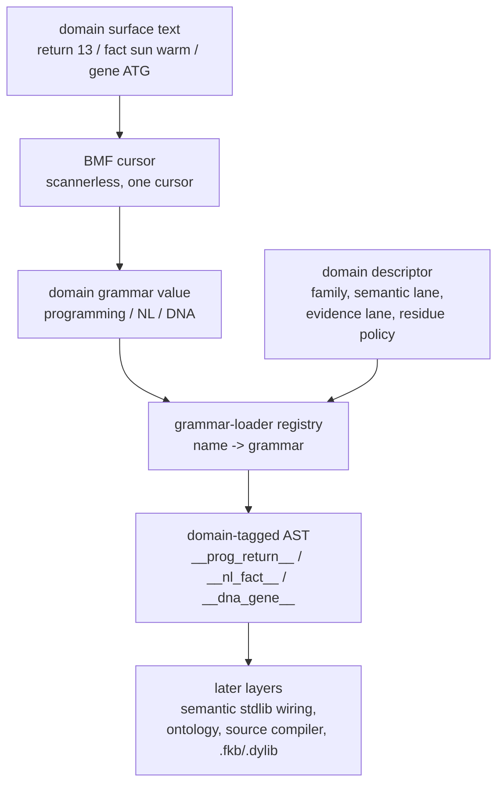

# 2026-07-03 -- domain grammar core layer review

## Ground

Layer 5 is the domain grammar shell:

- `form/form-stdlib/domain-grammar-core.fk`
- `grammars/domain-grammar-core.fk`
- `form/form-stdlib/tests/domain-grammar-core-band.fk`

It follows the closed BMF cursor, BMF grammar, and grammar-loader layers in the
runtime prelude stack. It also follows the semantic stdlib review in the
architecture conversation, but it does not prelude, load, or call
`semantic-stdlib`; semantic wiring remains deferred.

The required checkout witnesses were green before implementation:

```text
ground.fk                    -> 42
ground-recursive.fk 10       -> 55
binary-freshness-band.fk     -> 15
native-vs-rented-check       -> 11111
```

## Why This Layer Exists

The low-level concern is real: the implementation cells are still written in
direct executable Form, so the repo still shows a lot of `do`, `let`, and
`defn`. That is the current compiler floor, not the intended authoring
experience.

This layer does not remove that floor. It draws the next boundary above it:
domain authors should be able to bring surfaces that are not s-expressions and
not records forced into one universal shape. A domain grammar is a BMF grammar
value, selected by the grammar-loader, with explicit metadata lanes for meaning,
evidence, residue, and lower target.

The witness surfaces are intentionally not Form:

```text
return 13
fact sun warm
gene ATG
```

They all parse through the same BMF cursor/grammar/loader stack, but each emits
a domain-distinct AST tag:

```text
__prog_return__
__nl_fact__
__dna_gene__
```

## Layer Diagram



## Pre-Review

Grok pre-reviewed the proposed layer against the current receipts and files. It
returned `PASS` with required corrections before implementation:

- keep the prelude slim: `core`, `bmf-core`, `bmf-grammar`, `grammar-loader`;
- use `dgcore-*` so this does not collide with `dynamic-grammar-carrier.fk`;
- make semantic/evidence/residue lanes metadata-only, not live wiring;
- use domain-tagged AST values, not production lowerings;
- prove grammar-value non-collapse, distinct AST tags, EOF/trailing failure,
  and per-domain lane metadata;
- do not call `ssl-translate`, do not load ontology or
  `field-domain-grammars.form`, and do not claim universal domain support.

Claude pre-review was attempted after Urs said Claude was approved. The local
CLI still returned:

```text
Not logged in - Please run /login
```

That is authentication unavailability, not approval and not a layer verdict.

## What Changed

Both mirrored files define:

- `domain-grammar-core-manifest`;
- `dgcore-domain`, a descriptor carrying:
  - name;
  - family;
  - grammar value;
  - semantic lane;
  - evidence lane;
  - residue policy;
  - lower target;
- three tiny BMF grammar values:
  - programming: `return 13`;
  - natural-language: `fact sun warm`;
  - biology/DNA: `gene ATG`;
- `dgcore-domain-registry`, built through `grammar-loader`;
- `dgcore-parse`, a full-source parse wrapper that rejects trailing sediment;
- reader helpers for domain-tagged ASTs.

`form/form-stdlib/source-runner-admission.fk` now records the
`domain-grammar-core-band` as a current green gate. The admission band mask did
not change; this only adds the new layer to the current observation snapshot.

## Witness

```sh
./fkwu --src <(cat form/form-stdlib/core.fk \
    form/form-stdlib/bmf-core.fk \
    form/form-stdlib/bmf-grammar.fk \
    form/form-stdlib/grammar-loader.fk \
    form/form-stdlib/domain-grammar-core.fk \
    form/form-stdlib/tests/domain-grammar-core-band.fk)
```

```text
268435455
```

Bit decoding. Bits `1` through `256` are manifest/boundary declarations. Bits
`512` through `134217728` are behavioral witnesses.

```text
1         manifest declares domain-descriptor
2         manifest declares multi-domain-registry
4         manifest declares grammar-as-data
8         manifest declares one-cursor
16        manifest declares no-line-grammar
32        manifest declares no-tokenizer
64        manifest declares ontology-free
128       manifest declares metadata-only-lanes
256       manifest declares multi-domain-witness
512       registry count is 3
1024      registry has programming
2048      registry has natural-language
4096      registry has dna
8192      programming parses return 13 as __prog_return__
16384     programming value slot is 13
32768     natural-language parses fact sun warm as __nl_fact__
65536     natural-language preserves subject sun and predicate warm
131072    dna parses gene ATG as __dna_gene__
262144    dna motif slot is ATG
524288    missing domain returns NO-SUCH-GRAMMAR and is rejected by gl-ok?
1048576   bad programming source returns parse-fail and is rejected by gl-ok?
2097152   trailing sediment fails
4194304   grammar start names differ across domains
8388608   parsed AST tags differ across domains
16777216  descriptor families differ across domains
33554432  evidence lane metadata differs
67108864  residue policy metadata differs
134217728 shadow registration proves newest grammar wins
```

Adjacent witnesses:

```text
grammar-loader-band          -> 65535
source-runner-admission-band -> 1048575
domain-grammar-core copy cmp -> 0
```

## What This Does Not Prove

- It does not prove full Python, JavaScript, Form, BML, natural-language, DNA,
  physics, chemistry, biology, astronomy, math, or science grammars.
- It does not prove `field-domain-grammars.form` or any ontology-backed field
  proof contract.
- It does not call `semantic-stdlib` or prove semantic translation. The
  semantic/evidence/residue lanes are readable descriptor metadata only.
- It does not integrate with the source compiler, `.fkb`, `.tbl`, or `.dylib`
  artifact route.
- It does not remove direct Form as the implementation substrate. It proves a
  layer boundary above that substrate.

## Alternatives

| Alternative | Disposition | Why |
| --- | --- | --- |
| Keep writing each domain as ad hoc low-level Form | Rejected | It preserves the low-level authoring problem and hides the shared grammar path. |
| Use one universal s-expression or record grammar for all domains | Rejected | The core architecture explicitly requires domain-appropriate grammars. |
| Load `semantic-stdlib` and translate live in this layer | Rejected | Semantic stdlib consumes already-identified surfaces; this layer is raw-source -> AST. |
| Load ontology or field-domain proof files here | Rejected | That would turn a shell/contract layer into a fat integration layer. |
| Build full NL/DNA/programming grammars now | Deferred | The purpose here is the domain grammar contract and non-collapse witness. |
| Use tokenizer or line grammar | Rejected | BMF cursor is scannerless and streaming; token/line grammars are not the waist. |

## Deferred

- Registering existing `defdata-language`, `form-definition-language`, and
  future domain files through this core descriptor layer.
- Full domain grammars for programming languages, NL, DNA, physics, chemistry,
  biology, astronomy, math, and other fields.
- Wiring domain parse output into `semantic-stdlib` translation/residue.
- Stable ontology-backed NodeID/source attribution for domain ASTs.
- Program-image `.fkb` and verified `.dylib` artifact selection.
- A higher grammar-authoring DSL so even domain grammar definitions are not
  hand-written as direct Form cells.

## Post-Review

Grok post-reviewed the implemented layer and receipt read-only, reproduced the
local witnesses, and returned `PASS`. It accepted closure for Layer 5 as an
ontology-free, metadata-only domain grammar shell over the BMF cursor and
grammar-loader registry.

Grok found no code blocker. Its required corrections were receipt-only:

- clarify that `semantic-stdlib` is not loaded or called by this layer;
- distinguish manifest bits from behavioral bits;
- tighten the missing-domain bit wording to `NO-SUCH-GRAMMAR`;
- replace this post-review section with the green closure verdict.

Those corrections are now recorded here.

2026-07-04 downstream revalidation after the BMF grammar sugar/full-parse
layer:

```text
domain-grammar-core-band     -> 268435455
grammar-loader-band          -> 65535
source-runner-admission-band -> 1048575
domain-grammar-core copy cmp -> 0
```

No current implementation or band diff exists in `domain-grammar-core`.

Grok re-reviewed Layer 5 and Layer 6 after the Layer 3 grammar-waist change and
returned `PASS`. It accepted that the current bands remain full-mask green,
the `grammars/` and `form/form-stdlib/` copies are byte-identical, and no
implementation change is required.

Claude re-reviewed the same evidence and returned `PASS`. This closes the
earlier missing Claude review; the previous `Not logged in` result was an
authentication failure, not a layer verdict.

No OOM-killed process occurred during this layer pass.
