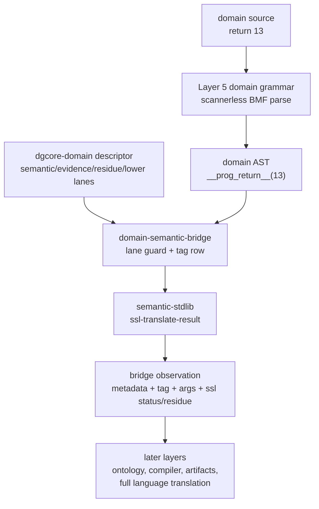

# 2026-07-03 -- domain semantic bridge layer review

## Ground

This is a Layer 6 bridge adjunct between Layer 5 domain ASTs and the existing
`semantic-stdlib` pivot:

- `form/form-stdlib/domain-semantic-bridge.fk`
- `form/form-stdlib/tests/domain-semantic-bridge-band.fk`

It is not a new grammar language, so it intentionally has no `grammars/` mirror.
It follows `semantic-stdlib.fk`, which is also stdlib-only.

The required checkout witnesses were green before implementation:

```text
ground.fk                    -> 42
ground-recursive.fk 10       -> 55
binary-freshness-band.fk     -> 15
native-vs-rented-check       -> 11111
```

## Why This Layer Exists

`domain-grammar-core` and the grammar authoring rungs produced domain ASTs and
descriptor metadata, but the semantic lane was still cargo:

```text
return 13 -> __prog_return__(13)
semantic lane: semantic-stdlib
```

`semantic-stdlib` already owns shared semantic operation ids, qualifiers,
fidelity, and residue. What was missing was the first live bridge:

```text
parsed domain AST + dgcore-domain descriptor
  -> lane gate
  -> domain tag row
  -> ssl-translate-result
  -> domain-semantic-bridge observation
```

The bridge consumes already parsed nodes. It does not scan source, tokenize,
define a grammar, load ontology, invoke the source compiler, write `.fkb`, or
emit `.dylib`.

## Layer Diagram



## Pre-Review

Grok pre-reviewed the proposed layer and returned `PASS` with required
corrections:

- call this a domain-semantic bridge, not a second semantic stdlib;
- key bridge rows by domain name and AST tag;
- use `form/return` as the canonical semantic-stdlib source row for
  `programming/__prog_return__`;
- guard on `semantic-lane == semantic-stdlib` before any `ssl` call;
- keep bridge failure modes distinct from `ssl` missing results;
- carry descriptor metadata, node tag, args, target language, target surface,
  sem-id, fidelity, and residue in the bridge observation;
- do not parse raw source inside the bridge;
- add an admission row only after the band is green;
- no C growth.

Claude pre-reviewed the same layer and returned `PASS` with additional
corrections:

- make the row table a parameter for `dsb-bridge-with-rows`, so a trap row can
  prove the lane guard runs before row lookup;
- pass through `ssl` missing-target results unmasked, using `haskell` as the
  missing target witness;
- use real `dgcore-parse` outputs in the band, not hand-built ASTs;
- witness descriptor cargo such as `compiler-proof` and
  `syntax-semantic-residue`;
- do not mirror this file under `grammars/`, because it is semantic wiring, not
  a grammar definition.

Grok was asked to re-check the mirror question. It returned `PASS` on the
layout correction: no `grammars/domain-semantic-bridge.fk`; this layer follows
`semantic-stdlib.fk`, not the grammar mirror pattern.

## What Changed

`domain-semantic-bridge.fk` defines:

- `domain-semantic-bridge-manifest`;
- a small `dsb-row` table, currently one row:
  `programming + __prog_return__ -> form + return + ssl-return`;
- `dsb-bridge-with-rows`, the parameterized bridge for guard-order witnesses;
- `dsb-bridge`, the public bridge using the v1 row table;
- `dsb-result`, an observation carrier preserving descriptor metadata, AST tag,
  args, target language, source language/surface, target surface, sem-id,
  fidelity, and residue.

Failure modes are layer-specific:

```text
semantic-lane-not-stdlib
missing-domain-semantic-row
```

When the bridge successfully reaches `semantic-stdlib`, it passes through
`ssl-result` status/residue unchanged, including `missing-target`.

`form/form-stdlib/source-runner-admission.fk` now records
`domain-semantic-bridge-band` as a current green observation. The admission band
mask did not change.

## Witness

```sh
./fkwu --src <(cat form/form-stdlib/core.fk \
    form/form-stdlib/bmf-core.fk \
    form/form-stdlib/bmf-grammar.fk \
    form/form-stdlib/grammar-loader.fk \
    form/form-stdlib/domain-grammar-core.fk \
    form/form-stdlib/semantic-stdlib.fk \
    form/form-stdlib/domain-semantic-bridge.fk \
    form/form-stdlib/tests/domain-semantic-bridge-band.fk)
```

```text
268435455
```

Bit decoding:

```text
1          manifest declares consumes-parsed-ast
2          manifest declares no-raw-source-parse
4          manifest declares no-tokenizer
8          manifest declares lane-gate-before-ssl
16         manifest declares ssl-delegate-only
32         manifest declares bridge-row-table
64         manifest declares single-row-table-v1
128        manifest declares preserves-domain-metadata
256        manifest declares preserves-node-args
512        manifest declares residue-fidelity-pass-through
1024       manifest declares no-ontology
2048       manifest declares no-artifact-route
4096       dgcore parses return 13 as __prog_return__
8192       parsed return node carries arg 13
16384      python target status ok, surface return, sem ssl-return
32768      python target fidelity 100 and empty residue
65536      bridge result preserves arg 13
131072     bridge result preserves compiler-proof, syntax-semantic-residue, form-recipe
262144     bridge row uses form/return as canonical semantic source
524288     rust target status lossy and fidelity 50
1048576    rust target carries stmt residue and ssl-return
2097152    haskell target passes through ssl missing target surface
4194304    haskell target carries missing-target residue and ssl-return
8388608    yield 7 parses as __prog_yield__ and returns missing-domain-semantic-row
16777216   yield result preserves arg 7 and missing-domain-semantic-row residue
33554432   natural-language fact returns semantic-lane-not-stdlib
67108864   trap row for __nl_fact__ still returns semantic-lane-not-stdlib
134217728  v1 row table has one row and it targets ssl-return
```

Adjacent witnesses:

```text
semantic-stdlib-band              -> 8388607
domain-grammar-core-band          -> 268435455
source-runner-admission-band      -> 1048575
```

## What This Does Not Prove

- It does not parse raw source text.
- It does not define a grammar surface and does not belong under `grammars/`.
- It does not translate natural language, DNA, physics, chemistry, biology,
  math, or other non-programming domains.
- It does not add semantic stdlib rows beyond the existing `form/return` route.
- It does not integrate ontology, source compiler, `.fkb`, `.tbl`, or `.dylib`.
- It does not prove a full programming-language translator.
- It does not claim exhaustive residue. It passes through the categorical
  `semantic-stdlib` result unchanged.

## Alternatives

| Alternative | Disposition | Why |
| --- | --- | --- |
| Call `semantic-stdlib` directly from `domain-grammar-core` | Rejected | Layer 5 owns grammar/descriptor shape; Layer 6 owns semantic activation. |
| Add rows to `semantic-stdlib.fk` for domain AST tags | Rejected | Domain tags are bridge input, not language surfaces in the semantic catalog. |
| Treat any `return`-like tag as semantic return | Rejected | That would erase bridge row evidence and make missing rows invisible. |
| Reuse `ssl-observe-translation` alone | Rejected | It does not carry domain descriptor lanes or original AST args. |
| Mirror under `grammars/` | Rejected | This is semantic wiring over parsed ASTs, not a grammar definition. |
| Load ontology/source compiler here | Rejected | Those are later layers and would overclaim the bridge. |

## Deferred

- More bridge rows for more domain AST tags.
- Bridge rows for grammar-authoring and sibling-ref authored outputs beyond
  `__prog_return__`.
- Natural-language, DNA, science, math, and other domain semantic bridges.
- General typed argument interpretation beyond preserving AST args.
- Ontology, source compiler, and artifact route integration.

## Post-Review

Grok post-reviewed the implemented layer, band, admission row, and receipt
read-only. It returned `PASS` with no code or receipt blockers. Grok confirmed:

- the bridge consumes parsed ASTs only;
- the lane guard runs before row lookup;
- bridge-owned failures stay distinct from `ssl` missing results;
- `ssl` `missing-target` passes through unmasked;
- descriptor metadata and args are preserved;
- no `grammars/` mirror is present or expected;
- the admission row records a green observation without changing the admission
  policy mask.

Claude post-reviewed the same files read-only and returned `PASS` with no code
or receipt blockers. Claude independently re-ran:

```text
domain-semantic-bridge-band   -> 268435455
source-runner-admission-band  -> 1048575
git diff --check              -> clean
```

Claude also checked the C boundary. The existing uncommitted runtime diff is
parser/source-reader work from other layers and contains no `domain-semantic`,
`dsb`, or bridge fingerprints from this layer.

Non-blocking future improvement: the band proves guard ordering through the
trap-row witness, but the bit table has no typed way to mark "this is an
order-witness bit" distinct from a presence/behavior bit. That vocabulary can
be added later if the observation language needs it.

No OOM-killed process occurred during this layer pass.

2026-07-04 downstream revalidation after the BMF grammar sugar/full-parse
layer:

```text
domain-semantic-bridge-band  -> 268435455
semantic-stdlib-band         -> 8388607
domain-grammar-core-band     -> 268435455
source-runner-admission-band -> 1048575
```

Grok re-reviewed Layer 5 and Layer 6 after the Layer 3 grammar-waist change and
returned `PASS`. Claude re-reviewed the same evidence and returned `PASS`.
No implementation change was required.
