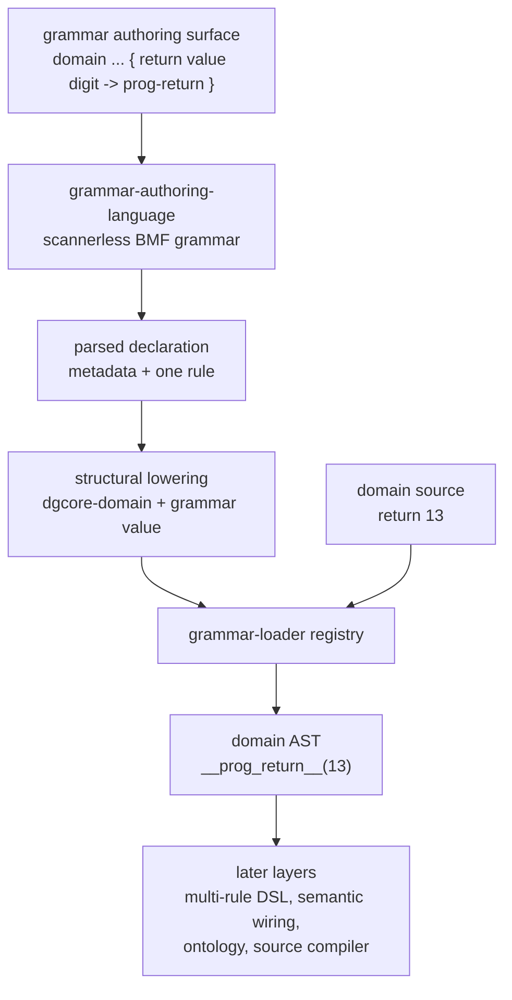

# 2026-07-03 -- grammar authoring language layer review

## Ground

This is a Layer 5 authoring rung above the `domain-grammar-core` shell. It is
not semantic Layer 6 and not a replacement for `domain-grammar-core`:

- `form/form-stdlib/grammar-authoring-language.fk`
- `grammars/grammar-authoring-language.fk`
- `form/form-stdlib/tests/grammar-authoring-language-band.fk`

The required checkout witnesses were green before implementation:

```text
ground.fk                    -> 42
ground-recursive.fk 10       -> 55
binary-freshness-band.fk     -> 15
native-vs-rented-check       -> 11111
```

## Why This Layer Exists

The prior layer proved a domain grammar contract, but the grammar values were
still hand-written as direct Form:

```text
(grammar ... (rule3 ... (p-lit ...) (p-cap ...) (p-run ...) (t-emit ...)))
```

That is still too low-level as an authoring experience. This layer admits one
small scannerless authoring surface for a domain grammar descriptor and one
rule:

```text
domain programming family programming-language semantic semantic-stdlib
  evidence compiler-proof residue syntax-semantic-residue lower form-recipe
  { return value digit -> prog-return }
```

It lowers structurally into `dgcore-domain` plus a BMF grammar value. It does
not lower into Form source text and does not call the source compiler.

The resulting grammar parses:

```text
return 13 -> __prog_return__(13)
```

So the implementation file still uses direct Form because that is the current
floor, but the authored domain grammar surface no longer requires writing the
raw BMF constructor tree by hand.

## Layer Diagram



## Pre-Review

Grok pre-reviewed the proposed layer against the current receipts and files. It
returned `PASS` with required corrections before implementation:

- call this a Layer 5 authoring rung, not semantic Layer 6;
- use `gal-*` names to avoid collision with `dgcore-*`, `dgc-*`, `gft-*`,
  `ddl-*`, and `fdl-*`;
- use `p-run "alnum"` for hyphenated metadata tokens;
- avoid the `word` class because it admits braces;
- map emit slugs explicitly, so `prog-return` becomes `__prog_return__`;
- lower structurally to BMF values and `dgcore-domain`, not to Form source;
- prove behavioral parity with the hand-written `dgcore-programming-grammar`;
- lock v1 to one rule body: `{ <literal> <capture-name> <run-class> -> <emit-slug> }`;
- keep the prelude slim: `core`, `bmf-core`, `bmf-grammar`,
  `grammar-loader`, `domain-grammar-core`;
- defer multi-rule grammars, repetitions, alternatives, nested templates,
  induction, semantic wiring, ontology, source compiler, and registration of
  existing language files.

Claude pre-review was not available: the local CLI still returned
`Not logged in - Please run /login`.

## What Changed

Both mirrored files define:

- `grammar-authoring-language-manifest`;
- `grammar-authoring-language-grammar`;
- `gal-parse`, a full-source parser that rejects trailing sediment;
- declaration readers for domain name, family, semantic lane, evidence lane,
  residue policy, lower target, literal, capture, run class, and emit slug;
- `gal-emit-tag`, which maps `prog-return` to `__prog_return__`;
- `gal-lower-grammar`, a structural BMF grammar builder;
- `gal-lower-domain`, reusing `dgcore-domain`;
- `gal-register-lowered`, which registers the lowered descriptor through
  `grammar-loader`.

`form/form-stdlib/source-runner-admission.fk` now records
`grammar-authoring-language-band` as a current green observation. The admission
band mask did not change.

## Witness

```sh
./fkwu --src <(cat form/form-stdlib/core.fk \
    form/form-stdlib/bmf-core.fk \
    form/form-stdlib/bmf-grammar.fk \
    form/form-stdlib/grammar-loader.fk \
    form/form-stdlib/domain-grammar-core.fk \
    form/form-stdlib/grammar-authoring-language.fk \
    form/form-stdlib/tests/grammar-authoring-language-band.fk)
```

```text
134217727
```

Bit decoding. Bits `1` through `256` are manifest/boundary declarations. Bits
`512` through `67108864` are behavioral witnesses.

```text
1         manifest declares scannerless
2         manifest declares bmf-cursor-grammar
4         manifest declares no-line-grammar
8         manifest declares not-s-expression-surface
16        manifest declares not-form-cell-authoring
32        manifest declares single-domain-decl
64        manifest declares single-rule-body
128       manifest declares metadata-only-lanes
256       manifest declares grammar-value-lowering
512       canonical declaration parses
1024      domain name reads programming
2048      family reads programming-language
4096      semantic lane reads semantic-stdlib
8192      evidence lane reads compiler-proof
16384     residue policy reads syntax-semantic-residue
32768     lower target reads form-recipe
65536     rule body reads return/value/digit/prog-return
131072    lowered descriptor is dgcore-domain shape
262144    lowered grammar start is return
524288    registered lowered grammar parses return 13 as __prog_return__
1048576   parsed value slot is 13
2097152   authored grammar has behavioral parity with hand-written programming grammar
4194304   trailing sediment fails
8388608   malformed declaration fails
16777216  lowered descriptor registers under programming
33554432  whitespace-tolerant declaration variant parses
67108864  lowered metadata lanes match parsed declaration, not defaults
```

Adjacent witnesses:

```text
grammar-loader-band              -> 65535
domain-grammar-core-band         -> 268435455
source-runner-admission-band     -> 1048575
grammar-authoring-language copy  -> 0
```

## What This Does Not Prove

- It does not remove direct Form from this implementation file.
- It does not support multi-rule grammars, alternatives, repetitions, nested
  templates, precedence, typed fields, or generalized grammar editing.
- It does not register `defdata-language`, `form-definition-language`, or the
  existing domain grammar files through `dgcore`.
- It does not call `semantic-stdlib` or prove translation/fidelity/residue
  semantics.
- It does not load ontology, source attribution, source compiler, `.fkb`,
  `.tbl`, or `.dylib` artifact routes.
- It does not replace `dynamic-grammar-carrier` or `grammar-from-thought`.

## Alternatives

| Alternative | Disposition | Why |
| --- | --- | --- |
| Keep hand-writing BMF grammar constructors | Rejected | It leaves the grammar authoring layer at raw Form constructor level. |
| Lower the DSL to Form source text | Rejected | This would overclaim a source compiler route and increase source-shape pressure. |
| Load `semantic-stdlib` here | Rejected | Semantic stdlib consumes identified surfaces; this layer authors grammar values. |
| Reuse `dynamic-grammar-carrier` | Rejected | It carries extension receipts over token lists, not a scannerless BMF authoring grammar. |
| Reuse `grammar-from-thought` | Deferred | Learned induction is a later route; this layer is explicit authoring. |
| Support full grammar syntax now | Deferred | The first honest rung proves one descriptor and one rule body. |

## Deferred

- Multi-rule grammar declarations.
- Alternatives, repetitions, separators, captures beyond one value, nested
  templates, and source attribution.
- A grammar-authoring grammar for NL, DNA, physics, chemistry, biology,
  astronomy, math, and other domain-specific syntaxes.
- Integration of existing language layers into `domain-grammar-core`.
- Learned grammar induction from `grammar-from-thought`.
- Live semantic-stdlib translation and ontology/source compiler integration.

## Post-Review

Grok post-reviewed the implemented layer, receipt, mirrored copies, and local
witnesses read-only. It reproduced the key witnesses and returned `PASS` with
no code blockers.

Final witness packet:

```text
grammar-authoring-language-band -> 134217727
domain-grammar-core-band        -> 268435455
grammar-loader-band             -> 65535
source-runner-admission-band    -> 1048575
grammar-authoring copy cmp      -> 0
binary-freshness-band           -> 15
ground.fk                       -> 42
ground-recursive.fk 10          -> 55
```

Grok accepted this as a scannerless one-declaration/one-rule authoring surface
above `domain-grammar-core`. The review confirmed:

- the prelude is slim and does not include `semantic-stdlib`, ontology, or the
  source compiler;
- `semantic-stdlib` appears only as descriptor metadata cargo and is not called
  by this layer;
- bits `1` through `256` are manifest/boundary declarations, while bits `512`
  through `67108864` are behavioral witnesses;
- `gal-lower-grammar` structurally builds BMF grammar values rather than Form
  source text;
- behavioral parity with `dgcore-programming-grammar` is witnessed without
  claiming full grammar-value equality.

Claude post-review was attempted through the local CLI and remained unavailable:

```text
Not logged in - Please run /login
```

That is authentication unavailability, not approval.

No OOM-killed process occurred during this layer pass.
