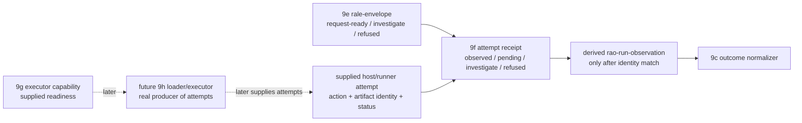

# 2026-07-03 -- Runtime artifact attempt-receipt layer review

## Scope

Layer 9f is the attempt-receipt layer between the 9e load envelope and the
9g executor capability / future 9h loader path. It binds a supplied host/runner
observation to the exact envelope identity before deriving the plain
`rao-run-observation` row that Layer 9c already knows how to normalize.

This is not a loader, executor, `.fkb` walker, `.dylib` caller, or source
runner. It exists because the current body can honestly validate provenance
over supplied rows before it can honestly claim arbitrary binary loading or
native dispatch without growing the C seed.

Artifacts:

- `form/form-stdlib/runtime-artifact-attempt-receipt.fk`
- `form/form-stdlib/tests/runtime-artifact-attempt-receipt-band.fk`
- architecture update in `receipts/2026-07-03-core-layer-architecture-map.md`

## Layer Diagram



## Pre-Review

Grok pre-review verdict: CONDITIONAL PASS.

Required constraints:

- do not land this as "9f loader/executor"; update the architecture map so 9f
  is the attempt-receipt layer and real load/execute moves to 9g;
- manifest and band must forbid implying Form produced the observation;
- document how 9c gets the original selection from envelope provenance plus the
  derived observation;
- do not implement outcome algebra, fallback policy, retry policy, or success
  normalization here;
- the derived observation action must equal the envelope action;
- mismatches must be loud investigate receipts with no derived observation.

Claude no-tools pre-review verdict: CONDITIONAL PASS.

Required constraints:

- rename now rather than deferring; claiming 9f is a loader/executor would be
  fabrication;
- pending observation must have an escalation story so a stuck attempt is not
  silently ignored;
- mismatch must be loud and observable, not silence;
- the trustworthy tuple without re-hashing is exactly the 9e emitted identity
  tuple: action, route, kind, path, source hash, content hash.

## Implementation

`runtime-artifact-attempt-receipt.fk` adds:

- `runtime-artifact-attempt-receipt-manifest`;
- supplied attempt rows:
  `("runtime-artifact-supplied-attempt" action route artifact-kind artifact-path source-hash content-hash status detail code)`;
- receipt rows:
  `("runtime-artifact-attempt-receipt" envelope attempt derived-observation action route artifact-kind artifact-path source-hash content-hash attempt-status receipt-status severity reason detail code)`;
- `raar-receipt-from-envelope` for pending observation receipts;
- `raar-receipt-from-envelope-age` so pending can become
  `pending-observation-stalled` investigation;
- `raar-receipt-from-envelope-attempt` for identity-bound observations;
- `raar-receipt-selection` as the downstream bridge to 9c selection provenance.

Only a request-ready `rale-envelope` can produce an observed attempt receipt.
Only a supplied attempt whose action, route, artifact kind, artifact path,
source hash, and content hash match the envelope can derive a
`rao-run-observation`. The derived observation's action is the envelope action.

Hard statuses are not softened or discarded. `oom-killed`, `killed`, `stalled`,
`timeout`, and `wrong-value` become observed hard attempt receipts and are
forwarded to 9c, which still normalizes them to investigation.

The aging helper consumes supplied `age` and `deadline` values. It does not read
a clock or schedule work; 9g must decide where those supplied aging facts come
from when real attempts exist.

## Witnesses

Focused witness:

```sh
./fkwu --src <(cat form/form-stdlib/core.fk \
    form/form-stdlib/source-artifact-cache.fk \
    form/form-stdlib/source-artifact-descriptor.fk \
    form/form-stdlib/runtime-artifact-plan.fk \
    form/form-stdlib/runtime-artifact-selector.fk \
    form/form-stdlib/runtime-artifact-outcome.fk \
    form/form-stdlib/runtime-artifact-retry.fk \
    form/form-stdlib/runtime-artifact-load-envelope.fk \
    form/form-stdlib/runtime-artifact-attempt-receipt.fk \
    form/form-stdlib/tests/runtime-artifact-attempt-receipt-band.fk)
# -> 2147483647
```

Band coverage:

- manifest boundary bits;
- request-ready envelope without observation is pending;
- pending can age into investigation;
- matched native/program-image/source attempts derive `rao-run-observation`;
- soft supplied statuses flow through 9c as fallback-available where fallback
  exists;
- hard supplied statuses flow through 9c as investigate;
- unknown statuses flow through 9c as investigate;
- action, route, kind, path, source-hash, and content-hash mismatches are loud
  investigate receipts with no derived observation;
- malformed attempt rows refuse;
- investigate/refused/non-ready/malformed envelopes do not derive observations;
- retry-envelope provenance is preserved through `raar-receipt-selection`;
- row shape and idempotence.

## Deferred

- Real `.fkb` image load/walk.
- Real `.dylib` load/call, symbol binding, dispatch, invoke/return.
- Native execution and source execution.
- Disk IO and arbitrary binary byte hashing.
- Seal/proof/callable reverification.
- Outcome algebra, fallback execution, retry scheduling.
- Source-runner admission coupling.
- Installed startup selector for `fkwu`.
- Any C-seed growth.

## Post-Review

Grok post-review verdict: PASS.

Grok confirmed:

- 9f is an attempt-receipt layer, not a loader/executor;
- real load/execute is now explicitly future 9h work in the architecture map,
  after 9g capability readiness;
- supplied attempts only: the layer does not claim Form produced the
  observation;
- the six-field identity tuple must match before a derived 9c observation exists:
  action, route, artifact kind, artifact path, source hash, content hash;
- mismatches are loud `investigate` receipts with no derived observation;
- pending can escalate to `pending-observation-stalled`;
- hard statuses are preserved and forwarded to 9c;
- no outcome algebra, retry policy, fallback execution, IO, byte hashing,
  reverify, `.fkb` walk, `.dylib` call, admission, selector install, or C
  growth appears in 9f.

Claude no-tools post-review verdict: PASS.

Claude confirmed the pre-review conditions are cleared: the boundary is
receipt-only, mismatches derive nothing, only request-ready envelopes can observe
attempts, the six-field match is complete, and hard/unknown statuses are
forwarded to 9c rather than swallowed.

Claude's watch-item is recorded here: aged pending introduces supplied time-like
facts, so 9g must keep the aging witness external to 9f. This is not a blocker
because 9f reads only supplied `age`/`deadline` values and does not own clocks or
scheduling.

Downstream contract: when a receipt has status `observed`, 9c consumes
`raar-receipt-selection(receipt)` plus `raar-receipt-derived-observation(receipt)`.
The focused band exercises ok, soft, hard, and unknown observation paths through
that bridge.
