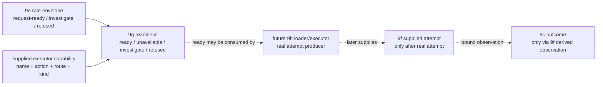

# 2026-07-03 -- Runtime artifact executor-capability layer review

## Scope

Layer 9g is the executor-capability layer between 9e request envelopes and the
future 9h real loader/executor. It says whether a supplied host capability row
claims it can attempt the envelope's action/route/artifact-kind tuple.

This is not execution. It does not load or walk `.fkb`, load or call `.dylib`,
run source, produce 9f attempts, or derive 9c observations. A `ready` row means
only "a supplied current capability claims it can attempt this envelope." Future
9h may consume 9g `ready` rows and, if it actually attempts the artifact, supply
9f attempt rows.

Artifacts:

- `form/form-stdlib/runtime-artifact-executor-capability.fk`
- `form/form-stdlib/tests/runtime-artifact-executor-capability-band.fk`
- architecture update in `receipts/2026-07-03-core-layer-architecture-map.md`

## Layer Diagram



## Pre-Review

Grok pre-review verdict: CONDITIONAL PASS.

Required constraints:

- rename the architecture so 9g is executor capability/readiness and real
  load/walk/call moves to 9h;
- `ready` must not mean execute or success;
- document the chain: 9e -> 9g -> future 9h supplies attempts -> 9f -> 9c;
- keep source-runner admission separate; 9g only matches envelope
  action/route/kind to per-route executor capability rows;
- capability evidence must be supplied rows, not path/extension inference or
  disk probing;
- band non-request-ready envelopes, mismatches, stale/wrong authority,
  no-capability, and current-floor `.fkb`/`.dylib` unavailable rows;
- do not produce 9f attempts or 9c observations.

Claude no-tools pre-review verdict: CONDITIONAL PASS.

Required constraints:

- rename the architecture in the same pass;
- name the 9h consumer contract so readiness rows are not orphan gates;
- define stale without touching bytes or drop stale vocabulary;
- make refused, unavailable, and investigate disjoint:
  - refused: malformed or forbidden authority;
  - unavailable: no matching capability supplied;
  - investigate: matching capability with stale or inadequate evidence;
- cite the current-floor red signal for `.fkb`/`.dylib` unavailable rows.

## Implementation

`runtime-artifact-executor-capability.fk` adds:

- `runtime-artifact-executor-capability-manifest`;
- capability rows:
  `("runtime-artifact-executor-capability" name action route artifact-kind availability evidence-kind authority freshness detail)`;
- readiness rows:
  `("runtime-artifact-executor-readiness" envelope capability action route artifact-kind required-capability status reason evidence-kind authority freshness detail)`;
- closed capability names:
  - `native-dylib-caller`
  - `program-image-walker`
  - `source-compiler-front-door`
- `raec-readiness-from-envelope-no-capability`;
- `raec-readiness-from-envelope-capability`;
- current-floor unavailable rows for native dylib and program-image execution,
  both citing `2026-07-03-form-fs-read-bytes-canary-0`.

The closed action/route/kind table is:

| Envelope action | Route | Artifact kind | Required capability |
| --- | --- | --- | --- |
| `run-native` | `sac-run-dylib` | `native-dylib` | `native-dylib-caller` |
| `run-program-image` | `sac-run-fkb` | `program-image-fkb` | `program-image-walker` |
| `compile-source` | `sac-run-source-compile` | `source-fk` | `source-compiler-front-door` |

`stale` is purely supplied evidence: the layer checks capability availability,
evidence-kind, and freshness fields. It does not read bytes, hash, stat files,
or rederive freshness.

## Witnesses

Focused witness:

```sh
./fkwu --src <(cat form/form-stdlib/core.fk \
    form/form-stdlib/source-artifact-cache.fk \
    form/form-stdlib/source-artifact-descriptor.fk \
    form/form-stdlib/runtime-artifact-plan.fk \
    form/form-stdlib/runtime-artifact-selector.fk \
    form/form-stdlib/runtime-artifact-outcome.fk \
    form/form-stdlib/runtime-artifact-retry.fk \
    form/form-stdlib/runtime-artifact-load-envelope.fk \
    form/form-stdlib/runtime-artifact-executor-capability.fk \
    form/form-stdlib/tests/runtime-artifact-executor-capability-band.fk)
# -> 2147483647
```

Band coverage:

- manifest boundary bits;
- native, program-image, and source capability `ready` rows;
- no supplied capability -> `unavailable`;
- current-floor native and program-image executor rows -> `unavailable`, with
  `2026-07-03-form-fs-read-bytes-canary-0` detail;
- stale/inadequate supplied evidence -> `investigate`;
- forbidden authority and malformed capability -> `refused`;
- name/action/route/kind mismatch -> `unavailable`;
- investigate/refused/non-ready/malformed envelopes never produce `ready`;
- unsupported hand-built envelope -> `investigate`;
- `ready` is not execution or a 9c observation;
- evidence fields, idempotence, and closed table.

## Deferred

- Real `.fkb` image load/walk.
- Real `.dylib` load/call, symbol binding, dispatch, invoke/return.
- Native execution and source execution.
- Disk IO and arbitrary binary byte hashing.
- Seal/proof/callable reverification.
- 9f attempt production and 9c observation production.
- Outcome algebra, fallback execution, retry scheduling.
- Source-runner admission coupling.
- Installed startup selector for `fkwu`.
- Any C-seed growth.

## Post-Review

Grok post-review verdict: PASS.

The first Grok post-review run reached its configured max-turn limit after
reading/reviewing and returned no verdict. That was not counted as a review and
was recorded as reviewer-tool behavior, not an OOM kill and not a `fkwu` stall.
The bounded retry returned PASS.

Grok confirmed:

- 9g is capability/readiness only, and real load/walk/call is deferred to 9h;
- `ready` is explicitly not execution or success;
- matching is over supplied capability rows and envelope fields only;
- stale/inadequate paths use supplied availability/evidence-kind/freshness
  fields, not IO, hashing, or reverification;
- status partition holds:
  - `refused`: malformed capability/envelope, forbidden authority, terminal
    refused envelope;
  - `unavailable`: no capability, field mismatches, explicit unavailable
    availability;
  - `investigate`: stale/inadequate evidence, unsupported or non-ready upstream,
    terminal investigate;
- current-floor native/program-image rows are `unavailable` and cite
  `2026-07-03-form-fs-read-bytes-canary-0`;
- the 9g cell has no filesystem, binary loader, 9f attempt, or 9c observation
  invocations;
- the focused witness returns `2147483647` through the concatenated prelude
  route.

Claude no-tools post-review verdict: PASS.

Claude confirmed the pre-review conditions are cleared: the architecture names
9h as the real executor, 9g stays readiness-only, staleness is supplied evidence
only, current-floor unavailability is honest, and the boundary scan finds no
hidden execution path.

Claude's non-blocking note is recorded here: the forbidden-authority vocabulary
should be pinned again when 9h consumes readiness rows so refusal semantics do
not drift.
