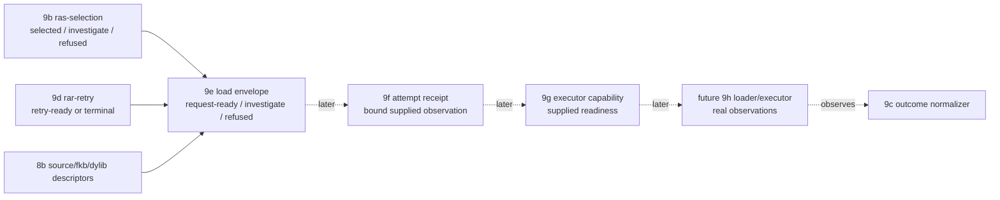

# 2026-07-03 -- Runtime artifact load-envelope layer review

## Scope

Layer 9e is the request-envelope layer between 9b/9d request selection and the
future capability/loader path. It emits a row that says "this exact artifact is
ready to be attempted," while staying honest that no artifact has been loaded,
walked, called, or proven successful.

Artifacts:

- `form/form-stdlib/runtime-artifact-load-envelope.fk`
- `form/form-stdlib/tests/runtime-artifact-load-envelope-band.fk`
- architecture update in `receipts/2026-07-03-core-layer-architecture-map.md`

The public prefix is `rale-`, not the originally proposed `rle-`, because
`rle-` already belongs to the run-length encoding stdlib cell. Reusing that
prefix would have made observation and grep-based review ambiguous.

## Layer Diagram



## Pre-Review

Grok pre-review verdict: CONDITIONAL PASS.

Required constraints:

- make 9e a load-envelope/request layer, not a real loader/executor;
- update the architecture map so real load/execute moves to 9f;
- use descriptors only for identity rejoin via `sad-route(source,fkb,dylib)`;
- do not consume `rap-plan` or rederive plan coherence;
- do not create route preference, fallback, skip, deopt, or compile-output
  policy here;
- use a closed route/action table:
  - `run-native` + `sac-run-dylib` -> dylib descriptor;
  - `run-program-image` + `sac-run-fkb` -> fkb descriptor;
  - `compile-source` + `sac-run-source-compile` -> source descriptor plus an
    envelope-local no-compile-output sentinel;
- accept retry rows directly and preserve full retry provenance;
- malformed, mismatched, corrupt, terminal, or non-ready inputs must never emit
  `request-ready`;
- band that `request-ready` is not load success.

Claude concise no-tools pre-review verdict: CONDITIONAL PASS.

Required additions:

- retry envelopes must inherit the nested `rar-retry-next-selection` route, not
  silently use the prior route;
- the no-compile-output marker must be a field/sentinel on the envelope row, not
  a new artifact family;
- the envelope must explicitly carry selection and retry provenance;
- unknown routes or non-total route cases must investigate/refuse, never
  default into a runnable request.

Earlier Claude tool-backed/larger pre-review attempts either stayed silent long
enough to interrupt or produced output that was lost to truncation. Those were
recorded as reviewer-tool waits/truncation, not OOM kills and not `fkwu` stalls.
The accepted pre-review is the bounded no-tools result above.

## Implementation

`runtime-artifact-load-envelope.fk` adds:

- `runtime-artifact-load-envelope-manifest`;
- envelope statuses: `request-ready`, `investigate`, `refused`;
- `rale-no-retry` and `rale-no-compile-output` sentinels;
- `rale-envelope` rows:
  `("runtime-artifact-load-envelope" source artifact action route artifact-kind artifact-path source-hash content-hash selection retry compile-output status reason)`;
- direct construction from readable selected `ras-selection` rows;
- retry construction from `retry-ready` `rar-retry` rows by using the nested
  next selection;
- route/action matching for native, program-image, and compile-source requests;
- strict readable-selection guarding before selector accessors are used.

The envelope row carries both selection and retry fields. Direct selection
requests use `rale-no-retry`; retry requests carry the full `rar-retry` row. A
compile-source envelope carries the canonical source descriptor as the attempted
artifact and `rale-no-compile-output` as an envelope field. Actual compiler
emission remains a later compiler layer.

The `runtime-artifact-plan.fk` prelude is present only for shared action
constant names such as `rap-act-run-native`; 9e does not consume `rap-plan`
rows, call `rap-plan-from-descriptors`, or rederive plan coherence.

## Witnesses

Focused witness:

```sh
./fkwu --src <(cat form/form-stdlib/core.fk \
    form/form-stdlib/source-artifact-cache.fk \
    form/form-stdlib/source-artifact-descriptor.fk \
    form/form-stdlib/runtime-artifact-plan.fk \
    form/form-stdlib/runtime-artifact-selector.fk \
    form/form-stdlib/runtime-artifact-outcome.fk \
    form/form-stdlib/runtime-artifact-retry.fk \
    form/form-stdlib/runtime-artifact-load-envelope.fk \
    form/form-stdlib/tests/runtime-artifact-load-envelope-band.fk)
# -> 2147483647
```

The first direct attempt, `./fkwu --src form/form-stdlib/tests/runtime-artifact-load-envelope-band.fk`,
returned `nothing`. That was investigated instead of counted as a pass. Adjacent
artifact bands behaved the same when run without concatenated source because
their `preludes:` comments are documentation, not active imports. The established
witness route for these layered cells is the concatenated source snapshot shown
above.

The first concatenated 9e witness returned `2130706431`, missing exactly
`16777216`, the malformed-selection bit. Root cause: `ras-selection?` checks only
the row tag, so a short tagged row was being treated as non-selected instead of
malformed. The fix was `rale-selection-readable?`, which checks the eight-field
shape before any selector accessors are used. The rerun returned `2147483647`.

Adjacent witnesses:

- source-artifact descriptor: `2147483647`
- runtime artifact plan: `67108863`
- runtime artifact selector: `2147483647`
- runtime artifact outcome: `2147483647`
- runtime artifact retry: `2147483647`
- runtime artifact load envelope: `2147483647`

Checkout floor:

- `./fkwu --src bootstrap/ground.fk` -> `42`
- `./fkwu --src bootstrap/ground-recursive.fk 10` -> `55`
- `./fkwu --src form/form-stdlib/tests/binary-freshness-band.fk` -> `15`
- native-vs-rented concat -> `11111`
- `git diff --check` -> clean

## Deferred

- Real disk IO and byte hashing.
- Seal/proof/callable reverification.
- `.fkb` image load/walk and `.dylib` load/call.
- Native execution and source execution.
- Real observation generation.
- Retry loops and fallback execution scheduling.
- Source-runner admission coupling.
- Compiler emission and compile-output attachment.
- Installed startup selector for `fkwu`.
- Any C-seed growth.

## Post-Review

Grok post-review verdict: PASS.

Grok confirmed:

- 9e is envelope-only; `request-ready` is not load success;
- 9e does not consume `rap-plan` rows and uses the plan prelude only for shared
  action constants;
- descriptor use is limited to `sad-route` equality against the selection or
  retry-next-selection route;
- the retry path inherits `rar-retry-next-selection`;
- malformed, terminal, non-ready, mismatched, invalid, wrong-action, and
  missing-artifact cases never emit `request-ready`;
- `rale-no-compile-output` is an envelope field;
- the architecture map now splits 9e load envelope, 9f attempt receipt, and
  9g executor capability before future 9h loader/executor.

Claude no-tools post-review first returned CONDITIONAL PASS with one condition:
confirm that readable-selection and missing-artifact checks are field-only and
do not probe the filesystem. The implementation definitions are:

```lisp
(defn rale-selection-readable? (selection)
    (if (eq (len selection) 8)
        (ras-selection? selection)
        0))
(defn rale-native-artifact-present? (dylib)
    (if (sad-artifact? dylib)
        (str_eq (sad-artifact-kind dylib) (sad-kind-native-dylib))
        0))
(defn rale-program-image-artifact-present? (fkb)
    (if (sad-artifact? fkb)
        (str_eq (sad-artifact-kind fkb) (sad-kind-program-image-fkb))
        0))
```

Claude reviewed that confirmation and returned PASS, with no blockers. Its
useful wording correction: "present" in this layer means present in the supplied
descriptor row, not present on disk. Disk truth belongs to a later admission or
loader layer.
