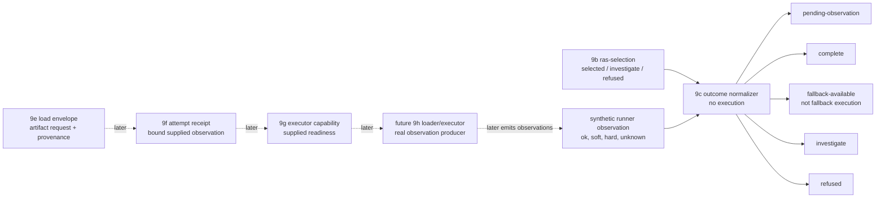

# 2026-07-03 -- runtime artifact outcome layer review

## Ground

Layer 9c follows the reviewed runtime artifact stack:

- `receipts/2026-07-03-core-layer-architecture-map.md`
- `receipts/2026-07-03-runtime-artifact-plan-layer-review.md`
- `receipts/2026-07-03-runtime-artifact-selector-layer-review.md`
- `form/form-stdlib/runtime-artifact-plan.fk`
- `form/form-stdlib/runtime-artifact-selector.fk`
- `form/form-stdlib/runtime-artifact-outcome.fk`
- `form/form-stdlib/tests/runtime-artifact-outcome-band.fk`

Layer 9c is an outcome observation face. It consumes Layer 9b
`runtime-artifact-selection` rows and synthetic future runner observation rows.
It emits normalized outcome rows.

It is not a loader, executor, fallback runner, retry orchestrator, admission
gate, or installed `fkwu` selector. It does not consume descriptors or
`rap-plan` rows, read or write disk, load or walk `.fkb`, load or call `.dylib`,
bind symbols, execute native bytes, generate real observations, reverify
seal/proof/callable receipts, decide source-runner admission, investigate by
itself, or grow the C seed.

## Layer Diagram



## Pre-Review

Grok pre-review verdict: CONDITIONAL PASS.

Required constraints:

- name this Layer 9c outcome face, not a loader/executor;
- land outcome normalization before any loader stub;
- consume only `ras-selection` rows plus synthetic observations;
- do not consume `rap-plan` rows for deopt-anchor or compile-output;
- keep `fallback-available` only as recorded availability, never fallback
  execution or fallback success;
- hard statuses must always investigate:
  - `oom-killed`
  - `killed`
  - `stalled`
  - `timeout`
  - `wrong-value`
- soft statuses may become `fallback-available` only when fallback is not
  `none`;
- selected rows with no observation become `pending-observation`;
- selector `investigate` and `refused` propagate without requiring execution
  observation;
- readable unknown observation status investigates;
- observation action mismatch investigates;
- band the hard statuses individually and use helper-shaped witnesses to avoid
  the source-shape stall found in Layer 9a.

Claude tool-backed pre-review was attempted first. The process stayed alive at
low CPU and moderate memory while silent, then was interrupted with no review
text. This was recorded as reviewer-tool wait behavior, not an OOM kill and not
a `fkwu` stall.

Claude concise no-tools pre-review verdict: CONDITIONAL PASS.

Required additions:

- unknown observation statuses investigate by default, not fallback or refused;
- observation supplied for terminal selector outcomes must not reopen execution;
  terminal `investigate`/`refused` outcomes propagate and the observation is
  recorded as ignored;
- fallback success must not be reachable inside the same failed selection
  cycle. A fallback can complete only after future re-selection/retry
  orchestration creates a new selected action;
- outcome rows must carry the route join key, attempted action, propagated 9b
  reason, and an outcome-level reason;
- add Must-Not-Own entries for fallback execution, retry orchestration, real
  observation generation, mutation of selection rows, and investigation policy.

## Implementation

`runtime-artifact-outcome.fk` adds:

- `runtime-artifact-outcome-manifest`;
- `rao-run-observation` rows:
  `("runtime-artifact-run-observation" action status detail code)`;
- `rao-outcome` rows:
  `("runtime-artifact-outcome" route attempted fallback selection-status outcome-status observation-status selection-reason outcome-reason detail code)`;
- `rao-outcome-from-selection`;
- `rao-outcome-from-selection-observation`.

Outcome matrix:

```text
selected, no observation        -> pending-observation
selected + ok                   -> complete
selected + loader-missing/error -> fallback-available only if fallback exists
selected + hard status          -> investigate
selected + unknown status       -> investigate
selected + action mismatch      -> investigate
terminal investigate/refused    -> propagate terminal outcome
malformed selection             -> refused
selected + malformed observation -> refused
```

Terminal selection with an observation does not run or reinterpret the
observation. It propagates the terminal status with
`terminal-observation-ignored`.

The hard status set is:

```text
oom-killed
killed
stalled
timeout
wrong-value
```

## Witness

Layer command:

```sh
./fkwu --src <(cat form/form-stdlib/core.fk \
    form/form-stdlib/source-artifact-cache.fk \
    form/form-stdlib/source-artifact-descriptor.fk \
    form/form-stdlib/runtime-artifact-plan.fk \
    form/form-stdlib/runtime-artifact-selector.fk \
    form/form-stdlib/runtime-artifact-outcome.fk \
    form/form-stdlib/tests/runtime-artifact-outcome-band.fk)
```

Layer witness:

```text
runtime-artifact-outcome-band -> 2147483647
```

Bit decoding:

```text
1          manifest declares outcome-face-not-execution
2          manifest declares consumes-ras-selection-only
4          manifest declares consumes-synthetic-observations-only
8          manifest declares total-outcome-row
16         manifest declares terminal-selection-propagates
32         manifest declares selected-pending-without-observation
64         manifest declares soft-failure-fallback-available-only
128        manifest declares hard-observation-investigates
256        manifest declares unknown-observation-investigates
512        manifest declares action-mismatch-investigates
1024       manifest declares no-automatic-fallback-execution
2048       manifest declares no-rap-plan-or-descriptor-consumption
4096       manifest declares no-runtime-load-walk-call-exec
8192       manifest declares no-seal-proof-callable-admission
16384      manifest declares no-c-seed-growth-or-selector-install
32768      manifest declares no-reselection-retry-or-real-observation-generation
65536      malformed/listless selection refuses; unknown selection status investigates
131072     selected malformed/listless observation refuses
262144     selected without observation is pending, not complete
524288     selected ok observation completes
1048576    selector investigate propagates, including supplied observation ignored
2097152    selector refused propagates, including supplied observation ignored
4194304    all hard statuses investigate with fallback present
8388608    soft failures with fallback become fallback-available
16777216   soft failures without fallback investigate
33554432   unknown observation status investigates
67108864   observation action mismatch investigates
134217728  ok observation for fallback action does not complete the primary selection
268435456  hand-built selection completes without descriptor or plan consumption
536870912  descriptor -> plan -> selection -> outcome matrix completes for selected actions
1073741824 outcome row shape is fixed and fallback-available carries no execution proof
```

## Red Signals And Investigations

No OOM-killed process occurred during this layer pass. No `fkwu` stall
occurred. The Claude tool-backed pre-review stayed alive while silent and was
recorded as reviewer-tool wait behavior. The concise Claude pass returned a
conditional review after interruption; it is recorded as a successful
conceptual review, not as a tool-backed workspace review.

The first `runtime-artifact-outcome-band` run returned `2147483647`.

## Deferred

- Real `.fkb` loading and walking.
- Real `.dylib` loading, symbol binding, calling, dispatch, invoke/return, and
  native execution.
- Real runtime observation generation.
- Runtime selector installation in `fkwu`.
- Fallback execution and retry-loop scheduling. Fallback re-selection is now
  owned by Layer 9d, outside this 9c outcome face.
- Source-map/deopt execution and compile-output use.
- Descriptor route derivation and `rap-plan` consumption.
- Disk IO, byte hashing, seal/proof/callable reverification, and
  direct-source admission coupling.
- Actual investigation workflows after an outcome is marked `investigate`.

## Post-Review

Grok post-review verdict: PASS.

Grok re-ran the witness stack and checked the six blocker questions:

- 9c consumes only 9b selections plus synthetic observations;
- the outcome matrix matches the implementation and band;
- all hard statuses investigate even with fallback present;
- `fallback-available` is not fallback execution or success;
- outcome rows carry route, attempted action, fallback, status, observation,
  selection reason, outcome reason, detail, and code without fake execution
  proof;
- the receipt honestly records deferred work and reviewer-tool waits.

Grok noted two non-blocking precision issues. Both were accepted:

- the architecture row now says `wrong-value`, matching the implementation;
- the malformed-selection bit now also proves that a well-formed selection row
  with unknown status investigates.

Claude post-review verdict: PASS.

Claude verified the implementation against the body and re-ran:

```text
runtime-artifact-outcome-band -> 2147483647
```

Claude confirmed:

- there is no descriptor, `rap-plan`, `sra-*`, seal/proof/callable, runtime
  loader, or C surface in the 9c cell;
- hard status checks run before soft fallback handling;
- `ok` for the fallback action on the primary selection is an action mismatch
  and therefore investigates;
- the outcome row shape is sufficient for future route joins without claiming
  execution proof;
- `rap-act-none` and `rao-action-none` both denote `"none"`, so fallback
  presence does not silently split.

Claude's non-blocking notes were also accepted:

- mismatch rows record the observation's action in `attempted`; this means
  "what was observed as attempted", while the selected side remains available
  through the propagated selection reason and status;
- `(len 3)`, `(len "abc")`, and `(len nil)` each returned `0` on the current
  source runner, so the band now covers non-list malformed selection and
  observation inputs.

Final verification:

```text
ground.fk                         -> 42
ground-recursive.fk 10            -> 55
binary-freshness-band             -> 15
native-vs-rented-check            -> 11111
source-artifact-cache-band        -> 1048575
source-artifact-descriptor-band   -> 2147483647
runtime-artifact-plan-band        -> 67108863
runtime-artifact-selector-band    -> 2147483647
runtime-artifact-outcome-band     -> 2147483647
source-runner-admission-band      -> 1048575
git diff --check                  -> clean
```
