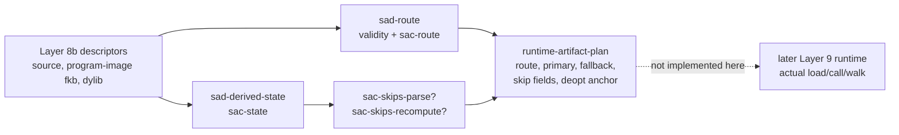

# 2026-07-03 -- runtime artifact plan layer review

## Ground

This layer follows the reviewed source artifact stack:

- `receipts/2026-07-03-core-layer-architecture-map.md`
- `receipts/2026-07-03-source-artifact-cache-layer-review.md`
- `receipts/2026-07-03-source-artifact-descriptor-layer-review.md`
- `form/form-stdlib/source-artifact-cache.fk`
- `form/form-stdlib/source-artifact-descriptor.fk`
- `form/form-stdlib/runtime-artifact-plan.fk`
- `form/form-stdlib/tests/runtime-artifact-plan-band.fk`

This is Layer 9a: the runtime artifact plan face. It is not full Layer 9 native
runtime execution. It consumes descriptor routes and emits an observable plan
row:

- primary action;
- fallback action;
- skip-parse and skip-recompute fields;
- deopt-anchor presence;
- compile-output intent when the plan is source compile.

It does not decide direct `--src` admission, read disk, write/load `.fkb`, load
or call `.dylib`, execute native bytes, verify seals, parse source, or grow
`runtime/fkwu-uni.c`.

## Layer Diagram



## Pre-Review

Grok pre-review verdict: CONDITIONAL PASS. Required corrections:

- call this Layer 9a, not full Layer 9;
- use `runtime-artifact-plan.fk` with prefix `rap-`;
- invalid descriptor shape plans investigate, while valid-shaped stale,
  hash/seal/version failures plan source compile;
- keep `investigate` separate from `sra-route-investigate`;
- derive routes from `sad-route`, not by reimplementing freshness;
- native plans must carry program-image `.fkb` fallback and deopt anchor;
- add a source-runner admission observation row after the band is green.

Claude pre-review verdict: CONDITIONAL. Required corrections:

- seal-bad must plan compile-source, not investigate, because Layer 8b already
  closed bundle quarantine through `sad-route`;
- skip fields must be derived from `sac-skips-parse?` and
  `sac-skips-recompute?`, not restated;
- `no-disk-io`, `no-runtime-load`, and `no-c-seed-growth` belong in the layer
  manifest, not inside plan rows;
- add `no-admission-policy` to make clear this layer does not own Layer 8a
  direct-source admission;
- define fallback action for every plan shape.

## Implementation

`runtime-artifact-plan.fk` adds:

- `runtime-artifact-plan-manifest`;
- action constants:
  - `rap-act-investigate`
  - `rap-act-compile-source`
  - `rap-act-run-program-image`
  - `rap-act-run-native`
  - `rap-act-none`
- `rap-plan`, with fields:
  - route
  - primary action
  - fallback action
  - skip-parse
  - skip-recompute
  - deopt-anchor
  - compile-output
- `rap-plan-from-descriptors`, the public descriptor-first entry point.

Route mapping is:

```text
sad-route-invalid      -> investigate, fallback none
sac-run-source-compile -> compile-source, fallback none
sac-run-fkb            -> run-program-image, fallback compile-source
sac-run-dylib          -> run-native, fallback run-program-image
```

Skip fields and deopt-anchor are not parallel route policy. For valid
descriptor rows, skip fields call `sac-skips-parse?` and
`sac-skips-recompute?` on `sad-derived-state`. Deopt-anchor is the current
program-image `.fkb` readiness from `sac-fkb-ready?`, which is why native plans
cannot appear without a program-image fallback anchor.

## Witness

Layer command:

```sh
./fkwu --src <(cat form/form-stdlib/core.fk \
    form/form-stdlib/source-artifact-cache.fk \
    form/form-stdlib/source-artifact-descriptor.fk \
    form/form-stdlib/runtime-artifact-plan.fk \
    form/form-stdlib/tests/runtime-artifact-plan-band.fk)
```

Layer witness:

```text
runtime-artifact-plan-band      -> 67108863
source-artifact-descriptor-band -> 2147483647
source-artifact-cache-band      -> 1048575
source-runner-admission-band    -> 1048575
git diff --check                -> 0
```

Bit decoding:

```text
1        manifest declares plan-face-not-execution
2        manifest declares derives-from-sad-route
4        manifest declares routing-owned-by-sac
8        manifest declares skips-derived-from-sac
16       manifest declares invalid-investigates
32       manifest declares fkb-fallback-required-for-native
64       manifest declares deopt-anchor-observability
128      manifest declares no-disk-io
256      manifest declares no-runtime-load
512      manifest declares no-admission-policy
1024     manifest declares no-c-seed-growth
2048     manifest declares no-seal-verification
4096     invalid source descriptor investigates, not compile
8192     unknown artifact kind investigates
16384    source-hash mismatch fkb plans compile-source
32768    missing artifacts plan compile-source and do not skip parse
65536    stale/equal mtime boundary maps to compile/source image
131072   fresh fkb plans run-program-image with compile fallback
262144   fresh proven dylib plans native with fkb fallback
524288   unproven and non-callable dylibs plan program-image, not native
1048576  fresh dylib with stale fkb plans compile-source
2097152  seal-bad fkb/dylib quarantine plans compile-source
4194304  source newer than artifacts plans compile-source
8388608  route and skip fields match sad/sac for representative matrix
16777216 compile plan reuses sad/sac compile-output, including nonlowerable
33554432 native plan carries a deopt anchor; no-anchor probe routes non-native
```

### Stall Investigation

The first band implementation stalled after more than a minute and was
interrupted. This was not OOM: `ps` showed `fkwu` running with approximately
2.5 MB RSS. Individual source-level probes returned immediately, including
manifest lookup, invalid descriptor planning, fkb planning, native planning, and
compile-output access.

The second implementation, which bound all plans once inside one large local
`sum` body, still stalled. Prefix-load probes then isolated the stall to the
generic helper:

```text
rapb-route-skip-parity?
```

The helper had an invalid/valid branch with local `let` bindings. Merely
defining that source shape was enough to stall the current source runner; it
did not need to execute. Replacing it with a simpler valid-descriptor helper,
and splitting the band into small bit functions, made the full band return
`67108863` immediately.

This is recorded as a source-shape pressure finding, not ignored. It reinforces
the current practice: keep witnesses helper-shaped and avoid large branchy
local bodies until the source runner's retention/source-shape model is
hardened.

No OOM-killed process occurred during this layer pass.

## Post-Review

Grok post-review verdict: PASS.

Grok re-ran the layer witness and the dependent bands:

```text
runtime-artifact-plan-band      -> 67108863
source-artifact-descriptor-band -> 2147483647
source-artifact-cache-band      -> 1048575
source-runner-admission-band    -> 1048575
```

Grok confirmed that this remains Layer 9a, not full Layer 9 runtime
execution, and that full `.fkb`/`.dylib` load, call, and selector install are
properly deferred.

Claude post-review verdict: PASS.

Claude re-ran:

```text
runtime-artifact-plan-band      -> 67108863
source-artifact-descriptor-band -> 2147483647
source-artifact-cache-band      -> 1048575
source-runner-admission-band    -> 1048575
git diff --check                -> 0
```

Claude verified the pre-review corrections in code:

- the layer is scoped as a plan face, not runtime execution;
- invalid descriptor shape plans `investigate`;
- valid-shaped stale/hash/seal failures plan `compile-source`;
- seal-bad does not investigate;
- skip fields delegate to `sac-skips-parse?` and
  `sac-skips-recompute?`;
- layer-boundary facts stay in the manifest, not plan rows;
- native plans carry `.fkb` fallback and deopt-anchor observability;
- `rap-plan-from-descriptors` is descriptor-first and uses `sad-route`;
- this layer did not add C runtime meaning.

Claude also noted a non-blocking precision issue: the original bit label
`native plan cannot appear without a deopt anchor` overstated what that one bit
alone proves. The stronger guarantee lives structurally in the Layer 8 route
algebra: `sac-dylib-ready?` requires `sac-fkb-ready?`, and Layer 9a derives its
native route and deopt anchor from that state. The band comment and receipt were
therefore tightened to say the witnessed fact directly: a native plan carries a
deopt anchor, and a no-anchor probe routes non-native.

## Alternatives

| Alternative | Disposition | Why |
| --- | --- | --- |
| Claim this is full Layer 9 native runtime | Rejected | This layer emits plan rows only; loading/calling artifacts remains pending. |
| Fold plan rows into `source-artifact-descriptor.fk` | Rejected | Layer 8b owns metadata validation; 9a owns runtime intent vocabulary. |
| Fold plan rows into `source-artifact-cache.fk` | Rejected | The cache layer owns route algebra only. |
| Map seal-bad artifacts to investigate | Rejected | Layer 8b already routes valid-shaped quarantine to source compile. |
| Map invalid descriptors to source compile | Rejected | Malformed metadata is not a cache miss. |
| Put no-disk/no-load flags inside plan rows | Rejected | Those are layer-boundary facts, not facts about future execution. |
| Implement selector in C now | Rejected | Form plan first; C remains a shrink target. |

## Deferred

- Actual program-image `.fkb` loading and walking.
- Actual `.dylib` loading, binding, and calling.
- Runtime selector installation in `fkwu`.
- Disk IO, byte hashing, seal verification, and descriptor probing.
- Source maps and deopt execution beyond the observable deopt-anchor flag.
- C-seed shrink beyond keeping this layer out of C.

## Reflection

Achieved:

- Layer 9a now has a plan language for runtime artifact intent.
- Invalid descriptor shape and valid-shaped stale/quarantine cases stay
  separate: invalid investigates; stale/quarantine compiles source.
- Program-image `.fkb` fallback/deopt anchor is surfaced in native plans.
- Skip fields are delegated to the existing source artifact cache policy.
- The band proves the plan face without claiming actual artifact execution.

Deferred, with why:

- Real execution is deferred because no runtime selector is installed and the
  layer intentionally does not perform disk/native operations.
- Seal/hash verification is deferred because Layer 8b only consumes declared
  descriptor status and the future probe must provide verified rows.
- The source-shape stall is not fixed in the runner here; it is mitigated by
  shaping this witness into small helpers and recorded for future source-runner
  hardening.
