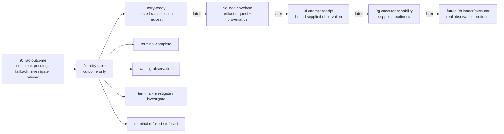

# 2026-07-03 -- runtime artifact retry layer review

## Ground

Layer 9d follows the reviewed runtime artifact stack:

- `receipts/2026-07-03-core-layer-architecture-map.md`
- `receipts/2026-07-03-runtime-artifact-plan-layer-review.md`
- `receipts/2026-07-03-runtime-artifact-selector-layer-review.md`
- `receipts/2026-07-03-runtime-artifact-outcome-layer-review.md`
- `form/form-stdlib/runtime-artifact-plan.fk`
- `form/form-stdlib/runtime-artifact-selector.fk`
- `form/form-stdlib/runtime-artifact-outcome.fk`
- `form/form-stdlib/runtime-artifact-retry.fk`
- `form/form-stdlib/tests/runtime-artifact-retry-band.fk`

Layer 9d is a retry/re-selection face. It consumes Layer 9c
`runtime-artifact-outcome` rows and emits retry rows. Only a 9c
`fallback-available` outcome can become `retry-ready`.

It is not a loader, executor, fallback runner, retry loop, scheduler,
admission gate, or installed `fkwu` selector. It does not consume descriptors
or `rap-plan` rows, read or write disk, load or walk `.fkb`, load or call
`.dylib`, bind symbols, execute native bytes, generate real observations,
reverify seal/proof/callable receipts, decide source-runner admission, or grow
the C seed.

## Layer Diagram



## Pre-Review

Grok pre-review verdict: CONDITIONAL PASS.

Required constraints:

- make pure retry/re-selection Layer 9d and push real loader/executor out of 9d;
- consume only 9c outcome rows;
- do not require the original observation row or descriptor/plan rows;
- allow `retry-ready` only for `fallback-available`;
- guard the pairing table:
  - attempted `run-native`, fallback `run-program-image`
  - attempted `run-program-image`, fallback `compile-source`
- do not infer retry from the prior route alone;
- emit full synthetic `ras-selection` rows for the two known fallback pairings;
- keep the embedded selection's reason as the normal selected reason, with the
  fallback provenance on the retry row;
- prove golden parity against descriptor -> plan -> selector rows so the
  synthetic fallback selections cannot drift silently;
- band hard outcomes and terminal outcomes as no-retry;
- record malformed, corrupt, and unknown pairings as refused or investigate;
- update the architecture map to 9d retry and the later runtime request/executor
  path.

Claude tool-backed pre-review stayed alive with low CPU and moderate memory
while silent, then was interrupted with no review text. This was recorded as a
reviewer-tool wait, not an OOM kill and not a `fkwu` stall.

Claude concise no-tools pre-review verdict: CONDITIONAL PASS.

Required additions:

- carry provenance so a synthetic selection cannot be confused with a 9b-authored
  plan selection;
- verify the 9c outcome schema before claiming outcome-only input is enough;
- state and band that hard statuses with fallback never retry;
- band termination and acyclicity of the native -> program-image ->
  compile-source -> none chain;
- band skip parity with the 9b-selected rows;
- band idempotence: the same outcome yields the same retry row;
- use a name like `waiting-observation`, not a misleading terminal wait, for
  pending outcomes.

The implementation answers the provenance concern by carrying the full source
outcome in the retry row. It does not claim loader-ready artifact identity. The
later 9e load envelope must still rejoin runtime artifact context, 9f must bind
any supplied attempt observation to that envelope, and 9g must name executor
capability readiness before the 9h loader/executor attempts real load or walk.

## Implementation

`runtime-artifact-retry.fk` adds:

- `runtime-artifact-retry-manifest`;
- `rar-no-selection`;
- `rar-retry` rows:
  `("runtime-artifact-retry" source-outcome prior-route prior-attempted fallback next-selection status reason prior-outcome-status prior-outcome-reason)`;
- `rar-retry-from-outcome`.

Retry matrix:

```text
fallback-available, run-native -> run-program-image       -> retry-ready
fallback-available, run-program-image -> compile-source   -> retry-ready
complete                                                   -> terminal-complete
pending-observation                                        -> waiting-observation
investigate                                                -> terminal-investigate
refused                                                    -> terminal-refused
hard observation status                                    -> investigate
unknown/corrupt fallback-available                         -> investigate/refused
malformed outcome                                          -> refused
```

The two synthetic next selections are:

```text
run-program-image: route=sac-run-fkb, fallback=compile-source, skips=1/0
compile-source:    route=sac-run-source-compile, fallback=none, skips=0/0
```

The embedded `ras-selection` uses the ordinary selected reason:

```text
selected-program-image
selected-compile-source
```

The retry row carries the fallback re-selection reason:

```text
fallback-reselected-program-image
fallback-reselected-compile-source
```

## Witness

Layer command:

```sh
./fkwu --src <(cat form/form-stdlib/core.fk \
    form/form-stdlib/source-artifact-cache.fk \
    form/form-stdlib/source-artifact-descriptor.fk \
    form/form-stdlib/runtime-artifact-plan.fk \
    form/form-stdlib/runtime-artifact-selector.fk \
    form/form-stdlib/runtime-artifact-outcome.fk \
    form/form-stdlib/runtime-artifact-retry.fk \
    form/form-stdlib/tests/runtime-artifact-retry-band.fk)
```

Layer witness:

```text
runtime-artifact-retry-band -> 2147483647
```

Bit decoding:

```text
1          manifest declares retry-face-not-execution
2          manifest declares consumes-rao-outcome-only
4          manifest declares total-retry-row
8          manifest declares fallback-available-only-retries
16         manifest declares hard-outcomes-do-not-retry
32         manifest declares synthetic-fallback-selection-not-from-plan
64         manifest declares known-pairing-table-only
128        manifest declares retry-row-carries-source-outcome
256        manifest declares no-descriptor-consumption
512        manifest declares no-rap-plan-consumption
1024       manifest declares no-observation-generation
2048       manifest declares no-runtime-load-walk-call-exec
4096       manifest declares no-fallback-execution-or-retry-loop
8192       manifest declares no-admission-policy
16384      manifest declares no-seal-proof-callable-reverify
32768      manifest declares no-c-seed-growth-or-selector-install
65536      complete outcome is terminal-complete with no next selection
131072     pending outcome waits with no next selection
262144     investigate/refused terminal outcomes propagate with no next selection
524288     all hard outcomes do not retry
1048576    native soft fallback creates program-image selection request
2097152    program-image soft fallback creates compile-source selection request
4194304    fallback-available is not execution or completion
8388608    malformed/listless outcome refuses
16777216   unknown outcome status investigates
33554432   corrupt fallback-available does not retry
67108864   unknown fallback pairing, including compile-source end-of-ladder, investigates
134217728  synthetic next selections match descriptor -> plan -> selector rows
268435456  same outcome yields same retry row
536870912  hand-built outcome retries without descriptor or plan input
1073741824 retry row shape is fixed and carries source-outcome provenance
```

## Red Signals And Investigations

No OOM-killed process occurred during this layer pass. No `fkwu` stall
occurred. Claude's tool-backed and concise pre-review runs both waited while
alive with low CPU and moderate memory; each was interrupted and recorded as
reviewer-tool wait behavior. The concise run returned a conceptual review after
interruption and is recorded as such, not as a tool-backed workspace review.

The first `runtime-artifact-retry-band` run returned `2147483647`.

## Deferred

- Real `.fkb` loading and walking.
- Real `.dylib` loading, symbol binding, calling, dispatch, invoke/return, and
  native execution.
- Real runtime observation generation.
- Runtime selector installation in `fkwu`.
- Fallback execution and retry-loop scheduling.
- Artifact identity rejoin for real loading.
- Source-map/deopt execution and compile-output use.
- Descriptor route derivation and `rap-plan` consumption.
- Disk IO, byte hashing, seal/proof/callable reverification, and
  direct-source admission coupling.
- Actual investigation workflows after retry status is `investigate`.

## Post-Review

Grok post-review verdict: PASS.

Grok re-ran the 9d witness and checked the six blocker questions:

- 9d consumes only 9c outcome rows;
- `retry-ready` appears only for `fallback-available` with the two known
  pairings;
- hard outcomes and corrupt `fallback-available` rows do not retry;
- embedded `ras-selection` rows match descriptor -> plan -> selector reference
  selections field-for-field;
- `fallback-available` remains a retry request, not execution or success;
- the receipt honestly records deferred work, reviewer-tool waits, no
  OOM/`fkwu` stall, and the loader/executor move past 9e into the later runtime
  producer after the load-envelope and attempt-receipt split.

Claude post-review verdict: PASS.

Claude's tool-backed post-review stayed alive at low CPU and moderate memory
while silent, then was interrupted and recorded as reviewer-tool wait behavior.
A concise no-tools post-review returned PASS. It confirmed that the retry-ready
gate is conjunctive, terminal/pending outcomes emit no next selection, the
degradation ladder is acyclic, and the redundant hard-status check is the right
cross-layer contract rather than dead code.

Claude's non-blocking end-of-ladder note was accepted: the unknown-pairing bit
now also proves attempted `compile-source` with a fallback still investigates
and emits no next selection.

Final verification:

```text
ground.fk                         -> 42
ground-recursive.fk 10            -> 55
binary-freshness-band             -> 15
native-vs-rented-check            -> 11111
source-artifact-cache-band        -> 1048575
source-artifact-descriptor-band   -> 2147483647
runtime-artifact-plan-band        -> 67108863
runtime-artifact-selector-band    -> 2147483647
runtime-artifact-outcome-band     -> 2147483647
runtime-artifact-retry-band       -> 2147483647
source-runner-admission-band      -> 1048575
git diff --check                  -> clean
```
