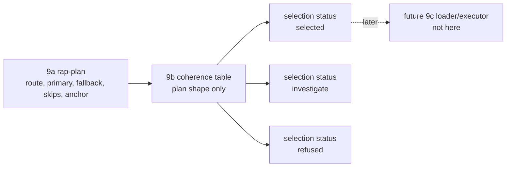

# 2026-07-03 -- runtime artifact selector layer review

## Ground

Layer 9b follows the reviewed source artifact stack:

- `receipts/2026-07-03-core-layer-architecture-map.md`
- `receipts/2026-07-03-runtime-artifact-plan-layer-review.md`
- `form/form-stdlib/source-artifact-cache.fk`
- `form/form-stdlib/source-artifact-descriptor.fk`
- `form/form-stdlib/runtime-artifact-plan.fk`
- `form/form-stdlib/runtime-artifact-selector.fk`
- `form/form-stdlib/tests/runtime-artifact-selector-band.fk`

Layer 9b is a plan-coherence selector face. It consumes 9a `rap-plan` rows and
emits total selection rows:

```text
coherent execution intent -> selected
upstream investigate plan  -> investigate
incoherent readable plan   -> investigate
malformed unreadable plan  -> refused
```

It is not runtime execution and not an installed `fkwu` selector. It does not
derive routes from descriptors, read or write disk, load or walk `.fkb`, load or
call `.dylib`, resolve symbols, execute native bytes, reverify seals/proofs or
callable receipts, decide source-runner admission, or grow the C seed.

## Layer Diagram



## Pre-Review

Grok pre-review verdict: CONDITIONAL PASS.

Required corrections:

- call this Layer 9b, not full Layer 9 native runtime;
- use `runtime-artifact-selector.fk` with prefix `ras-`;
- expose a single plan-first entry, `ras-selection-from-plan`;
- consume `rap-plan` rows only; descriptor-to-plan composition may appear in
  the band, but selector policy must not call `sad-route` or rederive routes;
- keep malformed rows as `refused`, incoherent readable plans as
  `investigate`, and upstream primary `investigate` as `investigate`, not
  `selected`;
- do not require compile-source selection to carry a deopt anchor;
- keep `rap-act-investigate` separate from source-runner admission routes;
- emit a total selection row for every input shape;
- do not load/call artifacts, verify seals, recheck proof/callable rows, decide
  direct-source admission, install a selector in C, or grow the C seed.

Claude tool-backed pre-review started grounding in the architecture map and
9a plan layer, then stayed silent for several minutes while alive, low-CPU, and
light-memory. It was interrupted as a reviewer-tool wait, not an OOM kill and
not a `fkwu` stall.

Claude no-tools pre-review verdict: CONDITIONAL PASS.

Additional requirements:

- make malformed vs incoherent explicit: unreadable/missing-field/wrong-shape
  plans are refused; readable but contradictory plans investigate;
- distinguish upstream investigate from selector-discovered incoherence in the
  reason field;
- make compile-source with `deopt-anchor=1` incoherent and band it;
- keep fallback single-step and do not synthesize fallback chains;
- prove the selector consumes only plan rows by using hand-built plan rows that
  do not come from descriptors;
- verify the `ras-` prefix before landing.

`rg` found no existing `runtime-artifact-selector` file before this layer.

## Implementation

`runtime-artifact-selector.fk` adds:

- `runtime-artifact-selector-manifest`;
- status strings:
  - `selected`
  - `investigate`
  - `refused`
- reason strings for selected native/program-image/compile-source, upstream
  investigate, malformed plan, incoherent native/program-image/compile-source,
  incoherent investigate, unknown primary, and route mismatch;
- `ras-selection` rows:
  `("runtime-artifact-selection" route selected fallback status skip-parse skip-recompute reason)`;
- `ras-selection-from-plan`, which validates a `rap-plan` row without
  rederiving descriptor routes.

Coherence rules:

```text
run-native        requires route=dylib, fallback=run-program-image, skips=1/1, deopt-anchor=1
run-program-image requires route=fkb, fallback=compile-source, skips=1/0, deopt-anchor=1
compile-source    requires route=source-compile, fallback=none, skips=0/0, deopt-anchor=0
investigate       requires route=invalid, fallback=none, skips=0/0, deopt-anchor=0
```

Unknown readable primary actions investigate. Route mismatches investigate.
Malformed unreadable rows refuse.

## Witness

Layer command:

```sh
./fkwu --src <(cat form/form-stdlib/core.fk \
    form/form-stdlib/source-artifact-cache.fk \
    form/form-stdlib/source-artifact-descriptor.fk \
    form/form-stdlib/runtime-artifact-plan.fk \
    form/form-stdlib/runtime-artifact-selector.fk \
    form/form-stdlib/tests/runtime-artifact-selector-band.fk)
```

Layer witness:

```text
runtime-artifact-selector-band -> 2147483647
```

Bit decoding:

```text
1          manifest declares selection-face-not-execution
2          manifest declares consumes-rap-plan-only
4          manifest declares plan-coherence-gate
8          manifest declares no-descriptor-route-derivation
16         manifest declares total-selection-row
32         manifest declares selected-investigate-refused-statuses
64         manifest declares malformed-refused-incoherent-investigates
128        manifest declares no-disk-io
256        manifest declares no-runtime-load
512        manifest declares no-native-execution
1024       manifest declares no-seal-verification
2048       manifest declares no-proof-callable-reverify
4096       manifest declares no-admission-policy
8192       manifest declares no-c-seed-growth
16384      manifest declares no-fkwu-selector-install
32768      manifest declares no-route-rederivation
65536      malformed plan is refused
131072     coherent native plan selects run-native
262144     coherent fkb plan selects run-program-image
524288     coherent compile-source plans select compile-source
1048576    upstream investigate plan remains investigate, not selected
2097152    incoherent native plan investigates
4194304    incoherent fkb plan investigates
8388608    incoherent compile-source plan investigates
16777216   unknown primary investigates
33554432   selected rows preserve skip fields from plan
67108864   representative descriptor -> plan -> selection matrix has expected outcomes
134217728  hand-built plan selects without descriptor derivation
268435456  route mismatch, including shape-alien route fields, investigates
536870912  fallbacks stay single-step
1073741824 selection row shape is fixed and does not carry compile-output
```

## Red Signals And Investigations

No OOM-killed process occurred during this layer pass. No `fkwu` stall
occurred. Claude's tool-backed pre-review stayed alive, low-CPU, and
light-memory while silent; it was interrupted and recorded as reviewer-tool
wait behavior.

The first `runtime-artifact-selector-band` run returned `2147483647`.

## Deferred

- Actual `.fkb` loading/walking remains future Layer 9 runtime work.
- Actual `.dylib` loading, binding, symbol resolution, dispatch, invoke/return,
  and native execution remain future runtime work.
- Installed `fkwu` startup selector remains deferred.
- Disk IO, artifact byte hashing, seal/proof/callable reverification, and
  direct-source admission coupling remain outside this layer.
- Source-map/deopt execution remains future work. 9b only validates the
  deopt-anchor flag already carried by the plan.

## Post-Review

Grok post-review verdict: PASS.

Grok checked plan-only consumption, malformed-vs-incoherent routing, upstream
investigate preservation, compile-source/deopt-anchor incoherence, forbidden
runtime mechanisms, and receipt honesty. It found no required changes. One
non-blocking wording note was accepted: the architecture diagram's selector
label now says `plan coherence + status`, not `freshness + proof gates`, so 9b
does not appear to own gates already proved below it.

Claude post-review verdict: PASS.

Claude independently grounded in the selector, band, receipts, and upstream
9a/8x layers. It found no required changes. It did note that the broader
working tree contains an unrelated `runtime/fkwu-uni.c` diff, so the 9b layer
must remain commit-scoped away from any C growth claim. It also suggested a
small distillation row for a shape-alien route field; the route-mismatch bit now
covers `(rap-plan (list 3) ...) -> investigate/route-mismatch` inside the same
band bit.

Final verification:

```text
ground.fk                         -> 42
ground-recursive.fk 10            -> 55
binary-freshness-band             -> 15
native-vs-rented-check            -> 11111
source-artifact-cache-band        -> 1048575
source-artifact-descriptor-band   -> 2147483647
runtime-artifact-plan-band        -> 67108863
source-artifact-identity-band     -> 2147483647
source-artifact-seal-band         -> 2147483647
source-artifact-proof-band        -> 2147483647
source-artifact-callable-band     -> 2147483647
runtime-artifact-selector-band    -> 2147483647
source-runner-admission-band      -> 1048575
git diff --check                  -> clean
```
