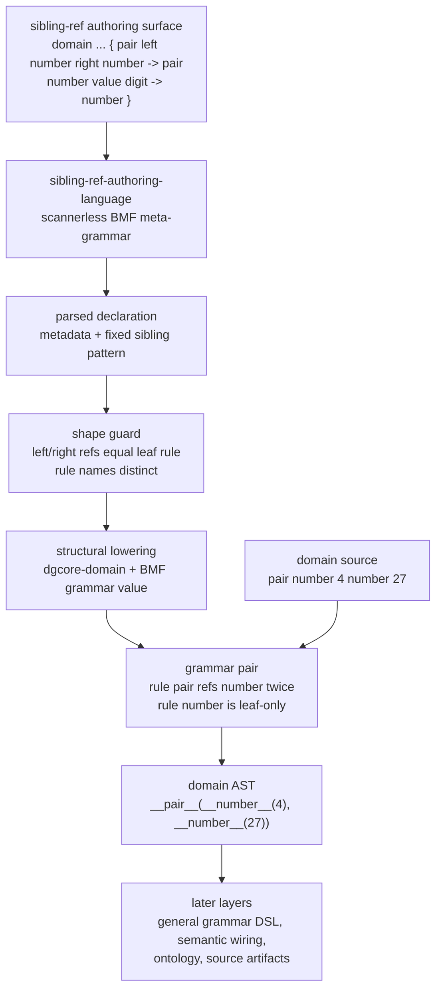

# 2026-07-03 -- sibling-ref authoring language layer review

## Ground

This is a Layer 5 authoring rung above `grammar-authoring-language` and
`domain-grammar-core`:

- `form/form-stdlib/sibling-ref-authoring-language.fk`
- `grammars/sibling-ref-authoring-language.fk`
- `form/form-stdlib/tests/sibling-ref-authoring-language-band.fk`

It does not replace the earlier one-rule authoring layer and does not widen the
closed `grammar-authoring-language` contract.

The required checkout witnesses were green before this implementation pass:

```text
ground.fk                    -> 42
ground-recursive.fk 10       -> 55
binary-freshness-band.fk     -> 15
native-vs-rented-check       -> 11111
```

## Why This Layer Exists

The previous authoring surface removed one hand-written BMF constructor tree:

```text
domain ... { return value digit -> prog-return }
```

That proved the first non-Form authored grammar value, but it still left the
next common grammar shape at raw constructor level: one start rule that depends
on one sibling leaf rule. This layer admits that shape without exposing a
general `ref` language to the author:

```text
domain programming family programming-language semantic semantic-stdlib
  evidence compiler-proof residue syntax-semantic-residue lower form-recipe {
    pair left number right number -> pair
    number value digit -> number
  }
```

The authored text lowers structurally to:

- one `dgcore-domain`;
- one BMF grammar value;
- start rule `pair`;
- leaf rule `number`;
- two internal captures around `p-ref "number"`;
- no Form source text emission.

The resulting grammar parses:

```text
pair number 4 number 27 -> __pair__(__number__(4), __number__(27))
```

The important point is that BMF already had the capability. This layer names
one safe authoring shape over it, instead of growing the evaluator or C seed.

## Layer Diagram



## Pre-Review

Grok first pre-reviewed an exactly-two-rule authoring rung and returned `PASS`
with boundary corrections:

- make this a separate module and receipt, not a mutation of
  `grammar-authoring-language`;
- keep the layer at Layer 5 authoring, not semantic Layer 6;
- preserve a slim prelude and avoid ontology/source compiler/artifact claims;
- avoid a general `ref`/`alt`/`rep`/`sep` DSL;
- prove full-source parse, malformed/trailing failures, copy integrity, and
  adjacent bands.

Claude then reviewed the same next step and returned `PASS` with a sharper
correction: the better next rung is not two unrelated rules, but a bounded
sibling-ref shape. Claude required:

- rule one structurally references rule two;
- rule two is leaf-only;
- duplicate rule names fail before lowering;
- nested slot readers descend nodes instead of assuming string leaves;
- reuse `gal-emit-tag`;
- no evaluator guard or C growth.

That introduced a real reviewer fork because Grok had warned against general
`p-ref` scope drift. A follow-up Grok review of the bounded sibling-ref variant
returned `PASS`, provided:

- the layer stays separate;
- the authoring surface does not expose `ref`, `alt`, `rep`, or `sep`;
- the one structural template is manifest-locked;
- the internal `p-ref` is produced only by lowering;
- the receipt explicitly says this is not a general grammar DSL.

Claude initially took several minutes with no output. That was investigated,
not ignored: the process was alive, around 428 MB RSS, then sampled in
`kevent64`/Bun event waits rather than CPU or memory pressure. It later returned
normally. No OOM/killed process occurred.

## What Changed

Both mirrored files define:

- `sibling-ref-authoring-language-manifest`;
- `sibling-ref-authoring-language-grammar`;
- `sral-parse`, a full-source parser that rejects trailing sediment;
- metadata readers for domain, family, semantic lane, evidence lane, residue
  policy, and lower target;
- start-rule readers for literal, left capture, left leaf, right capture, right
  leaf, and emit slug;
- leaf-rule readers for literal, capture, run class, and emit slug;
- `sral-valid?`, which rejects duplicate rule names and mismatched sibling
  references before lowering;
- `sral-lower-grammar`, which structurally builds a BMF grammar value with one
  internal sibling `p-ref`;
- `sral-lower-domain`, reusing `dgcore-domain`;
- `sral-register-lowered`, reusing `grammar-loader`.

`form/form-stdlib/source-runner-admission.fk` now records
`sibling-ref-authoring-language-band` as a current green observation. The
admission band mask did not change.

## Witness

```sh
./fkwu --src <(cat form/form-stdlib/core.fk \
    form/form-stdlib/bmf-core.fk \
    form/form-stdlib/bmf-grammar.fk \
    form/form-stdlib/grammar-loader.fk \
    form/form-stdlib/domain-grammar-core.fk \
    form/form-stdlib/grammar-authoring-language.fk \
    form/form-stdlib/sibling-ref-authoring-language.fk \
    form/form-stdlib/tests/sibling-ref-authoring-language-band.fk)
```

```text
2147483647
```

Bit decoding:

```text
1           manifest declares scannerless
2           manifest declares bmf-cursor-grammar
4           manifest declares no-line-grammar
8           manifest declares no-tokenizer
16          manifest declares not-s-expression-surface
32          manifest declares not-form-cell-authoring
64          manifest declares exactly-two-rules
128         manifest declares fixed-sibling-pattern
256         manifest declares leaf-second-rule
512         manifest declares internal-ref-only
1024        manifest declares no-general-ref-surface
2048        manifest declares metadata-only-lanes
4096        manifest declares grammar-value-lowering
8192        canonical declaration parses
16384       domain name reads programming
32768       family reads programming-language
65536       metadata lanes read from declaration
131072      start rule fields read pair/left/number/right/number
262144      emit and leaf fields read pair/number/value/digit/number
524288      lowering succeeds
1048576     lowered descriptor is dgcore-domain shape
2097152     lowered grammar start is pair
4194304     lowered grammar has exactly two rules
8388608     lowered descriptor registers under programming
16777216    registered grammar parses parent tag __pair__
33554432    left nested node is __number__(4)
67108864    right nested node is __number__(27)
134217728   authored grammar has behavioral parity with a hand-built grammar
268435456   trailing, malformed, and no-space arrow variants fail
536870912   duplicate rule names and mismatched sibling refs fail validation
1073741824  whitespace-tolerant declaration variant parses
```

Adjacent witnesses:

```text
grammar-authoring-language-band     -> 134217727
domain-grammar-core-band            -> 268435455
grammar-loader-band                 -> 65535
source-runner-admission-band        -> 1048575
sibling-ref authoring copy cmp      -> 0
```

## What This Does Not Prove

- It does not remove direct Form from implementation files.
- It does not expose a general `ref`, `alt`, `rep`, or `sep` authoring DSL.
- It does not support arbitrary N-rule grammars, precedence, separators,
  optional terms, nested templates, or typed captures.
- It does not register `defdata-language`, `form-definition-language`, NL, DNA,
  physics, chemistry, biology, astronomy, math, or other domain grammar files
  through `domain-grammar-core`.
- It does not call `semantic-stdlib`; semantic/evidence/residue fields remain
  descriptor metadata cargo.
- It does not load ontology, lower to Form source, compile `.fk`, write `.fkb`,
  include `.tbl`, or produce `.dylib`.
- It does not add evaluator recursion guards. The safety is the manifest-locked
  shape: rule two is leaf-only, and rule one has exactly two internal refs to it.

## Alternatives

| Alternative | Disposition | Why |
| --- | --- | --- |
| Extend `grammar-authoring-language` in place | Rejected | It would break the closed one-rule contract and its band. |
| Two independent authored rules | Deferred | It is useful, but sibling-ref proves the higher shape already held by BMF. |
| General author-visible `ref` DSL | Rejected for this layer | It would reopen all graph, recursion, and progress questions at once. |
| Add evaluator recursion/depth guards | Rejected | No new mechanism is needed for this fixed shape, and C growth violates the shrink target. |
| Lower to Form source text | Rejected | This layer builds BMF values structurally and does not claim a source compiler route. |
| Load semantic stdlib or ontology | Rejected | The layer authors grammar shape; semantic interpretation is later. |

## Deferred

- A general grammar authoring language with named refs, alternatives,
  repetitions, separators, captures, and templates.
- More than two authored rules.
- Multi-domain grammar catalogs and registration of existing language layers.
- Learned grammar induction from `grammar-from-thought`.
- Live semantic-stdlib translation, ontology integration, and source compiler
  integration.
- `.fkb`, `.tbl`, and `.dylib` artifact routes.

## Post-Review

Grok post-reviewed the implemented layer, mirrored copy, band, admission row,
and receipt read-only. It returned `PASS` with no code or receipt blockers.
Grok confirmed:

- the layer is separate and does not mutate `grammar-authoring-language`;
- the fixed sibling-ref pattern is locked by manifest and parser shape;
- rule two is leaf-only;
- `ref`, `alt`, `rep`, and `sep` are not author-visible;
- `p-ref` appears only inside structural lowering;
- semantic stdlib, ontology, source compiler, `.fkb`, and `.dylib` are not
  claimed by the layer;
- the admission row records a green observation without changing the admission
  policy mask.

Claude post-reviewed the same files read-only and returned `PASS` with no code
or receipt blockers. Claude independently re-ran the key witnesses:

```text
sibling-ref-authoring-language-band -> 2147483647
grammar-authoring-language-band     -> 134217727
source-runner-admission-band        -> 1048575
sibling-ref authoring copy cmp      -> identical
git diff --check                    -> clean
```

Claude also checked the C boundary: the existing uncommitted
`runtime/fkwu-uni.c` diff belongs to prior source-runner work and contains no
`sibling`, `sral`, or authoring fingerprints from this layer.

Non-blocking future improvement: Claude probed `(sral-valid? (sral-parse
"garbage"))` and observed `0`. That path is clean, but a future band can add an
explicit bit for parse-fail validation rather than relying on the manual probe.

No OOM-killed process occurred during this layer pass.
