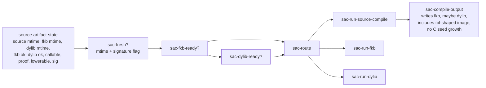

# 2026-07-03 -- Source artifact cache layer review

## Ground

This layer follows the reviewed core architecture map:

- `receipts/2026-07-03-core-layer-architecture-map.md`
- `form/form-stdlib/source-artifact-cache.fk`
- `form/form-stdlib/tests/source-artifact-cache-band.fk`

The layer language is not a parser, not a domain grammar, and not a live host
loader. It is a route policy language for source-owned execution artifacts:

- source remains canonical
- program-image `.fkb` is the target parsed-image cache
- `.dylib` is the target native cache after proof
- stale/missing artifacts route back to source compile
- the temporary C seed must not grow to hide the boundary

This receipt treated `source-artifact-cache.fk` as a draft implementation until
Grok and Claude reviewed it against this layer boundary. Their required
corrections are now applied; post-review remains pending.

## Layer Diagram



This diagram is policy over synthetic state rows. It does not claim that
`fkwu` already checks disk artifacts at startup, loads a program-image `.fkb`,
or calls a `.dylib`.

## Abstraction

The layer's abstraction is a small decision algebra:

- readiness predicates: `sac-fresh?`, `sac-fkb-ready?`, `sac-dylib-ready?`
- route decisions: `sac-run-source-compile`, `sac-run-fkb`, `sac-run-dylib`
- route query helpers: `sac-skips-parse?`, `sac-skips-recompute?`
- compile-output policy: `sac-compile-output`
- observable manifest: `source-artifact-cache-manifest`

The important language choice is that artifact routing is expressed as data and
pure decision functions first. The host/compiler layer later has to satisfy
this route with real files and proof gates.

## Pre-Review

Claude reviewed the architecture map, layer receipt, implementation, and band
read-only. Its verdict was conditional accept: this is the correct next layer
and the decision algebra is internally sound, but the manifest had to be
renamed so program-image `.fkb` policy does not collapse back into the already
proven parsed-data `.fkb` cache story. Claude also required the receipt to name
the intentional divergence from the architecture diagram: `sac-dylib-ready?`
requires a current program-image `.fkb` before a `.dylib` can win, so the native
route never strands the runtime without a parsed-image fallback.

Grok independently reviewed the same files read-only and also returned
conditional accept. Grok's required correction matched Claude's: rename
`fkb-parsed-cache` to explicit program-image vocabulary and update the band and
receipt. Grok also recommended either adding manifest bits for the previously
unwitnessed manifest features or documenting that gap.

Corrections applied before closure:

- `fkb-parsed-cache` -> `program-image-fkb-cache`
- `fkb-includes-tbl` -> `program-image-includes-tbl`
- `mtime-freshness` -> `mtime-signature-freshness`
- added a source comment documenting why `.dylib` readiness requires a current
  program-image `.fkb`
- widened the band to witness all manifest features
- added a band case proving a fresh/proven `.dylib` with stale `.fkb` routes to
  source compile, not native

## Implementation

`source-artifact-cache.fk` defines:

- a queryable manifest
- synthetic artifact state rows
- mtime/signature freshness
- `.fkb` readiness
- `.dylib` readiness gated by `.fkb` readiness, callable status, and native
  proof
- route selection, preferring dylib, then fkb, then source compile
- compile-output policy, always writing `.fkb`, writing `.dylib` only when
  lowerable and native-proofed, carrying a table-shaped image flag, and carrying
  no-C-growth

The source header now explicitly says this is a policy contract over synthetic
state rows. It does not read disk artifacts, run a program-image `.fkb`, or load
a `.dylib`.

## Witness

Layer band:

```sh
./fkwu --src <(cat form/form-stdlib/core.fk \
    form/form-stdlib/source-artifact-cache.fk \
    form/form-stdlib/tests/source-artifact-cache-band.fk)
```

```text
2097151
```

Bit decoding:

```text
1      manifest declares source-authority
2      manifest declares program-image-fkb-cache
4      manifest declares program-image-includes-tbl
8      manifest declares dylib-native-cache
16     policy: fresh program-image fkb routes to parsed image
32     stale fkb routes to source compile
64     policy: fresh verified dylib wins over fkb
128    dylib without native proof falls back to fkb
256    missing fkb routes to source compile
512    compile output writes fkb
1024   compile output writes dylib only when lowerable and proven
2048   compile output carries the tbl-shaped parsed image
4096   equal mtime is fresh
8192   source-newer invalidates fkb and dylib
16384  policy: fresh fkb would skip source parse
32768  policy: fresh dylib would skip recompute
65536  manifest declares mtime-signature-freshness
131072 manifest declares compile-on-stale
262144 manifest declares no-c-seed-growth
524288 policy: dylib cannot win without a ready program-image fkb
1048576 policy: sig-ok=0 invalidates otherwise fresh artifacts
```

Bits `1` through `8` and `65536` through `262144` are manifest checks. Bits
`16` through `32768`, `524288`, and `1048576` are route and output policy
checks over synthetic state rows.

## Alternatives

| Alternative | Disposition | Why |
| --- | --- | --- |
| Grow `FK_AST_NODE_CAP` | Rejected | This grows the temporary C seed and hides source-shape pressure. |
| Keep shrinking domain files around `--src` | Rejected as architecture | Useful for local witnesses, but not the runtime destination. |
| Claim `.fkb` program-image loading now | Rejected | Current proof is parsed-data/image caching, not default program parse skipping. |
| Claim `.dylib` runtime selection now | Rejected | Existing receipts model/partially witness the carrier path; integrated runtime selector is pending. |
| Use mtime-only forever | Deferred | Current parsed-data cache proves mtime; target program artifacts need stronger hash/signature/proof metadata. |
| Build selector in C now | Rejected for this layer | The policy must be clear in Form first; C remains a shrink target. |
| Let `.dylib` win without a current `.fkb` | Rejected for this policy | Native route should not strand the runtime without a current parsed-image fallback/deopt anchor. |

## Deferred

- Real disk-backed selector: source path -> choose fresh `.dylib`, fresh
  program-image `.fkb`, or compile source.
- Program-image `.fkb` format/admission that actually skips current source
  parsing.
- Self-derived `.tbl`/program-image emission without bin-go provenance.
- Native `.dylib` load/call integration in the checkout witness without
  expanding the C seed as the permanent home.
- Strong artifact identity: hash/signature/version/source-map/proof metadata.
- Historical `--src`/`let` divergence and `form-ontology-loader.fk` AST
  pressure are no longer current blockers for this policy layer; they were
  closed later by the source-runner read-completeness, module-constant,
  Form-owned core-`bp`, and root-`do` repairs. This layer still only names the
  artifact route; it does not implement disk-backed loading.

## Post-Review

Claude post-reviewed the corrected implementation, receipt, architecture map,
and band read-only. It reproduced the witness:

```text
2097151
```

Claude accepted the layer as the implemented Form policy contract. It verified
that the pre-review corrections landed, including program-image `.fkb`
vocabulary, manifest coverage, and the explicit `.dylib`-requires-current-fkb
fallback rule. A 2026-07-04 follow-up then closed Claude's named residual risk:
the band now proves `sig-ok = 0` invalidates otherwise mtime-fresh `.fkb` and
`.dylib` artifacts by routing to source compile.

Grok also post-reviewed read-only, ran a fresh witness, and accepted the layer
as implemented policy. Grok found no technical blockers and confirmed that the
layer does not claim live disk selection, program-image loading, or `.dylib`
runtime dispatch. Grok agreed that the band is sufficient for the policy layer,
not sufficient for the later disk selector/runtime layers.

## Reflection

Achieved:

- Layer 8 now has a reviewed, layer-appropriate policy language:
  source-owned artifact state, readiness predicates, route decisions, and
  compile-output policy.
- The manifest and band now distinguish target program-image `.fkb` from the
  already-proven parsed-data `.fkb` cache.
- The band returns `2097151`, proving all declared manifest features plus route
  behavior over synthetic state rows.
- The `.dylib` route is deliberately conservative: it cannot win unless the
  program-image `.fkb` is current too, preserving a parsed-image fallback/deopt
  anchor.
- The negative signature case is now witnessed: an otherwise fresh, ok,
  callable, proven state with `sig-ok = 0` routes to source compile.

Deferred, with why:

- Real disk selector: deferred because this layer is the policy algebra only;
  filesystem admission belongs to the host/compiler layer.
- Program-image `.fkb` load path: deferred because current evidence proves
  parsed-data/image roundtrips, not default program parse skipping.
- `.dylib` load/call path: deferred because current receipts model and partially
  witness the carrier; integrated runtime dispatch is not live here.
- Strong artifact identity: deferred because the current layer only carries a
  `sig-ok` flag. Later admission layers must replace that placeholder with real
  hash/signature/version/source-map/proof metadata.
- `--src`/`let` divergence and `form-ontology-loader.fk` AST pressure: closed
  by later source-runner repairs, not by this artifact-cache layer. The cache
  policy remains the route language for future program-image and native
  artifacts.

Layer 8 closes only as the source artifact cache policy contract. It does not
close the disk-backed selector, program-image loader, native `.dylib` runtime,
or C-seed shrink.
