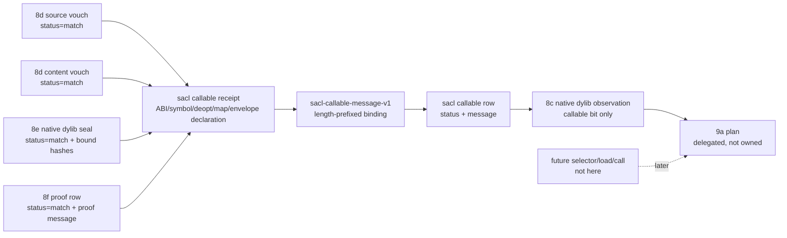

# 2026-07-03 -- source artifact callable layer review

## Ground

Layer 8g follows the reviewed artifact stack:

- `receipts/2026-07-03-core-layer-architecture-map.md`
- `form/form-stdlib/source-artifact-cache.fk`
- `form/form-stdlib/source-artifact-descriptor.fk`
- `form/form-stdlib/runtime-artifact-plan.fk`
- `form/form-stdlib/source-artifact-probe.fk`
- `form/form-stdlib/source-artifact-identity.fk`
- `form/form-stdlib/source-artifact-seal.fk`
- `form/form-stdlib/source-artifact-proof.fk`
- `form/form-stdlib/source-artifact-callable.fk`
- `form/form-stdlib/tests/source-artifact-callable-band.fk`

Layer 8g is a structural callable-receipt face for sealed and proven native
dylib identity. It consumes 8d `sai-*` vouch rows, 8e `sas-*` seal rows, and
8f `sapr-*` proof rows directly. A matching receipt may set only the native
dylib `callable` bit in 8c observations.

The central rule is:

```text
callable=1 means receipt admitted for this proven sealed native dylib identity
callable=1 != symbol resolved != dlopen/dlsym != dispatch != invoke/return
callable=1 != memory-envelope proof != source-map/deopt content proof
callable=1 != native execution != runtime selector
```

## Layer Diagram



## Pre-Review

Grok pre-review verdict: CONDITIONAL PASS.

Required corrections:

- implement 8g after 8f and before runtime selector, load/call, or compiler
  emission;
- use `source-artifact-callable` with `sacl-` prefix unless a better fresh
  prefix is justified;
- set `callable=1` only to mean "structural callable receipt admitted for this
  proven sealed native dylib identity";
- consume `sai-*`, `sas-*`, and `sapr-proof-row` directly, never collapsed
  observation fields;
- scope callable admission to native dylib receipts only;
- introduce `unproven` as a distinct status when vouch/seal rows match but the
  proof row does not;
- bind identity, seal, artifact bit, proof message, entry symbol, ABI name,
  arity, calling/result conventions, deopt-anchor presence, source-map
  presence, declarative memory-envelope status, and witness counts in a
  length-prefixed `sacl-v1` message;
- treat memory-envelope and source-map fields as declarations only;
- never load/call a dylib, resolve symbols, execute native bytes, hash binary
  files, write caches, emit compiler artifacts, install a selector, fork route
  algebra, change source-runner admission, verify memory-envelope bands, prove
  source-map/deopt content, or set lowerable.

Claude pre-review was attempted twice: one tool-backed prompt and one concise
no-tools prompt. Both stayed silent for several minutes while `ps` showed the
process alive, low-CPU, and light-memory. They were interrupted and recorded as
reviewer-tool waits, not OOM kills and not `fkwu` stalls.

## Implementation

`source-artifact-callable.fk` adds:

- `source-artifact-callable-manifest`;
- `sacl-callable-message-v1`, a length-prefixed canonical callable receipt
  message;
- `sacl-callable-receipt` rows:
  `("source-artifact-callable-receipt" kind version path source-hash content-hash seal-value artifact-bit proof-message entry-symbol abi-name arity calling-convention result-convention deopt-anchor-present source-map-present memory-envelope-status min-witnesses witness-count)`;
- ABI-name shape for `sysv`, `win64`, and `aarch64-darwin`;
- memory-envelope status tags `match`, `declared`, `mismatch`, and `absent`,
  with callable admission requiring `match`;
- status values for `match`, `mismatch`, `malformed`, `unvouched`,
  `unsealed`, `unproven`, `insufficient-witness`, and `role-refused`;
- `sacl-admit-callable`, which admits only native dylib receipts whose source
  vouch, content vouch, seal row, proof row, proof message binding, callable
  receipt binding, declarative memory-envelope status, and witness count all
  match;
- `sacl-native-dylib-observation-from-callable`, which enriches an 8c native
  dylib observation with source hash, content hash, seal bit, proof bit, and
  callable bit while passing lowerable through unchanged.

Zero-arity native entry points are allowed by shape as explicit ABI metadata:
`arity >= 0`. The current band uses arity `2`.

## Witness

Layer command:

```sh
./fkwu --src <(cat form/form-stdlib/core.fk \
    form/form-stdlib/str-byte-at.fk \
    form/form-stdlib/sha256.fk \
    form/form-stdlib/hex.fk \
    form/form-stdlib/hmac-sha256.fk \
    form/form-stdlib/form-fs.fk \
    form/form-stdlib/source-artifact-cache.fk \
    form/form-stdlib/source-artifact-descriptor.fk \
    form/form-stdlib/runtime-artifact-plan.fk \
    form/form-stdlib/source-artifact-probe.fk \
    form/form-stdlib/source-artifact-identity.fk \
    form/form-stdlib/source-artifact-seal.fk \
    form/form-stdlib/source-artifact-proof.fk \
    form/form-stdlib/source-artifact-callable.fk \
    form/form-stdlib/tests/source-artifact-callable-band.fk)
```

Layer witness:

```text
source-artifact-callable-band -> 2147483647
```

Bit decoding:

```text
1          manifest declares callable-receipt-validation
2          manifest declares callable-is-receipt-not-dispatch
4          manifest declares consumes-sai-vouch-status
8          manifest declares consumes-sas-seal-status
16         manifest declares consumes-sapr-proof-status
32         manifest declares native-dylib-callable-only
64         manifest declares callable-receipt-validated-sets-callable
128        manifest declares seal-left-unchanged-by-callable
256        manifest declares proof-left-unchanged-by-callable
512        manifest declares lowerable-left-untouched
1024       manifest declares length-prefixed-callable-message-v1
2048       manifest declares structural-not-signature
4096       manifest declares no-native-execution
8192       manifest declares no-symbol-resolution
16384      manifest declares no-artifact-load
32768      manifest declares no-runtime-selector
65536      manifest declares no-compiler-emission
131072     manifest declares no-cache-write
262144     manifest declares no-sac-route-fork
524288     manifest declares no-source-runner-admission-change
1048576    manifest declares no-binary-file-hash
2097152    manifest declares read-file-bytes-not-checkout-witness
4194304    manifest declares no-c-seed-growth
8388608    manifest declares memory-envelope-status-declarative-only
16777216   manifest declares source-map-presence-declarative-only
33554432   canonical callable message is length-prefixed, collision-negative, and field-sensitive
67108864   matching chain admits callable row
134217728  unsealed, unvouched, unproven, malformed, unknown-ABI, insufficient, hash-pair, proof-message, memory-status, and role-refused negatives
268435456  enrichment sets callable only from valid callable and preserves lowerable
536870912  proof+seal without callable still routes program-image, not native
1073741824 callable opens native route only with a current program-image fkb; stale fkb compiles
```

## Red Signals And Investigations

No OOM-killed process occurred during this layer pass. No `fkwu` stall
occurred. The Claude pre-review attempts stayed alive, low-CPU, and
light-memory while silent; both were interrupted and recorded as reviewer-tool
waits.

The first `source-artifact-callable-band` run returned `2147483647`. No
debugging patch was needed before the receipt was written.

## Deferred

- Symbol resolution, `dlopen`, `dlsym`, dispatch, invoke/return, native
  execution, and runtime selector installation remain later layers.
- Memory-envelope execution proof remains in the JIT observation lane; 8g only
  records a declarative memory-envelope status string.
- Source-map/deopt content proof remains a later proof language; 8g only
  records presence bits.
- Binary `.fkb`/`.dylib` byte hashing remains deferred until `read_file_bytes`
  is exposed and witnessed on current `fkwu`.
- Compiler emission, cache writes, artifact load/call, and route algebra remain
  outside this layer.
- Lowerable admission remains outside this layer and is passed through.
- `source-runner-admission` logic remains unchanged.

## Post-Review

Post-review:

- Grok verdict: PASS. It reran the full witness matrix on current `fkwu`,
  including the bootstrap floor and artifact-lane bands. It confirmed 8g sits
  after 8f, consumes 8d/8e/8f rows directly, admits only native dylib callable
  receipts, sets `callable=1` only through
  `sacl-native-dylib-observation-from-callable`, passes lowerable through
  unchanged, and contains no symbol resolution, load/call, cache write,
  compiler emission, selector install, source-runner admission change, route
  fork, or binary hashing behavior.
- Claude tool-backed post-review started reading and running verification but
  later stayed silent while alive, low-CPU, and light-memory. It was interrupted
  and recorded as a reviewer-tool wait, not an OOM kill and not a `fkwu` stall.
- Claude concise no-tools follow-up returned PASS for the final band-only ABI
  hardening, explicitly caveating that it relied on the stated witness facts
  rather than rerunning the cells.

Post-review hardening:

- The happy-path ABI registry is now explicitly witnessed for
  `aarch64-darwin` in `saclb-bit-match`.
- The negatives bit now includes an `unknown-abi` receipt that must return
  `malformed`.
- The receipt-local ABI fields are named as structural only: entry symbol, ABI,
  arity, calling/result conventions, deopt-anchor presence, source-map
  presence, and memory-envelope status do not imply symbol resolution,
  dispatch, or ABI execution proof.

Final verification:

```text
cc -O2 -o fkwu runtime/fkwu-uni.c                    -> same known warnings only
bootstrap/ground.fk                                  -> 42
bootstrap/ground-recursive.fk 10                     -> 55
binary-freshness-band                                -> 15
native-vs-rented-check                               -> 11111
source-artifact-cache-band                           -> 1048575
source-artifact-descriptor-band                      -> 2147483647
runtime-artifact-plan-band                           -> 67108863
source-artifact-probe-band                           -> 536870911
source-runner-admission-band                         -> 1048575
source-artifact-identity-band                        -> 2147483647
source-artifact-seal-band                            -> 2147483647
source-artifact-proof-band                           -> 2147483647
source-artifact-callable-band                        -> 2147483647
git diff --check                                     -> 0
```

Residual non-blocking hardening:

- The content vouch's own path is still not bound through the 8e -> 8g chain;
  identity is pinned by content hash, so this is provenance narration rather
  than identity, and should be closed at 8e if it is closed.
- `saclb-bit-message` samples field sensitivity instead of enumerating all 19
  fields. The length-prefixed construction is still structural; a future sweep
  can enumerate every field if the message format changes.
- `insufficient-witness` is judged before chain binding, matching 8f's status
  order. Later layers should not read it as "bound but under-witnessed."
