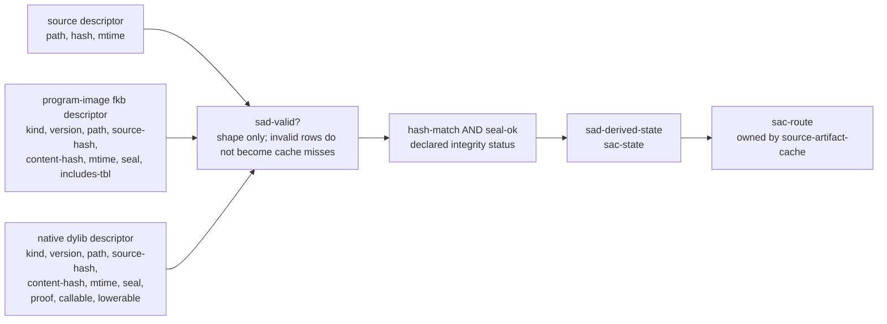

# 2026-07-03 -- source artifact descriptor layer review

## Ground

This layer follows the architecture map and the reviewed source artifact cache
policy:

- `receipts/2026-07-03-core-layer-architecture-map.md`
- `receipts/2026-07-03-source-artifact-cache-layer-review.md`
- `form/form-stdlib/source-artifact-cache.fk`
- `form/form-stdlib/source-artifact-descriptor.fk`
- `form/form-stdlib/tests/source-artifact-descriptor-band.fk`

Layer 8b sits in front of the source artifact cache policy. It defines
synthetic descriptor rows for:

- the canonical `.fk` source;
- the target program-image `.fkb`;
- the optional native `.dylib`.

It validates descriptor shape, source identity, artifact kind, version,
declared seal status, proof/callable/lowerable fields, and then derives the
existing `sac-state` row consumed by `source-artifact-cache.fk`.

It does not read disk, hash bytes, verify cryptographic signatures, write
`.fkb`, load `.dylib`, choose a runtime artifact, parse source, or grow
`runtime/fkwu-uni.c`.

## Layer Diagram



The layer deliberately does not call artifact rows "manifests." The body
already uses "manifest" for layer feature lists, pack manifests, and content
addressed model files. This layer uses "descriptor" for execution-artifact
metadata and keeps `source-artifact-descriptor-manifest` only for the normal
layer feature list.

## Pre-Review

Grok pre-review verdict: CONDITIONAL PASS. Required corrections:

- keep a distinct prefix and avoid colliding with the existing
  `source-artifact-cache-manifest`;
- define per-artifact signature/seal derivation into `sac-state`;
- reject parsed-data `.fkb` so it cannot be mistaken for program-image `.fkb`;
- derive into `sac-state` and call `sac-route`, not duplicate route algebra;
- keep the source artifact cache band unchanged;
- witness signature-bad, stale, missing, unproven, and no-current-fkb cases.

Claude pre-review verdict: CONDITIONAL. Required corrections:

- do not name the layer `source-artifact-manifest`; use descriptor vocabulary;
- call the integrity flag a declared seal status, not verified signature;
- define the collapse to `sac-state` integrity as hash-match AND seal-ok;
- carry all fields needed to fill `sac-state`, including callable and lowerable;
- keep parsed-data `.fkb`, compiler-image `.fkb`, and program-image `.fkb`
  separate;
- state that mtime remains the freshness gate and hash/seal only invalidate;
- expose validation separately so invalid descriptors do not silently route as
  source-compile cache misses;
- add architecture map row 8b and an admission observation row.

## Implementation

`source-artifact-descriptor.fk` adds:

- `source-artifact-descriptor-manifest`, the layer feature list;
- source descriptors: `sad-source`;
- artifact descriptors: `sad-program-image-fkb`, `sad-native-dylib`, and
  `sad-no-artifact`;
- kind constants for `program-image-fkb`, `native-dylib`, and rejected
  `parsed-data-fkb`;
- shape validation through `sad-valid?`;
- current-artifact checks that require current version, matching source hash,
  declared `seal-ok`, and for program-image `.fkb`, `includes-tbl`;
- `sad-derived-state`, the only bridge into `sac-state`;
- `sad-route`, which returns `sad-route-invalid` for invalid descriptor rows
  instead of treating malformed metadata as source-compile;
- `sad-compile-output-from-dylib`, reusing `sac-compile-output`.

The chosen integrity collapse is conservative:

```text
sac-state sig-ok = source-hash-match AND seal-ok for each present artifact
```

A bad seal or source-hash mismatch quarantines the descriptor bundle, not only
the single artifact row. This is deliberately stricter than missing native
proof: an unproven dylib can fall back to a current program-image `.fkb`, while
a seal-bad dylib paired with a current `.fkb` routes to source compile because
the bundle's declared integrity is no longer trusted. Hash/seal status does not
revalidate stale mtimes and it does not prove real byte identity; those belong
to the later disk-reading selector/probe layer.

## Witness

Layer command:

```sh
./fkwu --src <(cat form/form-stdlib/core.fk \
    form/form-stdlib/source-artifact-cache.fk \
    form/form-stdlib/source-artifact-descriptor.fk \
    form/form-stdlib/tests/source-artifact-descriptor-band.fk)
```

Layer witness:

```text
source-artifact-descriptor-band -> 2147483647
source-artifact-cache-band      -> 1048575
source-runner-admission-band    -> 1048575
```

Bit decoding:

```text
1         manifest declares source-identity-required
2         manifest declares program-image-fkb-kind
4         manifest declares optional-native-dylib-kind
8         manifest declares artifact-identity-fields
16        manifest declares seal-is-declared-not-verified
32        manifest declares proof-status-for-dylib
64        manifest declares derives-sac-state
128       manifest declares no-disk-io
256       manifest declares not-parsed-data-fkb
512       manifest declares no-runtime-selector
1024      manifest declares routing-owned-by-sac
2048      manifest declares no-c-seed-growth
4096      well-formed descriptor bundle validates
8192      invalid source descriptor fails validation
16384     unknown artifact kind rejects
32768     parsed-data fkb kind rejects
65536     fresh program-image fkb routes to fkb
131072    stale-mtime fkb routes to source compile
262144    source-hash mismatch routes to source compile
524288    seal-bad fkb routes to source compile
1048576   version mismatch routes to source compile
2097152   fresh proven dylib with current fkb routes to dylib
4194304   unproven dylib falls back to fkb
8388608   fresh dylib with stale fkb routes to source compile
16777216  missing artifacts route to source compile
33554432  equal-mtime fkb boundary is fresh
67108864  source-newer-than-artifacts routes to source compile
134217728 compile-output intent reuses sac policy, including nonlowerable
268435456 invalid descriptor does not route as source compile
536870912 descriptor-derived routes match hand-built sac-state routes
1073741824 seal-bad dylib quarantines the bundle and routes to compile
```

No OOM-killed process occurred during this layer pass.

## Post-Review

Initial post-review:

- Grok verdict: PASS. It independently reproduced
  `source-artifact-descriptor-band -> 1073741823`,
  `source-artifact-cache-band -> 1048575`, and
  `source-runner-admission-band -> 1048575`, then found no code blockers.
- Claude verdict: CONDITIONAL. Claude reproduced the same witnesses but
  required two honesty fixes:
  - add a band bit proving the bundle-wide quarantine policy when a seal-bad
    dylib is paired with a fresh `.fkb`;
  - either remove or witness `sad-parsed-data-kind?`.

Corrections applied:

- `source-artifact-descriptor-band` now uses `sad-parsed-data-kind?` in the
  parsed-data rejection bit.
- The band now adds bit `1073741824`, proving that a seal-bad dylib paired with
  a fresh program-image `.fkb` routes to source compile and not to `.fkb`.
- `source-runner-admission.fk` now records expected and actual
  `2147483647` for `source-artifact-descriptor-band`.
- This receipt now names bundle-wide quarantine and the deliberate
  proof-vs-seal asymmetry.

Follow-up post-review:

- Grok verdict: PASS. Reproduced:
  `source-artifact-descriptor-band -> 2147483647`,
  `source-artifact-cache-band -> 1048575`,
  `source-runner-admission-band -> 1048575`, and
  `binary-freshness-band -> 15`.
- Claude verdict: PASS. Reproduced a fresh `fkwu`, descriptor band
  `2147483647`, cache band `1048575`, admission band `1048575`, and
  `git diff --check -> 0`.

Claude noted one non-blocking residual: the receipt's hash-mismatch quarantine
claim is structurally true through the same `sad-artifact-source-match?` path,
but the band separately witnesses only fkb hash mismatch and dylib seal
failure. A future 32nd-bit or split-band hardening can add an explicit
hash-bad-dylib witness if we want symmetric evidence without overloading this
31-bit band.

## Alternatives

| Alternative | Disposition | Why |
| --- | --- | --- |
| Name the layer `source-artifact-manifest` | Rejected | "Manifest" is already polysemous in this body; descriptors are artifact metadata rows, not feature manifests or pack manifests. |
| Put hash/seal fields directly in `source-artifact-cache.fk` | Rejected | The cache layer owns route policy over `sac-state`; descriptor validation belongs in front of it. |
| Let parsed-data `.fkb` satisfy program-image `.fkb` | Rejected | The architecture map explicitly split parsed-data, compiler-image, and program-image `.fkb` evidence. |
| Treat source-hash match as enough to override stale mtime | Rejected for now | This synthetic layer does not read bytes; mtime remains the freshness gate. |
| Route invalid descriptors to source compile | Rejected | Malformed metadata is not a cache miss; it must remain observable as invalid. |
| Verify seals in this layer | Rejected | This layer has no disk/byte access. `seal-ok` is declared status supplied by a future probe. |
| Reimplement route preference | Rejected | `sac-route` remains the only route algebra. |

## Deferred

- Disk probe that fills descriptors from real source/artifact files.
- Real hash calculation and seal/signature verification.
- Program-image `.fkb` writer and loader that actually skips source parsing.
- `.dylib` native artifact loader/caller and runtime selector.
- Source maps, deopt anchors, artifact version migration, and proof storage.
- C-seed shrink beyond keeping this layer out of C.

## Reflection

Achieved:

- Layer 8b now has a descriptor language for execution-artifact metadata.
- Descriptor rows are validated separately from route selection.
- Program-image `.fkb` is kept distinct from parsed-data `.fkb`.
- Hash/seal failures and version mismatch invalidate otherwise fresh artifacts.
- The band proves descriptor-derived routes agree with the existing
  `source-artifact-cache` route policy.

Deferred, with why:

- Real artifact IO is deferred because this layer is the contract over rows, not
  the host probe.
- Runtime selection is deferred because `source-artifact-cache.fk` only names
  the route policy and no selector exists in `fkwu` yet.
- Seal verification is deferred because no byte-reading verifier exists here;
  this layer only consumes a declared status.
