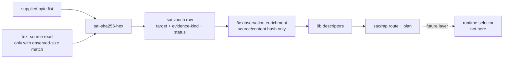

# 2026-07-03 -- source artifact identity layer review

## Ground

Layer 8d follows the reviewed artifact stack:

- `receipts/2026-07-03-core-layer-architecture-map.md`
- `form/form-stdlib/source-artifact-cache.fk`
- `form/form-stdlib/source-artifact-descriptor.fk`
- `form/form-stdlib/runtime-artifact-plan.fk`
- `form/form-stdlib/source-artifact-probe.fk`
- `form/form-stdlib/source-artifact-identity.fk`
- `form/form-stdlib/tests/source-artifact-identity-band.fk`

Layer 8d is the digest/vouch face. It owns SHA-256 identity over supplied
material and the row language that says what evidence produced that digest. It
does not own the runtime selector, compiler emission, cache writes, seal
verification, native proof/callable admission, artifact load, arbitrary binary
file hashing, or C seed growth.

The central rule is:

```text
digest match != seal-ok != proof != callable != native admission
```

## Layer Diagram



## Pre-Review

Grok pre-review verdict: CONDITIONAL PASS.

Required corrections:

- implement Layer 8d before compiler emission or runtime selector;
- include two faces: supplied byte-list digest core and a scoped text-source
  helper;
- do not vouch disk binary artifacts through current `read_file_bytes` or
  `fs-read-bytes`;
- emit `sai-*` digest/vouch rows and do not fork `sad-route` or `sac-state`;
- digest match must not set `seal-ok`, proof, callable, or native admission;
- add the architecture-map row at implementation;
- leave source-runner admission unchanged for now;
- band known SHA vectors, match/mismatch/malformed declarations, text helper
  scope, vouch-to-8c enrichment, no seal/proof/native admission, no
  load/selector/emission/write/C growth, no binary file hash, and the
  `read_file_bytes` primitive parity gap.

Claude pre-review verdict: CONDITIONAL PASS.

Claude's first CLI run stayed silent for several minutes. `ps` showed it alive,
idle, and not memory-heavy; it was interrupted and rerun with a no-tools prompt.
That was a reviewer-tool wait, not a kernel OOM/stall.

Additional required corrections from Claude:

- keep the dependency direction explicit: 8d may depend on 8c to enrich
  observations, but 8c must not import 8d;
- text-source digest rows must require observed file size to match string byte
  length before carrying an actual digest, guarding against truncated reads;
- vouch rows must carry an evidence-kind field;
- include SHA-256 empty, `abc`, and 56-byte padding/two-block vectors;
- make the `read_file_bytes` gap a canary that goes red when binary byte IO
  becomes real;
- declare the hex policy: 8d accepts canonical lowercase `sha256:` plus 64
  lowercase hex digits; uppercase declarations are malformed, not mismatch;
- include a no-write/no-cache-write manifest bit.

## Implementation

`source-artifact-identity.fk` adds:

- `source-artifact-identity-manifest`;
- canonical `sha256:` lower-hex declaration validation;
- `sai-sha256-hex` over supplied byte lists;
- `sai-sha256-string` through `str-byte-at`;
- `sai-vouch` rows:
  `("source-artifact-identity-vouch" target path evidence-kind expected actual status observed-size material-size)`;
- supplied-byte vouch helpers for source and content hashes;
- size-checked text-source vouch helpers;
- 8c enrichment helpers that fill only source/content hash fields and pass
  seal/proof/callable fields through from their own declared evidence.

The text helper is intentionally not binary-safe. If observed size and string
byte length differ, it emits status `size-mismatch` with an empty actual hash.

## Witness

Layer command:

```sh
./fkwu --src <(cat form/form-stdlib/core.fk \
    form/form-stdlib/str-byte-at.fk \
    form/form-stdlib/sha256.fk \
    form/form-stdlib/hex.fk \
    form/form-stdlib/form-fs.fk \
    form/form-stdlib/source-artifact-cache.fk \
    form/form-stdlib/source-artifact-descriptor.fk \
    form/form-stdlib/runtime-artifact-plan.fk \
    form/form-stdlib/source-artifact-probe.fk \
    form/form-stdlib/source-artifact-identity.fk \
    form/form-stdlib/tests/source-artifact-identity-band.fk)
```

Layer witness:

```text
source-artifact-identity-band -> 2147483647
```

Bit decoding:

```text
1          manifest declares byte-list-sha256-hex
2          manifest declares declared-content-hash-verify
4          manifest declares declared-source-hash-verify
8          manifest declares evidence-kind-carried
16         manifest declares supplied-byte-list-evidence
32         manifest declares text-source-helper-scoped
64         manifest declares text-size-must-match-observed
128        manifest declares emits-observations-for-sap
256        manifest declares identity-match-does-not-set-seal-ok
512        manifest declares no-seal-verification
1024       manifest declares no-proof-callable-native-admission
2048       manifest declares no-artifact-load
4096       manifest declares no-runtime-selector
8192       manifest declares no-compiler-emission
16384      manifest declares no-cache-write
32768      manifest declares no-c-seed-growth
65536      manifest declares no-binary-file-hash
131072     manifest declares read-file-bytes-not-checkout-witness
262144     manifest declares does-not-derive-sac-state-or-route
524288     manifest declares read-only-no-disk-write
1048576    manifest declares no-sap-import-cycle
2097152    empty byte-list SHA-256 vector matches
4194304    abc byte-list SHA-256 vector matches
8388608    56-byte padding/two-block vector matches
16777216   declared hash match and mismatch are distinct
33554432   undeclared/malformed/uppercase policy is conservative
67108864   vouch row carries target, evidence kind, and sizes
134217728  text helper and live text observation accept size match and refuse mismatch
268435456  8c enrichment preserves separate seal evidence
536870912  digest match cannot admit native without proof/callable
1073741824 read_file_bytes checkout gap canary remains red
```

## Red Signals And Investigations

The first full band pass returned `268435455`. The missing integration bits
were caused by placeholder fixture hashes for `"fkb"` and `"dylib"`, not by
layer behavior. Replacing them with the real SHA-256 values closed those bits.

The next band pass returned `1073741823`, missing only the
`read_file_bytes` canary. Investigation showed:

- a direct debug probe over a three-byte text file saw `fs-read-bytes` length
  `0`;
- equality on `nth` of the unresolved byte-read result was not stable enough to
  use as a canary;
- the band now asserts the stable fact: a three-byte file read through current
  `fs-read-bytes` does not produce a three-byte byte list.

That canary should go red when `read_file_bytes` becomes a real fkwu primitive,
forcing a conscious binary-file-hash admission layer instead of silently
expanding 8d's scope.

No OOM-killed process occurred during this layer pass. No `fkwu` stall occurred.

## Deferred

- Arbitrary binary file hashing for `.fkb` and `.dylib` is deferred until
  `read_file_bytes` is exposed and witnessed on current `fkwu`.
- Seal/signature verification remains a later integrity/proof layer.
- Compiler emission and cache writes remain later source compiler work.
- Runtime selector installation and artifact load/call remain later runtime
  work.
- Source-runner admission was not changed; both reviewers scoped the byte-IO
  mismatch as a primitive/checkpoint parity concern until a host/compiler lane
  depends on it directly.

## Post-Review

Initial post-review:

- Grok verdict: PASS. It reran the full prelude bundle and reproduced
  `source-artifact-identity-band -> 2147483647`. It confirmed the layer sits
  after 8c and before compiler emission/selector, the source file has no
  `fs-read-bytes` or `read_file_bytes` calls, vouch rows carry evidence kind,
  text helper mismatch clears the actual hash, digest enrichment does not set
  seal/proof/callable, and 8c has no `sai-*` dependency.
- Claude verdict: PASS. It rebuilt `fkwu`, reproduced the 8d band and
  `ground -> 42`, checked fixture hashes against `shasum -a 256`, confirmed no
  8d-driven C growth, and verified the byte-IO canary is the only
  `fs-read-bytes` use in the 8d files.

Both reviewers named the same non-blocking coverage gap: the pure
`sai-vouch-text-source` helper was banded, but the live
`sai-vouch-text-source-observation` wrapper was not yet directly exercised.

Follow-up hardening:

- Bit `134217728` now also writes a temp source file, observes it through
  `sap-observe-source`, calls `sai-vouch-text-source-observation`, and verifies
  `match`.
- The same bit constructs a deliberately false source observation with size
  `4` over the real three-byte file and verifies `size-mismatch`.
- It also passes an absent source observation and verifies `unobserved`.

Follow-up verification:

```text
source-artifact-identity-band -> 2147483647
source-artifact-probe-band    -> 536870911
git diff --check              -> 0
```

Follow-up post-review:

- Grok verdict: PASS. It reproduced `binary-freshness-band -> 15`,
  `source-artifact-identity-band -> 2147483647`, and
  `source-artifact-probe-band -> 536870911`. Grok confirmed the hardened bit
  closes the observation-wrapper coverage gap without adding seal/proof/native
  admission, cache write, compiler emission, or binary file hashing.
- Claude verdict: PASS. It reran the 8d and 8c bands plus `git diff --check`.
  Claude confirmed the live path, false-observation path, and absent path are
  pinned, and that the module's `read-only-no-disk-write` claim remains scoped
  to the module under test, not to the temp-file-writing band.

Residual risks are intentionally deferred:

- the defensive wrong-role/non-observation branch of
  `sai-vouch-text-source-observation` remains unbanded because covering it would
  broaden this layer beyond the requested hardening;
- length-preserving `read_file` corruption is not detectable by the size guard;
  the real fix remains a witnessed byte-IO door and a later binary digest layer;
- mismatch/malformed vouches collapse to empty hashes when converted into 8c
  observations. That is conservative for routing, but a future seal/proof layer
  should consume the vouch status directly rather than only the collapsed
  observation hash field.
