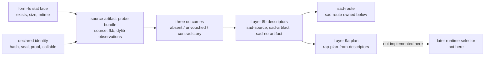

# 2026-07-03 -- source artifact probe layer review

## Ground

This layer follows the reviewed artifact stack:

- `receipts/2026-07-03-core-layer-architecture-map.md`
- `form/form-stdlib/form-fs.fk`
- `form/form-stdlib/source-artifact-cache.fk`
- `form/form-stdlib/source-artifact-descriptor.fk`
- `form/form-stdlib/runtime-artifact-plan.fk`
- `form/form-stdlib/source-artifact-probe.fk`
- `form/form-stdlib/tests/source-artifact-probe-band.fk`

Layer 8c is the source artifact probe face. It is not a runtime selector and
not compiler emission. It supplies the descriptor rows Layer 8b already named as
future work: source, program-image `.fkb`, and native `.dylib` observations.

Its language is an observation bundle:

- observed path, exists, size, and mtime;
- declared source/content hashes;
- declared seal/proof/callable/lowerable/includes-tbl fields;
- descriptor construction through Layer 8b constructors;
- route and plan delegation to Layer 8b and Layer 9a.

It does not hash bytes, verify seals, parse source, sniff filename extensions,
write artifacts, load `.fkb`, call `.dylib`, install a selector, decide direct
`--src` admission, or grow `runtime/fkwu-uni.c`.

## Layer Diagram



## Pre-Review

Grok pre-review verdict: CONDITIONAL PASS.

Required corrections:

- implement this as Layer 8c before full Layer 9 runtime or compiler emission;
- add the architecture map row;
- use `source-artifact-probe.fk` and `sap-`;
- keep probe metadata separate from descriptor rows and layer manifests;
- do not export a parallel route algebra;
- make missing hashes conservative, not fabricated;
- manifest the distinction between observation and verification;
- witness invalid probe, kind rejection, seal/hash quarantine,
  existence-is-not-verification, and delegation equality.

Claude pre-review verdict: CONDITIONAL.

Required corrections:

- split the pure synthetic core from any live `form-fs` observation face;
- carry three distinct outcomes:
  - absent artifact -> `sad-no-artifact`, safe source compile;
  - present but unvouched -> `sad-no-artifact`, safe source compile;
  - contradictory or unidentifiable -> invalid descriptors and investigate;
- never fabricate hash fields;
- never infer artifact kind from path extension;
- if checksum computation is later added, name the checksum honestly and do not
  treat it as seal/proof verification;
- split the band into small helper functions from the start.

## Implementation

`source-artifact-probe.fk` adds:

- `source-artifact-probe-manifest`;
- observation rows with role, path, exists, size, mtime, declared hashes, and
  declared integrity/proof fields;
- bundle rows containing source, program-image `.fkb`, and native `.dylib`
  observations;
- consistency checks for absent/present/contradictory observations;
- source identifiability checks;
- present-but-unvouched artifact degradation to `sad-no-artifact`;
- descriptor construction through `sad-source`, `sad-program-image-fkb`,
  `sad-native-dylib`, and `sad-no-artifact`;
- `sap-delegated-route` and `sap-plan-from-probe`, which delegate to
  `sad-route` and `rap-plan-from-descriptors`;
- read-only live observation helpers that use `form-fs` stat doors only.

The central honesty rule is:

```text
absent      -> compile-source as cache miss
unvouched   -> compile-source as safe overwrite
contradict  -> investigate
```

## Witness

Layer command:

```sh
./fkwu --src <(cat form/form-stdlib/core.fk \
    form/form-stdlib/form-fs.fk \
    form/form-stdlib/source-artifact-cache.fk \
    form/form-stdlib/source-artifact-descriptor.fk \
    form/form-stdlib/runtime-artifact-plan.fk \
    form/form-stdlib/source-artifact-probe.fk \
    form/form-stdlib/tests/source-artifact-probe-band.fk)
```

Layer witness:

```text
source-artifact-probe-band      -> 536870911
runtime-artifact-plan-band      -> 67108863
source-artifact-descriptor-band -> 2147483647
source-artifact-cache-band      -> 1048575
source-runner-admission-band    -> 1048575
git diff --check                -> 0
```

Bit decoding:

```text
1         manifest declares constructs-sad-descriptors
2         manifest declares delegates-routing-to-sac
4         manifest declares delegates-validation-to-sad
8         manifest declares delegates-plan-to-rap
16        manifest declares observed-fields-are-declarations
32        manifest declares present-unvouched-degrades-to-missing
64        manifest declares absent-artifact-is-cache-miss
128       manifest declares contradictory-observation-investigates
256       manifest declares no-seal-verification
512       manifest declares no-artifact-load
1024      manifest declares no-runtime-selector
2048      manifest declares read-only-no-disk-write
4096      manifest declares form-fs-doors-only
8192      manifest declares no-kind-from-extension
16384     manifest declares no-byte-hash
32768     manifest declares no-c-seed-growth
65536     complete bundle constructs valid sad descriptors
131072    missing artifacts compile and do not skip parse
262144    fresh fkb plans run-program-image with compile fallback
524288    fresh proven dylib plans native with fkb fallback
1048576   absent artifact maps to sad-no-artifact and compile
2097152   present-unvouched artifact is not run and no hash is fabricated
4194304   contradictory observation investigates, not compile
8388608   unidentifiable source investigates
16777216  declared seal-bad or source-hash mismatch quarantines to compile
33554432  proof/callable zero cannot yield native
67108864  probe delegation matches hand-built sad/rap routes
134217728 live form-fs stat observes existence, mtime, and unvouched no-run
268435456 parsed-data or unknown role cannot become program-image descriptor
```

### Red Signals

The first local band pass returned `534773759`, missing bit `2097152`.
Investigation isolated the problem to the band witness, not the probe layer:
the present-but-unvouched behavior itself degraded the artifact to
`sad-no-artifact` and planned source compile, but the bit included an irrelevant
fabricated-descriptor expression. The witness was tightened to assert the real
facts directly:

- the unvouched observation's declared source/content hashes remain empty;
- the constructed `.fkb` descriptor is `sad-no-artifact`;
- the plan does not run the program-image artifact.

After that correction the band returned `536870911`.

Post-review hardening tightened three non-blocking reviewer notes without changing
the expected band total:

- the unvouched bit now uses a row with missing source hash but present content
  hash, proving the probe does not fabricate the missing source identity;
- the live `form-fs` bit now observes a real existing temp file with empty
  hashes and proves the constructed `.fkb` descriptor is still
  `sad-no-artifact`;
- the quarantine bit now includes a declared source-hash mismatch in addition
  to declared seal failure.

No OOM-killed process occurred during this layer pass. No `fkwu` stall occurred.
Claude's pre-review took several minutes without output; `ps` showed the Claude
CLI alive, idle, and not memory-heavy, and it eventually returned a conditional
review. That was a reviewer-tool wait, not a kernel OOM/stall.

## Post-Review

Initial post-review:

- Grok verdict: PASS. It reproduced `binary-freshness-band -> 15`,
  `source-artifact-probe-band -> 536870911`,
  `runtime-artifact-plan-band -> 67108863`,
  `source-artifact-descriptor-band -> 2147483647`,
  `source-artifact-cache-band -> 1048575`, and
  `source-runner-admission-band -> 1048575`.
- Claude verdict: PASS. It reproduced the same focused witnesses and
  `git diff --check -> 0`.

Both reviewers confirmed the pre-review corrections:

- observation is not verification;
- absent, unvouched, and contradictory observations are distinct;
- routing delegates through `sad-route` / `sac-route`;
- planning delegates through `rap-plan-from-descriptors`;
- no direct `sac-state` construction appears in the probe layer;
- kind is carried by bundle role, not inferred from extension;
- live observation uses `form-fs` stat doors only;
- no hash/seal verification, artifact load, runtime selector, compiler
  emission, or C growth is claimed.

Grok and Claude both called out the same non-blocking witness-strength issue:
the first unvouched bit had real force through `sad-no-artifact` and no-run, but
one sub-assertion was too tautological; the live `form-fs` bit also did not yet
prove existence-is-not-verification on a real existing file. The hardening above
was applied in response.

Follow-up post-review:

- Grok verdict: PASS. It reran `binary-freshness-band -> 15`, the Layer 8c
  witness `536870911`, and a stack sanity check
  `runtime-artifact-plan-band -> 67108863`. Grok confirmed the hardening is
  substantive and does not introduce a verification overclaim.
- Claude verdict: PASS. It reran `source-artifact-probe-band -> 536870911` and
  `git diff --check -> 0`. Claude confirmed the shape-filler comment,
  unvouched-row strengthening, source-hash mismatch leg, and live
  existing-file-with-empty-hashes proof all close the previously weak points.

Grok saw one local `git diff --check` wrapper oddity: exit 1 with no output,
while the focused layer checks passed. In this worktree after the follow-up
review, both `git diff --check` and `command git diff --check` exit 0.

## Alternatives

| Alternative | Disposition | Why |
| --- | --- | --- |
| Jump to full Layer 9 selector | Rejected | Selector needs trustworthy descriptor observations and load/call machinery first. |
| Implement compiler emission first | Deferred | Emission needs the probe to witness its own artifacts and remains a larger cell under source-runner pressure. |
| Treat any existing `.fkb` as runnable | Rejected | Existence and extension are not proof of program-image kind or byte identity. |
| Infer artifact kind from filename extension | Rejected | Kind comes from the bundle role and 8b constructors, not text suffix sniffing. |
| Fabricate placeholder hashes for present files | Rejected | Missing identity is unvouched, not valid. |
| Route unvouched present artifacts to investigate | Rejected for this layer | They are consistent observations and can be safely overwritten by compile-source. |
| Construct `sac-state` directly | Rejected | That would fork Layer 8b descriptor ownership and route derivation. |

## Deferred

- Real content hashing and seal/signature verification.
- Program-image `.fkb` writing, loading, and walking.
- Native `.dylib` loading, binding, and calling.
- Runtime selector installation in `fkwu`.
- Compiler emission that produces program-image `.fkb` and native `.dylib`.
- Source maps, deopt execution, proof storage, and artifact migration.
- C-seed shrink beyond keeping this layer out of C.

## Reflection

Achieved:

- Layer 8c now has a probe-row language between filesystem observations and
  execution-artifact descriptors.
- The layer preserves the distinction between absent, unvouched, and
  contradictory observations.
- Descriptor construction delegates to Layer 8b; routing delegates to `sad` /
  `sac`; runtime intent delegates to Layer 9a.
- The live face observes only stat facts through `form-fs`.

Deferred, with why:

- Verification is deferred because this layer has no byte-hash/seal verifier.
- Execution is deferred because this layer only constructs descriptors and
  plans.
- Compiler output is deferred because this is the probe/admission input, not
  the compiler.
- Selector installation is deferred because runtime load/call has not been
  reviewed or brought home without C growth.
