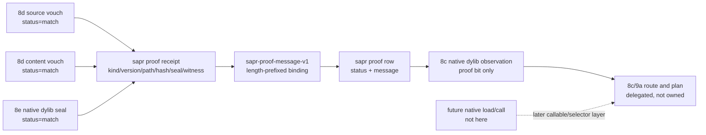

# 2026-07-03 -- source artifact proof layer review

## Ground

Layer 8f follows the reviewed artifact stack:

- `receipts/2026-07-03-core-layer-architecture-map.md`
- `form/form-stdlib/source-artifact-cache.fk`
- `form/form-stdlib/source-artifact-descriptor.fk`
- `form/form-stdlib/runtime-artifact-plan.fk`
- `form/form-stdlib/source-artifact-probe.fk`
- `form/form-stdlib/source-artifact-identity.fk`
- `form/form-stdlib/source-artifact-seal.fk`
- `form/form-stdlib/source-artifact-proof.fk`
- `form/form-stdlib/tests/source-artifact-proof-band.fk`

Layer 8f is a structural proof-receipt face for sealed native dylib identity.
It consumes 8d `sai-*` vouch rows and 8e `sas-*` seal rows directly. A matching
receipt may set only the native dylib `proof` bit in 8c observations.

The central rule remains:

```text
proof=1 means receipt admitted for this sealed identity
proof=1 != native execution != callable admission != source-map/deopt proof
```

## Layer Diagram



## Pre-Review

Grok pre-review verdict: CONDITIONAL PASS.

Required corrections:

- implement 8f after 8e, before callable/native admission and before any
  compiler emission or runtime selector;
- use the `source-artifact-proof` / `sapr-` prefix to avoid the existing
  `sap-` probe namespace;
- allow Candidate A: set native `proof=1` only to mean "proof receipt admitted
  for this sealed identity";
- consume `sai-*` vouches and `sas-*` seal rows directly, never collapsed
  observation fields;
- scope proof admission to native dylib receipts only;
- never set `callable`, execute native bytes, write caches, emit compiler
  artifacts, load/call dylibs, or fork the source artifact route algebra;
- bind the canonical receipt message to kind, version, path, source hash,
  content hash, expected seal value, artifact bit/lowerable field, proof kind,
  witness kind, expected result, actual result, minimum witness count, and
  witness count;
- exclude mtime, sizes, callable, route/plan fields, raw bytes,
  source-map/deopt proof, and native-training merkle fields from this layer.

Claude pre-review was attempted twice before implementation: one live tool
review and one no-tools retry. Both stayed silent for several minutes while
`ps` showed the process alive, idle, and light-memory. They were interrupted
and recorded as reviewer-tool waits, not OOM kills and not `fkwu` stalls.

## Implementation

`source-artifact-proof.fk` adds:

- `source-artifact-proof-manifest`;
- `sapr-proof-message-v1`, a length-prefixed canonical proof receipt message;
- `sapr-proof-receipt` rows:
  `("source-artifact-proof-receipt" kind version path source-hash content-hash seal-value artifact-bit proof-kind witness-kind expected-result actual-result min-witnesses witness-count)`;
- canonical SHA-256 and HMAC seal validation inherited from 8d and 8e;
- status values for `match`, `mismatch`, `malformed`, `unvouched`,
  `unsealed`, `insufficient-witness`, and `role-refused`;
- `sapr-admit-proof`, which admits only native dylib receipts whose source
  vouch, content vouch, seal row, seal-row bound hashes, receipt binding,
  expected/actual result, and witness count all match;
- `sapr-native-dylib-observation-from-proof`, which enriches an 8c native
  dylib observation with source hash, content hash, seal bit, and proof bit
  while passing callable and lowerable through unchanged.

## Witness

Layer command:

```sh
./fkwu --src <(cat form/form-stdlib/core.fk \
    form/form-stdlib/str-byte-at.fk \
    form/form-stdlib/sha256.fk \
    form/form-stdlib/hex.fk \
    form/form-stdlib/hmac-sha256.fk \
    form/form-stdlib/form-fs.fk \
    form/form-stdlib/source-artifact-cache.fk \
    form/form-stdlib/source-artifact-descriptor.fk \
    form/form-stdlib/runtime-artifact-plan.fk \
    form/form-stdlib/source-artifact-probe.fk \
    form/form-stdlib/source-artifact-identity.fk \
    form/form-stdlib/source-artifact-seal.fk \
    form/form-stdlib/source-artifact-proof.fk \
    form/form-stdlib/tests/source-artifact-proof-band.fk)
```

Layer witness:

```text
source-artifact-proof-band -> 2147483647
```

Bit decoding:

```text
1          manifest declares proof-receipt-validation
2          manifest declares proof-is-receipt-not-native-exec
4          manifest declares consumes-sai-vouch-status
8          manifest declares consumes-sas-seal-status
16         manifest declares native-dylib-proof-only
32         manifest declares proof-receipt-validated-sets-proof
64         manifest declares callable-left-untouched
128        manifest declares lowerable-left-untouched
256        manifest declares length-prefixed-proof-message-v1
512        manifest declares structural-not-signature
1024       manifest declares no-native-execution
2048       manifest declares no-callable-admission
4096       manifest declares no-binary-file-hash
8192       manifest declares read-file-bytes-not-checkout-witness
16384      manifest declares no-artifact-load
32768      manifest declares no-runtime-selector
65536      manifest declares no-compiler-emission
131072     manifest declares no-cache-write
262144     manifest declares no-sac-route-fork
524288     manifest declares no-source-runner-admission-change
1048576    manifest declares no-c-seed-growth
2097152    canonical proof message is length-prefixed and collision-negative
4194304    matching receipt admits proof row
8388608    mismatch, insufficient-witness, unsealed, unvouched, malformed, hash-pair mismatch, and role-refused negatives
16777216   bound receipt fields change the canonical message
33554432   enrichment sets proof only from valid proof and preserves callable/lowerable
67108864   proof=1 with callable=0 does not admit native route
134217728  mtime is excluded and does not change proof message semantics
268435456  proof admission does not set callable or lowerable
536870912  program-image fkb proof receipt is refused
1073741824 proof+seal still requires a later callable/selector gate to route native
```

## Red Signals And Investigations

The previous patch application output was truncated by the tool context limit.
Before proceeding, both new files were read back from disk and the proof band
was run. The files were present, complete enough to execute, and the first
layer witness returned `2147483647`.

Claude post-review surfaced a real structural gap: before follow-up hardening,
8e seal rows carried match status and MAC values but not the source/content
hashes used to build the HMAC message. That meant 8f could not structurally
reject a caller-assembled match-status seal row paired with different vouches.
The fix was to carry bound source/content hashes on the 8e seal row and require
8f receipt binding to match both the live vouches and those seal-row hashes.
The proof band now includes a `hash-pairing` negative for that case.

No OOM-killed process occurred during this layer pass. No `fkwu` stall
occurred. The only long wait observed was the Claude reviewer CLI staying
silent while alive and light-memory; that is tracked separately as reviewer
tool behavior.

## Deferred

- Binary `.fkb`/`.dylib` byte hashing remains deferred until `read_file_bytes`
  is exposed and witnessed on current `fkwu`.
- Callable admission is delegated to Layer 8g. Native execution, load/call, and
  runtime selector admission remain later layers.
- Source-map/deopt proof remains a later proof language, not this structural
  receipt gate.
- Native-training merkle proofs remain future work.
- Compiler emission, cache writes, artifact load/call, and runtime selector
  installation remain later layers.
- `source-runner-admission` logic remains unchanged.

## Post-Review

Initial post-review:

- Grok verdict: PASS. It reran the Layer 8f bundle and reproduced
  `source-artifact-proof-band -> 2147483647`, confirmed the layer sets only
  native dylib `proof=1`, confirmed callable/lowerable pass through unchanged,
  and found no load/call, byte-hash, cache-write, compiler-emission, selector,
  or route-fork behavior in `source-artifact-proof.fk`.
- Claude verdict: PASS. It independently reran
  `source-artifact-proof-band -> 2147483647`, confirmed the consumed 8d/8e/8c
  helpers exist with the arities used, verified `source-runner-admission-band
  -> 1048575`, and confirmed the layer is pure row/string structure with no
  native execution, byte reads, binary hashing, cache writes, selector, or
  compiler emission.

Reviewer hardening items:

- Grok asked for broader field-sensitivity coverage and clearer wording that
  the stored canonical message is structural evidence, not an independently
  verified cryptographic witness.
- Claude found the seal/vouch hash-pairing gap described above, plus smaller
  non-blocking notes: malformed receipt status precedence, artifact-bit shape,
  and a weak self-comparison in the mtime-insensitivity bit.

Follow-up hardening:

- 8e seal rows now carry the source/content hashes used in the HMAC message.
- 8f receipt binding now requires receipt hashes to match both live vouches and
  the hashes carried by the seal row.
- 8f receipt shape now constrains `artifact-bit` to `0` or `1`.
- The proof band now includes a hash-pairing negative and broader canonical
  message field sensitivity for source hash, content hash, proof kind, witness
  kind, expected result, actual result, minimum witnesses, and witness count.
- The mtime-insensitivity bit now uses an actual proof-status check instead of
  a self-comparison.

Follow-up verification:

```text
cc -O2 -o fkwu runtime/fkwu-uni.c                    -> same known warnings only
bootstrap/ground.fk                                  -> 42
bootstrap/ground-recursive.fk 10                     -> 55
binary-freshness-band                                -> 15
native-vs-rented-check                               -> 11111
source-artifact-cache-band                           -> 1048575
source-artifact-descriptor-band                      -> 2147483647
runtime-artifact-plan-band                           -> 67108863
source-artifact-probe-band                           -> 536870911
source-runner-admission-band                         -> 1048575
source-artifact-identity-band                        -> 2147483647
source-artifact-seal-band                            -> 2147483647
source-artifact-proof-band                           -> 2147483647
git diff --check                                     -> 0
```

Follow-up review:

- Grok verdict: PASS. It independently reran the full matrix above, confirmed
  the 8e seal row now carries bound source/content hashes, confirmed 8f checks
  receipt hashes against both live vouches and seal-row hashes, and confirmed
  the synthetic match-status/different-hash row now yields `mismatch`.
- Claude follow-up started by reading/running the hardening review and named an
  empty-output harness issue when trying to run single test files without their
  full prelude bundle. It then stayed silent for several minutes while alive,
  low-CPU, and light-memory. It was interrupted and recorded as a reviewer-tool
  wait, not an OOM kill and not a `fkwu` stall. The earlier tool-backed Claude
  post-review remains PASS and directly produced the hash-pairing hardening
  applied here.

Residual non-blocking hardening:

- Add a dedicated seal-row-internal-consistency predicate if later callers need
  to classify pair swaps as `unsealed` or `malformed` before receipt binding.
- Mirror the `artifact-bit` 0/1 shape rule inside 8e seal construction.
- Name the hash-pair binding as an explicit manifest feature in a later cleanup
  if the manifest evolves beyond the current 31-bit witness.
