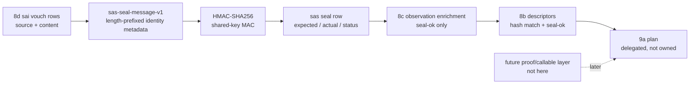

# 2026-07-03 -- source artifact seal layer review

## Ground

Layer 8e follows the reviewed artifact stack:

- `receipts/2026-07-03-core-layer-architecture-map.md`
- `form/form-stdlib/source-artifact-cache.fk`
- `form/form-stdlib/source-artifact-descriptor.fk`
- `form/form-stdlib/runtime-artifact-plan.fk`
- `form/form-stdlib/source-artifact-probe.fk`
- `form/form-stdlib/source-artifact-identity.fk`
- `form/form-stdlib/source-artifact-seal.fk`
- `form/form-stdlib/tests/source-artifact-seal-band.fk`

Layer 8e is the keyed seal face. It consumes Layer 8d `sai-*` vouch rows
directly, verifies a short length-prefixed source-artifact identity message
with HMAC-SHA256, and may set artifact `seal-ok` in 8c observations only when:

```text
source vouch is match
AND content vouch is match
AND expected HMAC seal matches actual HMAC seal
```

The central rule remains:

```text
seal-ok != proof != callable != native admission
```

The seal is a shared-key MAC, not an ed25519/public-key signature. Anyone who
can verify with the key can also mint a seal. Key storage, secret retrieval,
trust-root management, source maps, native proof/callable admission, Mach-O
codesign, binary file hashing, cache writes, compiler emission, artifact
load/call, route algebra, runtime selector, and C seed growth remain outside
this layer.

## Layer Diagram



## Pre-Review

Grok pre-review verdict: CONDITIONAL PASS.

Required corrections:

- implement 8e as the seal-verification layer after 8d and before proof,
  compiler emission, or runtime selector;
- use HMAC-SHA256 keyed integrity, not pack-manifest Adler32 and not row-only
  attestation;
- freeze a versioned `sas-seal-message-v1`;
- gate seal verification on 8d `sai-vouch` rows with status `match` for both
  source and content;
- scope to artifact roles only;
- allow 8e to set artifact `seal-ok`, but never proof/callable/lowerable;
- bind kind, version, path, source hash, content hash, and a role-specific bit;
- exclude mtime, size, proof, callable, route/plan fields, and raw artifact
  bytes;
- add the architecture-map 8e row at implementation and leave
  `source-runner-admission` logic unchanged.

Claude pre-review verdict: CONDITIONAL PASS.

Additional required corrections:

- call the seal a keyed MAC, not a signature; name ed25519 as future work;
- state the cost boundary: HMAC covers short identity metadata only, never
  artifact bytes;
- length-prefix canonical message fields, or otherwise prevent delimiter
  injection;
- exclude verifier-side evidence kind and sizes from the sealed message;
- include a collision-negative band for canonical message encoding;
- include mtime-insensitivity and stale-artifact routing proof;
- note that the `source-runner-admission` current-gates snapshot does not yet
  enumerate every artifact-lane band; that remains convention/debt, not an 8e
  logic change.

## Implementation

`source-artifact-seal.fk` adds:

- `source-artifact-seal-manifest`;
- `sas-seal-message-v1`, a length-prefixed canonical identity message:
  `sas-v1`, artifact kind, artifact version, path, source hash, content hash,
  and one role-specific bit;
- `sas-program-image-fkb-message`, binding `includes-tbl`;
- `sas-native-dylib-message`, binding `lowerable`;
- `sas-hmac-seal`, using `hmac-sha256` and lowercase hex as
  `hmac-sha256:<64 hex>`;
- canonical HMAC seal validation with uppercase declarations treated as
  malformed, not mismatch;
- `sas-seal-row` with kind, version, path, key evidence kind, vouch statuses,
  bound source/content hashes, expected seal, actual seal, seal status, and the
  role-specific bit;
- artifact seal helpers for program-image `.fkb` and native `.dylib`;
- `sas-source-role-refusal` so source rows are not treated as sealed artifacts;
- enrichment helpers that fill source/content hash fields from matched 8d
  vouches and set `seal-ok` from the seal row while passing proof/callable
  fields through unchanged.

The HMAC fixtures were checked externally with `openssl dgst -sha256 -mac HMAC
-macopt key:seal-key` over the exact length-prefixed messages:

```text
program-image fkb seal =
hmac-sha256:67be7f4549fb6d950a6bd4bf335a5e140898dd16488f2ffed695266119c74d92

native dylib seal =
hmac-sha256:379bc7bcaaa870931e3f60218dfb64e5ad43e26236259141d222a46f7d9269c9
```

## Witness

Layer command:

```sh
./fkwu --src <(cat form/form-stdlib/core.fk \
    form/form-stdlib/str-byte-at.fk \
    form/form-stdlib/sha256.fk \
    form/form-stdlib/hex.fk \
    form/form-stdlib/hmac-sha256.fk \
    form/form-stdlib/form-fs.fk \
    form/form-stdlib/source-artifact-cache.fk \
    form/form-stdlib/source-artifact-descriptor.fk \
    form/form-stdlib/runtime-artifact-plan.fk \
    form/form-stdlib/source-artifact-probe.fk \
    form/form-stdlib/source-artifact-identity.fk \
    form/form-stdlib/source-artifact-seal.fk \
    form/form-stdlib/tests/source-artifact-seal-band.fk)
```

Layer witness:

```text
source-artifact-seal-band -> 2147483647
```

Bit decoding:

```text
1          manifest declares hmac-sha256-seal-hex
2          manifest declares seal-is-keyed-mac-not-signature
4          manifest declares short-identity-message-only
8          manifest declares length-prefixed-message-v1
16         manifest declares consumes-sai-vouch-status
32         manifest declares artifact-roles-only
64         manifest declares seal-verified-sets-seal-ok
128        manifest declares identity-match-alone-not-seal-ok
256        manifest declares no-proof-callable-native-admission
512        manifest declares no-binary-file-hash
1024       manifest declares read-file-bytes-not-checkout-witness
2048       manifest declares no-key-storage-or-secret-retrieval
4096       manifest declares no-ed25519-or-codesign
8192       manifest declares no-artifact-load
16384      manifest declares no-runtime-selector
32768      manifest declares no-compiler-emission
65536      manifest declares no-cache-write
131072     manifest declares no-sac-route-fork
262144     manifest declares no-c-seed-growth
524288     manifest declares read-only-no-disk-write
1048576    manifest declares no-sai-import-cycle
2097152    canonical message is length-prefixed and collision-negative
4194304    HMAC fixture matches external vector
8388608    seal row match carries key evidence, artifact bit, and seal-ok
16777216   undeclared/malformed/uppercase/wrong-key/unvouched negatives
33554432   every bound field changes the canonical message
67108864   mtime is excluded and stale artifact still compiles
134217728  enrichment conjunction matrix
268435456  seal-good fkb can route program-image; seal-bad compiles
536870912  seal-good dylib does not admit native without proof/callable
1073741824 source role is refused and cannot set artifact seal-ok
```

## Red Signals And Investigations

The first HMAC probe through `fkwu` printed a compact numeric display for
strings, so it was not used as the external fixture source. The exact
length-prefixed message strings in the band were hashed with `openssl`, then
locked as expected constants. The `fkwu` band then verified the same constants.

No OOM-killed process occurred during this layer pass. No `fkwu` stall occurred.
Claude's pre-review spent several minutes silent while alive, idle, and
light-memory according to `ps`; this was a reviewer-tool wait, not a kernel
stall.

## Deferred

- Binary `.fkb`/`.dylib` byte seals remain deferred until `read_file_bytes` is
  truly exposed and witnessed on current `fkwu`.
- Ed25519/public-key signatures and trust-root management remain future work.
- Mach-O codesign/page-slot verification remains in `form-codesign.fk`, not in
  source artifact trust.
- Native proof/callable admission remains a later artifact-proof layer.
- Compiler emission, cache writes, artifact load/call, and runtime selector
  installation remain later layers.
- `source-runner-admission` logic remains unchanged. Its current-gates snapshot
  does not yet enumerate every artifact-lane band; this is retained as a
  convention/debt rather than changed inside 8e.

## Post-Review

Initial post-review:

- Grok verdict: PASS. It reran `source-artifact-seal-band -> 2147483647`,
  checked the HMAC constants with OpenSSL, confirmed 8e sits after 8d and
  before proof/selector/emission, verified the layer file has no byte-IO calls,
  and confirmed route/plan use appears only in the band.
- Claude verdict: PASS. It reran `source-artifact-seal-band -> 2147483647`,
  independently recomputed both HMAC vectors with OpenSSL over the canonical
  messages, and checked the implementation against every pre-review
  requirement.

Both reviewers named non-blocking hardening points:

- add a content-vouch-only mismatch case;
- add native dylib `lowerable` field sensitivity;
- make the generic `sas-artifact-seal` constructor refuse non-artifact kinds
  directly, not only through the `sas-source-role-refusal` helper.

Follow-up hardening:

- `sas-artifact-kind?` now admits only `program-image-fkb` and `native-dylib`;
  `sas-artifact-seal` returns `role-refused` before vouch conjunction or HMAC
  when kind is not an artifact kind.
- `sas-seal-row` now carries the source and content hashes used to build the
  HMAC message, allowing Layer 8f to reject a match-status seal row paired with
  different vouches.
- The negatives bit now includes source-vouch match plus content-vouch mismatch,
  proving the conjunction is a real AND and the actual seal remains empty.
- Field sensitivity now includes the native dylib `lowerable` bit.
- The source-role refusal bit now checks both `sas-source-role-refusal` and a
  direct generic `(sas-artifact-seal (sap-role-source) ...)` call with matching
  vouches.

Follow-up verification:

```text
source-artifact-seal-band     -> 2147483647
source-artifact-identity-band -> 2147483647
source-artifact-probe-band    -> 536870911
binary-freshness-band         -> 15
git diff --check              -> 0
```

Later Layer 8f hash-pairing verification:

```text
source-artifact-seal-band  -> 2147483647
source-artifact-proof-band -> 2147483647
```

This later pass added bound source/content hashes to the seal row so 8f can
reject a match-status seal row paired with different live vouches. It does not
change 8e's cryptographic scope: HMAC still covers short identity metadata
only, and binary byte hashing remains deferred.

Follow-up post-review:

- Grok verdict: PASS. It reran the focused witnesses and confirmed all four
  residuals were substantively closed without adding a new bit weight, changing
  expected totals, widening scope, or weakening the `seal-ok` conjunction.
- The tool-backed Claude follow-up review stayed silent for several minutes
  while `ps` showed it alive, idle, and light-memory; it was interrupted as a
  reviewer-tool wait, not a kernel stall or OOM. A tighter no-tools Claude
  follow-up returned PASS at description level, explicitly noting it did not
  re-run cells but found the hardening scope-contained and consistent with the
  earlier tool-backed Claude PASS.

Residual risks are intentionally deferred:

- HMAC remains a shared-key MAC. Anyone who can verify can mint; ed25519 and
  trust-root policy remain later work.
- `str_eq` is not constant-time; this is acceptable for the current interpreted
  recipe witness but should be named again in any later adversarial proof layer.
- `sas-artifact-kind?` is deliberately a closed whitelist. A future third
  artifact kind must update this predicate and its band.
- Consumers must branch on seal status, not merely empty actual-seal strings,
  because `role-refused`, `unvouched`, and `undeclared` can all carry empty
  actual seals for different reasons.
