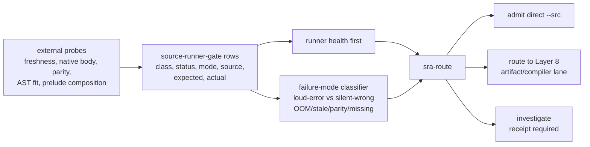

# 2026-07-03 -- Source runner admission layer review

## Ground

This layer follows the reviewed architecture map and the source artifact cache
policy:

- `receipts/2026-07-03-core-layer-architecture-map.md`
- `form/form-stdlib/source-artifact-cache.fk`
- `form/form-stdlib/source-runner-admission.fk`
- `form/form-stdlib/tests/source-runner-admission-band.fk`

The layer language is not a parser, not a cache selector, and not disk IO. It is
an observation-row admission policy for the temporary direct `--src` runner:

- admit direct `--src` only when runner health, semantic parity, capacity,
  composition, and remediation observations are green
- route loud structural capacity failures to the artifact/compiler lane with a
  receipt
- route silent wrong values, OOM/killed, stale witnesses, semantic divergence,
  native-body failures, missing observations, and requested C growth to
  investigation
- leave cache writes, `.fkb` loading, `.dylib` loading, and disk freshness to
  later layers

## Layer Diagram



This diagram is policy over observation rows. It does not claim the policy ran
the probes, read disk state, or selected a real runtime artifact.

## Pre-Review

Grok accepted the layer boundary but required the gates to be split by failure
class. Its key correction was that AST-cap failures and prelude failures must
not share one red bit:

- `fk_smknode: program too large for the AST node table` is a loud structural
  ceiling and may route to the artifact lane with a receipt.
- A silent wrong value such as `hdc-count` returning `0` after `core.fk` is
  prepended must route to investigation.
- Missing observations must deny admission; they cannot default green.

Claude independently accepted the boundary and made the same load-bearing
correction: route by failure mode, not gate name. Claude also asked for runner
health to be treated before per-source parity, for `no C growth` to be a
remediation constraint rather than a runtime observation, and for every
per-source gate to carry source identity.

Both reviews said the historical `let` divergence should now be a regression
gate, not a current red signal, because today's minimal probe returned `42`.

## Current Observations

Required grounding witnesses passed before this layer moved:

```text
./fkwu --src bootstrap/ground.fk                                      -> 42
./fkwu --src bootstrap/ground-recursive.fk 10                         -> 55
./fkwu --src form/form-stdlib/tests/binary-freshness-band.fk          -> 15
./fkwu --src <native-vs-rented concat>                                -> 11111
```

Source-runner probes before the read-completeness repair:

```text
(do (let x 40) (add x 2))                                             -> 42
learn/homecoming-distillation-corpus.fk + band, without core.fk        -> 511
core.fk + learn/homecoming-distillation-corpus.fk + band               -> 0
core.fk + learn/homecoming-distillation-corpus.fk + (hdc-count ...)    -> 0
form/form-stdlib/form-ontology-loader.fk                              -> fk_smknode: program too large for the AST node table
```

Small corpus probes after `core.fk` returned correct counts (`1` and `3`), so
the homecoming failure was not a universal shadowing bug in `core.fk`. At the
time of this layer's first closure, it remained silent wrong output under the
direct-source composition envelope and was therefore investigation-required.

Follow-up repair: `receipts/2026-07-03-src-read-completeness-repair.md` closed
that silent wrong value as incomplete pipe/FIFO source ingestion in `fk_run_src`,
not a Form composition bug. After the bounded read-to-EOF repair, the same
process-substitution bundle returns `511`, and `(hdc-count (hdc-rows))` returns
`39`.

Second follow-up repair:
`receipts/2026-07-03-source-runner-module-constants-core-bp.md` closed the
remaining current direct-source blockers recorded by this snapshot:

```text
(let rows (list 1 2 3)) + (defn rows-f () rows) -> 3
form-ontology-loader.fk + bp(add) probe          -> 13
source-runner-root-do-band                       -> 31
bmf-core-band integration                        -> 600
```

Those observations update the current snapshot to direct admission. Synthetic
loud capacity rows still route to the artifact lane; the current ontology row
is no longer such a row.

## Implementation

`source-runner-admission.fk` defines:

- route constants: admit direct, artifact lane, investigate
- status constants: green, red, unknown
- a manifest for the layer boundary
- `source-runner-gate` rows with gate id, class, scope, status, failure mode,
  source identity, expected value, and actual value
- hard failure classification for silent wrong values, OOM/killed, stale
  binary, native body failure, semantic divergence, C-growth request, missing
  observation, health failure, parity failure, and remediation failure
- source identity enforcement: rows with empty source identity are hard and
  route to investigation
- soft artifact classification for loud structural capacity failures
- `sra-route`, `sra-direct-admissible?`, and `sra-requires-receipt?`
- a current 2026-07-03 observation snapshot

The band is intentionally helper-shaped. A first version used a single large
local `let` chain and stalled until interrupted after more than 40 seconds. The
stall was not ignored: the band was split into manifest, route, and current
snapshot helpers. A later scratch probe showed that binding the full current
snapshot in one local `let` could collapse to `0`, so current gate checks use
named gate getters and the full current route uses direct row construction.

## Witness

Original layer band:

```sh
./fkwu --src <(cat form/form-stdlib/core.fk \
    form/form-stdlib/source-runner-admission.fk \
    form/form-stdlib/tests/source-runner-admission-band.fk)
```

```text
1048575
```

2026-07-04 mirror/static hardening added an exact grammar mirror and a
boundary bit, so the current band is:

```text
cd form && ./validate.sh form-stdlib/tests/source-runner-admission-band.fk
-> 2097151

direct fkwu concat from repo root
-> 2097151

cmp form/form-stdlib/source-runner-admission.fk grammars/source-runner-admission.fk
-> 0
```

Supporting current probes after the read-completeness repair:

```text
sra-route (sra-current-gates)                 -> 1
current snapshot bit expression               -> 917504
empty-source loud capacity row                -> 3
ontology-loader loud capacity row             -> 2
```

Bit decoding:

```text
1      manifest declares runner-health-first
2      manifest declares parity-noncircular
4      manifest declares capacity-routes-artifact
8      manifest declares silent-wrong-investigates
16     manifest declares oom-kill-investigates
32     manifest declares missing-observation-denies
64     manifest declares no-c-growth-remediation-constraint
128    manifest declares layer8-handles-artifacts
256    manifest declares source-identity-required
512    all-green gates admit direct source
1024   loud AST/capacity error routes to artifact lane
2048   silent wrong value routes to investigation
4096   OOM/killed routes to investigation
8192   stale freshness routes to investigation
16384  native-body failure routes to investigation
32768  semantic parity failure routes to investigation
65536  unknown/missing observation routes to investigation
131072 current let parity probe is green
262144 current ontology-loader probe is green
524288 current snapshot admits direct source because observed gates are green
1048576 mirror/static boundary holds
```

## Alternatives

| Alternative | Disposition | Why |
| --- | --- | --- |
| Treat every direct-source failure as an artifact-route miss | Rejected | Silent wrong values are not capacity limits; they are unentitled results and must be investigated. |
| Treat every direct-source failure as hard investigation | Rejected | A loud AST-cap error is an expected structural ceiling of the temporary runner and should route to the artifact lane with a receipt. |
| Grow `FK_AST_NODE_CAP` or other C caps | Rejected | The C seed is a shrink target; growing it hides architecture pressure. |
| Put disk freshness and cache writes here | Rejected | That belongs to the source artifact cache and later selector layers. |
| Drop the `let` probe because it is green today | Rejected | It is retained as a parity regression gate because `SEED-DROP.md` records a real historical divergence. |
| Use one flat boolean gate vector | Rejected | Reviews showed failure mode matters more than gate name. |

## Deferred

- Keep the homecoming/core read-completeness repair covered by regression
  probes; the original silent `0` is now closed.
- Build a real source runner probe harness that records rows from command
  output rather than maintaining the current snapshot by hand.
- Implement disk-backed artifact selection.
- Implement program-image `.fkb` admission that skips source parsing.
- Implement verified native `.dylib` runtime dispatch.
- Replace current `expected`/`actual` strings with richer structured evidence
  rows when the observation layer is ready.

## Post-Review

Grok post-reviewed the implemented layer read-only and returned conditional
accept: safe to close as policy-only. It confirmed the load-bearing split:
loud capacity errors route to the artifact lane, silent wrong values route to
investigation, and hard rows take precedence over soft capacity rows in the
combined current snapshot.

Grok found no structural blocker, but raised two honesty corrections:

- `source-identity-required` was declared in the manifest but not enforced by
  `sra-route`.
- `runner-health-first` should be read as classification priority, not literal
  evaluation order.

The source-identity correction is now applied: `sra-hard-gate?` treats an empty
source field as hard, so an otherwise soft loud-capacity row with empty source
routes to investigation:

```text
empty-source loud capacity row -> 3
```

The runner-health wording is retained as manifest language, but this receipt
scopes it precisely: health red rows are hard and deny admission; the policy is
not a live ordered probe executor.

Claude post-review was attempted twice through the local `claude` CLI. Both
normal runs stalled with no visible review text and ended with `Execution error`
when interrupted. A bare-mode retry failed immediately:

```text
Not logged in - Please run /login
```

That is recorded as a review-tool failure, not as approval. The layer therefore
has Grok post-review and local witnesses, while Claude post-review remains
unavailable in this environment.

Follow-up: the homecoming/core silent wrong value was subsequently root-caused
and repaired in `runtime/fkwu-uni.c` as incomplete `--src` input ingestion from
pipe/FIFO paths. A later source-runner/module-constant/root-`do` repair also
made the ontology and BMF integration probes green. The current snapshot now
routes to direct source (`1`).

## 2026-07-04 Mirror/Static Hardening And Review Closure

The old Claude-unavailable note above is preserved as history, but it is now
superseded for the current layer state.

Pre-review closure with the current reviewer agents required a small hardening
patch rather than receipt-only closure:

- add `grammars/source-runner-admission.fk` as an exact mirror;
- add one band bit for mirror equality and active forbidden API boundaries;
- use `file_size`-guarded reads so both repo-root direct probes and
  `cd form && ./validate.sh ...` work;
- keep the static scan tailored to active forbidden surfaces, not observation
  labels such as `.fkb`, `line-grammar`, or `runtime-artifact-plan`;
- do not change source-runner admission policy semantics.

Implemented:

- added `grammars/source-runner-admission.fk`;
- added `srab-read-file-any`, `srab-has?`, and
  `srab-static-and-mirror-band`;
- raised the expected mask from `1048575` to `2097151`.

Verification:

```text
cc -O2 -o fkwu runtime/fkwu-uni.c
# existing fread and getsockname warnings only
./fkwu --src bootstrap/ground.fk -> 42
./fkwu --src bootstrap/ground-recursive.fk 10 -> 55
./fkwu --src form/form-stdlib/tests/binary-freshness-band.fk -> 15
native-vs-rented-check -> 11111

cd form && ./validate.sh form-stdlib/tests/source-runner-admission-band.fk
-> 2097151

direct fkwu concat from repo root
-> 2097151

cmp form/form-stdlib/source-runner-admission.fk grammars/source-runner-admission.fk
-> 0

tailored forbidden API scan over source and mirror
-> no hits
```

Jason, acting as Grok reviewer: `PASS_WITH_CHANGES` before the hardening
patch. He required the exact mirror, static/mirror band bit, cwd-stable helper,
and receipt update.

Jason post-review verdict after the hardening patch: `PASS_WITH_CHANGES` with
receipt-only cleanup. He accepted the exact mirror, tailored static scan, and
`2097151` validator result, and required this section plus the reflection mask
to be updated before closure. Those receipt-only changes are now applied.

Popper, acting as Claude reviewer: `PASS_WITH_CHANGES` before the hardening
patch. He required the same mirror/static hardening, explicitly rejected
`value_kind == "string"` as the only file-read guard, and asked that the old
Claude-unavailable history be preserved but superseded by current review.

Popper post-review verdict after the hardening patch: `PASS`. He accepted the
exact mirror, `file_size`-guarded helper, tailored static scan, updated mask,
preserved old Claude-unavailable history, and verification evidence. Required
changes: none.

## Reflection

Achieved:

- Direct `--src` now has a layer-appropriate admission language instead of an
  implicit trust boundary.
- The policy distinguishes loud capacity errors from silent wrong values.
- The current `let` probe is corrected from stale red signal to green parity
  witness.
- The historical AST-cap and homecoming-prelude failures remain represented
  without being collapsed into the same failure class.
- The band now returns `2097151`; `1048575` was the pre-hardening mask. After
  the source-runner follow-up repairs, the current route returns direct
  admission (`1`).

Deferred, with why:

- The homecoming `0` root cause is no longer deferred; it was closed by
  `receipts/2026-07-03-src-read-completeness-repair.md`.
- Real probe collection is deferred because this layer is pure policy over rows;
  the harness belongs in an observation/admission adapter.
- Artifact execution is deferred because Layer 8 is currently policy only and
  the runtime selector is not integrated.

Layer 8a closes only as source-runner admission policy. The homecoming silent
wrong value, ontology AST pressure, module-constant export, and BMF root-`do`
integration failures are closed by source-runner repairs. Disk-backed
selection, program-image loading, native dispatch, and C-seed shrink remain
open.
