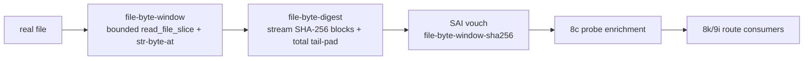

# 2026-07-04 -- file-byte-digest layer review

## Why This Layer Exists

Layers 8h through 9i made the program-image route structurally real: a
`.tbl`-shaped payload can live inside a program-image `.fkb` envelope, the
current executor can receive exact `.tbl` text, compiler emission can bind those
values, persistence can attest a supplied probe bundle, and handoff can produce
a request-ready artifact envelope.

The remaining weakness was identity evidence. Layer 8c observations and 8k
persistence rows still accepted source/content hashes supplied by the caller.
Layer 8d could hash supplied byte lists and size-checked text, but it honestly
refused arbitrary binary file hashing because the whole-file byte door is red.

`file-byte-digest.fk` closes the narrower capability: cap-bound SHA-256 over
real files using the proven Layer 1a byte-window floor. The current shared floor
is a bounded NUL/ASCII string-slice byte path, not an arbitrary high-byte binary
or multibyte UTF-8 carrier.



## Implemented

- `form/form-stdlib/file-byte-digest.fk`
- `grammars/file-byte-digest.fk`
- `form/form-stdlib/tests/file-byte-digest-band.fk`
- `receipts/2026-07-03-core-layer-architecture-map.md`

The new public surface is:

- `fbd-digest-file-capped-window`
- `fbd-digest-file-capped`
- `fbd-vouch-file-capped-window`
- `fbd-vouch-source-file-capped`
- `fbd-vouch-content-file-capped`
- default `fbd-vouch-source-file` / `fbd-vouch-content-file`

The default total file cap is `65536`. The default window size is
`fbw-max-window` (`4096`). Both cap and window size must be multiples of 64, and
the requested window size must stay within the Layer 1a maximum.

## Evidence

Pre-review:

- Grok verdict: `PASS_WITH_CHANGES`.
- Claude verdict: `PASS_WITH_CHANGES`.

Both reviewers required:

- place the layer as Layer 1b, not as another 8k/9x policy wrapper;
- keep total-file cap distinct from the byte-window size;
- use `fbw-read-window`, not the red whole-file byte doors;
- own total-length SHA-256 tail padding instead of calling `pad-message` over a
  partial tail;
- cross-check `fs-stat-size` before and after streaming;
- emit unchanged `sai-vouch` rows with evidence kind
  `file-byte-window-sha256`;
- leave 8d's `no-binary-file-hash` claim intact.

Local verification:

```sh
cc -O2 -o fkwu runtime/fkwu-uni.c
./fkwu --src bootstrap/ground.fk                                      # 42
./fkwu --src bootstrap/ground-recursive.fk 10                         # 55
./fkwu --src form/form-stdlib/tests/binary-freshness-band.fk          # 15
./fkwu --src /tmp/nvr.fk                                              # 11111

# composed-prelude focused and neighbor bands
file-byte-digest-band                    -> 2147483647
file-byte-window-band                    -> 2147483647
source-artifact-identity-band            -> 2147483647
source-artifact-probe-band               -> 536870911  # declared full score
source-compiler-emission-band            -> 2147483647
source-compiler-persistence-band         -> 2147483647
runtime-artifact-handoff-band            -> 2147483647
```

Static and structural checks:

```sh
cmp grammars/file-byte-digest.fk form/form-stdlib/file-byte-digest.fk  # 0
forbidden raw IO / loader / selector scan over source + mirror         # no hits
parser-style paren balance over source, mirror, band                   # depth 0, no negative lines
```

The focused band proves:

- manifest boundary and negative-capability claims;
- boundary SHA-256 parity for sizes `0`, `1`, `55`, `56`, `63`, `64`, `119`,
  and `120`;
- NUL/ASCII bytes including `0`, `10`, and `127`;
- multi-window streaming through a small order-sensitive reviewed window and a
  4160-byte default-window fixture;
- exact cap success and cap+1 refusal;
- malformed cap, invalid window sizes, and missing-file statuses;
- SAI vouch target/evidence/status behavior;
- probe enrichment can route to `run-program-image` only when seal/table bits
  are supplied separately;
- the source/mirror contain no raw whole-file byte IO, form-binary IO,
  loader/call, attempt, or selector names.

## Stall Investigation

The first focused run was stopped after roughly two and a half minutes with no
output. This was not ignored.

Two causes were found:

1. The initial source and band each had one extra closing parenthesis. A
   parser-style balance scan showed negative depth at the final top-level line.
   The source-runner stall was a malformed-form symptom, not a valid proof run.
2. A bare `./fkwu --src form/form-stdlib/tests/file-byte-digest-band.fk`
   returned `nothing`, as existing non-standalone stdlib bands do without their
   preludes. The valid harness is a composed-prelude source file.

The initial 4160-byte multi-window truth fixture was removed while debugging
because the broken run made it look expensive. Claude post-review falsified that
premise after the paren fix by timing the 4160-byte default-window digest and a
65536-byte cap digest externally. The band now restores the 4160-byte
default-window fixture and adds invalid-window-size coverage.

## Deferred

- Arbitrary whole-file byte IO remains unavailable. This layer uses bounded
  windows only.
- Binary `.fkb` write/read remains unavailable. This layer can identify a real
  file's bytes; it does not create a form-binary artifact.
- Large artifact hashing above the reviewed `65536` cap is deferred.
- Host-speed or JIT-accelerated streaming `process-block` is not claimed.
- In-body timing remains unavailable; cost claims are external observations
  until a native time-observation door exists.
- Seal/proof/callable enrichment remains in the existing 8e/8f/8g layers.
- Real 9h load/walk/call and startup selector installation remain pending.

## Corrective Follow-Up: High-Byte Carrier Scope

Sibling validation later returned `2113929215`, missing exactly the old
`binary-transparent` bit. Investigation found the lower cause in Layer 1a:
Rust and TypeScript decode `read_file_slice` as UTF-8 text, so high bytes such
as `128` and `255` cannot be claimed as sibling-portable through the string
carrier. Direct `fkwu` can carry those bytes, but this layer's shared proof
must not launder a runtime-specific property into the portable band.

The repair renames the manifest claim to `nul-ascii-window-transparent`, changes
the high-byte fixture to NUL/ASCII bytes `0, 65, 10, 127, 66`, and keeps the
arbitrary binary/multibyte byte-list carrier deferred instead of growing the C
seed.

Current verification:

```text
cd form && ./validate.sh form-stdlib/tests/file-byte-digest-band.fk -> 2147483647
direct fkwu composed prelude -> 2147483647
cmp grammars/file-byte-digest.fk form/form-stdlib/file-byte-digest.fk -> 0
```

## Alternatives Rejected

| Alternative | Decision | Reason |
| --- | --- | --- |
| Grow C with a new byte door | Rejected | Violates the shrink-to-zero rule while Layer 1a already exposes a bounded floor. |
| Modify 8d directly | Rejected | 8d's refusal remains true for its own routes; `fbd-` is a sibling evidence producer. |
| Jump to 9h loader/executor | Rejected | Request readiness without observed content identity would still be synthetic. |
| Keep only repeated-byte multi-window fixtures | Rejected | A window-ordering bug could pass when every window has identical bytes. The band now uses distinct per-window content. |

## Post-Review

- Grok verdict: `PASS`.
- Claude verdict: `PASS_WITH_CHANGES`.

Claude required two band/receipt changes:

- restore the 4160-byte default-window fixture or stop claiming it was too
  expensive;
- add invalid window-size coverage.

Both changes were applied. The composed-prelude `file-byte-digest-band` still
returns `2147483647`.

Follow-up review:

- Claude verdict: `PASS`.
- Grok verdict: `PASS`.

Both follow-up reviews confirmed the restored 4160-byte default-window fixture,
order-sensitive 192-byte multi-window fixture, invalid-window-size coverage, and
corrected receipt language.
