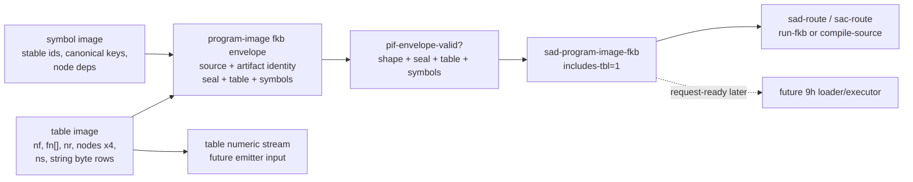

# 2026-07-04 -- program-image fkb table/symbol-envelope layer review

## Why This Layer Exists

The architecture already said a fresh program-image `.fkb` should include the
`.tbl`-shaped function/node/string table, but the current body had only policy
and descriptor rows. The `.tbl` payload itself was still outside the `.fkb`
artifact shape.

During the 8h6 byte-decode review, the boundary was corrected: `.fkb` must also
carry canonical symbol/dependency truth. A locale/domain `.sym` sidecar can
name, alias, translate, and present stable symbols, but it cannot be the only
holder of executable symbol dependencies.

This layer folds that payload into a first-class recipe envelope:

```text
program-image .fkb envelope =
  source identity
  artifact identity
  declared seal status
  validated table image:
    nf, function roots, nr, node rows x4, ns, string byte rows
  validated symbol image:
    symbol ids + canonical keys
    node-defined symbols + node dependency symbol ids
```

It is intentionally not the 9h loader/executor. It makes the artifact payload
ontologically explicit before any runtime can claim to load it.

## Ground And Current Floor

Required floor before edits:

```text
cc -O2 -o fkwu runtime/fkwu-uni.c
# known fread/getsockname warnings only
./fkwu --src bootstrap/ground.fk -> 42
./fkwu --src bootstrap/ground-recursive.fk 10 -> 55
./fkwu --src form/form-stdlib/tests/binary-freshness-band.fk -> 15
native-vs-rented-check -> 11111
```

Reviewer-required probe correction:

```text
write_file_text/read_file control with core.fk -> ok, file exists
write_form_binary with core.fk -> nothing, no file
len(recipe_to_bytes (list 1 2 3)) with core.fk -> 0
```

So the layer does not use form-binary disk IO primitives as evidence. The
payload is a Form recipe envelope only. Disk write/read and execution stay
deferred.

## Layer Diagram



## Pre-Review

First reviewer attempts:

- Grok tried to ground the checkout and hit `max turns reached` with no verdict.
- Claude emitted attempted grep tool calls and no verdict.

These are recorded as tool friction, not approval.

Strict no-tool retries:

- Grok: `PASS_WITH_CHANGES`.
- Claude: `PASS_WITH_CHANGES`.

Required changes incorporated:

- validate the form-binary IO probe with a working file-write control;
- derive the layer through existing descriptor/cache policy instead of a
  parallel route algebra;
- prove that `includes-tbl=1` alone cannot bypass source-hash or seal checks;
- pin exact node row arity at four cells;
- reject malformed table counts and malformed string byte rows;
- keep parsed-data `.fkb`, compiler/image `.fkb`, and program-image `.fkb`
  distinct;
- mirror the layer under `grammars/`;
- record future 9h as still pending.

## Implementation

Files:

- `form/form-stdlib/program-image-fkb.fk`
- `grammars/program-image-fkb.fk`
- `form/form-stdlib/tests/program-image-fkb-band.fk`
- architecture update in `receipts/2026-07-03-core-layer-architecture-map.md`

The new prefix is `pif-`.

Main rows:

```text
("program-image-table" nf fn-roots nr node-rows ns string-byte-rows)

("program-image-symbol-image"
  symbol-count symbol-rows
  node-symbol-count node-symbol-rows)

("program-image-fkb-envelope" version
  source-path source-hash source-mtime
  artifact-path content-hash artifact-mtime
  seal-ok table-image symbol-image)
```

`pif-envelope` remains a compatibility constructor that supplies an empty
symbol image. `pif-envelope-with-symbols` carries the corrected `.fkb` shape.

Primary functions:

- `pif-table-valid?`
- `pif-symbol-image-valid-for-table?`
- `pif-table-numeric-stream`
- `pif-envelope-valid?`
- `pif-source-from-envelope`
- `pif-descriptor-from-envelope`
- `pif-route-from-envelope`

`pif-descriptor-from-envelope` returns `sad-program-image-fkb` only when the
envelope shape is valid, `seal-ok` is `1`, and the table validates. Otherwise
it returns `sad-no-artifact`.

After the symbol/dependency correction, `pif-envelope-valid?` also requires the
symbol image to validate against the table node count and symbol count. Symbol
rows are ordered by stable id. Node symbol rows are ordered by node id, can use
`-1` for anonymous nodes, and dependency ids must reference embedded symbols.

## Witnesses

Focused band:

```sh
./fkwu --src <(cat form/form-stdlib/core.fk \
  form/form-stdlib/source-artifact-cache.fk \
  form/form-stdlib/source-artifact-descriptor.fk \
  form/form-stdlib/program-image-fkb.fk \
  form/form-stdlib/tests/program-image-fkb-band.fk)
# -> 2147483647
```

The band proves:

- manifest boundaries;
- program-image kind is not parsed-data or compiler-image;
- exact node row arity `4`;
- string byte rows are byte-ranged;
- table counts must match actual row counts;
- embedded symbol image validates against table node count and symbol count;
- node symbol rows can carry defined symbol ids and dependency symbol ids;
- `.sym` is treated as a lens over stable ids, not executable dependency truth;
- table-to-numeric-stream order: `nf`, roots, `nr`, nodes x4, `ns`, strings;
- invalid tables produce an empty numeric stream;
- a valid sealed envelope converts to `sad-program-image-fkb` with
  `includes-tbl=1`;
- valid fresh envelope routes to `sac-run-fkb`;
- stale envelope routes to source compile;
- seal-bad and bad-table envelopes produce no program-image descriptor;
- missing source hash is invalid, not a cache miss;
- source-hash mismatch quarantines the artifact;
- `includes-tbl=1` alone cannot route when seal/source checks fail;
- parsed-data `.fkb` is rejected;
- the module text does not reference the unavailable form-binary IO, recipe
  byte IO, dylib load, or runtime table-loader names;
- `grammars/program-image-fkb.fk` mirrors the stdlib file exactly.

Downstream route revalidation:

```text
source-artifact-cache-band                  -> 1048575
source-artifact-descriptor-band             -> 2147483647
runtime-artifact-plan-band                  -> 67108863
runtime-artifact-selector-band              -> 2147483647
runtime-artifact-outcome-band               -> 2147483647
runtime-artifact-retry-band                 -> 2147483647
runtime-artifact-load-envelope-band         -> 2147483647
runtime-artifact-attempt-receipt-band       -> 2147483647
runtime-artifact-executor-capability-band   -> 2147483647
```

Static checks:

```text
cmp grammars/program-image-fkb.fk form/form-stdlib/program-image-fkb.fk -> 0
forbidden runtime/IO route scan over program-image-fkb mirrors -> no hits
```

The first focused band run returned `1073741823`, missing the static/mirror
bit. Investigation found the forbidden runtime table-loader name in a comment,
not executable code. The comment was repaired and the band returned the full
mask. The miss was kept as evidence that the static guard is useful.

## Deferred

- Real disk `.fkb` write/read.
- Any use of form-binary IO primitives as current fkwu proof.
- Parsing existing `.tbl` text files from disk.
- Whole-file artifact hashing.
- Program-image loading/walking.
- Startup selector installation.
- 9f attempt production from real execution.
- 9h loader/executor.
- Native `.dylib` loading/calling.
- C-seed growth.

## Alternatives

| Alternative | Decision | Reason |
| --- | --- | --- |
| Call form-binary IO now | Rejected | Current fkwu probe returns `nothing` and no file; using it would fabricate a disk round-trip. |
| Put the payload directly in `source-artifact-descriptor.fk` | Rejected | Descriptor rows should remain compact metadata. The table payload needs its own language and validation. |
| Jump straight to 9h loader/executor | Deferred | Loader/executor needs a concrete payload contract first and must produce real attempts/observations, not policy rows. |
| Treat existing `.tbl` seeds as program-image `.fkb` proof | Rejected | Existing `.tbl` streams are runnable table files with separate provenance caveats, not `.fkb` program-image envelopes. |

## Post-Review

Grok post-review verdict: `PASS`.

Grok accepted Layer 8h as a valid semantic fold of `.tbl` into the
program-image `.fkb` envelope, with loader/executor still deferred and recorded
as pending 9h.

Claude post-review verdict: `PASS`.

Claude accepted the layer as reviewed, citing the full-mask band, exact mirror
parity, repaired static/mirror guard, absent forbidden loader/executor routes,
malformed/arity/range rejection coverage, unchanged sibling bands, and honest
9h deferral.

The exchange stayed alive by answering the user's `.tbl`/`.fkb` question with
a concrete layer, while refusing to turn an envelope proof into a fake loader
claim.
