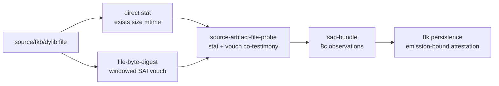

# 2026-07-04 -- source artifact file probe layer review

## Why This Layer Exists

Layer 8k already consumes a `sap-bundle`, but before this layer that bundle
could still carry caller-declared source/content hashes. Layer 1b now produces
SAI-compatible file digest vouches over real files, so the next honest movement
is a bridge:



The layer builds file-backed `sap-bundle` rows without claiming seal/proof
verification, compiler emission, persistence, loading, runtime selection, or C
seed growth.

## Pre-Review

Grok first attempted to ground the checkout and hit `max turns reached` without
a verdict; that attempt is recorded as review-tool friction, not approval.

Grok retry verdict: `PASS_WITH_CHANGES`.

Required changes from Grok:

- keep v1 below `source-compiler-emission`;
- register the layer as a 1b -> 8c bridge;
- expose mismatch/too-large/unobserved status, not just empty hashes;
- prove 8k ready/investigate edges in the band;
- move the old probe-integration witness out of `file-byte-digest-band`.

Claude verdict: `PASS_WITH_CHANGES`.

Required changes from Claude:

- no supplied hash may transit the stat pass;
- cross-check the direct stat size against the digest vouch observed size and
  degrade to `stat-drift` on disagreement;
- expose vouches/statuses through carrier rows;
- missing fkb must remain an absent observation, not a present observation with
  empty hashes;
- static scan must forbid `read_file` in this layer.

## Implementation

Files:

- `form/form-stdlib/source-artifact-file-probe.fk`
- `grammars/source-artifact-file-probe.fk`
- `form/form-stdlib/tests/source-artifact-file-probe-band.fk`
- `form/form-stdlib/tests/file-byte-digest-band.fk`
- `receipts/2026-07-03-core-layer-architecture-map.md`

The new prefix is `safp-`.

Main rows:

```text
("source-artifact-file-source-probe" observation vouch status)

("source-artifact-file-artifact-probe" role observation
  source-vouch content-vouch status)

("source-artifact-file-probe-bundle" source-probe fkb-probe
  dylib-probe sap-bundle status)
```

Primary functions:

- `safp-source-file-probe`
- `safp-source-observation`
- `safp-source-vouch`
- `safp-program-image-fkb-file-probe`
- `safp-program-image-fkb-observation`
- `safp-native-dylib-file-probe`
- `safp-native-dylib-observation`
- `safp-missing-native-dylib-observation`
- `safp-source-fkb-probe`
- `safp-source-fkb-bundle`

The stat pass reads `fs-exists?`, `fs-stat-size`, and `fs-stat-mtime` directly.
It passes no caller-supplied hash into a `sap-observe-*` helper. Hash fields
enter observations only through SAI vouches. If the direct stat size differs
from a nonnegative vouch observed size, the effective vouch is rewritten with
status `stat-drift` and an empty actual hash.

`file-byte-digest-band` no longer owns the SAP integration proof; it now proves
only digest/vouch helper policy at that bit. The file-backed SAP edge is proven
in this layer's focused band.

## Witnesses

Required floor before implementation:

```text
cc -O2 -o fkwu runtime/fkwu-uni.c
# known fread/getsockname warnings only
./fkwu --src bootstrap/ground.fk -> 42
./fkwu --src bootstrap/ground-recursive.fk 10 -> 55
./fkwu --src form/form-stdlib/tests/binary-freshness-band.fk -> 15
native-vs-rented-check -> 11111
```

Focused and neighbor bands:

```text
file-byte-digest-band              -> 2147483647
source-artifact-file-probe-band    -> 2147483647
source-artifact-probe-band         -> 536870911
source-artifact-identity-band      -> 2147483647
source-compiler-emission-band      -> 2147483647
source-compiler-persistence-band   -> 2147483647
runtime-artifact-handoff-band      -> 2147483647
```

The focused band proves:

- manifest boundaries and negative capabilities;
- source and fkb happy path from real temp files;
- `sap-plan-from-probe` chooses program-image only when source/fkb hashes match,
  fkb is fresh, `seal-ok=1`, and `includes-tbl=1`;
- missing fkb is an absent observation and routes to compile-source through 8c;
- missing source investigates through 8k;
- source mismatch and fkb content mismatch degrade hashes and investigate
  through 8k;
- too-large, malformed expected hash, and malformed cap remain observable;
- seal missing and missing table bits remain visible policy failures;
- optional native dylib helper carries proof/callable/lowerable supplied bits;
- `stat-drift` degrades hash propagation;
- carrier rows expose vouches/statuses;
- module static scan forbids whole-file text reads, binary form IO, artifact
  load/call names, route derivation, source-compiler imports, and persistence
  calls;
- grammar mirror is byte-identical.

Static checks:

```text
cmp form/form-stdlib/source-artifact-file-probe.fk grammars/source-artifact-file-probe.fk -> 0
forbidden scan over source-artifact-file-probe mirrors -> no hits
```

Investigation notes:

- First `source-compiler-emission-band` neighbor run returned `2013265919`,
  missing bit `134217728`. Investigation showed the command omitted the declared
  `reason-coverage.fk` prelude. Re-running with the declared prelude returned
  `2147483647`.
- First `runtime-artifact-handoff-band` neighbor run returned `2145386495`,
  missing bit `2097152`. Investigation showed the same omitted
  `reason-coverage.fk` prelude. Re-running with the declared prelude returned
  `2147483647`.

## Deferred

- Binary `.fkb` write/read.
- Program-image `.fkb` load/walk.
- Native `.dylib` load/call.
- Seal/proof/callable verification inside this layer.
- Compiler emission import or `safp-bundle-from-emission`.
- Persistence attestation inside this layer.
- Runtime selector installation.
- Arbitrary-size file hashing beyond the reviewed cap.
- C-seed growth.

## Alternatives

| Alternative | Decision | Reason |
| --- | --- | --- |
| Import `source-compiler-emission` and build directly from an 8j row | Deferred | Reviewers agreed v1 should stay below 8j; the caller can project paths/hashes and pass them explicitly. |
| Call `sap-observe-*` with expected hashes | Rejected | That would let supplied hashes transit the stat pass, which is exactly the declaration leak this layer removes. |
| Return only `sap-bundle` | Rejected | Empty hashes would hide mismatch/too-large/unobserved/stat-drift reasons. Probe carrier rows keep status observable. |
| Treat missing fkb as present with empty hashes | Rejected | 8c distinguishes absent cache miss from present-but-unvouched/investigate surfaces. |
| Build 9h loader now | Deferred | This layer only makes observed identity bundles; loading/execution remains a later runtime layer. |

## Post-Review

Grok post-review verdict: `PASS_WITH_CHANGES`.

Required changes:

- assert mismatch and missing-file statuses on the probe carrier rows, not only
  on degraded observations and downstream 8k reasons;
- test `stat-drift` through the layer's stat+vouch observation-building path,
  not only through the low-level `safp-effective-vouch` helper.

Follow-up applied:

- added `safp-source-probe-from-stat-vouch`, used by `safp-source-file-probe`;
- refreshed the grammar mirror;
- strengthened `source-artifact-file-probe-band` to assert:
  - bad source probe status and vouch status are `mismatch`;
  - bad fkb artifact probe status and content-vouch status are `mismatch`;
  - missing fkb artifact probe and bundle statuses are `unobserved`;
  - `stat-drift` flows through `safp-source-probe-from-stat-vouch`, producing an
    empty source hash in the observation.

The strengthened focused band returned `2147483647`.

Grok follow-up post-review verdict: `PASS`.

Grok confirmed the carrier-status assertions and the stat-drift path through
`safp-source-probe-from-stat-vouch`.

Claude full follow-up review hit its bounded turn cap without a verdict, so it
was not counted. A final snippet-based Claude follow-up review returned `PASS`.
Claude confirmed that:

- source/fkb mismatch and missing fkb now assert carrier/vouch statuses directly;
- `safp-source-probe-from-stat-vouch` exercises the same observation-building
  path that `safp-source-file-probe` delegates to;
- the verification set and receipt match the applied follow-up.
